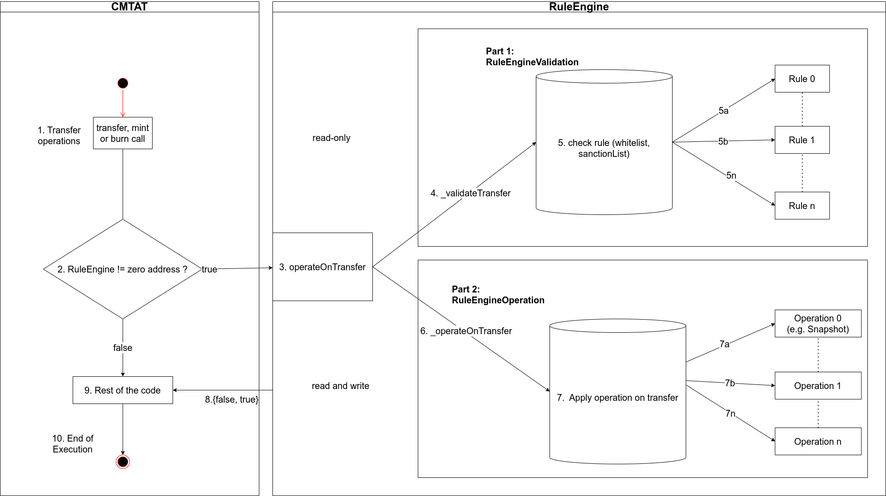
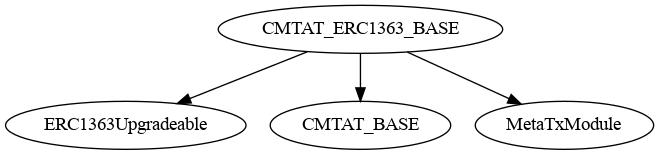
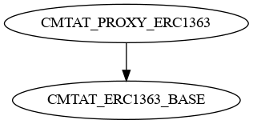
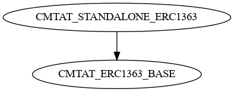

# CMTA Token 

> To use the CMTAT, we recommend the latest audited version, from the [Releases](https://github.com/CMTA/CMTAT/releases) page. Currently, it is the version [v2.3.0](https://github.com/CMTA/CMTAT/releases/tag/v2.3.0)

[TOC]


## Introduction

The CMTA token (CMTAT) is a framework enabling the tokenization of securities in compliance with Swiss law. This repository provides CMTA's reference implementation of CMTAT for Ethereum, as an ERC-20 compatible token.

The CMTAT is an open standard from the [Capital Markets and Technology Association](http://www.cmta.ch/) (CMTA), which gathers Swiss finance, legal, and technology organizations.
The CMTAT was developed by a working group of CMTA's Technical Committee that includes members from Atpar, Bitcoin Suisse, Blockchain Innovation Group, Hypothekarbank Lenzburg, Lenz & Staehelin, Metaco, Mt Pelerin, SEBA, Swissquote, Sygnum, Taurus and Tezos Foundation. The design and security of the CMTAT was supported by ABDK, a leading team in smart contract security.

The preferred way to receive comments is through the GitHub issue tracker.  Private comments and questions can be sent to the CMTA secretariat at <a href="mailto:admin@cmta.ch">admin@cmta.ch</a>. For security matters, please see [SECURITY.md](./SECURITY.MD).

Note that CMTAT may be used in other jurisdictions than Switzerland, and for tokenizing various asset types, beyond equity and debt products. 

## Difference between version

The main difference between the three main version are the following

### Standard ERC

Here the list of ERC supported between different version:

|                                                              | ERC status               | CMTAT 1.0 | CMTAT 2.30 | CMTAT 3.0.0                                                  |
| ------------------------------------------------------------ | ------------------------ | --------- | ---------- | ------------------------------------------------------------ |
| **Fungible tokens**                                          |                          |           |            |                                                              |
| [ERC-20](https://eips.ethereum.org/EIPS/eip-20)              | Standard Track (final)   | &#x2611;  | &#x2611;   | &#x2611;                                                     |
| [ERC-1363](https://eips.ethereum.org/EIPS/eip-1363)          | Standard Track (final)   | &#x2612;  | &#x2612;   | &#x2611;<br />(specific deployment version)                  |
| **Tokenization**                                             |                          |           |            |                                                              |
| [ERC-1404](https://github.com/ethereum/eips/issues/1404)<br />(Simple Restricted Token Standard) | Draft                    | &#x2611;  | &#x2611;   | &#x2611;                                                     |
| [ERC-1643](https://github.com/ethereum/eips/issues/1643) (Document Management Standard) <br />(Standard from [ERC-1400](https://github.com/ethereum/EIPs/issues/1411)) | Draft                    | &#x2612;  | &#x2612;   | &#x2611;<br />(through DocumentEngine with small improvement) |
| **Proxy support related**                                    |                          |           |            |                                                              |
| Deployment with a UUPS proxy ([ERC-1822](https://eips.ethereum.org/EIPS/eip-1822)) | Stagnant<br />(but used) | &#x2612;  | &#x2612;   | &#x2611;<br />(specific deployment version)                  |
| [ERC-7201](https://eips.ethereum.org/EIPS/eip-7201)<br/>(Storage namespaces for proxy contract) | Standard Track (final)   | &#x2612;  | &#x2612;   | &#x2611;                                                     |
| **Other**                                                    |                          |           |            |                                                              |
| [ERC-2771](https://eips.ethereum.org/EIPS/eip-2771) (Meta Tx / gasless) | Standard Track (final)   | &#x2611;  | &#x2611;   | &#x2611;                                                     |
| [ERC-6093](https://eips.ethereum.org/EIPS/eip-6093) (Custom errors for ERC-20 tokens) | Standard Track (final)   | &#x2612;  | &#x2612;   | &#x2611;<br />                                               |

#### ERC-3643

The [ERC-3643](https://eips.ethereum.org/EIPS/eip-3643) is an official Ethereum standard, unlike ERC-1400 and ERC-1404. This standard, also built on top of ERC-20, offers a way to manage and perform compliant transfers of security tokens.

ERC-3643 enforces identity management as a core component of the standards by using a decentralized identity system called [onchainid](https://www.onchainid.com/).

While CMTAT does not include directly the identify management system, it shares with ERC-3643 several same functions.

To represent the level of similarity between ERC-3643 interface and CMTAT functionnalities, we have created three level of conformity.

The interface is available in [IERC3643Partial.sol](./contracts/interfaces/IERC3643Partial.sol)

If you want to use CMTAT to create a version implementing all functions from ERC-3643, you can create it through a dedicated deployment version (similar to what has been done for UUPS and ERC-1363).

**Level**

| **Level** | **Description**                                              |
| :-------- | :----------------------------------------------------------- |
| 0         | Not implemented                                              |
| 1         | Implemented, but the argument names are different<br />(function signature will be the same nevertheless) |
| 3         | Exactly same function (same argument name, same parameter)   |

The main reason the argument names change is because CMTAT relies on OpenZeppelin to name the arguments

##### Pause

| **ERC-3643**                             | **CMTAT 3.0**                   | **Result** |
| :--------------------------------------- | :------------------------------ | :--------- |
| `pause() external`                       | Same                            | 3          |
| `unpause() external`                     | Same                            | 3          |
| `paused() external view returns (bool);` | Same                            | 2          |
| `  event Paused(address _userAddress);`  | event Paused(address account);  | 2          |
| ` event Unpaused(address _userAddress);` | event Unpaused(address account) | 2          |

##### ERC20Base

| **ERC-3643**                                                 | **CMTAT 3.0**                                                | **Result** |
| :----------------------------------------------------------- | :----------------------------------------------------------- | :--------- |
| `setName(string calldata _name) external;`                   | setName(string calldata name_)                               | 2          |
| `setSymbol(string calldata _symbol) external;`               | function setSymbol(string calldata symbol_)                  | 2          |
| `function batchTransfer(address[] calldata _toList, uint256[] calldata _amounts) external;` | function batchTransfer(address[] calldata tos,uint256[] calldata values) external returns (bool); | 2          |

##### Supply Management (burn/mint)

| **ERC-3643**                                                 | **CMTAT 3.0 Modules** | **CMTAT 3.0 Functions**                                      | **Result** |
| :----------------------------------------------------------- | :-------------------- | :----------------------------------------------------------- | :--------- |
| `  batchMint(address[] calldata _toList, uint256[] calldata _amounts) external;` | MintModule            | `mint(address account, uint256 value)`                       | 2          |
| `  batchMint(address[] calldata _toList, uint256[] calldata _amounts) external;` | MintModule            | `function mintBatch(address[] calldata accounts,uint256[] calldata values) ` | 2          |
| `burn(address _userAddress, uint256 _amount) external`       | BurnModule            | `function burn(address account,uint256 value)`               | 2          |
| `batchBurn(address[] calldata _userAddresses, uint256[] calldata _amounts) external` | BurnModule            | `function burnBatch(address[] calldata accounts,uint256[] calldata values,string calldata reason)` | 2          |
| `function batchForcedTransfer(address[] calldata _fromList, address[] calldata _toList, uint256[] calldata _amounts) external` | BurnModule            | `function forcedTransfer(address account, address destination, uint256 value) external returns (bool)` | 2          |

##### Enforcement

| **ERC-3643**                      | **CMTAT 3.0**               | **Result** |
| :-------------------------------- | :-------------------------- | :--------- |
| ` isFrozen(address _userAddress)` | `isFrozen(address account)` | 2          |

####  ERC-7551

This section presents a correspondence table between [ERC-7551](https://ethereum-magicians.org/t/erc-7551-crypto-security-token-smart-contract-interface-ewpg/16416) and their equivalent functions inside CMTAT.

The ERC-7551 is currently a draft ERC proposed by the Federal Association of Crypto Registrars from Germany to tokenize assets in compliance with [eWPG](https://www.gesetze-im-internet.de/ewpg/). 

The interface is supposed to work on top of additional standards that cover the actual storage of ownership of shares of a security in the form of a token (e.g. ERC-20 or ERC-1155).

| **N°** | **Functionalities**                                          | **ERC-7551 Functions**                    | **CMTAT 3.0.0** (next release                                |
| :----- | :----------------------------------------------------------- | :---------------------------------------- | :----------------------------------------------------------- |
| 1      | Freeze and unfreeze a specific amount of tokens              | freezeTokens<br />unfreezeTokens          | Partial<br />All the tokens owned by the address are frozen  |
| 2      | Pausing transfers The operator can pause and unpause transfers | pauseTransfers                            | ✅<br />function pause/unpause + deactivateContract           |
| 3      | Link to off-chain document<br />Add the hash of a document   | setPaperContractHash                      | ✅<br />Done with the field terms.<br />This field is represented as a Document also (name, uri, hash, last on-chain modification date) |
| 4      | Metadata JSON file                                           | setMetaDataJSON                           | ✅<br />Support through the documentModule and [ERC-1643](https://github.com/ethereum/eips/issues/1643) or Link can be put  in the string field “information” |
| 5      | Forced transfersTransfer `amount` tokens to `to` without requiring the consent of `fro`m | forceTransferFrom                         | ✅<br />Function forceTransfer                                |
| 6      | Token supply managementreduce the balance of `tokenHolder` by `amount` without increasing the amount of tokens of any other holder | destroyTokens                             | ✅<br />Function burn                                         |
| 7      | Token supply managementincrease the balance of `to` by `amount` without decreasing the amount of tokens from any other holder. | issue                                     | ✅<br />Function mint and mintBatch                           |
| 8      | Transfer compliance<br />Check if a transfer is valid        | `canTransfer() `and a `canTransferFrom()` | ✅ <br />With [ERC-1404](https://github.com/ethereum/eips/issues/1404) |

### Modules

Here the list of modules supported between different version and the difference.

For simplicity, the module names and function locations are those of version 3.0.0

- "fn" means function
- Changes made in a release are considered maintained in the following release unless explicitly stated otherwise

#### Core modules

|                     | CMTAT 1.0      | CMTAT 2.30                                                   | CMTAT 3.0.0                                                  |
| ------------------- | -------------- | ------------------------------------------------------------ | ------------------------------------------------------------ |
| ValidationModule    | &#x2611;       | &#x2611;                                                     | &#x2611;                                                     |
| AuthorizationModule | &#x2611;<br /> | &#x2611;<br /><br />(Admin has all the roles by default)     | &#x2611;<br />                                               |
| BaseModule          | &#x2611;       | &#x2611;<br />(Add two fields: flag and information)         | &#x2611;<br />Remove field flag (not used)                   |
| BurnModule          | &#x2611;       | &#x2611;<br />Replace fn `burnFrom` by fn `forceBurn`        | Add fn `burnBatch`<br />Rename `forceBurn` in `burn`<br />Add fn `burnFrom` |
| EnforcementModule   | &#x2611;       | &#x2611;                                                     | &#x2611;                                                     |
| ERC20BaseModule     | &#x2611;       | &#x2611;<br />Remove fn `forceTransfer`<br />(replaced by `burn`and `mint`)<br /> | Add fn `transferBatch` <br /><br />Add fn `balanceInfo` (useful to distribute dividends)<br />Add  fn `enforceTransfer`(=forceTransfer)<br /><br />Add fn `setName`and `setSymbol`<br />Remove custom fn `approve`(keep only ERC-20 approve) |
| MintModule          | &#x2611;       | &#x2611;                                                     | Add fn `mintBatch`                                           |
| PauseModule         | &#x2611;       | &#x2611;                                                     | Replace fn `kill` by fn `deactivateContract`                 |

CMTAT 3.0.0 adds also a function `burnAndMint`to burn and mint atomically in the same function.

### Extensions modules

|                | CMTAT 1.0       | CMTAT 2.30                                               | CMTAT 3.0.0                                               |
| -------------- | --------------- | -------------------------------------------------------- | --------------------------------------------------------- |
| CreditsEvents  | &#x2612;        | &#x2611;<br />                                           | &#x2611;  <br />(Require an external contract DebtEngine) |
| DebtEvents     | &#x2612;        | &#x2611;                                                 | &#x2611; <br />(Require an external contract DebtEngine)  |
| MetaTx         | &#x2611; <br /> | &#x2611; <br /><br />(forwarder immutable)               | &#x2611; <br />                                           |
| SnapshotModule | &#x2611;<br />  | Partial<br />(Not included by default because unaudited) | &#x2611; <br />(require an external SnapshotEngine)       |


------

## Documentation

Here a summary of the main documents:

| Document                            | Link/Files                                               |
| ----------------------------------- | -------------------------------------------------------- |
| Documentation of the modules API.   | [doc/modules](doc/modules)                               |
| How to use the project + toolchains | [doc/USAGE.md](doc/USAGE.md)                             |
| Project architecture                | [architecture.pdf](./doc/schema/drawio/architecture.pdf) |
| FAQ                                 | [doc/general/FAQ.md](doc/general/FAQ.md)                 |

CMTA providers further documentation describing the CMTAT framework in a platform-agnostic way, and covering legal aspects, see

-  [CMTA Token (CMTAT)](https://cmta.ch/standards/cmta-token-cmtat)
-  [Standard for the tokenization of shares of Swiss corporations using the distributed ledger technology](https://cmta.ch/standards/standard-for-the-tokenization-of-shares-of-swiss-corporations-using-the-distributed-ledger-technology)

### Further reading

- [CMTA - A comparison of different security token standards](https://cmta.ch/news-articles/a-comparison-of-different-security-token-standards)
- [Taurus - Security Token Standards: A Closer Look at CMTAT](https://www.taurushq.com/blog/security-token-standards-a-closer-look-at-cmtat/)
- [Taurus - Equity Tokenization: How to Pay Dividend On-Chain Using CMTAT](https://www.taurushq.com/blog/equity-tokenization-how-to-pay-dividend-on-chain-using-cmtat/) (CMTAT v2.4.0)
- [Taurus - Token Transfer Management: How to Apply Restrictions with CMTAT and ERC-1404](https://www.taurushq.com/blog/token-transfer-management-how-to-apply-restrictions-with-cmtat-and-erc-1404/) (CMTAT v2.4.0)
- [Taurus - Making CMTAT Tokenization More Scalable and Cost-Effective with Proxy and Factory Contracts](https://www.taurushq.com/blog/cmtat-tokenization-deployment-with-proxy-and-factory/) (CMTAT v2.5.1)
- [Taurus - Addressing the Privacy and Compliance Challenge in Public Blockchain Token Transactions](https://www.taurushq.com/blog/enhancing-token-transaction-privacy-on-public-blockchains-while-ensuring-compliance/) (Aztec)

## Functionality

### Overview

The CMTAT supports the following core features:

* Basic mint, burn, and transfer operations
* Pause of the contract and freeze of specific accounts

Furthermore, the present implementation uses standard mechanisms in
order to support:

* Upgradeability, via deployment of the token with a proxy
* "Gasless" transactions
* Conditional transfers, via a rule engine

This reference implementation allows the issuance and management of tokens representing equity securities.
It can however also be used for other forms of financial instruments such as debt securities.

You may modify the token code by adding, removing, or modifying features. However, the core modules must remain in place for compliance with Swiss law.

### Kill switch

CMTAT initially supported a `kill()` function relying on the SELFDESTRUCT opcode (which effectively destroyed the contract's storage and code).
However, Ethereum's [Cancun upgrate](https://github.com/ethereum/execution-specs/blob/master/network-upgrades/mainnet-upgrades/cancun.md) (rolled out in Q1 of 2024)  has removed support for SELFDESTRUCT (see [EIP-6780](https://eips.ethereum.org/EIPS/eip-6780)).

The `kill()` function will therefore not behave as it was used

We have replaced this function by a new function `deactivateContract`, introduced in the version v2.3.1 inside the PauseModule, to deactivate the contract.
This function set a boolean state variable `isDeactivated` to true and puts the contract in the pause state.
The function `unpause`is updated to revert if the previous variable is set to true, thus the contract is in the pause state "forever".

The consequences are the following:

- In standalone mode, this operation is irreversible, it is not possible to rollback.
- With a proxy, it is still possible to rollback by deploying a new implementation.

### Gasless support

The CMTAT supports client-side gasless transactions using the [ERC-2771](https://eips.ethereum.org/EIPS/eip-2771)

The contract uses the OpenZeppelin contract `ERC2771ContextUpgradeable`, which allows a contract to get the original client with `_msgSender()` instead of the fee payer given by `msg.sender` while allowing upgrades on the main contract (see *Deployment via a proxy* above).

At deployment, the parameter  `forwarder` inside the CMTAT contract constructor has to be set  with the defined address of the forwarder. Please note that the forwarder can not be changed after deployment, and with a proxy architecture, its value is stored inside the implementation contract bytecode instead of the storage of the proxy.

References:

- [OpenZeppelin Meta Transactions](https://docs.openzeppelin.com/contracts/5.x/api/metatx)

- OpenGSN has deployed several forwarders, see their [documentation](https://docs.opengsn.org/contracts/#receiving-a-relayed-call) to see some examples.

-----

## Architecture

CMTAT architecture is divided in two main componentes: module and engines

The main schema describing the architecture can be found here: [architecture.pdf](./doc/schema/drawio/architecture.pdf) 

#### Base


### Module

Modules describe a **logical** code separation inside CMTAT.  They are defined as abstract contracts.
Their code and functionalities are part of the CMTAT and therefore are also included in the calculation of the contract size and the maximum size limit of 24 kB.

It is always possible to delete a module but this requires modifying the code and compiling it again, which require to perform a security audit on these modifications.

Modules are also separated in different categories.

- **Internal** modules: implementation for a module when OpenZeppelin does not provide a library to use. For example, this is the case for the SnapshotModule.

- **Wrapper** modules: abstract contract around OpenZeppelin contracts or internal module.
  For example, the wrapper PauseModule provides public functions to call the internal functions from OpenZeppelin.

  - Core (Wrapper sub-category): Contains the modules required to be CMTA compliant
  - Extension (Wrapper sub-category): not required to be CMTA compliant, "bonus features" (snapshotModule, debtModule)

  

#### List

Here the list of the different modules with the links towards the documentation and the main file.

##### Controller

| Name             | Documentation                                                | Main File                                                    |
| ---------------- | ------------------------------------------------------------ | ------------------------------------------------------------ |
| ValidationModule | [validation.md](doc/modules/presentation/controllers/validation.md) | [ValidationEngineModule.sol](./contracts/modules/wrapper/controllers/ValidationEngineModule.sol) |

##### Core

Generally, these modules are required to be compliant with the CMTA specification.

| Name              | Documentation                                     | Main File                                                    |
| ----------------- | ------------------------------------------------- | ------------------------------------------------------------ |
| BaseModule        | [base.md](doc/modules/core/base.md)               | [BaseModule.sol](./contracts/modules/wrapper/core/BaseModule.sol) |
| BurnModule        | [ERC20Burn.md](doc/modules/core/ERC20Burn.md)     | [ERC20BurnModule.sol](./contracts/modules/wrapper/core/ERC20BurnModule.sol) |
| EnforcementModule | [enforcement.md](doc/modules/core/enforcement.md) | [EnforcementModule.sol](./contracts/modules/wrapper/core/EnforcementModule.sol) |
| ERC20BaseModule   | [erc20base.md](doc/modules/core/ERC20base.md)     | [ERC20BaseModule.sol](./contracts/modules/wrapper/core/ERC20BaseModule.sol) |
| MintModule        | [ERC20Mint.md](doc/modules/core/ERC20Mint.md)     | [ERC20MintModule.sol](./contracts/modules/wrapper/core/ERC20MintModule.sol) |
| PauseModule       | [pause.md](doc/modules/core/pause.md)             | [PauseModule.sol](./contracts/modules/wrapper/core/PauseModule.sol) |

##### Extensions

Generally, these modules are not required to be compliant with the CMTA specification.

| Name           | Documentation                                       | Main File                                                    |
| -------------- | --------------------------------------------------- | ------------------------------------------------------------ |
| MetaTxModule   | [metatx.md](doc/modules/extensions/metatx)          | [MetaTxModule.sol](./contracts/modules/wrapper/extensions/MetaTxModule.sol) |
| DebtModule     | [debt.md](doc/modules/extensions/debt)              | [DebtEngineModule.sol](./contracts/modules/wrapper/extensions/DebtEngineModule.sol) |
| DocumentModule | [document.md](doc/modules/extensions/document)      | [DocumentEngineModule.sol](./contracts/modules/wrapper/extensions/DocumentEngineModule.sol) |
| SnapshotModule | [ERC20Snapshot.md](doc/modules/extensions/snapshot) | [SnapshotEngineModule.sol](./contracts/modules/wrapper/extensions/SnapshotEngineModule.sol) |

##### Security

| Name                | Documentation                                               | Main File                                                    |
| ------------------- | ----------------------------------------------------------- | ------------------------------------------------------------ |
| AuthorizationModule | [authorization.md](./doc/modules/security/authorization.md) | [AuthorizationModule.sol](./contracts/modules/security/AuthorizationModule.sol) |

### Engines

Engines are external smart contracts called by CMTAT modules.

These engines are **optional** and their addresses can be left to zero.

More details are available in [./doc/general/Engine.md](./doc/general/Engine.md)


#### RuleEngine (IERC-1404)

The `RuleEngine` is an external contract used to apply transfer restriction to the CMTAT through whitelisting, blacklisting,...

This contract is defined in the `ValidationModule`.

An example of RuleEngine is also available on [GitHub](https://github.com/CMTA/RuleEngine).

Here is the list of the different version available for each CMTAT version.

| CMTAT version           | RuleEngine                                                   |
| ----------------------- | ------------------------------------------------------------ |
| CMTAT 2.5.0 (unaudited) | RuleEngine >= [v2.0.3](https://github.com/CMTA/RuleEngine/releases/tag/v2.0.3) (unaudited) |
| CMTAT 2.4.0 (unaudited) | RuleEngine >=v2.0.0<br />Last version: [v2.0.2](https://github.com/CMTA/RuleEngine/releases/tag/v2.0.2)(unaudited) |
| CMTAT 2.3.0             | [RuleEngine v1.0.2](https://github.com/CMTA/RuleEngine/releases/tag/v1.0.2) |
| CMTAT 2.0 (unaudited)   | [RuleEngine 1.0](https://github.com/CMTA/RuleEngine/releases/tag/1.0) (unaudited) |
| CMTAT 1.0               | No ruleEngine available                                      |

This contract acts as a controller and can call different contract rule to apply rule on each transfer.

A possible rule is a whitelist rule where only the address inside the whitelist can perform a transfer

##### Requirement

Since the version 2.4.0, the requirement to use a RuleEngine are the following:

> The `RuleEngine` has to import an implement the interface `IRuleEngine` which declares the function `operateOnTransfer` and several other functions related to IERC1404.

This interface can be found in [./contracts/interfaces/engine/IRuleEngine.sol](./contracts/interfaces/engine/IRuleEngine.sol).

Warning: The `RuleEngine` has to restrict the access of the function `operateOnTransfer` to only the `CMTAT contract`. 

Before each transfer, the CMTAT calls the function `operateOnTransfer` which is the entrypoint for the RuleEngine.

Further reading: [Taurus - Token Transfer Management: How to Apply Restrictions with CMTAT and ERC-1404](https://www.taurushq.com/blog/token-transfer-management-how-to-apply-restrictions-with-cmtat-and-erc-1404/) (version used CMTAT v2.4.0)

Example of a CMTAT using a ruleEngine:

In this example, the token holder calls the function `transfer` which triggers a call to the `RuleEngine` and the different rules associated.



#### SnapshotEngine

Engine to perform snapshot on-chain. This engine is defined in the module `SnapshotModule`.

CMTAT implements only one function defined in the interface [ISnapshotEngine](./contracts/interfaces/engine/ISnapshotEngine.sol)

**Before** each transfer, the CMTAT calls the function `operateOnTransfer` which is the entrypoint for the SnapshotEngine.

```solidity
/*
* @dev minimum interface to define a SnapshotEngine
*/
interface ISnapshotEngine {
    /**
     * @dev Returns true if the operation is a success, and false otherwise.
     */
    function operateOnTransfer(address from, address to, uint256 balanceFrom, uint256 balanceTo, uint256 totalSupply) external;
}
```


| CMTAT                            | SnapshotEngine                                               |
| -------------------------------- | ------------------------------------------------------------ |
| CMTAT v2.3.0                     | SnapshotEngine v0.1.0 (unaudited)                            |
| CMTAT v2.4.0, v2.5.0 (unaudited) | Include inside SnapshotModule (unaudited)                    |
| CMTAT v2.3.0                     | Include inside SnapshotModule (unaudited)                    |
| CMTAT v1.0.0                     | Include inside SnapshotModule, but not gas efficient (audited) |

#### DebtEngine

This engine:

- Replaces the modules Debt and Credit included since CMTAT version.
- Is defined in the `DebtModule`.

CMTAT only implements two functions , available in the interface [IDebtEngine](./contracts/interfaces/engine/IDebtEngine.sol) to get information from the debtEngine.

```solidity
interface IDebtEngine is IDebtGlobal {
    function debt() external view returns(IDebtGlobal.DebtBase memory);
    function creditEvents() external view returns(IDebtGlobal.CreditEvents memory);
}
```

Use an external contract provides two advantages: 

- Reduce code size of CMTAT, which is near of the maximal size limit 
- Allow to manage this information for several different tokens  (CMTAT or not).

Here is the list of the different version available for each CMTAT version.

| CMTAT version            | DebtEngine                                                   |
| ------------------------ | ------------------------------------------------------------ |
| CMTAT v2.5.0 (unaudited) | [DebtEngine v0.2.0](https://github.com/CMTA/DebtEngine/releases/tag/v0.2.0) (unaudited) |

#### DocumentEngine (IERC-1643)

The `DocumentEngine` is an external contract to support [*ERC-1643*](https://github.com/ethereum/EIPs/issues/1643) inside CMTAT, a standard proposition to manage document on-chain. This standard is notably used by [ERC-1400](https://github.com/ethereum/eips/issues/1411) from Polymath. 

This engine is defined in the module `DocumentModule`

This EIP defines a document with three attributes:

- A short name (represented as a `bytes32`)
-  A generic URI (represented as a `string`) that could point to a website or other document portal.
-  The hash of the document contents associated with it on-chain.

CMTAT only implements two functions from this standard, available in the interface [IERC1643](./contracts/interfaces/engined/draft-IERC1643.sol) to get the documents from the documentEngine.

```solidity
interface IERC1643 {
function getDocument(bytes32 _name) external view returns (string memory , bytes32, uint256);
function getAllDocuments() external view returns (bytes32[] memory);
}
```

The `DocumentEngine` has to import an implement this interface. To manage the documents, the engine is completely free on how to do it.

Use an external contract provides two advantages: 

- Reduce code size of CMTAT, which is near of the maximal size limit 
- Allow to manage documents for several different tokens  (CMTAT or not).

Here is the list of the different version available for each CMTAT version.

| CMTAT version            | DocumentEngine                                               |
| ------------------------ | ------------------------------------------------------------ |
| CMTAT v2.5.0 (unaudited) | [DocumentEngine v0.3.0](https://github.com/CMTA/DocumentEngine/releases/tag/v0.3.0) (unaudited) |

#### AuthorizationEngine (Deprecated)

> Warning: this engine has been removed since CMTAT v3.0.0

The `AuthorizationEngine` was an external contract to add supplementary check on AccessControl (functions `grantRole` and `revokeRole`) from the CMTAT. Since delegating access rights to an external contract is complicated and it is better to manage access control directly in CMTAT, we removed it in version 3.0.0.

**Details**

This contract was managed in the `AuthorizationModule`.

The `AuthorizationEngine` has to import an implement the interface [IAuthorizationEngine.sol](./contracts/interfaces/engine/IAuthorizationEngine.sol) which declares the functions `operateOnGrantRole` and `operateOnRevokeRole`

There was only one prototype available: [CMTA/AuthorizationEngine](https://github.com/CMTA/AuthorizationEngine)

| CMTAT version                          | AuthorizationEngine                    |
| -------------------------------------- | -------------------------------------- |
| CMTAT v3.0.0                           | Removed                                |
| CMTAT v2.4.0, 2.5.0, 2.5.1 (unaudited) | AuthorizationEngine v1.0.0 (unaudited) |
| CMTAT 2.3.0 (audited)                  | Not available                          |
| CMTAT 1.0 (audited)                    | Not available                          |

----

## Deployment model 

Contracts for deployment are available in the directory [./contracts/deployment](./contracts/deployment)

| CMTAT Model         | Description                                                  | Contract                                                     |
| ------------------- | ------------------------------------------------------------ | ------------------------------------------------------------ |
| Standalone          | Deployment without proxy <br />(immutable)                   | [CMTAT_STANDALONE](./contracts/deployment/CMTAT_STANDALONE.sol) |
| Proxy               | Deployment with a standard proxy (Transparent or Beacon Proxy) | [CMTAT_PROXY](./contracts/deployment/CMTAT_PROXY.sol)        |
| UUPS Proxy          | Deployment with a UUPS proxy                                 | [CMTAT_PROXY_UUPS](./contracts/deployment/CMTAT_PROXY_UUPS.sol) |
| Proxy ERC-1363      | ERC1363 Proxy version                                        | [CMTAT_PROXY_ERC1363](./contracts/deployment/ERC1363/CMTAT_PROXY_ERC1363.sol) |
| Standalone ERC-1363 | ERC1363 Standalone version                                   | [CMTAT_STANDALONE_ERC1363](./contracts/deployment/ERC1363/CMTAT_STANDALONE_ERC1363.sol) |

### Standalone

To deploy CMTAT without a proxy, in standalone mode, you need to use the contract version `CMTAT_STANDALONE`.

Here the surya inheritance schema:


### With a proxy

The CMTAT supports deployment via a proxy contract.  Furthermore, using a proxy permits to upgrade the contract, using a standard proxy upgrade pattern.

- The  implementation contract to use with a TransparentProxy  is the `CMTAT_PROXY`.
- The  implementation contract to use with a UUPSProxy  is the `CMTAT_PROXY_UUPS`.

Please see the OpenZeppelin [upgradeable contracts documentation](https://docs.openzeppelin.com/upgrades-plugins/1.x/writing-upgradeable) for more information about the proxy requirements applied to the contract.

See the OpenZeppelin [Upgrades plugins](https://docs.openzeppelin.com/upgrades-plugins/1.x/) for more information about plugin upgrades in general.

#### Inheritance

- UUPS


- Proxy standard


#### Implementation details

##### Storage

CMTAT also implements the [ERC-7201](https://eips.ethereum.org/EIPS/eip-7201) to manage the storage location. See [this article](https://www.rareskills.io/post/erc-7201) by RareSkills for more information

Note that deployment via a proxy is not mandatory, but is recommended by CMTA.

##### Initialize functions

For wrapper modules, we have removed the public function `{ContractName}_init`to reduce the size of the contracts since inside the public initializer function to initialize your proxy, you have to call the difference functions `__{ContractName}_init_unchained`.

Do not forget to call the functions `init_unchained` from the parent initializer if you create your own contract from the different modules.

As indicated in the [OpenZeppelin documentation](https://docs.openzeppelin.com/contracts/5.x/upgradeable#multiple-inheritance): 

> Initializer functions are not linearized by the compiler like constructors. Because of this, each `__{ContractName}_init` function embeds the linearized calls to all parent initializers. As a consequence, calling two of these `init` functions can potentially initialize the same contract twice.
>
> The function `__{ContractName}_init_unchained` found in every contract is the initializer function minus the calls to parent initializers, and can be used to avoid the double initialization problem, but doing this manually is not recommended. We hope to be able to implement safety checks for this in future versions of the Upgrades Plugins.

### ERC-1363

[ERC-1363](https://eips.ethereum.org/EIPS/eip-1363) is an extension interface for ERC-20 tokens that supports executing code on a recipient contract after transfers, or code on a spender contract after approvals, in a single transaction.

Two dedicated version (proxy and standalone) implementing this standard are available.

More information on this standard here: [erc1363.org](https://erc1363.org), [RareSkills - ERC-1363](https://www.rareskills.io/post/erc-1363)

#### Inheritance

- CMTAT ERC-1363 Base




- CMTAT PROXY ERC-1363




- CMTAT Proxy ERC-1363



### Factory

Factory contracts are available to deploy the CMTAT with a beacon proxy, a transparent proxy or an UUPS proxy.

These contract have now their own GitHub project: [CMTAT Factory](https://github.com/CMTA/CMTATFactory)

| CMTAT version                     | CMTAT Factory                                                |
| --------------------------------- | ------------------------------------------------------------ |
| CMTAT v3.0.0                      | CMTAT Factory v0.1.0 (unaudited)                             |
| CMTAT v2.5.0 / v2.5.1 (unaudited) | Available within CMTAT <br />see contracts/deployment<br />(unaudited) |
| CMTAT 2.3.0 (audited)             | Not available                                                |
| CMTAT 1.0 (audited)               | Not available                                                |

Further reading: [Taurus - Making CMTAT Tokenization More Scalable and Cost-Effective with Proxy and Factory Contracts](https://www.taurushq.com/blog/cmtat-tokenization-deployment-with-proxy-and-factory/) (version used CMTAT v2.5.1)

------

## Security

### Vulnerability disclosure

Please see [SECURITY.md](./SECURITY.MD).


### Module

See the code in [modules/security](./contracts/modules/security).

Access control is managed thanks to the module `AuthorizationModule`.

### Audit

The contracts have been audited by [ABDKConsulting](https://www.abdk.consulting/), a globally recognized firm specialized in smart contracts security.

#### First audit - September 2021

Fixed version : [1.0](https://github.com/CMTA/CMTAT/releases/tag/1.0)

Fixes of security issues discovered by the initial audit were reviewed by ABDK and confirmed to be effective, as certified by the [report released](doc/audits/ABDK-CMTAT-audit-20210910.pdf) on September 10, 2021, covering [version c3afd7b](https://github.com/CMTA/CMTAT/tree/c3afd7b4a2ade160c9b581adb7a44896bfc7aaea) of the contracts.
Version [1.0](https://github.com/CMTA/CMTAT/releases/tag/1.0) includes additional fixes of minor issues, compared to the version retested.

A summary of all fixes and decisions taken is available in the file [CMTAT-Audit-20210910-summary.pdf](doc/audits/CMTAT-Audit-20210910-summary.pdf) 

#### Second audit - March 2023

Fixed version : [v2.3.0](https://github.com/CMTA/CMTAT/releases/tag/v2.3.0)

The second audit covered version [2.2](https://github.com/CMTA/CMTAT/releases/tag/2.2).

Version v2.3.0 contains the different fixes and improvements related to this audit.

The report is available in [ABDK_CMTA_CMTATRuleEngine_v_1_0.pdf](doc/audits/ABDK_CMTA_CMTATRuleEngine_v_1_0/ABDK_CMTA_CMTATRuleEngine_v_1_0.pdf). 

### Tools

#### Slither

You will find the report produced by [Slither](https://github.com/crytic/slither) in 

| Version | File                                                         |
| ------- | ------------------------------------------------------------ |
| v3.0.0  | [v3.0.0-slither-report.md](doc/audits/tools/slither/v3.0.0-slither-report.md) |
| v2.5.0  | [v2.5.0-slither-report.md](doc/audits/tools/slither/v2.5.0-slither-report.md) |
| v2.3.0  | [v2.3.0-slither-report.md](doc/audits/tools/slither/v2.3.0-slither-report.md) |

#### [Mythril](https://github.com/Consensys/mythril)

| Version | File                                                         |
| ------- | ------------------------------------------------------------ |
| v2.5.0  | [mythril-report-standalone.md](doc/audits/tools/mythril/v2.5.0/myth_standalone_report.md)<br />[mythril-report-proxy.md](doc/audits/tools/mythril/v2.5.0/myth_proxy_report.md)<br /> |

### Test

A code coverage is available in [index.html](doc/general/test/coverage/index.html).


### Remarks

As with any token contract, access to the owner key must be adequately restricted.
Likewise, access to the proxy contract must be restricted and seggregated from the token contract.

---

## Others implementations

Two versions are available for the blockchain [Tezos](https://tezos.com)
- [CMTAT FA2](https://github.com/CMTA/CMTAT-Tezos-FA2) Official version written in SmartPy
- [@ligo/cmtat](https://github.com/ligolang/CMTAT-Ligo/) Unofficial version written in Ligo
  - See also [Tokenization of securities on Tezos by Frank Hillard](https://medium.com/@frank.hillard_62931/tokenization-of-securities-on-tezos-2e3c3e90fc5a)

For [Aztec](https://aztec.network), see [Taurus - Addressing the Privacy and Compliance Challenge in Public Blockchain Token Transactions](https://www.taurushq.com/blog/enhancing-token-transaction-privacy-on-public-blockchains-while-ensuring-compliance/) 

## Contract size

```bash
npm run-script size
```

Solc version: 0.8.28

Optimizer: true

First column: contract name

second colum: deployed size (KiB))

Third column: Initcode size (KiB)


## Intellectual property

The code is copyright (c) Capital Market and Technology Association, 2018-2025, and is released under [Mozilla Public License 2.0](./LICENSE.md).
