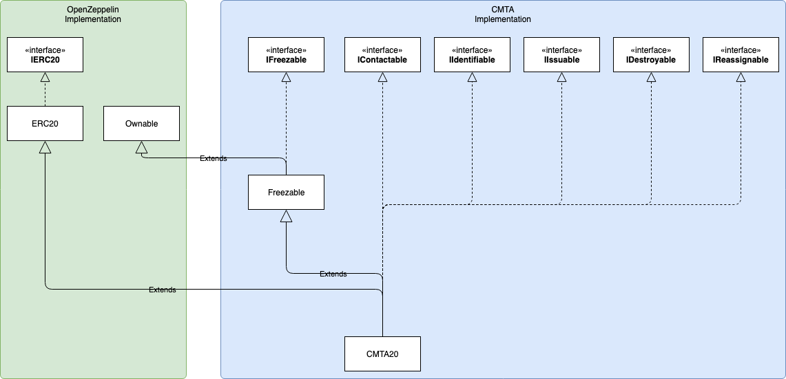

# CMTA20 Share Token (draft, request for comments)

The CMTA20 token is a proposed ERC20 extension described as a Solidity smart contract for the Ethereum platform, implementing functionalities required to tokenize a Swiss corporation's equity securities (or "shares"), in accordance with the [Blueprint]( https://www.cmta.ch/content/52/cmta-blueprint-for-the-tokenization-of-shares-of-swiss-corporations.pdf) published by the [Capital Markets and technology association](http://www.cmta.ch/) (CMTA).

The blueprint document describes the process through which shares that have already been issued pursuant to Swiss corporation law can be "wrapped" into digital tokens, so that the tokens and the underlying shares are tied to each other in a manner that prevents the shares from being transferred without the corresponding tokens and vice-versa.

**IMPORTANT**: This project and the code in the present repository is an example implementation of the CMTA Blueprint requirements to an ERC20 interface extension which is publicly shared as a draft, in order to receive feedback from potential users and from the community at large, regarding aspects such as functionality, security, or interface design. The preferred way to receive comments is through the GitHub issue tracker (therefore making the comments public); private comments can be sent to the CMTA secretariat at [admin@cmta.ch](mail:admin@cmta.ch).

**NOTE**:
A related project is the [Security Token Standard](https://thesecuritytokenstandard.org/), an initiative driven by Polymath and supported by a number of organizations, which resulted in the creation of the ERC 1400 (Security Token Standard) and ERC 1410 (Partially Fungible Token Standard) tokens. These are ERC 20-compatible tokens which leverage related EIPs (1594, 1643, 1655) in order to create a comprehensive interface for arbitrary asset classes across jurisdictions. In comparison, CMTA20 aims at providing a minimal interface to securely enable the tokenization of shares (equity securities) in accordance with Swiss law, as an example implementation of the tokenisation [blueprint](https://www.cmta.ch/content/52/cmta-blueprint-for-the-tokenization-of-shares-of-swiss-corporations.pdf) published by the CMTA.

## Token architecture



## Function overview

The CMTA20 token is an ERC20-compatible token, which extends the ERC20 interface with the following functions:

The following functions enable the token issuer (i.e., "owner" of the share token contract) and shareholder to associate data to their address, in a way that the owner can retrieve a shareholder's data:

- `setContact`: Sets the contact point (such as an email address) for shareholders to contact the token issuer. (*only owner*)
  - *Param* `String _contact`: The contact point to be set
  - *Emits* `LogContactSet` event with the new contact point as parameter

- `setMyIdentity`: Allows a potential/actual shareholder to set his own identity on chain. For privacy reasons, we recommend that identity is cryptographically protected (e.g., encrypted and signed).
  - *Param* `bytes _identity`: The binary string that represents the protected identity of the potential/actual shareholder.

- `identity`: Retrieves the encrypted binary string that represents the identity of a potential/actual shareholder, if set.
  - *Param* `address shareholder`: The address of the potential/actual shareholder
  _ *Returns* the encrypted binary string that represents the identity of a potential/actual shareholder or 0x0 if the identity has not been set

Tokens issuance, supply, and ownership can be managed by the owner thanks to the following functions:

- `issue`: Issue new share tokens to the owner address (*only owner*)
  - *Param* `uint256 _amount`: The amount of token to be issued
  - *Emits* `LogIssued` event with the amount of issued tokens as parameter
  - *Emits* `Transfer` event with the 0 address, the owner address and the amount issued as parameters

- `redeem`: Redeem share token from the owner address (*only owner*)
  - *Param* `uint256 _amount`: The amount of token to be redeemed
  - *Emits* `LogRedeemed` event with the amount of redeemed tokens as parameter
  - *Emits* `Transfer` event with the owner address, the 0 address and the amount redeemed as parameters

- `reassign`: Reassign all tokens from original address to replacement address
  - *Param* `address original`: Original address to retrieve the token from
  - *Param* `address replacement`: Destination address on which the token will be reassigned
  - *Emits* `Transfer` event with the original address, the replacement address and the amount of tokens to be reassigned as parameters
  - *Emits* `LogReassigned` event with the original address, the replacement address and the amount of tokens reassigned as parameters

- `destroy`: Destroy tokens from multiple addresses holding it. Tokens will be sent to owner address that will have to call redeem to definitely destroy the tokens (*only owner*)
  - *Param* `address[] shareholders` : Array of addresses holding potentially holding tokens that will be destroyed
  - *Emits* `Transfer` events with the shareholder address, the owner address and the amount destroyed as parameters
  - *Emits* `LogDestroyed` event with shareholders addresses on which tokens were destroyed

The token can be frozen (and unfrozen):

- `freeze`: Freeze the token transfers (*only owner*)
  - *Emits* `LogFrozen` event with the freeze time as parameter

- `unfreeze`: Unfreeze the token transfers (*only owner*)
  - *Emits* `LogUnfrozen` event with the unfreeze time as parameter

Ownership of the token can be abandoned or transferred:
  
- `renounceOwnership`: Renounce the ownership of the token (*this change cannot be reverted and the token will not be able to be administered anymore*) (*only owner*)
  - *Emits* `OwnershipRenounced` event with the previous owner as parameter

- `transferOwnership:` Transfers the ownership of the token to `_newOwner`. (be absolutely sure that you're in full control of _newOwner associated private key otherwise the token will not be able to be administered anymore) (*only owner*)
  - *Param* `address _newOwner`: the address of the new owner of the token
  - *Emits* `OwnershipTransferred` event with the previous owner and the new owner as parameters


## Optional rule engine

The `canTransfer` function can be used to verify if a transfer is authorized by the rules established by the token owner:

- `canTransfer`: Check if it is possible to transfer `_value` tokens from `_from` address to `_to` address
  - *Param* `address _from`: Source address for the transfer
  - *Param* ` address _to`: Destination address for the transfer
  - *Param* `uint256 _value`: Amount of tokens to be transferred
  - *Returns* `true` if the transfer is possible, false otherwise

Said rules are defined through an (optional) rule engine, set using the `setRuleEngine` method. CMTA does not provide any RuleEngine implementation. It does however provide interfaces `IRuleEngine` and `IRule` to help with the implementation:

- `setRuleEngine`: Sets the optional rule engine address (*only owner*)
  - *Param* `IRuleEngine _ruleEngine`: The rule engine contract address to act as an external validator for transfers
  - *Emits* `LogRuleEngineSet` event with the new rule engine address as parameter

```
interface IRuleEngine {
  function setRules(IRule[] calldata rules) external;
  function ruleLength() external view returns (uint256);
  function rule(uint256 ruleId) external view returns (IRule);
  function rules() external view returns(IRule[] memory);

  function validateTransfer(
    address _from, 
    address _to, 
    uint256 _amount)
  external view returns (bool);
}
```

```
interface IRule {
  function isTransferValid(
    address _from, address _to, uint256 _amount)
  external view returns (bool isValid);
}
```


## Intellectual property and contributors

The code is copyright (c) Capital Market and Technology Association, 2018-2019, and is released under [Mozilla Public License 2.0](./LICENSE.md).

The smart contract was designed by CMTA's Technical Committee, with contributions from [Lenz & Staehelin](https://www.lenzstaehelin.com/), [Mt Pelerin](https://www.mtpelerin.com/) (source code lead author), [Swissquote](https://swissquote.com/), [Taurus Group](https://taurusgroup.ch/), and [Tokenestate](https://tokenestate.io/).
