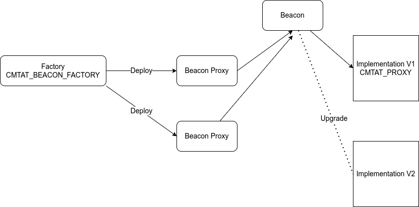
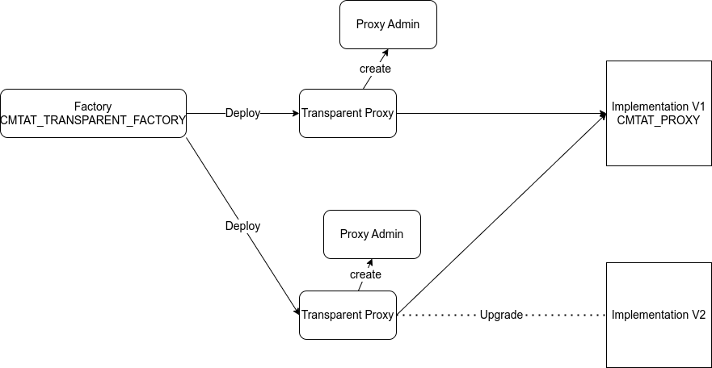

# CMTA Token 

> To use the CMTAT, we recommend the latest audited version, from the [Releases](https://github.com/CMTA/CMTAT/releases) page. Currently, it is the version [v2.3.0](https://github.com/CMTA/CMTAT/releases/tag/v2.3.0)

## Introduction

The CMTA token (CMTAT) is a framework enabling the tokenization of securities in compliance with Swiss law. This repository provides CMTA's reference implementation of CMTAT for Ethereum, as an ERC-20 compatible token.

The CMTAT is an open standard from the [Capital Markets and Technology Association](http://www.cmta.ch/) (CMTA), which gathers Swiss finance, legal, and technology organizations.
The CMTAT was developed by a working group of CMTA's Technical Committee that includes members from Atpar, Bitcoin Suisse, Blockchain Innovation Group, Hypothekarbank Lenzburg, Lenz & Staehelin, Metaco, Mt Pelerin, SEBA, Swissquote, Sygnum, Taurus and Tezos Foundation. The design and security of the CMTAT was supported by ABDK, a leading team in smart contract security.

The preferred way to receive comments is through the GitHub issue tracker.  Private comments and questions can be sent to the CMTA secretariat at <a href="mailto:admin@cmta.ch">admin@cmta.ch</a>. For security matters, please see [SECURITY.md](./SECURITY.MD).

Note that CMTAT may be used in other jurisdictions than Switzerland, and for tokenizing various asset types, beyond equity and debt products. 

## Functionality

### Overview

The CMTAT supports the following core features:

* Basic mint, burn, and transfer operations
* Pause of the contract and freeze of specific accounts

Furthermore, the present implementation uses standard mechanisms in
order to support:

* Upgradeability, via deployment of the token with a proxy
* "Gasless" transactions
* Conditional transfers, via a rule engine

This reference implementation allows the issuance and management of tokens representing equity securities.
It can however also be used for other forms of financial instruments such as debt securities.

You may modify the token code by adding, removing, or modifying features. However, the core modules must remain in place for compliance with Swiss law.

### Kill switch

CMTAT initially supported a `kill()` function relying on the SELFDESTRUCT opcode (which effectively destroyed the contract's storage and code).
However, Ethereum's [Cancun upgrate](https://github.com/ethereum/execution-specs/blob/master/network-upgrades/mainnet-upgrades/cancun.md) (rolled out in Q1 of 2024)  has removed support for SELFDESTRUCT (see [EIP-6780](https://eips.ethereum.org/EIPS/eip-6780)).

The `kill()` function will therefore not behave as it was used

We have replaced this function by a new function `deactivateContract`, introduced in the version v2.3.1 inside the PauseModule, to deactivate the contract.
This function set a boolean state variable `isDeactivated` to true and puts the contract in the pause state.
The function `unpause`is updated to revert if the previous variable is set to true, thus the contract is in the pause state "forever".

The consequences are the following:

- In standalone mode, this operation is irreversible, it is not possible to rollback.
- With a proxy, it is still possible to rollback by deploying a new implementation.

### Gasless support

The CMTAT supports client-side gasless transactions using the [Gas Station Network](https://docs.opengsn.org/#the-problem) (GSN) pattern, the main open standard for transfering fee payment to another account than that of the transaction issuer. The contract uses the OpenZeppelin contract `ERC2771ContextUpgradeable`, which allows a contract to get the original client with `_msgSender()` instead of the fee payer given by `msg.sender` while allowing upgrades on the main contract (see *Deployment via a proxy* above).

At deployment, the parameter  `forwarder` inside the  CMTAT contract constructor has to be set  with the defined address of the forwarder. Please note that the forwarder can not be changed after deployment, and with a proxy architecture, its value is stored inside the implementation contract bytecode instead of the storage of the proxy.

Please see the OpenGSN [documentation](https://docs.opengsn.org/contracts/#receiving-a-relayed-call) for more details on what is done to support GSN in the contract.

## Architecture

CMTAT architecture is divided in two main componentes: module and engines

### Module

Modules describe a logical code separation inside CMTAT.  They are defined as abstract contracts.
Their code and functionalities are part of the CMTAT and therefore are also included in the calculation of the contract size and the maximum size limit of 24 kB.

It is always possible to delete a module but this requires modifying the code and compiling it again, which require to perform a security audit on these modifications.

Modules are also separated in different categories.

- Internal modules: implementation for a module when OpenZeppelin does not provide a library to use. For example, this is the case for the SnapshotModule.

- Wrapper modules: abstract contract around OpenZeppelin contracts or internal module.
  For example, the wrapper PauseModule provides public functions to call the internal functions from OpenZeppelin.

  - Core (Wrapper sub-category): Contains the modules required to be CMTA compliant
  - Extension (Wrapper sub-category): not required to be CMTA compliant, "bonus features" (snapshotModule, debtModule)

  

#### List

Here the list of the different modules with the links towards the documentation and the main file.

##### Controller

| Name             | Documentation                                                | Main File                                                    |
| ---------------- | ------------------------------------------------------------ | ------------------------------------------------------------ |
| ValidationModule | [validation.md](doc/modules/presentation/controllers/validation.md) | [ValidationModule.sol](./contracts/modules/wrapper/controllers/ValidationModule.sol) |

##### Core

Generally, these modules are required to be compliant with the CMTA specification.

| Name              | Documentation                                                | Main File                                                    |
| ----------------- | ------------------------------------------------------------ | ------------------------------------------------------------ |
| BaseModule        | [base.md](doc/modules/presentation/core/base.md)             | [BaseModule.sol](./contracts/modules/wrapper/core/BaseModule.sol) |
| BurnModule        | [ERC20Burn.md](doc/modules/presentation/core/ERC20Burn.md)   | [ERC20BurnModule.sol](./contracts/modules/wrapper/core/ERC20BurnModule.sol) |
| EnforcementModule | [enforcement.md](doc/modules/presentation/core/enforcement.md) | [EnforcementModule.sol](./contracts/modules/wrapper/core/EnforcementModule.sol) |
| ERC20BaseModule   | [erc20base.md](doc/modules/presentation/core/erc20base.md)   | [ERC20BaseModule.sol](./contracts/modules/wrapper/core/ERC20BaseModule.sol) |
| MintModule        | [ERC20Mint.md](doc/modules/presentation/core/ERC20Mint.md)   | [ERC20MintModule.sol](./contracts/modules/wrapper/core/ERC20MintModule.sol) |
| PauseModule       | [pause.md](doc/modules/presentation/core/pause.md)           | [PauseModule.sol](./contracts/modules/wrapper/core/PauseModule.sol) |

##### Extensions

Generally, these modules are not required to be compliant with the CMTA specification.

| Name           | Documentation                                                | Main File                                                    |
| -------------- | ------------------------------------------------------------ | ------------------------------------------------------------ |
| MetaTxModule   | [metatx.md](doc/modules/presentation/extensions/metatx.md)   | [MetaTxModule.sol](./contracts/modules/wrapper/extensions/MetaTxModule.sol) |
| SnapshotModule | [snapshot.md](doc/modules/presentation/extensions/snapshot.md) | [SnapshotModule.sol](./contracts/modules/wrapper/extensions/SnapshotModule.sol) |
| DebtModule     | <Todo>                                                       | [DebtModule.sol](./contracts/modules/wrapper/extensions/DebtModule.sol) |
| DocumentModue  | <Todo>                                                       | [Document.sol](./contracts/modules/wrapper/extensions/DocumentModule.sol) |

##### Security

| Name                | Documentation                                                | Main File                                                    |
| ------------------- | ------------------------------------------------------------ | ------------------------------------------------------------ |
| AuthorizationModule | [authorization.md](./doc/modules/presentation/security/authorization.md) | [AuthorizationModule.sol](./contracts/modules/security/AuthorizationModule.sol) |

### Engines

Engines are external smart contracts called by CMTAT modules.

These engines are **optional** and their addresses can be left to zero.

More details are available in [./doc/general/Engine.md](./doc/general/Engine.md)


#### RuleEngine (IERC-1404)

The `RuleEngine` is an external contract used to apply transfer restriction to the CMTAT through whitelisting, blacklisting,...

This contract is defined in the `ValidationModule`.

An example of RuleEngine is also available on [Github](https://github.com/CMTA/RuleEngine).

Here is the list of the different version available for each CMTAT version.

| Name                    | RuleEngine                                                   |
| ----------------------- | ------------------------------------------------------------ |
| CMTAT 2.4.0 (unaudited) | RuleEngine >=v2.0.0<br />Last version: [v2.0.2](https://github.com/CMTA/RuleEngine/releases/tag/v2.0.2)(unaudited) |
| CMTAT 2.3.0             | [RuleEngine v1.0.2](https://github.com/CMTA/RuleEngine/releases/tag/v1.0.2) |
| CMTAT 2.0 (unaudited)   | [RuleEngine 1.0](https://github.com/CMTA/RuleEngine/releases/tag/1.0) (unaudited) |
| CMTAT 1.0               | No ruleEngine available                                      |

This contract acts as a controller and can call different contract rule to apply rule on each transfer.

A possible rule is a whitelist rule where only the address inside the whitelist can perform a transfer

Since the version 2.4.0, the requirement to use a RuleEngine are the following:

> The `RuleEngine` has to import an implement the interface `IRuleEngine` which declares the function `operateOnTransfer`.

This interface can be found in [./contracts/interfaces/engine/IRuleEngine.sol](./contracts/interfaces/engine/IRuleEngine.sol).

Before each transfer, the CMTAT calls the function `operateOnTransfer` which is the entrypoint for the RuleEngine.

#### AuthorizationEngine

The `AuthorizationEngine` is an external contract to add supplementary check on the functions `grantRole` and `revokeRole`from the CMTAT.

This contract is managed in the `AuthorizationModule`.

The `AuthorizationEngine` has to import an implement the interface [IAuthorizationEngine.sol](./contracts/interfaces/engine/IAuthorizationEngine.sol) which declares the functions `operateOnGrantRole` and `operateOnRevokeRole`

Currently, there is only a prototype available: [CMTA/AuthorizationEngine](https://github.com/CMTA/AuthorizationEngine)

#### DebtEngine

This engine replaces the modules Debt and Credit included since CMTAT version.

CMTAT only implements two functions , available in the interface [IDebtEngine](./contracts/interfaces/engine/IDebtEngine.sol) to get information from the debtEngine.

```solidity
interface IDebtEngine is IDebtGlobal {
    function debt() external view returns(IDebtGlobal.DebtBase memory);
    function creditEvents() external view returns(IDebtGlobal.CreditEvents memory);
}
```

Use an external contract provides two advantages: 

- Reduce code size of CMTAT, which is near of the maximal size limit 
- Allow to manage this information for several different tokens  (CMTAT or not).

Currently, there is no implementation of a DebtEngine available

#### DocumentEngine (IERC-1643)

The `DocumentEngine` is an external contract to support [*ERC-1643*](https://github.com/ethereum/EIPs/issues/1643) inside CMTAT, a standard proposition to manage document on-chain. This standard is notably used by [ERC-1400](https://github.com/ethereum/eips/issues/1411) from Polymath. 

This EIP defines a document with three attributes:

- A short name (represented as a `bytes32`)
-  A generic URI (represented as a `string`) that could point to a website or other document portal.
-  The hash of the document contents associated with it on-chain.

CMTAT only implements two functions from this standard, available in the interface [IERC1643](./contracts/interfaces/engined/draft-IERC1643.sol) to get the documents from the documentEngine.

```solidity
interface IERC1643 {
function getDocument(bytes32 _name) external view returns (string memory , bytes32, uint256);
function getAllDocuments() external view returns (bytes32[] memory);
}
```

The `DocumentEngine` has to import an implement this interface. To manage the documents, the engine is completely free on how to do it.

Use an external contract provides two advantages: 

- Reduce code size of CMTAT, which is near of the maximal size limit 
- Allow to manage documents for several different tokens  (CMTAT or not).

Currently, there is no implementation of a DocumentEngine available

## Deployment model 

| Model                       | Contract                                             |
| --------------------------- | ---------------------------------------------------- |
| Standalone                  | [CMTAT_STANDALONE](./contracts/CMTAT_STANDALONE.sol) |
| Transparent ou Beacon Proxy | [CMTAT_PROXY](./contracts/CMTAT_PROXY.sol)           |
| UUPS Proxy                  | [CMTAT_PROXY_UUPS](./contracts/CMTAT_PROXY_UUPS.sol) |


### Standalone

To deploy CMTAT without a proxy, in standalone mode, you need to use the contract version `CMTAT_STANDALONE`.

### With a proxy

The CMTAT supports deployment via a proxy contract.  Furthermore, using a proxy permits to upgrade the contract, using a standard proxy upgrade pattern.

- The  implementation contract to use with a TransparentProxy  is the `CMTAT_PROXY`.
- The  implementation contract to use with a UUPSProxy  is the `CMTAT_PROXY_UUPS`.

Please see the OpenZeppelin [upgradeable contracts documentation](https://docs.openzeppelin.com/upgrades-plugins/1.x/writing-upgradeable) for more information about the proxy requirements applied to the contract.

Please see the OpenZeppelin [Upgrades plugins](https://docs.openzeppelin.com/upgrades-plugins/1.x/) for more information about plugin upgrades in general.

Note that deployment via a proxy is not mandatory, but is recommended by CMTA.


### Factory

Factory contracts are available to deploy the CMTAT with a beacon proxy, a transparent proxy or an UUPS proxy.

- [CMTAT_BEACON_FACTORY.sol](./contracts/deployment/CMTAT_BEACON_FACTORY.sol)

- [CMTAT_TRANSPARENT_FACTORY.sol](./contracts/deployment/CMTAT_TP_FACTORY.sol)
- [CMTAT_UUPS_FACTORY.sol](./contracts/deployment/CMTAT_UUPS_FACTORY.sol)

#### Beacon Proxy Factory

The factory will use the same beacon for each beacon proxy. This beacon provides the address of the implementation contract, a CMTAT_PROXY contract. If you upgrade the beacon to point to a new implementation, it will change the implementation contract for all beacon proxy.



#### Transparent Proxy Factory

The factory will use the same implementation for each transparent proxy deployed. Each transparent proxy has its owned proxy admin, deployed inside the constructor of the transparent proxy. Each transparent proxy can upgrade their implementation to a new one independently and without impact on other proxies.



#### UUPS ProxyFactory

The factory will use the same implementation for each UUPS proxy deployed. Each UUPS proxy can upgrade their implementation to a new one independently and without impact on other proxies.

Contrary to the Transparent Proxy, the logic to upgrade the proxy is situated in the implementation and not in the proxy.

This is the reason whey there is a specific CMTAT contract which includes this logic to use: [CMTAT_PROXY_UUPS.sol](./contracts/CMTAT_PROXY_UUPS.sol)


## Security

### Vulnerability disclosure

Please see [SECURITY.md](./SECURITY.MD).


### Module

See the code in [modules/security](./contracts/modules/security).

Access control is managed thanks to the module `AuthorizationModule`.

### Audit

The contracts have been audited by [ABDKConsulting](https://www.abdk.consulting/), a globally recognized firm specialized in smart contracts security.

#### First audit - September 2021

Fixed version : [1.0](https://github.com/CMTA/CMTAT/releases/tag/1.0)

Fixes of security issues discovered by the initial audit were reviewed by ABDK and confirmed to be effective, as certified by the [report released](doc/audits/ABDK-CMTAT-audit-20210910.pdf) on September 10, 2021, covering [version c3afd7b](https://github.com/CMTA/CMTAT/tree/c3afd7b4a2ade160c9b581adb7a44896bfc7aaea) of the contracts.
Version [1.0](https://github.com/CMTA/CMTAT/releases/tag/1.0) includes additional fixes of minor issues, compared to the version retested.

A summary of all fixes and decisions taken is available in the file [CMTAT-Audit-20210910-summary.pdf](doc/audits/CMTAT-Audit-20210910-summary.pdf) 

#### Second audit - March 2023

Fixed version : [v2.3.0](https://github.com/CMTA/CMTAT/releases/tag/v2.3.0)

The second audit covered version [2.2](https://github.com/CMTA/CMTAT/releases/tag/2.2).

Version v2.3.0 contains the different fixes and improvements related to this audit.

The report is available in [ABDK_CMTA_CMTATRuleEngine_v_1_0.pdf](doc/audits/ABDK_CMTA_CMTATRuleEngine_v_1_0/ABDK_CMTA_CMTATRuleEngine_v_1_0.pdf). 

### Tools

You will find the report produced by [Slither](https://github.com/crytic/slither) in 

| Version      | File                                                         |
| ------------ | ------------------------------------------------------------ |
| Last version | [slither-report.md](doc/audits/tools/slither-report.md)      |
| v2.3.0       | [v2.3.0-slither-report.md](doc/audits/tools/v2.3.0-slither-report.md) |
| v2.3.1       | [v2.3.1-slither-report.md](doc/audits/tools/v2.3.1-slither-report.md) |
| v2.4.0       | [v2.4.0-slither-report.md](doc/audits/tools/v2.4.0-slither-report.md) |


### Test

A code coverage is available in [index.html](doc/general/test/coverage/index.html).


### Remarks

As with any token contract, access to the owner key must be adequately restricted.
Likewise, access to the proxy contract must be restricted and seggregated from the token contract.

## Documentation

Here a summary of the main documents:

| Document                          | Link/Files                                                 |
| --------------------------------- | ---------------------------------------------------------- |
| Documentation of the modules API. | [doc/modules](doc/modules)                                 |
| Documentation on the toolchain    | [doc/TOOLCHAIN.md](doc/TOOLCHAIN.md)                       |
| How to use the project            | [doc/USAGE.md](doc/USAGE.md)                               |
| Project architecture              | [doc/general/ARCHITECTURE.md](doc/general/ARCHITECTURE.md) |

CMTA providers further documentation describing the CMTAT framework in a platform-agnostic way, and covering legal aspects, see

-  [CMTA Token (CMTAT)](https://cmta.ch/standards/cmta-token-cmtat)
- [Standard for the tokenization of shares of Swiss corporations using the distributed ledger technology](https://cmta.ch/standards/standard-for-the-tokenization-of-shares-of-swiss-corporations-using-the-distributed-ledger-technology)

### Further reading
- [CMTA - A comparison of different security token standards](https://cmta.ch/news-articles/a-comparison-of-different-security-token-standards)
- [Taurus - Security Token Standards: A Closer Look at CMTAT](https://www.taurushq.com/blog/security-token-standards-a-closer-look-at-cmtat/)
- [Taurus - Equity Tokenization: How to Pay Dividend On-Chain Using CMTAT](https://www.taurushq.com/blog/equity-tokenization-how-to-pay-dividend-on-chain-using-cmtat/)
- [Taurus - Token Transfer Management: How to Apply Restrictions with CMTAT and ERC-1404](https://www.taurushq.com/blog/token-transfer-management-how-to-apply-restrictions-with-cmtat-and-erc-1404/)

## Others implementations
Two versions are available for the blockchain [Tezos](https://tezos.com)
- [CMTAT FA2](https://github.com/CMTA/CMTAT-Tezos-FA2) Official version written in SmartPy
- [@ligo/cmtat](https://github.com/ligolang/CMTAT-Ligo/) Unofficial version written in Ligo

## Contract size


## Intellectual property

The code is copyright (c) Capital Market and Technology Association, 2018-2024, and is released under [Mozilla Public License 2.0](./LICENSE.md).
