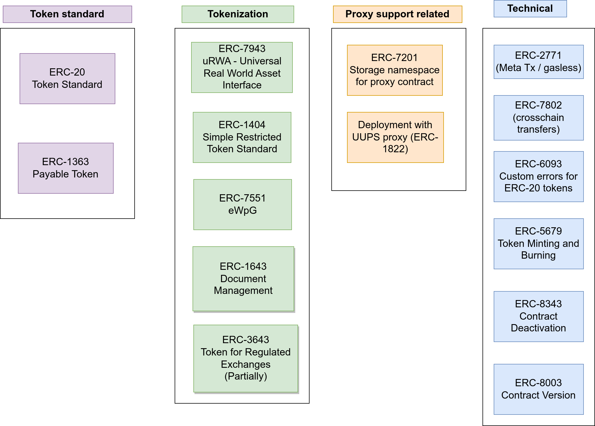

# CMTA Token (CMTAT)

> Latest audited release: [v3.0.0](https://github.com/CMTA/CMTAT/releases/tag/v3.0.0)
>
> Latest release: [v3.2.0](https://github.com/CMTA/CMTAT/releases/tag/v3.2.0)

CMTAT is a blockchain-agnostic open-source **security token framework**. This repository provides the Solidity reference implementation for EVM-compatible blockchains such as Ethereum, Optimism, Arbitrum, and Polygon PoS. It is developed and maintained by the [Capital Markets and Technology Association](https://www.cmta.ch/) (CMTA).  
It provides a modular implementation focused on regulated issuance and lifecycle management (transfer restrictions, enforcement, pause/deactivation, supply controls, documentation, and optional cross-chain features), with multiple deployment variants (standalone and upgradeable) to fit different product and jurisdiction requirements.

## What is CMTAT?

CMTAT extends the standard [ERC-20](https://eips.ethereum.org/EIPS/eip-20) token with compliance features required for regulated financial instruments:

| Feature | Purpose | Standards | Module Scope |
|---|---|---|---|
| **Pause** | Freeze all transfers globally (e.g., during corporate actions) | [ERC-3643](https://eips.ethereum.org/EIPS/eip-3643), [ERC-7551](https://ethereum-magicians.org/t/erc-7551-crypto-security-token-smart-contract-interface-ewpg-reworked/25477) (eWpG profile) | Core |
| **Deactivate** | Permanently disable token operations when required by lifecycle/governance decisions | [ERC-8343](https://github.com/ethereum/ERCs/pull/1900) (draft, not yet merged) | Core |
| **Account Freeze** | Block specific addresses from transferring | [ERC-3643](https://eips.ethereum.org/EIPS/eip-3643) enforcement model, [ERC-7943](https://eips.ethereum.org/EIPS/eip-7943) send/receive checks | Core |
| **Mint / Burn** | Controlled issuance and redemption of tokens | [ERC-3643](https://eips.ethereum.org/EIPS/eip-3643), [ERC-7551](https://ethereum-magicians.org/t/erc-7551-crypto-security-token-smart-contract-interface-ewpg-reworked/25477) (eWpG profile) | Core |
| **Batch Mint / Batch Burn** | Process multiple mint or burn operations in a single transaction | [ERC-3643](https://eips.ethereum.org/EIPS/eip-3643) | Core |
| **Configurable Decimals** | Define token decimals at deployment time | [ERC-20](https://eips.ethereum.org/EIPS/eip-20)-compatible behavior | Core |
| **Forced Transfer** | Admins can move tokens from frozen accounts | [ERC-3643](https://eips.ethereum.org/EIPS/eip-3643), [ERC-7551](https://ethereum-magicians.org/t/erc-7551-crypto-security-token-smart-contract-interface-ewpg-reworked/25477) (eWpG profile), [ERC-7943](https://eips.ethereum.org/EIPS/eip-7943) | Core/Extension |
| **Set Name / Symbol** | Update token name and symbol after deployment (supported deployment versions) | [ERC-3643](https://eips.ethereum.org/EIPS/eip-3643) | Core |
| **Contract Versioning** | Expose the contract's implementation version on-chain as a human-readable SemVer string via `version()` | [ERC-8303](https://github.com/ethereum/ERCs/pull/1819) (draft, not yet merged), [ERC-3643](https://eips.ethereum.org/EIPS/eip-3643) | Core |
| **Freeze Partial Tokens** | Freeze a specific amount of tokens on an address | [ERC-3643](https://eips.ethereum.org/EIPS/eip-3643), [ERC-7551](https://ethereum-magicians.org/t/erc-7551-crypto-security-token-smart-contract-interface-ewpg-reworked/25477) (eWpG profile), [ERC-7943](https://eips.ethereum.org/EIPS/eip-7943) equivalent (`setFrozenTokens`/`getFrozenTokens`) | Extension |
| **Transfer Validation** | Plug-in rule engine to restrict transfers by origin, receiver, or amount | [ERC-3643](https://eips.ethereum.org/EIPS/eip-3643), [ERC-7551](https://ethereum-magicians.org/t/erc-7551-crypto-security-token-smart-contract-interface-ewpg-reworked/25477), [ERC-7943](https://eips.ethereum.org/EIPS/eip-7943) | Extension/Option |
| **Snapshots** | Record balances at a specific point in time (e.g., for dividends) | CMTAT SnapshotEngine integration | Extension/Option |
| **Holder List** | Maintain on-chain the set of addresses holding a non-zero balance (issuer reporting, corporate actions) | [Fungible holder enumeration](./doc/ERCSpecification/draft-erc-token-holder.md) (draft) | Option |
| **Documents** | Attach legal documents to the token on-chain | [ERC-1643](https://github.com/ethereum/EIPs/issues/1643)-compatible document model | Extension/Option |
| **Cross-Chain Mint/Burn** | Cross-chain bridge-oriented mint/burn interface | [ERC-7802](https://eips.ethereum.org/EIPS/eip-7802) | Extension |
| **Permit** | Signature-based approvals without on-chain approve transaction | [ERC-2612](https://eips.ethereum.org/EIPS/eip-2612) | Deployment-version specific |
| **Multicall** | Execute multiple calls in one transaction | [ERC-6357](https://eips.ethereum.org/EIPS/eip-6357) | Deployment-version specific |
| **UUPS Upgradeability** | Upgradeable proxy pattern support | [ERC-1822](https://eips.ethereum.org/EIPS/eip-1822) | Deployment-version specific |
| **Debt Features** | Debt lifecycle and credit-event related capabilities | CMTAT Debt modules | Deployment-version specific |
| **ERC-1363 Payable Token Hooks** | Token callbacks (`transferAndCall` / `approveAndCall`) | [ERC-1363](https://eips.ethereum.org/EIPS/eip-1363) | Deployment-version specific |

Document model note:
- CMTAT implements **both** the *original* [ERC-1643](https://github.com/ethereum/EIPs/issues/1643) — only ever a GitHub issue (2018 draft), never a merged EIP — and its *current rework*, the draft proposal ["Document Management for Security Tokens" (ethereum/ERCs PR #1754, open/draft)](https://github.com/ethereum/ERCs/pull/1754).
- ERC-1643 document identifiers in CMTAT use `bytes32` names.
- CMTAT tokenization terms keep the modified CMTAT document structure (`IERC1643CMTAT.DocumentInfo`) with `string name`.

## Who uses CMTAT?

CMTAT is used in production by major financial institutions including **UBS**, **Taurus SA**, **Zand Trust**, **Daura**, **Obligate**, and **Syz Group** to tokenize equities, artwork, bonds, structured products, money market funds, and stablecoins.

### Example Per Use Case

- **Equities**: [Magic Tomato SA (2022)](https://www.taurushq.com/blog/magictomato-1st-foodtech-to-tokenise-its-shares-and-raise-equity/), [Qoqa Brew (2022)](https://www.taurushq.com/blog/qoqa-brew-brasserie-du-futur-tokenisation-et-financement-by-taurus/), [Cité Gestion SA (2023)](https://cmta.ch/news-articles/cite-gestion-becomes-cmta-certified-issuer-of-tokenized-shares), [CODE41 (2023)](https://www.taurushq.com/blog/code41-tokenises-its-shares-for-a-capital-increase-amongst-its-community-through-taurus-technology/).
- **Debt / Bonds**: [UBS Project Guardian digital bond (2024)](https://www.linkedin.com/posts/cmta-ch_shareubs-activity-7137735139438002177-oDUL), [SCCF tokenized trade-finance notes (2023)](https://www.taurushq.com/blog/sccf-and-horizon-capital-leverage-taurus-technology-to-execute-landmark-tokenized-trade-finance-debt-transaction/), [Obligate](https://www.obligate.com)
- **Structured Products**: [UBS tokenized warrant on Ethereum (2024)](https://www.ubs.com/global/en/media/display-page-ndp/en-20240207-tokenized-warrant.html)
- **Stablecoins**: Zand Trust (2025) issued an AED stablecoin using CMTAT v3.0.0 via Taurus infrastructure; [Zand Trust](https://zandtrust.com/).
- **Tokenized Market Funds**: [UBS uMINT (2024)](https://www.ubs.com/global/en/media/display-page-ndp/en-20241101-first-tokenized-investment-fund.html)
- **Tokenized Artwork**: [Syz Art tokenization](https://www.syzgroup.com/en/tokenization-syzart).
- **Private DvP settlement**: [Seturion (2026)](https://group.boerse-stuttgart.com/en/seturion/) (Börse Stuttgart Group) achieved private delivery-vs-payment settlement of tokenized assets on a public blockchain while keeping sensitive data confidential, using [CMTAT on Aztec](https://github.com/CMTA/private-CMTAT-aztec), a zero-knowledge Ethereum Layer-2. [Read more](https://www.linkedin.com/posts/seturion_achieving-private-dvp-settlement-on-public-activity-7424387919538450433-OItI/).

## Supported Financial Instruments

| Product | Deployment Version |
|---|---|
| Equities | CMTAT Standard |
| Equities / Bonds with balance snapshots (dividends, corporate actions) | CMTAT Snapshot, CMTAT Debt, CMTAT DebtEngine |
| On-chain shareholder registry / holder enumeration | CMTAT HolderList |
| Equities (Germany / eWpG) | CMTAT ERC-7551 |
| Debt / Bonds | CMTAT Debt |
| Debt / Bonds (external debt engine) | CMTAT DebtEngine |
| Stablecoins | CMTAT Light |
| Allowlist / Whitelist | CMTAT Allowlist or CMTAT Standard with RuleEngine |
| Permit + Multicall | CMTAT Permit |
| Payable token / DeFi callbacks | CMTAT ERC-1363 |
| Any (UUPS upgradeable proxy) | CMTAT UUPS |

Most products come in a **standalone** (immutable) or **upgradeable** (proxy) variant. The UUPS variant (`CMTATUpgradeableUUPS`) is upgradeable only — no standalone counterpart exists.

## Contract Sizes

Measured with `solc 0.8.34`, optimizer enabled (200 runs). EVM deployed bytecode limit: **24.576 KiB**.

| Deployment Version | Deployed (KiB) | Initcode standalone (KiB) | Initcode upgradeable (KiB) |
|---|---|---|---|
| CMTAT Standard | 22.251 | 25.663 | 22.577 |
| CMTAT Snapshot | 22.075 | 25.487 | 22.401 |
| CMTAT HolderList | 23.825 | 27.255 | 24.151 |
| CMTAT Light | 11.278 | 13.055 | 11.487 |
| CMTAT Allowlist | 19.882 | 23.079 | 20.208 |
| CMTAT Debt | 23.189 | 26.324 | 23.398 |
| CMTAT DebtEngine | 23.799 | 26.934 | 24.008 |
| CMTAT ERC-7551 | 22.812 | 26.224 | 23.138 |
| CMTAT ERC-1363 | 23.813 | 27.267 | 24.139 |
| CMTAT Permit | 23.341 | 26.650 | 23.550 |
| CMTAT UUPS | 23.552 | — | 23.904 |

All variants are within the deployed bytecode limit. The deployed size is identical between standalone and upgradeable for the same variant; the initcode is larger for standalone contracts since it includes the full constructor logic rather than an initializer.

## Key Standards

CMTAT implements a wide set of Ethereum standards:

- **[ERC-20](https://eips.ethereum.org/EIPS/eip-20)** — fungible token
- **[ERC-3643](https://eips.ethereum.org/EIPS/eip-3643)** — security token (without on-chain identity)
- **[ERC-7551](https://ethereum-magicians.org/t/erc-7551-crypto-security-token-smart-contract-interface-ewpg-reworked/25477)** — crypto security token interface (Germany eWpG profile)
- **[ERC-7943 (uRWA)](https://eips.ethereum.org/EIPS/eip-7943)** — universal RWA interface
- **[ERC-1404](https://github.com/ethereum/EIPs/issues/1404)** — restricted token. CMTAT (and the RuleEngine mock) implement **both** the *original* ERC-1404 — only ever published as a [GitHub issue](https://github.com/ethereum/EIPs/issues/1404), never a merged EIP (`detectTransferRestriction` / `messageForTransferRestriction`) — and its *current rework*, the draft proposal ["Simple Restricted Token" (ERCs PR #1701, open/draft)](https://github.com/ethereum/ERCs/pull/1701), which adds the spender-aware `detectTransferRestrictionFrom`.
- **[ERC-2612 Permit](https://eips.ethereum.org/EIPS/eip-2612)** — gasless approvals (specific deployment versions only)
- **[ERC-1363](https://eips.ethereum.org/EIPS/eip-1363)** — payable token hooks (specific deployment versions only)
- **[ERC-6357 Multicall](https://eips.ethereum.org/EIPS/eip-6357)** — batched calls in one transaction (specific deployment versions only)
- **[ERC-2771](https://eips.ethereum.org/EIPS/eip-2771)** — meta-transactions (gas sponsorship / gasless)
- **[ERC-7802](https://eips.ethereum.org/EIPS/eip-7802)** — cross-chain transfers
- **[ERC-7201](https://eips.ethereum.org/EIPS/eip-7201)** — storage namespaces for upgradeability
- **[ERC-8303](https://github.com/ethereum/ERCs/pull/1819)** — contract version exposed on-chain via `version()` (draft, not yet merged — [PR #1819](https://github.com/ethereum/ERCs/pull/1819))
- **[ERC-8343](https://github.com/ethereum/ERCs/pull/1900)** — contract deactivation (`deactivateContract()` / `deactivated()`), formerly `ICMTATDeactivate` (draft, not yet merged — [PR #1900](https://github.com/ethereum/ERCs/pull/1900))
- **[UUPS Proxy (ERC-1822 pattern)](https://eips.ethereum.org/EIPS/eip-1822)** — upgradeability pattern (specific deployment versions only)



## Cross-Chain Compatibility

CMTAT provides cross-chain compatibility through `ERC20CrossChain` and related deployment options:

- **ERC-7802**: native `crosschainMint` / `crosschainBurn` support for bridge-style interoperability.
- **Chainlink CCIP (CCT)**: compatible burn/mint token flow, including `getCCIPAdmin()` support through the `CCIPModule`. Scripts and examples are available in the project [CMTAT-CCIP](https://github.com/CMTA/CMTAT-CCIP)
- **LayerZero**: supported through external OFT adapters (ERC-3643 and ERC-7802 variants) in [CMTAT-LayerZero](https://github.com/CMTA/CMTAT-LayerZero).

For full architecture, permissions, and operational notes, see:
- [Cross-chain bridge integration](./doc/technical/cross-chain-bridge-integration.md)
- [Main documentation](./doc/README.md)

## Other CMTA projects

### Deployment version

This section regroups projects which implements new CMTAT deployment version for EVM/Ethereum with additionnal features

- [SnapshotEngine](https://github.com/CMTA/SnapshotEngine)

The SnapshotEngine is a smart contract system designed to perform ERC-20 on-chain snapshots, making it easier to distribute dividends or other token-based rewards directly on-chain. The SnapshotEngine can be external or integrated directly in the main token contract.

- [CMTAT-FIX](https://github.com/CMTA/CMTAT-FIX) ([Nethermind](https://www.nethermind.io))

Integration of FIX descriptor support for CMTAT.

This project provides a modular engine system that enables CMTAT tokens to store, manage, and verify FIX (Financial Information eXchange) protocol descriptors on-chain.

- [CMTAT-ACE](https://github.com/CMTA/CMTAT-ACE)

Integration of CMTAT with Chainlink's Automated Compliance Engine (ACE), keeping compliance rules in a separate policy engine so updating compliance becomes a configuration change rather than a contract redeployment. Two deployment variants are provided: Lite (transfer validation only) and Standard (policy-authoritative authorization).

### Blockchain Implementations

CMTAT is blockchain-agnostic and also has implementations/adaptations beyond this Solidity EVM repository:

- **Solana**: [CMTAT-Solana](https://github.com/CMTA/CMTAT-Solana)
- **Tezos**:
  - Official SmartPy implementation: [CMTAT-Tezos-FA2](https://github.com/CMTA/CMTAT-Tezos-FA2)
  - LIGO implementation: [CMTAT-Ligo](https://github.com/CMTA/CMTAT-Ligo)
- **Aztec (privacy-focused variant)**: [private-CMTAT-aztec](https://github.com/CMTA/private-CMTAT-aztec)
- **Zama Confidential variant**: [CMTAT-Confidential](https://github.com/CMTA/CMTAT-Confidential)
  -  A confidential security token implementation combining CMTAT compliance features with the Zama Confidential Blockchain Protocol for private balances.
- [CMTAT-Canton](https://github.com/CMTA/CMTAT-Canton): CMTAT version for Canton

### Utility contract

- [RuleEngine](https://github.com/CMTA/RuleEngine)

The RuleEngine is an external contract used to apply transfer restrictions to another contract, such as CMTAT and ERC-3643 tokens. Acting as a controller, it can call different contract rules and apply these rules on each transfer.

- [Rules](https://github.com/CMTA/Rules)

**Rules** is a collection of on-chain compliance and transfer-restriction rules designed for use with the [CMTA RuleEngine](https://github.com/CMTA/RuleEngine) and the [CMTAT token standard](https://github.com/CMTA/CMTAT).

- [SnapshotEngine](https://github.com/CMTA/SnapshotEngine)

The SnapshotEngine is a smart contract system designed to perform ERC-20 on-chain snapshots, making it easier to distribute dividends or other token-based rewards directly on-chain

- [IncomeVault](https://github.com/CMTA/IncomeVault)

The `IncomeVault` is a prototype to perform coupon-payment dividend with a CMTAT and the snapshotEngine

- [CMTAT-Factory](https://github.com/CMTA/CMTAT-Factory)

Factory to deploy CMTAT with Transparent, UUPS and Beacon proxy using **deterministic addresses (via CREATE2)**

- [Delivery vs. payment protocol](https://github.com/CMTA/DVP)

The DvP (Delivery versus Payment) smart contract (DVP.sol) interacts with an Asset Token smart contract (Delivery) and a *Payment Order Token* smart contract (Payment).

## Security

CMTAT has been audited by [ABDK](https://abdk.consulting) (v1.0, v2.3.0) and [Halborn](https://www.halborn.com) (v3.0.0), with ~99% test coverage across 5,626 automated tests.

> **WARNING — audit status.** Only **v3.0.0** has undergone a formal external security audit (Halborn). The subsequent releases **v3.1.0, v3.2.0 and v3.3.0 have NOT been formally audited**; they have only been reviewed with static analyzers ([Slither](https://github.com/crytic/slither), [Aderyn](https://github.com/Cyfrin/aderyn)) and AI-assisted auditing tools ([Nethermind Audit Agent](https://auditagent.nethermind.io)), which are **not** a substitute for a formal audit. Anyone deploying these versions in production **must perform their own independent security assessment and audit** before relying on them.

In addition to external audits and test coverage, CMTAT security reviews also include static analysis tools such as [Aderyn](https://github.com/Cyfrin/aderyn) and [Slither](https://github.com/crytic/slither), as well as AI-assisted auditing tools such as [Nethermind Audit Agent](https://auditagent.nethermind.io).

Per-tool reports, maintainer feedback, and dispositions are collected in **[doc/security/AUDIT.md](./doc/security/AUDIT.md)**. The v3.3.0 static-analysis run (Slither 0.11.5 — 110 results; Aderyn 0.6.5 — 2 High, 10 Low) surfaced **no exploitable finding requiring a code fix**: every result is a false positive, a documented design choice, an environment note, or a style/optimization item.

See [SECURITY.md](./SECURITY.md) for the responsible disclosure policy.

## License

[MPL-2.0](./LICENSE.md) — weak copyleft, allows commercial use.

### License Comparison

| Topic | MPL-2.0 | MIT | GNU GPL (v3) | Apache-2.0 |
|---|---|---|---|---|
| Open source | <strong><span style="color: #1e7e34;">&#x2714;</span></strong> | <strong><span style="color: #1e7e34;">&#x2714;</span></strong> | <strong><span style="color: #1e7e34;">&#x2714;</span></strong> | <strong><span style="color: #1e7e34;">&#x2714;</span></strong> |
| Commercial use | <strong><span style="color: #1e7e34;">&#x2714;</span></strong> | <strong><span style="color: #1e7e34;">&#x2714;</span></strong> | <strong><span style="color: #1e7e34;">&#x2714;</span></strong> | <strong><span style="color: #1e7e34;">&#x2714;</span></strong> |
| Copyleft level | Weak (file-level) | None (permissive) | Strong (project-level) | None (permissive) |
| If you modify licensed code | Must publish modified MPL files | No obligation to publish | Must publish derivative source under GPL | No obligation to publish |
| Proprietary code mixing | Allowed (keep MPL files under MPL) | Allowed | Restricted by GPL copyleft | Allowed |
| Patent license | <strong><span style="color: #1e7e34;">&#x2714;</span></strong> (explicit) | <strong><span style="color: #b00020;">&#x2718;</span></strong> (not explicit) | <strong><span style="color: #1e7e34;">&#x2714;</span></strong> (via GPLv3 terms) | <strong><span style="color: #1e7e34;">&#x2714;</span></strong> (explicit) |
| Notice / attribution | Required | Required | Required | Required (+ NOTICE handling) |

`Similarity`: all four licenses allow commercial use and redistribution.  
`Key difference`: MPL-2.0 is a middle ground between permissive licenses (MIT/Apache-2.0) and strong copyleft (GPL): only modified MPL-covered files must remain open.

**What is the patent license?**  
A patent license in an open-source license means contributors grant users permission to use any patents that would otherwise be needed to use their contributed code. This reduces patent-risk for adopters. `Apache-2.0`, `MPL-2.0`, and `GPLv3` include explicit patent protections (with termination clauses if someone starts a patent lawsuit over the covered software), while `MIT` does not include an explicit patent grant.

## Getting Started

[Hardhat](https://v2.hardhat.org) is the main development toolchain for this repository and for CMTAT.
[Forge (Foundry)](https://www.getfoundry.sh) is also installed and can compile the contracts, but Foundry-specific deployment scripts and Foundry-native test suites are maintained in a dedicated repository: [CMTAT-Foundry](https://github.com/CMTA/CMTAT-Foundry).

```bash
# Install dependencies
npm install

# Compile contracts
npm run hardhat:compile

# Run all tests
npm run test

# Generate coverage report
npm run coverage
```

## Documentation

Full specification, architecture details, module descriptions, and ERC compatibility tables are in **[doc/README.md](./doc/README.md)**. A short module/variant overview is in [doc/SUMMARY.md](./doc/SUMMARY.md).

Additional resources:

- [Usage Guide](./doc/USAGE.md)
- [FAQ](./doc/general/FAQ.md)
- Specification
  - [Specification PDF (v3.1.0)](./doc/specification/CMTATSpecificationV3.1.0.pdf)
  - [Specification PDF (v3.2.0)](./doc/specification/CMTATSpecificationV3.2.0.pdf)
- [Security Reports](./doc/security/) · [Audit overview](./doc/security/AUDIT.md)
- [CMTA Website](https://cmta.ch/)
- [GitHub Releases](https://github.com/CMTA/CMTAT/releases)

### Technical guides

Focused, subsystem-level guides live in [`doc/technical/`](./doc/technical/):

- **Architecture & operations** — [Deployment variants](./doc/technical/deployment.md) · [Lifecycle: pause & deactivation](./doc/technical/lifecycle.md) · [Access control (roles)](./doc/technical/access-control.md)
- **Standards** — [ERC-3643 implementation](./doc/technical/erc-3643-implementation.md) · [ERC-7551 (eWpG)](./doc/technical/erc7551.md) · [ERC-7943 (uRWA) integration](./doc/technical/erc-7943-uRWA-integration.md) · [Documents (ERC-1643)](./doc/technical/document.md) · [RuleEngine (ERC-1404)](./doc/technical/ruleengine-integration.md)
- **Features** — [Holder list](./doc/technical/holder-list.md) · [Snapshots](./doc/technical/snapshot.md) · [Debt & credit events](./doc/technical/debt.md) · [Permit & Multicall](./doc/technical/permit-multicall.md) · [Cross-chain bridge integration](./doc/technical/cross-chain-bridge-integration.md)
- **Use cases & porting** — [Stablecoins](./doc/technical/stablecoin.md) · [ERC-1450 integration](./doc/technical/erc-1450-integration.md) · [ERC-1450 improvements](./doc/technical/erc-1450-improvement.md) · [Guideline: porting to a new blockchain](./doc/technical/guideline-new-blockchain.md)
