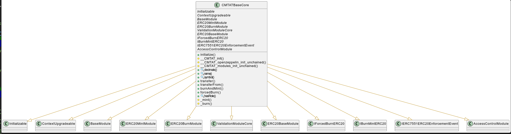
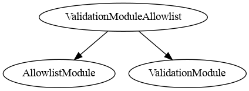
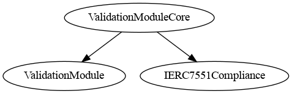
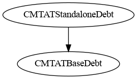
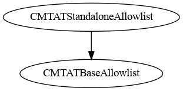
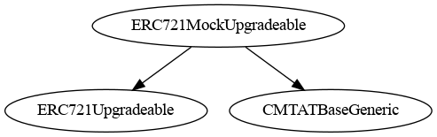
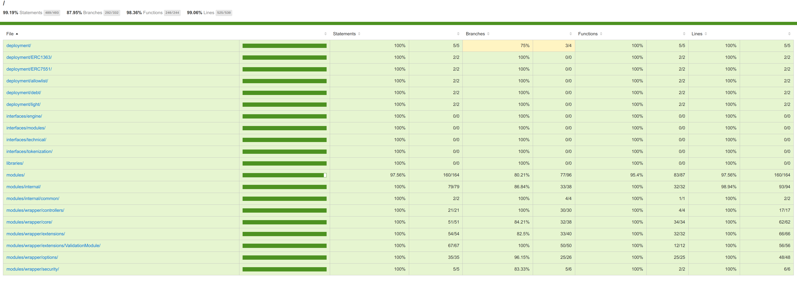

# CMTA Token 

> To use the CMTAT, we recommend the latest audited version, from the [Releases](https://github.com/CMTA/CMTAT/releases) page. Currently, it is the version [v2.3.0](https://github.com/CMTA/CMTAT/releases/tag/v2.3.0)

[TOC]

## Introduction

The CMTA token (CMTAT) is a security token framework that includes various compliance features such as conditional transfer, account freeze, and token pause, as well as technical features such as [ERC-7802](https://eips.ethereum.org/EIPS/eip-7802) for cross-chain transfer and upgradeadibility.

### History

The CMTA token (CMTAT) is a security token framework that includes various compliance features such as conditional transfer, account freeze, and token pause. CMTAT was initially optimized for the Swiss law framework, but can be suitable for other jurisdictions. This repository provides CMTA's reference Solidity implementation of CMTAT, suitable for EVM chains such as Ethereum.

The CMTAT is an open standard from the [Capital Markets and Technology Association](https://www.cmta.ch/) (CMTA), which gathers Swiss finance, legal, and technology organizations.
The CMTAT was developed by a working group of CMTA's Technical Committee that includes members from Atpar, Bitcoin Suisse, Blockchain Innovation Group, Hypothekarbank Lenzburg, Lenz & Staehelin, Metaco, Mt Pelerin, SEBA, Swissquote, Sygnum, Taurus and Tezos Foundation. The design and security of the CMTAT was supported by [ABDK](https://abdk.consulting), a leading team in smart contract security.

### Use case

This reference implementation allows the issuance and management of tokens representing equity securities, and other forms of financial instruments such as debt securities and structured products. It can also be used for stablecoins.

CMTAT was initially optimized for the Swiss law framework, but is also suitable for other jurisdictions.

You may modify the token code by adding, removing, or modifying features. However, the core modules must remain in place for compliance with the CMTA specification.

### Technical

The design and security of the CMTAT was supported by [ABDK](https://abdk.consulting), a leading team in smart contract security.

The preferred way to receive comments is through the GitHub issue tracker.  Private comments and questions can be sent to the CMTA secretariat at <a href="mailto:admin@cmta.ch">admin@cmta.ch</a>. For security matters, please see [SECURITY.md](./SECURITY.md).

This repository provides CMTA's reference Solidity implementation of CMTAT, suitable for EVM chains such as Ethereum.

### Overview

> Core means that they are the main features to build CMTAT

#### Core features

The CMTAT supports the following core features:

* ERC-20:
  * Mint, burn, and transfer operations
  * Configure `name`, `symbol`and `decimals`at deployment, as well as [ERC-3643](https://eips.ethereum.org/EIPS/eip-3643) functions to update `name`and `symbol`once deployed

* Pause of the contract and mechanism to deactivate it
* Freeze of specific accounts through ERC-3643 functions.

#### Extended features

> Extended features are nice-to-have features. They are generally included in the majority of deployment version.

The CMTAT supports the following extended features:

- Add information related to several documents ([ERC-1643](https://github.com/ethereum/EIPs/issues/1643)) though an external contract (`DocumentEngine`)

- Perform snapshot on-chain through an external contract (`SnapshotEngine`)
- Conditional transfers, via an external contract (`RuleEngine`)
- Put several information on-chain such as `tokenId` (ISIN or other identifier), `terms` (reference to any legally required documentation) and additional information (`information`)

#### Optional features

> Optional means that they are generally specific to deployment version

The CMTAT supports the following optional features:

- Transfer restriction through allowlisting/whitelisting (can be also done with a `RuleEngine`)
- Put Debt information and Credit Events on-chain
- Cross-chain functionalities with [ERC-7802](https://eips.ethereum.org/EIPS/eip-7802)
- "Gasless" (MetaTx) transactions with [ERC-2771](https://eips.ethereum.org/EIPS/eip-2771)

Furthermore, the present implementation uses standard mechanisms in
order to support `upgradeability`, via deployment of the token with a proxy by implementing [ERC-7201](https://eips.ethereum.org/EIPS/eip-7201)

## Standard ERC

Here the list of ERC used by CMTAT v3.0.0

### Schema


### CMTAT version support

Here the list of ERC supported between different version:

|                                                              | Associated contracts/modules               | ERC status               | CMTAT 1.0 | CMTAT 2.30 | CMTAT 3.0.0                                                  |           |          |          |                            |          |
| ------------------------------------------------------------ | ------------------------------------------ | ------------------------ | --------- | ---------- | ------------------------------------------------------------ | --------- | -------- | -------- | -------------------------- | -------- |
| Deployment version                                           |                                            |                          |           |            | (Standalone & Proxy)                                         | Light     | UUPS     | ERC1363  | Allowlist<br />(whitelist) | Debt     |
| **Fungible tokens**                                          |                                            |                          |           |            |                                                              |           |          |          |                            |          |
| [ERC-20](https://eips.ethereum.org/EIPS/eip-20)              | ERC20BaseModule                            | Standard Track (final)   | &#x2611;  | &#x2611;   | &#x2611;                                                     | &#x2611;  | &#x2611; | &#x2611; | &#x2611;                   | &#x2611; |
| [ERC-1363](https://eips.ethereum.org/EIPS/eip-1363)          | CMTATBaseERC1363                           | Standard Track (final)   | &#x2612;  | &#x2612;   | &#x2612;                                                     | &#x2612;  | &#x2612; | &#x2611; | &#x2612;                   | &#x2612; |
| **Tokenization**                                             |                                            |                          |           |            |                                                              |           |          |          |                            |          |
| [ERC-1404](https://github.com/ethereum/eips/issues/1404)<br />(Simple Restricted Token Standard) | ValidationModuleERC1404<br />(Exensions)   | Draft                    | &#x2611;  | &#x2611;   | &#x2611;                                                     | &#x2612;  | &#x2611; | &#x2611; | &#x2612;                   | &#x2611; |
| [ERC-1643](https://github.com/ethereum/eips/issues/1643) (Document Management Standard) <br />(Standard from [ERC-1400](https://github.com/ethereum/EIPs/issues/1411))<br />(Slightly improved) | DocumentModule<br />(Exensions)            | Draft                    | &#x2612;  | &#x2612;   | &#x2611;<br />(through DocumentEngine with small improvement) | &#x2612;  | &#x2611; | &#x2611; | &#x2611;                   | &#x2611; |
| [ERC-3643](https://eips.ethereum.org/EIPS/eip-3643)<br /><br />(Without on-chain identity) | Core + ERC20EnforcementModule (extensions) | Standard Track (final)   | &#x2612;  | &#x2612;   | &#x2611;                                                     | &#x2612;  | &#x2611; | &#x2611; | &#x2611;                   | &#x2611; |
| [ERC-7551](https://ethereum-magicians.org/t/erc-7551-crypto-security-token-smart-contract-interface-ewpg/16416)<br />(Slightly improved) | Core + ERC20EnforcementModule (extensions) | Draft                    | &#x2612;  | &#x2612;   | &#x2611;                                                     | Partially | &#x2611; | &#x2611; | &#x2611;                   | &#x2611; |
| **Proxy support related**                                    |                                            |                          |           |            |                                                              |           |          |          |                            |          |
| Deployment with a UUPS proxy ([ERC-1822](https://eips.ethereum.org/EIPS/eip-1822)) | -                                          | Stagnant<br />(but used) | &#x2612;  | &#x2612;   | &#x2612;                                                     | &#x2612;  | &#x2611; | &#x2612; | &#x2612;                   | &#x2612; |
| [ERC-7201](https://eips.ethereum.org/EIPS/eip-7201)<br/>(Storage namespaces for proxy contract) | All                                        | Standard Track (final)   | &#x2612;  | &#x2612;   | &#x2611;                                                     | &#x2611;  | &#x2611; | &#x2611; | &#x2611;                   | &#x2611; |
| **Technical**                                                |                                            |                          |           |            |                                                              |           |          |          |                            |          |
| [ERC-2771](https://eips.ethereum.org/EIPS/eip-2771) (Meta Tx / gasless) | MetaTxModule <br />(options)               | Standard Track (final)   | &#x2611;  | &#x2611;   | &#x2611;                                                     | &#x2612;  | &#x2611; | &#x2611; | &#x2611;                   | &#x2612; |
| [ERC-6093](https://eips.ethereum.org/EIPS/eip-6093) (Custom errors for ERC-20 tokens) | -                                          | Standard Track (final)   | &#x2612;  | &#x2612;   | &#x2611;                                                     | &#x2611;  | &#x2611; | &#x2611; | &#x2611;                   | &#x2611; |
| [ERC-7802](https://eips.ethereum.org/EIPS/eip-7802) (cross-chain token/transfers) | ERC20CrossChainModule<br />(options)       | Draft                    | &#x2612;  | &#x2612;   | &#x2611;                                                     | &#x2612;  | &#x2611; | &#x2611; | &#x2612;                   | &#x2612; |

### Details

#### ERC-3643

> [ERC specification](https://eips.ethereum.org/EIPS/eip-3643)
> Status: Standards Track

The [ERC-3643](https://eips.ethereum.org/EIPS/eip-3643) is an official Ethereum standard, unlike ERC-1400 and ERC-1404. This standard, also built on top of ERC-20, offers a way to manage and perform compliant transfers of security tokens.

ERC-3643 enforces identity management as a core component of the standards by using a decentralized identity system called [onchainid](https://www.onchainid.com/).

While CMTAT does not include directly the identity management system, it shares with ERC-3643 many of the same functions. The interface is available in [IERC3643Partial.sol](./contracts/interfaces/tokenization/IERC3643Partial.sol)

To represent the level of similarity between ERC-3643 interface and CMTAT functionnalities, we have created three levels of conformity.

If you want to use CMTAT to create a version implementing all functions from ERC-3643, you can create it through a dedicated deployment version (like what has been done for UUPS and ERC-1363).

The implemented interface is available in [IERC3643Partial](./contracts/interfaces/tokenization/IERC3643Partial.sol).

The main reason the argument names change is because CMTAT relies on OpenZeppelin to name the arguments.

##### All functions

```solidity
// interface IERC3643Pause 
// PauseModule
function paused() external view returns (bool)
function pause() external
function unpause() external

// interface IERC3643ERC20Base 
// ERC20BaseModule
function setName(string calldata name) external
function setSymbol(string calldata symbol) external

// IERC3643BatchTransfer
// ERC20MintModule
function batchTransfer(address[] calldata tos,uint256[] calldata values) external returns (bool)

// IERC3643Base
// BaseModule
function version() external view returns (string memory)

// IERC3643Enforcement 
// EnforcementModule
function isFrozen(address account) external view returns (bool)
function setAddressFrozen(address account, bool freeze) external
function batchSetAddressFrozen(address[] calldata accounts, bool[] calldata freeze) external;

// IERC3643ERC20Enforcement
// ERC20EnforcementModule
function getFrozenTokens(address account) external view returns (uint256);
function freezePartialTokens(address account, uint256 value) external;
function unfreezePartialTokens(address account, uint256 value) external;
function batchFreezePartialTokens(address[] calldata _userAddresses, uint256[] calldata _amounts) external;
function batchUnfreezePartialTokens(address[] calldata _userAddresses, uint256[] calldata _amounts) external;
function forcedTransfer(address from, address to, uint256 value) external returns (bool);


// IERC3643Mint
// MintModule
function mint(address account, uint256 value) external;
function batchMint( address[] calldata accounts,uint256[] calldata values) external;

// IERC3643Burn
// BurnModule
function burn(address account, uint256 value) external;
function burn(address account,uint256 value) external;
function batchBurn(address[] calldata accounts,uint256[] calldata values) external;

// IERC3643ComplianceRead
// ValidationModuleCore
function canTransfer(
        address from,
        address to,
        uint256 value
    ) external view returns (bool isValid);
}
```


##### Functions not implemented

All functions related to on-chain identity are **not** implemented inside CMTAT:

- ` setOnchainID`
- `setIdentityRegistry`
- `recoveryAddress` because this function takes the ` investorOnchainID` as an argument

These following functions to reduce contract code size:

- `batchForcedTransfer`to reduce contract code size
- `batchFreezePartialTokens` and `batchUnfreezePartialTokens`

All functions related to the interface `IAgentRole`because CMTAT uses a RBAC Access Control to offer more granularity in term of access control.

And finally `setCompliance`because CMTAT uses a different architecture for its `ruleEngine`.

##### Pause

Module: PauseModule

| **ERC-3643**                             | **CMTAT 3.0.0**                   | Deployment version |
| :--------------------------------------- | :-------------------------------- | ------------------ |
| Deployment version                       |                                   |                    |
| `pause() external`                       | Same                              | All                |
| `unpause() external`                     | Same                              | All                |
| `paused() external view returns (bool);` | Same                              | All                |
| `  event Paused(address _userAddress);`  | `event Paused(address account)`   | All                |
| ` event Unpaused(address _userAddress);` | `event Unpaused(address account)` | All                |

##### ERC20Base

| **ERC-3643**                                  | **CMTAT 3.0**                        | All deployment version |
| :-------------------------------------------- | :----------------------------------- | ---------------------- |
| `setName(string calldata _name) external;`    | `setName(string calldata name_)`     | &#x2611;<br />         |
| `setSymbol(string calldata _symbol) external` | `setSymbol(string calldata symbol_)` | &#x2611;<br />         |

##### Supply Management (burn/mint)

| **ERC-3643**                                                 | **CMTAT 3.0 Modules** | **CMTAT 3.0 Functions**                                      | Deployment version |
| :----------------------------------------------------------- | :-------------------- | :----------------------------------------------------------- | ------------------ |
| `  batchMint(address[] calldata _toList, uint256[] calldata _amounts) external;` | ERC20MintModule       | `mint(address account, uint256 value)`                       | All                |
| `  batchMint(address[] calldata _toList, uint256[] calldata _amounts) external;` | ERC20MintModule       | `batchMint(address[] calldata accounts,uint256[] calldata values) ` | All                |
| `function batchTransfer(address[] calldata _toList, uint256[] calldata _amounts) external;` | ERC20MintModule       | `batchTransfer(address[] calldata tos,uint256[] calldata values)` | All                |
| `burn(address _userAddress, uint256 _amount) external`       | ERC20BurnModule       | `function burn(address account,uint256 value)`               | All                |
| `batchBurn(address[] calldata _userAddresses, uint256[] calldata _amounts) external` | ERC20BurnModule       | `batchBurn(address[] calldata accounts,uint256[] calldata values)` | All                |

Warning: `batchTransfer` is restricted to the MINTER_ROLE to avoid the possibility to use non-standard function to move tokens

##### ERC20Enforcement

| **ERC-3643**                                                 | **CMTAT 3.0**                                                | Deployment version       |
| :----------------------------------------------------------- | :----------------------------------------------------------- | ------------------------ |
| ` isFrozen(address _userAddress)`                            | `isFrozen(address account)`                                  | All                      |
| `forcedTransfer(address _from, address _to, uint256 _amount) external returns (bool)` | `forcedTransfer(address from, address to, uint256 value) external returns (bool)` | All except Light version |
| `batchForcedTransfer(address[] calldata _fromList, address[] calldata _toList, uint256[] calldata _amounts) external` | Not implemented                                              | -                        |

##### ValidationModuleC

Note: `canTransfer` is defined for the compliance contract in ERC-3643.

| **ERC-3643**                                                 | **CMTAT 3.0**                                          | Deployment version |
| :----------------------------------------------------------- | :----------------------------------------------------- | ------------------ |
| `canTransfer(address _from, address _to, uint256 _amount) external view returns (bool)` | `canTransfer(address from, address to, uint256 value)` | All                |

####  ERC-7551 (eWPG)

> [ERC specification](https://ethereum-magicians.org/t/erc-7551-crypto-security-token-smart-contract-interface-ewpg/16416)
>
> Status: draft

This section presents a correspondence table between [ERC-7551](https://ethereum-magicians.org/t/erc-7551-crypto-security-token-smart-contract-interface-ewpg/16416) and their equivalent functions inside CMTAT.

The ERC-7551 is currently a draft ERC proposed by the Federal Association of Electroni Registrars from Germany to tokenize assets in compliance with [eWPG](https://www.gesetze-im-internet.de/ewpg/). 

The interface is supposed to work on top of additional standards that cover the actual storage of ownership of shares of a security in the form of a token (e.g. ERC-20 or ERC-1155).

##### CMTAT modification

Since ERC-7551 is not yet an official standard, we decided to use the same name and signature as ERC-3643. Typically, we define a function `burn`instead of `destroyTokens`.

The implemented interface is available in [IERC7551](./contracts/interfaces/tokenization/draft-IERC7551.sol)

| **N°** | **Functionalities**                                          | **ERC-7551 Functions**                    | **CMTAT 3.0.0**          | Implementations details                                      | Modules                                       |
| :----- | :----------------------------------------------------------- | :---------------------------------------- | :----------------------- | ------------------------------------------------------------ | --------------------------------------------- |
| 1      | Freeze and unfreeze a specific amount of tokens              | freezeTokens<br />unfreezeTokens          | &#x2611;                 | Implement ERC-3643 function`freezePartialTokens`and `unfreezePartialTokens`(with and without a `data`parameter)<br />+ ERC-3643 function `setAddressFrozen`<br />(with and without a `data`parameter) | EnforcementModule<br />ERC20EnforcementModule |
| 2      | Pausing transfers The operator can pause and unpause transfers | pauseTransfers                            | &#x2611;                 | Implement ERC-3643 functions `pause/unpause`<br /> + `deactivateContract` | PauseModule                                   |
| 3      | Link to off-chain document<br />Add the hash of a document   | setPaperContractHash                      | Equivalent functionality | The hash can be put in the field` Terms`<br />Terms is represented as a Document (name, uri, hash, last on-chain modification date) based on [ERC-1643](https://github.com/ethereum/eips/issues/1643) | ExtraInformationModule                        |
| 4      | Metadata JSON file                                           | setMetaDataJSON                           | &#x2611;                 | Define function `setMetaData`                                | ExtraInformationModule                        |
| 5      | Forced transfersTransfer `amount` tokens to `to` without requiring the consent of `fro`m | forceTransferFrom                         | &#x2611;                 | Implement<br/>ERC-3643 function  `forcedTransfer` (with and without a `data`parameter) | ERC20EnforcementModule                        |
| 6      | Token supply managementreduce the balance of `tokenHolder` by `amount` without increasing the amount of tokens of any other holder | destroyTokens                             | &#x2611;                 | Implement<br/>ERC-3643 function  `burn` / `batchBurn `(with and without a `data`parameter) | BurnModule                                    |
| 7      | Token supply managementincrease the balance of `to` by `amount` without decreasing the amount of tokens from any other holder. | issue                                     | &#x2611;                 | Implement<br/>ERC-3643 function  `mint` / `batchMint` (with and without a `data`parameter) | MintModule                                    |
| 8      | Transfer compliance<br />Check if a transfer is valid        | `canTransfer() `and a `canTransferFrom()` | &#x2611;                 | Implement<br/>ERC-3643 function `canTransfer`<br/>as well as a specific function `canTransferFrom` | ValidationModuleCore                          |

#####  Fulls functions

```solidity
// IERC7551Mint 
// MintModule
event Mint(address indexed minter, address indexed account, uint256 value, bytes data);
function mint(address account, uint256 value, bytes calldata data) external;

// IERC7551Burn
// BurnModule
event Burn(address indexed burner, address indexed account, uint256 value, bytes data);
function burn(address account, uint256 amount, bytes calldata data) external;

// IERC7551Pause
// PauseModule
function paused() external view returns (bool);
function pause() external;
function unpause() external;

// IERC7551ERC20Enforcement
// ERC20EnforcementModule
function getActiveBalanceOf(address account) external view returns (uint256);
function getFrozenTokens(address account) external view returns (uint256);
function freezePartialTokens(address account, uint256 amount, bytes memory data) external;
function unfreezePartialTokens(address account, uint256 amount, bytes memory data) external;
function forcedTransfer(address account, address to, uint256 value, bytes calldata data) external returns (bool);


// IERC7551Compliance
// ValidationModuleCore
function canTransfer(address from, address to, uint256 value) external view returns (bool);
function canTransferFrom(
        address spender,
        address from,
        address to,
        uint256 value
    )  external view returns (bool);


// IERC7551Base
// ExtraInformationModule
function metaData() external view returns (string memory);
function setMetaData(string calldata metaData_) external;
```


#### ERC-7802 (Crosschain transfers)

>  [ERC specification](https://eips.ethereum.org/EIPS/eip-7802)
> Status: draft

This standard introduces a minimal and extensible interface, `IERC7802`, for tokens to enable standardized crosschain communication.

CMTAT implements this standard in the option module `ERC20CrossChain`.

This standard is notably used by Optimism to provide cross-chain bridge between Optimism chain, see [docs.optimism.io/interop/superchain-erc20](https://docs.optimism.io/interop/superchain-erc20)

More information here: [Cross-Chain bridge support](./doc/general/crosschain-bridge-support.md)

Deployment version: since it is an extension module, it is not currently used in the deployment version `debt`, `light` & `allowlist`.

```solidity
interface IERC7802 is IERC165 {
    /// @notice Emitted when a crosschain transfer mints tokens.
    event CrosschainMint(address indexed to, uint256 value, address indexed sender);

    /// @notice Emitted when a crosschain transfer burns tokens.
    event CrosschainBurn(address indexed from, uint256 value, address indexed sender);

    /// @notice Mint tokens through a crosschain transfer.
    function crosschainMint(address to, uint256 value) external;

    /// @notice Burn tokens through a crosschain transfer.
    function crosschainBurn(address from, uint256 value) external;
}
```


-----

## Architecture

CMTAT architecture is divided in two main components: module and engines

The main schema describing the architecture can be found here: [architecture.pdf](./doc/schema/drawio/architecture.pdf) 

### Arborescence

- Contracts

```
├── deployment
│   ├── allowlist
│   │   ├── CMTATStandaloneAllowlist.sol
│   │   └── CMTATUpgradeableAllowlist.sol
│   ├── CMTATStandalone.sol
│   ├── CMTATUpgradeable.sol
│   ├── CMTATUpgradeableUUPS.sol
│   ├── debt
│   │   ├── CMTATStandaloneDebt.sol
│   │   └── CMTATUpgradeableDebt.sol
│   ├── ERC1363
│   │   ├── CMTATStandaloneERC1363.sol
│   │   └── CMTATUpgradeableERC1363.sol
│   ├── ERC7551
│   │   └── CMTATStandaloneERC7551.sol
│   └── light
│       ├── CMTATStandaloneLight.sol
│       └── CMTATUpgradeableLight.sol
├── interfaces
│   ├── engine
│   │   ├── IDebtEngine.sol
│   │   ├── IDocumentEngine.sol
│   │   ├── IRuleEngine.sol
│   │   └── ISnapshotEngine.sol
│   ├── modules
│   │   ├── IAllowlistModule.sol
│   │   ├── IDebtModule.sol
│   │   ├── IDocumentEngineModule.sol
│   │   └── ISnapshotEngineModule.sol
│   ├── technical
│   │   ├── ICMTATConstructor.sol
│   │   ├── IERC20Allowance.sol
│   │   ├── IERC7802.sol
│   │   └── IMintBurnToken.sol
│   └── tokenization
│       ├── draft-IERC1404.sol
│       ├── draft-IERC1643CMTAT.sol
│       ├── draft-IERC1643.sol
│       ├── draft-IERC7551.sol
│       ├── ICMTAT.sol
│       └── IERC3643Partial.sol
├── libraries
│   └── Errors.sol
├── mocks
│   ├── DebtEngineMock.sol
│   ├── DocumentEngineMock.sol
│   ├── ERC1363ReceiverMock.sol
│   ├── ERC721MockUpgradeable.sol
│   ├── library
│   │   └── snapshot
│   │       ├── ICMTATSnapshot.sol
│   │       ├── SnapshotErrors.sol
│   │       └── SnapshotModuleBase.sol
│   ├── MinimalForwarderMock.sol
│   ├── RuleEngine
│   │   ├── CodeList.sol
│   │   ├── interfaces
│   │   │   ├── IRuleEngineMock.sol
│   │   │   └── IRule.sol
│   │   ├── RuleEngineMock.sol
│   │   ├── RuleMockMint.sol
│   │   └── RuleMock.sol
│   ├── SnapshotEngineMock.sol
│   └── test
│       └── proxy
│           ├── CMTAT_PROXY_TEST.sol
│           └── CMTAT_PROXY_TEST_UUPS.sol
└── modules
    ├── CMTATBaseAllowlist.sol
    ├── CMTATBaseCommon.sol
    ├── CMTATBaseCore.sol
    ├── CMTATBaseDebt.sol
    ├── CMTATBaseERC1363.sol
    ├── CMTATBaseERC7551.sol
    ├── CMTATBaseGeneric.sol
    ├── CMTATBaseOption.sol
    ├── CMTATBase.sol
    ├── internal
    │   ├── AllowlistModuleInternal.sol
    │   ├── common
    │   │   └── EnforcementModuleLibrary.sol
    │   ├── EnforcementModuleInternal.sol
    │   ├── ERC20BurnModuleInternal.sol
    │   ├── ERC20EnforcementModuleInternal.sol
    │   ├── ERC20MintModuleInternal.sol
    │   └── ValidationModuleRuleEngineInternal.sol
    └── wrapper
        ├── controllers
        │   ├── ValidationModuleAllowlist.sol
        │   └── ValidationModule.sol
        ├── core
        │   ├── BaseModule.sol
        │   ├── EnforcementModule.sol
        │   ├── ERC20BaseModule.sol
        │   ├── ERC20BurnModule.sol
        │   ├── ERC20MintModule.sol
        │   ├── PauseModule.sol
        │   └── ValidationModuleCore.sol
        ├── extensions
        │   ├── DocumentEngineModule.sol
        │   ├── ERC20EnforcementModule.sol
        │   ├── ExtraInformationModule.sol
        │   ├── SnapshotEngineModule.sol
        │   └── ValidationModule
        │       ├── ValidationModuleERC1404.sol
        │       └── ValidationModuleRuleEngine.sol
        ├── options
        │   ├── AllowlistModule.sol
        │   ├── DebtEngineModule.sol
        │   ├── DebtModule.sol
        │   ├── ERC20CrossChainModule.sol
        │   ├── ERC7551Module.sol
        │   └── MetaTxModule.sol
        └── security
            └── AuthorizationModule.sol

```

- Docs


### Base contract

The base contracts are abstract contracts, so not directly deployable, which inherits from several different modules.

Base contracts are used by the different deployable contracts (CMTATStandalone, CMTATUpgradeable,...) to inherits from the different modules

| Name                                                         | Description                                                  | Associated contracts deployments                           |
| ------------------------------------------------------------ | ------------------------------------------------------------ | ---------------------------------------------------------- |
| [CMTATBase](./contracts/modules/CMTATBase.sol)               | Inherits from all core and extension modules                 | CMTAT Standalone / Upgradeable<br />CMTAT Upgradeable UUPS |
| [CMTATBaseCore](./contracts/modules/CMTATBaseCore.sol)       | Inherits from all core modules                               | CMTAT Light (Upgradeadble & Standalone                     |
| [CMTATBaseGeneric](./contracts/modules/CMTATBaseGeneric.sol) | Inherits from non-ERC20 related modules                      | -<br />(Only mock available)                               |
| [CMTATERC1363Base](./contracts/modules/CMTATERC1363Base.sol) | Inherits from CMTATBase, but also ERC-1363 OpenZeppelin contract and MetaTxModule (ERC-2771) | CMTAT ERC1363 (Upgradeable & Standalone)                   |
| [CMTATBaseOption](./contracts/modules/CMTATBaseOption.sol)   | Inherits from CMTATBase, but also from several other option modules | CMTAT Standalone / Upgradeable                             |
| [CMTATBaseAllowlist](./contracts/modules/CMTATBaseAllowlist.sol) | Inherits from CMTATBaseCommon, but also from ValidationModuleAllowlist | CMTAT Allowlist (upgradeable & Standalone)                 |


#### CMTATBase


CMTAT Base adds several functions: 

- `burnAndMint`to burn and mint atomically in the same function.

#### CMTAT Base Core

CMTAT Base Core adds several functions: 

- `burnAndMint`to burn and mint atomically in the same function.
- `forcedBurn`to allow the admin to burn tokens from a frozen address (defined in EnforcementModule)
  
  - This function is not required in CMTATBase because the function `forcedTransfer` (ERC20EnforcementModule) can be used instead.
  
  


#### CMTAT ERC1363 Base


#### CMTAT Base Option


#### CMTAT Base Generic


#### CMTAT Base Allowlist


### Module

#### Description

Modules describe a **logical** code separation inside CMTAT.  They are defined as abstract contracts.
Their code and functionalities are part of the CMTAT and therefore are also included in the calculation of the contract size and the maximum size limit of 24 kB.

It is always possible to delete a module, but this requires modifying the code and compiling it again, which would require a security audit to be performed on these modifications.

Modules are also separated in different categories.

- **Internal** modules: implementation for a module when OpenZeppelin does not provide a library to use. For example, this is the case for the `EnforcementModule`.
- **Wrapper** modules: abstract contract around OpenZeppelin contracts or internal module.
  For example, the wrapper `PauseModule` provides public functions to call the internal functions from OpenZeppelin.
  - **Core** (Wrapper sub-category): Contains the modules required to be CMTA compliant
  - **Security**: module related to access control
  - **Extension** (Wrapper sub-category): not required to be CMTA compliant, "bonus features" (snapshotModule, debtModule)
  - **Options**:  also bonus features to meet specific use cases through specific deployment version.
  


#### List

Here is the list of modules supported between different versions and the differences.

For simplicity, the module names and function locations are those of version 3.0.0

- "fn" means function
- Changes made in a release are considered maintained in the following release unless explicitly stated otherwise

##### Controllers

| Modules                            | Type        | Description                                                  | File                                                         | CMTAT 1.0 | CMTAT 2.30 | CMTAT 3.0.0                         |                 |             |
| ---------------------------------- | ----------- | ------------------------------------------------------------ | ------------------------------------------------------------ | --------- | ---------- | ----------------------------------- | --------------- | ----------- |
| Deployment version                 |             |                                                              |                                                              |           |            | Standalone, Upgradeable, UUPS, Debt | CMTAT Allowlist | CMTAT Light |
| ValidationModule                   | Controllers | Check transfer validity by calling the Pause and Enforcement modules | [ValidationModule.sol](./contracts/modules/wrapper/controllers/ValidationModule.sol) | &#x2611;  | &#x2611;   | &#x2611;                            | &#x2611;        | &#x2611;    |
| ValidationModuleAllowlist          | Controllers | Check transfer validity by calling Allowlist module          | [ValidationModuleAllowlist.sol](./contracts/modules/wrapper/controllers/ValidationModuleAllowlist.sol) | &#x2612;  | &#x2612;   | &#x2612;<br />Only CMTAT Allowlist) | &#x2611;        | &#x2612;    |
| ValidationModuleRuleEngineInternal | Internal    | Configure a `RuleEngine`                                     | [ValidationModuleRuleEngineInternal.sol](./contracts/modules/internal/ValidationModuleRuleEngineInternal.sol) | &#x2611;  | &#x2611;   | &#x2611;                            | &#x2612;        | &#x2612;    |
| ValidationModuleCore<br />         | Core        | Implements`canTransfer`and `canTransferFrom`<br />The core module does not implement ERC-1404 and the RuleEngine | [ValidationModuleCore.sol](./contracts/modules/wrapper/core/ValidationModuleCore.sol) | &#x2611;  | &#x2611;   | &#x2611;                            | &#x2611;        | &#x2611;    |
| ValidationModuleRuleEngine         | Extensions  | Set and call the ruleEngine to check transfer.               | [ValidationModuleRuleEngine.sol](./contracts/modules/wrapper/extensions/ValidationModule/ValidationModuleRuleEngine.sol) | &#x2611;  | &#x2611;   | &#x2611;                            | &#x2612;        | &#x2612;    |
| ValidationModuleERC1404            | Extensions  | Implements ERC-1404                                          | [ValidationModuleERC1404.sol](./contracts/modules/wrapper/extensions/ValidationModule/ValidationModuleERC1404.sol) | &#x2611;  | &#x2611;   | &#x2611;                            | &#x2612;        | &#x2612;    |


**Controllers**

- ValidationModule


- ValidationModuleAllowlist



**Internal**

- ValidationModuleRuleEngineInternal


**Core**

- ValidationModuleCore




**Extensions**

- ValidationModuleRuleEngine


- ValidationModuleERC1404


##### Core modules

Generally, these modules are required to be compliant with the CMTA specification.

| Modules                                                      | Description                    | File                                                         | CMTAT 1.0 | CMTAT 2.30                                                   | CMTAT 3.0.0                                                  |
| ------------------------------------------------------------ | ------------------------------ | ------------------------------------------------------------ | --------- | ------------------------------------------------------------ | ------------------------------------------------------------ |
| [BaseModule](./doc/modules/core/Base/base.md)                | Contract version               | [BaseModule.sol](./contracts/modules/wrapper/core/BaseModule.sol) | &#x2611;  | &#x2611;<br />(Add two fields: flag and information)         | &#x2611;<br />Remove field flag (not used)<br />Keep only the field VERSION and move the rest (tokenId, information,..) to an extension module `ExtraInformation` |
| [ERC20 Burn](./doc/modules/core/ERC20Burn/ERC20Burn.md)<br />(Prev. BurnModule) | Burn functions                 | [ERC20BurnModule.sol](./contracts/modules/wrapper/core/ERC20BurnModule.sol) | &#x2611;  | &#x2611;<br />Replace fn `burnFrom` by fn `forcedBurn`       | Add fn `burnBatch`<br />Rename `forceBurn` in `burn`<br />`burnFrom` is moved to the option module `ERC20CrossChain` |
| [Enforcement](./doc/modules/core/Enforcement/enforcement.md) | Freeze/unfreeze address        | [EnforcementModule.sol](./contracts/modules/wrapper/core/EnforcementModule.sol) | &#x2611;  | &#x2611;                                                     | &#x2611;                                                     |
| [ERC20Base](./doc/modules/core/ERC20Base/ERC20base.md)       | decimals, set name & symbol    | [ERC20BaseModule.sol](./contracts/modules/wrapper/core/ERC20BaseModule.sol) | &#x2611;  | &#x2611;<br />Remove fn `forceTransfer`<br />(replaced by `burn`and `mint`)<br /> | Add fn `balanceInfo` (useful to distribute dividends)<br />Add  fn `forcedTransfer`<br />Add fn `setName`and `setSymbol`<br />Remove custom fn `approve`(keep only ERC-20 approve) |
| [ERC20 Mint](./doc/modules/core/ERC20Mint/ERC20Mint.md)      | Mint functions + BatchTransfer | [ERC20MintModule.sol](./contracts/modules/wrapper/core/ERC20MintModule.sol) | &#x2611;  | &#x2611;                                                     | Add fn `mintBatch`<br />Add fn `transferBatch` <br />        |
| [Pause Module](./doc/modules/core/Pause/pause.md)            | Pause and deactivate contract  | [PauseModule.sol](./contracts/modules/wrapper/core/PauseModule.sol) | &#x2611;  | &#x2611;                                                     | Replace fn `kill` by fn `deactivateContract`                 |


  

##### Extensions modules

Generally, these modules are not required to be compliant with the CMTA specification.

| Modules                                                      | Description                                                  | File                                                         | CMTAT 1.0            | CMTAT 2.30                                               | CMTAT 3.0.0                                         |
| ------------------------------------------------------------ | ------------------------------------------------------------ | ------------------------------------------------------------ | -------------------- | -------------------------------------------------------- | --------------------------------------------------- |
| [ExtraInformation](./doc/modules/extensions/ExtraInformation/extraInformation.md) | Set extra information (tokenId, terms, metadata)             | [ExtraInformationModule.sol](./contracts/modules/wrapper/extensions/ExtraInformationModule.sol) | &#x2611;(BaseModule) | &#x2611;(BaseModule)                                     | &#x2611;<br />                                      |
| [SnapshotEngineModule](./doc/modules/extensions/snapshotEngine/Snapshot.md)<br />(Prev. SnapshotModule) | Set snapshotEngine                                           | [SnapshotEngineModule.sol](./contracts/modules/wrapper/extensions/SnapshotEngineModule.sol) | &#x2611;             | Partial<br />(Not included by default because unaudited) | &#x2611; <br />(require an external SnapshotEngine) |
| [DocumentEngineModule](./doc/modules/extensions/documentEngine/document.md) | Set additional document (ERC1643) through a DocumentEngine   | [DocumentEngineModule.sol](./contracts/modules/wrapper/extensions/DocumentEngineModule.sol) | &#x2612;             | &#x2612;                                                 | &#x2611;                                            |
| [ERC20EnforcementModule](./doc/modules/extensions/ERC20Enforcement/erc20enforcement.md) | The admin (or a third party appointed by it) can partially freeze a part of the balance of a token holder. | [ERC20EnforcementModule.sol](./contracts/modules/wrapper/extensions/ERC20EnforcementModule.sol) | &#x2612;             | &#x2612;                                                 | &#x2611;                                            |

##### Options modules

| Modules                                                      | Description                                            | File                                                         | CMTAT 1.0 | CMTAT 2.30                          | CMTAT 3.0.0              |           |                                                              |
| ------------------------------------------------------------ | ------------------------------------------------------ | ------------------------------------------------------------ | --------- | ----------------------------------- | ------------------------ | --------- | ------------------------------------------------------------ |
| Deployment version                                           |                                                        |                                                              |           |                                     | Standalone & Upgradeable | Allowlist | Debt                                                         |
| [ERC20CrossChain](doc/modules/options/erc20crosschain/erc20crosschain.md) | Cross-chain functions (ERC-7802)                       | [ERC20CrossChainModule.sol](./contracts/modules/wrapper/options/ERC20CrossChainModule.sol) | &#x2612;  | &#x2612;                            | &#x2611;                 | &#x2612;  | &#x2612;                                                     |
| [DebtModule](doc/modules/options/debt/debt.md)               | Set Debt Info                                          | [DebtModule.sol](./contracts/modules/wrapper/options/DebtModule.sol) | &#x2612;  | &#x2611;                            | &#x2612;                 | &#x2612;  | &#x2611;  <br />(Don't include CreditEvents managed by DebtEngineModule) |
| [DebtEngineModule](doc/modules/options/debtEngine/debtEngine.md) | Add a DebtEngine module (requires to set CreditEvents) | [DebtEngineModule.sol](./contracts/modules/wrapper/options/DebtEngineModule.sol) | &#x2612;  | &#x2612;                            | &#x2612;<br />           | &#x2612;  | &#x2611;                                                     |
| [MetaTx](doc/modules/options/metatx/metatx.md)               | ERC-2771 support                                       | [ MetaTxModule.sol](./contracts/modules/wrapper/options/MetaTxModule.sol) | &#x2611;  | &#x2611;<br />(forwarder immutable) | &#x2611;                 | &#x2612;  | &#x2612;                                                     |
| [Allowlist](doc/modules/options/allowlist/allowlist.md)      | Add integrated allowlist support                       | [Allowlist.sol](./contracts/modules/wrapper/options/AllowlistModule.sol) | &#x2612;  | &#x2612;                            | &#x2612;                 | &#x2611;  | &#x2612;                                                     |


##### Security

|                                                              | Description    | File                                                         | CMTAT 1.0 | CMTAT 2.30                                         | CMTAT 3.0.0 |
| ------------------------------------------------------------ | -------------- | ------------------------------------------------------------ | --------- | -------------------------------------------------- | ----------- |
| [AuthorizationModule](doc/modules/security/authorization.md) | Access Control | [AuthorizationModule.sol](./contracts/modules/wrapper/security/AuthorizationModule.sol) | &#x2611;  | &#x2611;<br />(Admin has all the roles by default) | &#x2611;    |


### Access Control (RBAC)

CMTAT uses a RBAC access control by using the contract `AccessControl`from OpenZeppelin.

Each module defines the roles useful to restrict its functions.

By default, the `admin` has all the roles and this behavior is defined in the `AuthorizationModule` by overriding the function `hasRole`.

See also [docs.openzeppelin.com - AccessControl](https://docs.openzeppelin.com/contracts/5.x/api/access#AccessControl)

#### Role list

Here the list of roles and their 32 bytes identifier.

|                       | Defined in                      | 32 bytes identifier                                          |
| --------------------- | ------------------------------- | ------------------------------------------------------------ |
| DEFAULT_ADMIN_ROLE    | OpenZeppelin<br />AccessControl | 0x0000000000000000000000000000000000000000000000000000000000000000 |
| **Core Modules**      |                                 |                                                              |
| BURNER_ROLE           | BurnModule                      | 0x3c11d16cbaffd01df69ce1c404f6340ee057498f5f00246190ea54220576a848 |
| MINTER_ROLE           | MintModule                      | 0x9f2df0fed2c77648de5860a4cc508cd0818c85b8b8a1ab4ceeef8d981c8956a6 |
| ENFORCER_ROLE         | EnforcementModule               | 0x973ef39d76cc2c6090feab1c030bec6ab5db557f64df047a4c4f9b5953cf1df3 |
| PAUSER_ROLE           | PauseModule                     | 0x65d7a28e3265b37a6474929f336521b332c1681b933f6cb9f3376673440d862a |
| **Extension Modules** |                                 |                                                              |
| SNAPSHOOTER_ROLE      | SnashotModule                   | 0x809a0fc49fc0600540f1d39e23454e1f6f215bc7505fa22b17c154616570ddef |
| DOCUMENT_ROLE         | DocumentModule                  | 0xdd7c9aafbb91d54fb2041db1d5b172ea665309b32f5fffdbddf452802a1e3b20 |
| ERC20ENFORCER_ROLE    | ERC20EnforcementModule          | 0xd62f75bf68b069bc8e2abd495a949fafec67a4e5a5b7cb36aedf0dd51eec7e72 |
| **Option Modules**    |                                 |                                                              |
| CROSS_CHAIN_ROLE      | ERC20CrossChainModule           | 0x620d362b92b6ef580d4e86c5675d679fe08d31dff47b72f281959a4eecdd036a |
| BURNER_FROM_ROLE      | ERC20CrossChainModule           | 0x5bfe08abba057c54e6a28bce27ce8c53eb21d7a94376a70d475b5dee60b6c4e2 |
| ALLOWLIST_ROLE        | AllowlistModule                 | 0x26a560d834a19637eccba4611bbc09fb32970bb627da0a70f14f83fdc9822cbc |
| DEBT_ROLE             | DebtModule                      | 0xc6f3350ab30f55ce45863160fc345c1663d4633fe7cacfd3b9bbb6420a9147f8 |


#### Schema

This schema contains the different roles and their restricted functions.


The OpenZepplin functions `grantRole`and `revokeRole`can be used by the admin to grant and revoke role to an address.

#### Transfer adminship

To transfer the adminship to a new admin, the current admin must call two functions:

1) `grantRole()` by specifying the DEFAULT_ADMIN_ROLE identifier and the new admin address
2) `renounceRole()` to revoke the DEFAULT_ADMIN_ROLE from its own account.

The new admin can also revoke a role from the current/old admin by calling `revokeRole`.

It is also possible to have several different admins.

### Engines

Engines are external smart contracts called by CMTAT modules.

These engines are **optional** and their addresses can be left to zero.


#### RuleEngine (IERC-1404)

The `RuleEngine` is an external contract used to apply transfer restrictions to the CMTAT through whitelisting, blacklisting,...

This contract is defined in the `ValidationModule`.

An example of RuleEngine is also available on [GitHub](https://github.com/CMTA/RuleEngine).

Here is the list of the different versions available for each CMTAT version.

| CMTAT version           | RuleEngine                                                   |
| ----------------------- | ------------------------------------------------------------ |
| CMTAT v3.0.0            | <To do>                                                      |
| CMTAT 2.5.0 (unaudited) | RuleEngine >= [v2.0.3](https://github.com/CMTA/RuleEngine/releases/tag/v2.0.3) (unaudited) |
| CMTAT 2.4.0 (unaudited) | RuleEngine >=v2.0.0<br />Last version: [v2.0.2](https://github.com/CMTA/RuleEngine/releases/tag/v2.0.2)(unaudited) |
| CMTAT 2.3.0             | [RuleEngine v1.0.2](https://github.com/CMTA/RuleEngine/releases/tag/v1.0.2) |
| CMTAT 2.0 (unaudited)   | [RuleEngine 1.0](https://github.com/CMTA/RuleEngine/releases/tag/1.0) (unaudited) |
| CMTAT 1.0               | No ruleEngine available                                      |

This contract acts as a controller and can call different contract rules to apply rules on each transfer.

A possible rule is a whitelist rule where only the address inside the whitelist can perform a transfer

##### Requirement

Since the version 2.4.0, the requirements to use a RuleEngine are the following:

> The `RuleEngine` must import and implement the interface `IRuleEngine` which declares the function `transferred` and `canApprove`with several other functions related to IERC1404.

This interface can be found in [IRuleEngine.sol](./contracts/interfaces/engine/IRuleEngine.sol).

Warning: The `RuleEngine` has to restrict the access of the function `transferred` to only the `CMTAT contract`. 

Before each transfer, the CMTAT calls the function `transferred` which is the entrypoint for the RuleEngine.

Further reading: [Taurus - Token Transfer Management: How to Apply Restrictions with CMTAT and ERC-1404](https://www.taurushq.com/blog/token-transfer-management-how-to-apply-restrictions-with-cmtat-and-erc-1404/) (version used CMTAT v2.4.0)


##### Interface

```solidity
interface IRuleEngine is IERC1404, IERC3643ComplianceRead, IERC7551Compliance {
    /**
     * @dev Returns true if the operation is a success, and false otherwise.
     */
    function canTransfer(address from, address to, uint256 value) 
    external override(IERC3643ComplianceRead, IERC7551Compliance) 
    view returns (bool);
    
    /*
     /**
     * @dev Returns true if the transfer is valid, and false otherwise.
     * Same name as ERC-3643 but with one supplementary argument `spender`
     * 
     */
    function transferred(address spender, address from, address to, uint256 value) external returns (bool isValid);
}
```

###### ERC-3643 Compliance

A RuleEngine must implement the ERC-3643 compliance function `canTransfer`

```solidity
interface IERC3643ComplianceRead {
    /**
     * @notice Returns true if the transfer is valid, and false otherwise.
     * @dev Don't check the balance and the user's right (access control)
     */
    function canTransfer(
        address from,
        address to,
        uint256 value
    ) external view returns (bool isValid);
}
```


###### ERC-1404

```solidity
interface IERC1404 {
    /* 
    * @dev leave the code 5-9 free/unused for further additions in your ruleEngine implementation
    */
    enum REJECTED_CODE_BASE {
        TRANSFER_OK,
        TRANSFER_REJECTED_PAUSED,
        TRANSFER_REJECTED_FROM_FROZEN,
        TRANSFER_REJECTED_TO_FROZEN,
        TRANSFER_REJECTED_FROM_INSUFFICIENT_ACTIVE_BALANCE
    }
    /**
     * @dev See {ERC-1404}
     * This function is where an issuer enforces the restriction logic of their token transfers. 
     * Some examples of this might include:
     * - checking if the token recipient is whitelisted, 
     * - checking if a sender's tokens are frozen in a lock-up period, etc.
     *
     */
    function detectTransferRestriction(
        address from,
        address to,
        uint256 value
    ) external view returns (uint8);

    /**
     * @dev See {ERC-1404}
     * This function is effectively an accessor for the "message", 
     * a human-readable explanation as to why a transaction is restricted. 
     *
     */
    function messageForTransferRestriction(
        uint8 restrictionCode
    ) external view returns (string memory);
}
```

#### RuleEngine Example

Example of a CMTAT using the [CMTA ruleEngine](https://github.com/CMTA/RuleEngine):

In this example, the token holder calls the function `transfer` which triggers a call to the `RuleEngine` and the different rules associated. The different rules are not mandatory by CMTAT an you are free to build a different RuleEngine.

#### SnapshotEngine

Engine to perform snapshot on-chain. This engine is defined in the module `SnapshotModule`.

CMTAT implements only one function defined in the interface [ISnapshotEngine](./contracts/interfaces/engine/ISnapshotEngine.sol)

**Before** each transfer, the CMTAT calls the function `operateOnTransfer` which is the entrypoint for the SnapshotEngine.

```solidity
/*
* @dev minimum interface to define a SnapshotEngine
*/
interface ISnapshotEngine {
    /**
     * @dev Returns true if the operation is a success, and false otherwise.
     */
    function operateOnTransfer(address from, address to, uint256 balanceFrom, uint256 balanceTo, uint256 totalSupply) external;
}
```


| CMTAT                            | SnapshotEngine                                               |
| -------------------------------- | ------------------------------------------------------------ |
| CMTAT v3.0.0                     | <To do>                                                      |
| CMTAT v2.3.0                     | SnapshotEngine v0.1.0 (unaudited)                            |
| CMTAT v2.4.0, v2.5.0 (unaudited) | Include inside SnapshotModule (unaudited)                    |
| CMTAT v2.3.0                     | Include inside SnapshotModule (unaudited)                    |
| CMTAT v1.0.0                     | Include inside SnapshotModule, but not gas efficient (audited) |

#### DebtEngine

This engine can be used to configure Debt and Credits Events information

- It is defined in the `DebtEngineModule` (option module)
- It extends the `DebtModule`(option module) by allowing to set Credit Events while the DebtModule only allows to set debt info. 
- If a `DebtEngine` is configured, the function `debt`() will return the debt configured by the RuleEngine instead of the `DebtModule`.

CMTAT only implements two functions, available in the interface [IDebtEngine](./contracts/interfaces/engine/IDebtEngine.sol) to get information from the debtEngine.

```solidity
interface IDebtEngine is IDebtEngine {
    function debt() external view returns(IDebtGlobal.DebtBase memory);
    function creditEvents() external view returns(IDebtGlobal.CreditEvents memory);
}
```

Use an external contract provides two advantages: 

- Reduce code size of CMTAT, which is near of the maximal size limit 
- Allow to manage this information for several different tokens  (CMTAT or not).

Here is the list of the different version available for each CMTAT version.

| CMTAT version            | DebtEngine                                                   |
| ------------------------ | ------------------------------------------------------------ |
| CMTAT v3.0.0             | <To do>                                                      |
| CMTAT v2.5.0 (unaudited) | [DebtEngine v0.2.0](https://github.com/CMTA/DebtEngine/releases/tag/v0.2.0) (unaudited) |

#### DocumentEngine (IERC-1643)

The `DocumentEngine` is an external contract to support [*ERC-1643*](https://github.com/ethereum/EIPs/issues/1643) inside CMTAT, a standard proposition to manage documents on-chain. This standard is notably used by [ERC-1400](https://github.com/ethereum/eips/issues/1411) from Polymath. 

This engine is defined in the module `DocumentModule`

This EIP defines a document with three attributes:

- A short name (represented as a `bytes32`)
- A generic URI (represented as a `string`) that could point to a website or other document portal.
- The hash of the document contents associated with it on-chain.

CMTAT only implements two functions from this standard, available in the interface [IERC1643](./contracts/interfaces/tokenization/draft-IERC1643.sol) to get the documents from the documentEngine.

```solidity
interface IERC1643 {
    struct Document {
        string uri;
        bytes32 documentHash;
        uint256 lastModified;
    }
    /**
     * @notice return a document identified by its name
     */
    function getDocument(string memory name) external view returns (Document memory doc);
    /**
     * @notice return all documents
     */
    function getAllDocuments() external view returns (string[] memory);
}
```

The `DocumentEngine` has to import and implement this interface. To manage the documents, the engine is completely free on how to do it.

Using an external contract provides two advantages: 

- Reduce code size of CMTAT, which is near the maximal size limit 
- Allow to manage documents management for several different tokens  (CMTAT or not).

Here is the list of the different versions available for each CMTAT version.

| CMTAT version            | DocumentEngine                                               |
| ------------------------ | ------------------------------------------------------------ |
| CMTAT v3.0.0             | <To do>                                                      |
| CMTAT v2.5.0 (unaudited) | [DocumentEngine v0.3.0](https://github.com/CMTA/DocumentEngine/releases/tag/v0.3.0) (unaudited) |

#### AuthorizationEngine (Deprecated)

> Warning: this engine has been removed since CMTAT v3.0.0

The `AuthorizationEngine` was an external contract to add supplementary checks on AccessControl (functions `grantRole` and `revokeRole`) from the CMTAT. Since delegating access rights to an external contract is complicated and it is better to manage access control directly in CMTAT, we removed it in version 3.0.0.

There was only one prototype available: [CMTA/AuthorizationEngine](https://github.com/CMTA/AuthorizationEngine)

| CMTAT version                          | AuthorizationEngine                    |
| -------------------------------------- | -------------------------------------- |
| CMTAT v3.0.0                           | Removed                                |
| CMTAT v2.4.0, 2.5.0, 2.5.1 (unaudited) | AuthorizationEngine v1.0.0 (unaudited) |
| CMTAT 2.3.0 (audited)                  | Not available                          |
| CMTAT 1.0 (audited)                    | Not available                          |

----

## Functionality details

### ERC-20 properties 

All ERC-20 properties (`name`, `symbol`and `decimals`) can be set at deployment or initialization if a proxy is used.

Once the contract is deployed, the core module `ERC20BaseModule` offers two ERC-3643 functions which allow to update the name and the symbol (but not the decimals).

```solidity
interface IERC3643ERC20Base {
    /**
     *  @notice sets the token name
     */
    function setName(string calldata name) external;
    /**
     *  @notice sets the token symbol
     */
    function setSymbol(string calldata symbol) external;
}
```


### Gasless support (ERC-2771 / MetaTx module)

The CMTAT supports client-side gasless transactions using the [ERC-2771](https://eips.ethereum.org/EIPS/eip-2771)

The contract uses the OpenZeppelin contract `ERC2771ContextUpgradeable`, which allows a contract to get the original client with `_msgSender()` instead of the feepayer given by `msg.sender` while allowing upgrades on the main contract (see *Deployment via a proxy* above).

At deployment, the parameter  `forwarder` inside the CMTAT contract constructor has to be set  with the defined address of the forwarder. 

After deployment:

- In standalone deployment, the forwarder is immutable and can not be changed after deployment.

- In upgradeable deployment (with a proxy), it is possible to change the forwarder by deploying a new implementation. This is possible because the forwarder is stored inside the implementation contract bytecode instead of the storage of the proxy.

References:

- [OpenZeppelin Meta Transactions](https://docs.openzeppelin.com/contracts/5.x/api/metatx)

- OpenGSN has deployed several forwarders, see their [documentation](https://docs.opengsn.org/contracts/#receiving-a-relayed-call) to see some examples.

### Enforcement / Transfer restriction

There are several ways to restrict transfers as well as burn/mint operations.

#### Enforcement Module

Specific addresses can be frozen with the following ERC-3643 functions `setAddressFrozen`and `batchSetAddressFrozen`

```solidity
interface IERC3643Enforcement {
    function isFrozen(address account) external view returns (bool);
    function setAddressFrozen(address account, bool freeze) external;
    function batchSetAddressFrozen(address[] calldata accounts, bool[] calldata freeze) external;
}
```

Additionally,  a `data`parameter can be also used, which will be emitted inside the smart contract

```solidity
function setAddressFrozen(address account, bool freeze, bytes calldata data)
```

Due to a limited contract size, there is no batch version with a data parameter available.

When an address is frozen, it is not possible to mint tokens to this address or burn its tokens. To move tokens from a frozen address, the issuer must use the function `forcedTransfer`.

#### ERC20EnforcementModule

- A part of the balance of a specific address can be frozen with the following ERC3643 function `freezePartialTokens` and `unfreezePartialTokens`
- Transfer/burn can be forced by the admin  (ERC20EnforcementModule) with the following ERC3643 function `forcedTransfer`.
  - In this case, if a part of the balance is frozen, the tokens are unfrozen before being burnt or transferred.

```solidity
interface IERC3643ERC20Enforcement {
    /**
     *  @notice Returns the amount of tokens that are partially frozen on a wallet
     */
    function getFrozenTokens(address account) external view returns (uint256);

    /**
     *  @notice freezes token amount specified for given address.
     */
    function freezePartialTokens(address account, uint256 value) external;
    /**
     *  @notice unfreezes token amount specified for given address
     */
    function unfreezePartialTokens(address account, uint256 value) external;
    /**
     *  
     *  @notice Triggers a forced transfer.
     */ 
    function forcedTransfer(address from, address to, uint256 value) external returns (bool);
}
```

#### Pause & Deactivate contract (PauseModule)

##### Pause

- Transfers can be put in pause with the following ERC3643 function `pause`and `unpause`

- From ERC-3643

```solidity
interface IERC3643Pause {
    /**
     * @notice Returns true if the contract is paused, and false otherwise.
     */
    function paused() external view returns (bool);
    /**
     *  @notice pauses the token contract, 
     *  @dev When contract is paused token holders cannot transfer tokens anymore
     *  
     */
    function pause() external;

    /**
     *  @notice unpauses the token contract, 
     *  @dev When contract is unpaused token holders can transfer tokens
     * 
     */
    function unpause() external;
}
```

##### Deactivate contracts

```solidity
interface ICMTATDeactivate {
    event Deactivated(address account);
    /**
    * @notice deactivate the contract
    * Warning: the operation is irreversible, be careful
    */
    function deactivateContract() external;

    /**
    * @notice Returns true if the contract is deactivated, and false otherwise.
    */
    function deactivated() external view returns (bool) ;
}
```

Since the version v2.3.1, a function `deactivateContract` is implemented in the PauseModule to deactivate the contract.

If a contract is deactivated, it is no longer possible to perform transfer and burn/mint operations.

###### Kill (previous version)

CMTAT initially supported a `kill()` function relying on the SELFDESTRUCT opcode (which effectively destroyed the contract's storage and code).
However, Ethereum's [Cancun upgrade](https://github.com/ethereum/execution-specs/blob/master/network-upgrades/mainnet-upgrades/cancun.md) (rolled out in Q1 of 2024)  has removed support for SELFDESTRUCT (see [EIP-6780](https://eips.ethereum.org/EIPS/eip-6780)).

The `kill()` function will therefore not behave as it was used, and we have replaced it by the function `deactivateContract` .

###### How it works

This function sets a boolean state variable `isDeactivated` to true and puts the contract in the pause state.
The function `unpause `is updated to revert if the previous variable is set to true, thus the contract is in the pause state "forever".

The consequences are the following:

- In standalone deployment, this operation is irreversible, it is not possible to rollback.
- In upgradeable deployment (with a proxy), it is still possible to rollback by deploying a new implementation which sets the variable `isDeactivated`to false.


#### Supply management (burn & mint)

This tab summarizes the different behavior of burn/mint functions if:

- The target address is frozen (EnforcementModule)
- The target address does not have enough active balance (ERC20EnforcementModule)
- If a ruleEngine is configured (ValidationModuleInternal)

|                                                              | burn      | batchBurn | burnFrom        | mint      | batchMint | crosschain burn | Crosschain mint | forcedTransfer   |
| ------------------------------------------------------------ | --------- | --------- | --------------- | --------- | --------- | --------------- | --------------- | ---------------- |
| Module                                                       | ERC20Burn | ERC20Burn | ERC20CrossChain | ERC20Mint | ERC20Mint | ERC20CrossChain | ERC20CrossChain | ERC20Enforcement |
| Module type                                                  | Core      | Core      | Options         | Core      | Core      | Options         | Options         | Extensions       |
| Allow operation on a frozen address                          | &#x2612;  | &#x2612;  | &#x2612;        | &#x2612;  | &#x2612;  | &#x2612;        | &#x2612;        | &#x2611;         |
| Unfreeze missing funds if active balance is not enough<br />(ERC20EnforcementModule) | &#x2612;  | &#x2612;  | &#x2612;        | -         | -         | &#x2612;        | -               | &#x2611;         |
| Call the RuleEngine                                          | &#x2611;  | &#x2611;  | &#x2611;        | &#x2611;  | &#x2611;  | &#x2611;        | &#x2611;        | &#x2612;         |


#### Allowlist (whitelist) module

With the `Allowlist` module and the associated `ValidationModuleAllowlist`, a supplementary check will be performed on the concerned address to determine if they are in the allowlist.

```solidity
interface IAllowlist {
    event AddressAddedToAllowlist(address indexed account, bool indexed status, address indexed enforcer, bytes data);
    event AllowlistEnableStatus(address indexed operator, bool status);
    /**
    * @notice return true if `account`is in the allowlist, false otherwise
    */
    function isAllowlisted(address account) external view virtual returns (bool);
    /**
     * @notice add/remove an address to/from the allowlist
     */
    function setAddressAllowlist(address account, bool status) external virtual;

    /**
     * @notice add/remove an address to/from the allowlist
	*/
    function setAddressAllowlist(address account, bool status, bytes calldata data) external virtual
    /**
    * @notice Batch version of {setAddressAllowlist}
    */
    function batchSetAddressAllowlist(address[] calldata accounts, bool[] calldata status) external virtual
    /**
    * @notice enable/disable allowlist
    */
    function enableAllowlist(bool status) external virtual
    
    /**
    * @notice Returns true if the list is enabled, false otherwise
    */
    function isAllowlistEnabled() external view virtual returns (bool)
}

```


#### Schema

Here a schema describing the different check performed during:

- transfer & transferFrom
- burn / mint (supply management)
- burn / mint for crosschain transfers


### Supply management

#### Event

Here the list of events emitted by functions, which modify the total supply.

| Name                                                         | Defined                       | Standard                  | Concerned functions                                          |
| ------------------------------------------------------------ | ----------------------------- | ------------------------- | ------------------------------------------------------------ |
| Transfer(address indexed from, address indexed to, uint256 value); | IERC20<br />(OpenZeppelin)    | ERC-20                    | All functions which impacts the supply because a burn/mint is a transfer |
| Mint(address indexed account, uint256 value, bytes data);    | IERC7551Mint                  | ERC-7551 (draft standard) | mint <br />(ERC20MintModule)<br />                           |
| BatchMint( address indexed minter, address[] accounts, uint256[] values |                               | -                         | BatchMint<br />(ERC20MintModule)                             |
| Burn(address indexed account, uint256 value, bytes data);    | IERC7551Burn                  | ERC-7551 (draft standard) | burn<br />(ERC20BurnModule)                                  |
| BatchBurn(address indexed burner, address[] accounts,  uint256[] values) |                               | -                         | BatchMint<br />(ERC20BurnModule)                             |
| BurnFrom(address indexed burner, address indexed account, address indexed spender, uint256 value); | IBurnERC20                    | -                         | brunFrom<br />(ERC20CrossChain)                              |
| CrosschainMint(address indexed to, uint256 value, address indexed sender) | IERC7551                      | ERC-7551                  | crosschainMint<br />(ERC20CrossChain)                        |
| CrosschainBurn(address indexed from, uint256 value, address indexed sender) | IERC7551                      | ERC-7551                  | crosschainBint<br />(ERC20CrossChain)                        |
| Enforcement (address indexed enforcer, address indexed account, uint256 amount, bytes data)<br />(Enforcement )<br /> | IERC7551ERC20EnforcementEvent | ERC-7551                  | forcedTransfer<br />(ERC20EnforcementModule)<br />forcedBurn<br />(CMTATBaseCore) |


#### Burn (ERC20BurnModule)

Core modue

##### ERC-3643

```solidity
interface IERC3643Burn{
	/**
	*  @notice Burns tokens from a given address, by transferring them to address(0)
	*/
    function burn(address account,uint256 value) external;
    /**
    * @notice Batch version of {burn}
    */
    function batchBurn(address[] calldata accounts,uint256[] calldata values) external;
}
```

##### ERC-7551

```solidity
interface IERC7551Burn {
    /**
    * @notice Emitted when the specified `value` amount of tokens owned by `owner`are destroyed with the given `data`
    */
    event Burn(address indexed burner, address indexed account, uint256 value, bytes data);
    /**
	*  @notice Burns tokens from a given address, by transferring them to address(0)
	*/
    function burn(address account, uint256 amount, bytes calldata data) external;
}
```

#### Mint (ERC20MintModule)

Core module

##### ERC-3643

```solidity
interface IERC3643Mint{
	/** 
	* @notice Creates a `value` amount of tokens and assigns them to `account`, by transferring it from address(0)
	*/
    function mint(address account, uint256 value) external;
    /**
    * @notice batch version of {mint}
    */
    function batchMint( address[] calldata accounts,uint256[] calldata values) external;
}
```

##### ERC7551

```solidity
interface IERC7551Mint {
    /**
     * @notice Emitted when the specified  `value` amount of new tokens are created and
     * allocated to the specified `account`.
     */
    event Mint(address indexed minter, address indexed account, uint256 value, bytes data);
    /** 
	* @notice Creates a `value` amount of tokens and assigns them to `account`, by transferring it from address(0)
	*/
    function mint(address account, uint256 value, bytes calldata data) external;
}
```


#### Cross-chain (ERC20Crosschain)

Option module

##### BurnFrom

```solidity
interface IBurnFromERC20 {
  event BurnFrom(address indexed account, address indexed spender, uint256 value);
  function burnFrom(address indexed burner, address indexed account, uint256 value) external;
}
```

##### ERC-7802

See the dedicated section (at the beginning of this document)

### Manage on-chain document

#### Terms

Tokenization terms are defined by the extension module `ExtraInformationModule `

The term is made of:

- A name (string)
- An `IERC1643.Document`document, which means:
  - A string uri (optional)
  - The document hash (optional)
  - The last on-chain modification date (set by the smart contract)

```solidity
interface IERC1643 {
    struct Document {
        string uri;
        bytes32 documentHash;
        uint256 lastModified;
    }
   // rest of the interface
}
interface ICMTATBase {
     /*
     * @dev A reference to (e.g. in the form of an Internet address) or a hash of the tokenization terms
     */ 
     struct Terms {
 	    string name;
 	    IERC1643.Document doc;
    }
    event Term(Terms newTerm);
    /*
    * @notice returns tokenization terms
    */
    function terms() external view returns (Terms memory);
    /*
    * @notice set tokenization terms
    */
    function setTerms(IERC1643CMTAT.DocumentInfo calldata terms_) external;
}
```

#### Additional documents through ERC1643 and DocumentEngine

Additional documents can be added through the `DocumentEngine`

For more information, see the section dedicated to the `DocumentEngine`

## Deployment model 

Contracts for deployment are available in the directory [contracts/deployment](./contracts/deployment)

| CMTAT Model      | Description                                                  | Standalone/Proxy | Contract                                                     | Remark                                                       |
| ---------------- | ------------------------------------------------------------ | ---------------- | ------------------------------------------------------------ | ------------------------------------------------------------ |
| CMTAT Standard   | Deployment without proxy <br />(immutable)                   | Standalone       | [CMTATStandalone](./contracts/deployment/CMTATStandalone.sol) | Core & extension module without Debt, Allowlist, ERC-3643 and UUPS<br />Include also two option modules: ERC20Crosschain & MetaTx |
|                  | Deployment with a standard proxy (Transparent or Beacon Proxy) | Upgradeable      | [CMTATUpgradeable](./contracts/deployment/CMTATUpgradeable.sol) | -                                                            |
| Upgradeable UUPS | Deployment with a UUPS proxy                                 | Only upgradeable | [CMTATUpgradeableUUPS](./contracts/deployment/CMTATUpgradeableUUPS.sol) | Same as standard version, but adds also the UUPS proxy support |
| ERC-1363         | Implements [ERC-1363](https://eips.ethereum.org/EIPS/eip-1363) | Standalone       | [CMTATStandaloneERC1363](./contracts/deployment/ERC1363/CMTATStandaloneERC1363.sol) | Same as standard version, but adds also the ERC-3643 support |
|                  | -                                                            | Upgradeable      | [CMTATUpgradeableERC1363](./contracts/deployment/ERC1363/CMTATUpgradeableERC1363.sol) |                                                              |
| Light            | Only core modules                                            | Standalone       | [CMTATStandaloneLight](./contracts/deployment/light/CMTATStandaloneLight.sol) | -                                                            |
|                  |                                                              | Upgradeable      | [CMTATUpgradeableLight](./contracts/deployment/light/CMTATUpgradeableLight.sol) |                                                              |
| Debt             | Set Det information and CreditEvents (through DebtEngine)    | Standalone       | [CMTATStandaloneDebt](./contracts/deployment/debt/CMTATStandaloneDebt.sol) | Add the debt support.<br />Contrary to the standard version, it does not include the modules MetaTx and ERC20Crosschain |
|                  |                                                              | Upgradeable      | [CMTATUpgradeableDebt](./contracts/deployment/debt/CMTATUpgradeableDebt.sol) | -                                                            |
| Allowlist        | Restrict transfer to an allowlist (whitelist)                | Standalone       | [CMTATStandaloneAllowlist](./contracts/deployment/allowlist/CMTATStandaloneAllowlist.sol) | Contrary to the standard version, it does not include ERC-1404 support (ValidationModuleERC1404) & ERC20Crosschain |
|                  |                                                              | Upgradeable      | [CMTATUpgradeableAllowlist](./contracts/deployment/allowlist/CMTATUpgradeableAllowlist.sol) |                                                              |

### Standard Standalone

To deploy CMTAT without a proxy, in standalone mode, you need to use the contract version `CMTATStandalone`.

Here is the surya inheritance schema:


### Upgradeable (with a proxy)

The CMTAT supports deployment via a proxy contract.  Furthermore, using a proxy permits to upgrade the contract, using a standard proxy upgrade pattern.

- The  implementation contract to use with a TransparentProxy  is the `CMTATUpgradeable`.
- The  implementation contract to use with a UUPSProxy  is the `CMTATUpgradeableUUPS`.

Please see the OpenZeppelin [upgradeable contracts documentation](https://docs.openzeppelin.com/upgrades-plugins/1.x/writing-upgradeable) for more information about the proxy requirements applied to the contract.

See the OpenZeppelin [Upgrades plugins](https://docs.openzeppelin.com/upgrades-plugins/1.x/) for more information about plugin upgrades in general.

#### Inheritance

- UUPS


- Proxy standard


#### Implementation details

##### Storage

CMTAT also implements the standard [ERC-7201](https://eips.ethereum.org/EIPS/eip-7201) to manage the storage location. See [this article](https://www.rareskills.io/post/erc-7201) by RareSkills for more information

##### Initialize functions

For wrapper modules, we have removed the public function `{ContractName}_init`to reduce the size of the contracts since inside the public initializer function to initialize your proxy, you have to call the different functions `__{ContractName}_init_unchained`.

Do not forget to call the functions `init_unchained` from the parent initializer if you create your own contract from the different modules.

As indicated in the [OpenZeppelin documentation](https://docs.openzeppelin.com/contracts/5.x/upgradeable#multiple-inheritance): 

> Initializer functions are not linearized by the compiler like constructors. Because of this, each `__{ContractName}_init` function embeds the linearized calls to all parent initializers. As a consequence, calling two of these `init` functions can potentially initialize the same contract twice.
>
> The function `__{ContractName}_init_unchained` found in every contract is the initializer function minus the calls to parent initializers, and can be used to avoid the double initialization problem, but doing this manually is not recommended. We hope to be able to implement safety checks for this in future versions of the Upgrades Plugins.

### ERC-1363

[ERC-1363](https://eips.ethereum.org/EIPS/eip-1363) is an extension interface for ERC-20 tokens that supports executing code on a recipient contract after transfers, or code on a spender contract after approvals, in a single transaction.

Two dedicated versions (proxy and standalone) implementing this standard are available.

More information on this standard here: [erc1363.org](https://erc1363.org), [RareSkills - ERC-1363](https://www.rareskills.io/post/erc-1363)

#### Inheritance

- CMTAT ERC-1363 Base


- CMTAT Upgradeable ERC-1363


- CMTAT Standalone ERC-1363


### Light version

The light version only includes core modules.

It also includes a function `forceBurn`to allow the admin to burn a token from a frozen address. This function is not required for deployment versions which include the extension module `ERC20EnforcementModule` because this module contains a function `forcedTransfer`which can be used instead.

- CMTAT Upgradeable Light


- CMTAT Standalone Light


- CMTATBaseCore


### Debt version

This deployment version includes the optional module `DebtModule`and `DebtEngineModule`which allows to store information related to the debt instrument inside the smart contract, as well as related `Credit Events`through an external engine called `DebtEngine`.

See [CMTAT - Standard for the tokenization of debt instruments using distributed ledger technology](https://cmta.ch/standards/standard-for-the-tokenization-of-debt-instruments-using-distributed-ledger-technology)

#### Struct

The debt information are defined by the struct `ICMTATDebt` in [ICMTAT.sol](./contracts/interfaces/tokenization/ICMTAT.sol)

```solidity
interface ICMTATDebt {
    struct DebtInformation {
        DebtIdentifier debtIdentifier;
        DebtInstrument debtInstrument;
    }
    struct DebtIdentifier {
        string issuerName;
        string issuerDescription;
        string guarantor;
        string debtHolder;
    }
    struct DebtInstrument {
        // uint256
        uint256 interestRate;
        uint256 parValue;
        uint256 minimumDenomination;
        // string
        string issuanceDate;
        string maturityDate;
        string couponPaymentFrequency;
        string interestScheduleFormat;
        string interestPaymentDate;
        string dayCountConvention;
        string businessDayConvention;
        string currency; 
        // address
        address currencyContract;
    }
    function debt() external view returns(DebtInformation memory);
}
```


##### Debt Identifier

Information on the issuer and other persons involved.

Defined by the struct `DebtIdentifier`in [ICMTAT.sol](./contracts/interfaces/tokenization/ICMTAT.sol)

| Field name        | Type   | Description                                                  |
| ----------------- | ------ | ------------------------------------------------------------ |
| issuerName        | string | Issuer identifier (legal entity identifier [LEI] or, if unavailable, Swiss entity identification number [UID] or equivalent) |
| issuerDescription | string | -                                                            |
| guarantor         | string | Guarantor identifier (legal entity identifier [LEI] or, if unavailable, Swiss entity identification number [UID] or equivalent), if applicable |
| debtHolder        | string | Debtholders representative identifier (legal entity identifier [LEI] or, if unavailable, Swiss entity identification number [UID] or equivalent), if applicable |

##### Debt Instrument

Information on the Instruments.

Defined by the struct `DebtInstrument`in [ICMTAT.sol](./contracts/interfaces/tokenization/ICMTAT.sol)

| Field name             | Type    | Description                                                  |
| ---------------------- | ------- | ------------------------------------------------------------ |
| interestRate           | uint256 | -                                                            |
| parValue               | uint256 | -                                                            |
| minimumDenomination    | uint256 | -                                                            |
| issuanceDate           | string  | -                                                            |
| maturityDate           | string  | -                                                            |
| couponPaymentFrequency | string  | -                                                            |
| interestScheduleFormat | string  | The purpose of the interest schedule is to set, within the parameters of the smart contract, the dates on which the interest payments accrue. <br />Format A: start date/end date/period<br />Format B: start date/end date/day of period (e.g., quarter or year) <br />Format C: date 1/date 2/date 3/…. |
| interestPaymentDate    | string  | Interest payment date (if different from the date on which the interest payment accrues): <br />Format A: period (indicating the period between the accrual date for the interest payment and the date on which the payment is scheduled to be made) Format B: specific date |
| dayCountConvention     | string  | -                                                            |
| businessDayConvention  | string  | -                                                            |
| currency               | string  | -                                                            |
| currencyContract       | address | -                                                            |

##### Credits events

Defined by the struct `CreditEvents`in [ICMTAT.sol](./contracts/interfaces/tokenization/ICMTAT.sol).

Contrary to the debt information, it requires the external contract `DebtEngine`to set the information

```solidity
interface ICMTATCreditEvents {
    function creditEvents() external view returns(CreditEvents memory);
    struct CreditEvents {
        bool flagDefault;
        bool flagRedeemed;
        string rating;
    }
}
```


|              | Type   |
| ------------ | ------ |
| flagDefault  | bool   |
| flagRedeemed | bool   |
| rating       | string |

#### Specification

Here the different fields and function to read and store the related debt information and Credit Events.

|                 | Module                            | Read/get function | Write/set functions                      | Require DebtEngine              | Internal field                      |
| --------------- | --------------------------------- | ----------------- | ---------------------------------------- | ------------------------------- | ----------------------------------- |
| Debt Identifier | DebtModule/<br />DebtEngineModule | debt()            | setDebt(...)                             | &#x2612;<br />(but can be used) | `_debt`                             |
| Debt Instrument | DebtModule<br />DebtEngineModule  | debt()            | setDebt(...)<br />setDebtInstrument(...) | &#x2612;<br />(but can be used) | `_debt`                             |
| Credit Events   | DebtEngineModule                  | creditEvents()    | -<br />(require `DebtEngine`)            | &#x2611;                        | -<br />(stores by the `DebtEngine`) |

#### Schema

- CMTAT Standalone Debt



- CMTAT Upgradeable Debt


- CMTAT Base Debt


### Allowlist

- CMTAT Standalone Allowlist



- CMTAT Upgradeable Allowlist


- CMAT base Allowlist


### Factory

Factory contracts are available to deploy the CMTAT with a beacon proxy, a transparent proxy or an UUPS proxy.

These contracts have now their own GitHub project: [CMTAT Factory](https://github.com/CMTA/CMTATFactory)

| CMTAT version                     | CMTAT Factory                                                |
| --------------------------------- | ------------------------------------------------------------ |
| CMTAT v3.0.0                      | CMTAT Factory v0.1.0 (unaudited)                             |
| CMTAT v2.5.0 / v2.5.1 (unaudited) | Available within CMTAT <br />see contracts/deployment<br />(unaudited) |
| CMTAT 2.3.0 (audited)             | Not available                                                |
| CMTAT 1.0 (audited)               | Not available                                                |

Further reading: [Taurus - Making CMTAT Tokenization More Scalable and Cost-Effective with Proxy and Factory Contracts](https://www.taurushq.com/blog/cmtat-tokenization-deployment-with-proxy-and-factory/) (version used CMTAT v2.5.1)

### Deployment for other types of tokens (ERC-721, ERC-1155, ...)

Deployment version using another type of token than ERC-20 (e.g ERC-721) or with a different logic (e.g [ZamaFHE - EncryptedERC20](https://www.zama.ai/post/confidential-erc-20-tokens-using-homomorphic-encryption)) can be built by using the base contract `CMTATBaseGeneric`. This base contract inherits from several non-ERC-20 modules

Currently, there is no available version but a mock contract which implements ERC-721 with `CMTATBaseGeneric`is available in the mock directory: [EC721MockUpgradeable.sol](./contracts/mocks/ERC721MockUpgradeable.sol)

- ERC721MockUpgradeable



- CMTATBaseGeneric


----

## Documentation

The documentation is available in the directory `doc`

Here a summary of the main documents

| Document                            | Files                                                        |
| ----------------------------------- | ------------------------------------------------------------ |
| Documentation of the modules API.   | [modules](./doc/modules)                                     |
| How to use the project + toolchains | [USAGE.md](./doc/USAGE.md)                                   |
| Project architecture                | [architecture.pdf](./doc/schema/drawio/architecture.pdf)     |
| FAQ                                 | [FAQ.md](./doc/general/FAQ.md)                               |
| Crosschain transfers                | [crosschain-bridge-support.md](./doc/general/crosschain-bridge-support.md) |

CMTA providers further documentation describing the CMTAT framework in a platform-agnostic way, and covering legal aspects, see

-  [CMTA Token (CMTAT)](https://cmta.ch/standards/cmta-token-cmtat)
-  [Standard for the tokenization of shares of Swiss corporations using the distributed ledger technology](https://cmta.ch/standards/standard-for-the-tokenization-of-shares-of-swiss-corporations-using-the-distributed-ledger-technology)
-  [Standard for the tokenization of debt instruments using distributed ledger technology](https://cmta.ch/standards/standard-for-the-tokenization-of-debt-instruments-using-distributed-ledger-technology)

### Further reading

- [CMTA - A comparison of different security token standards](https://cmta.ch/news-articles/a-comparison-of-different-security-token-standards)
- [Taurus - Security Token Standards: A Closer Look at CMTAT](https://www.taurushq.com/blog/security-token-standards-a-closer-look-at-cmtat/)
- [Taurus - Equity Tokenization: How to Pay Dividend On-Chain Using CMTAT](https://www.taurushq.com/blog/equity-tokenization-how-to-pay-dividend-on-chain-using-cmtat/) (CMTAT v2.4.0)
- [Taurus - Token Transfer Management: How to Apply Restrictions with CMTAT and ERC-1404](https://www.taurushq.com/blog/token-transfer-management-how-to-apply-restrictions-with-cmtat-and-erc-1404/) (CMTAT v2.4.0)
- [Taurus - Making CMTAT Tokenization More Scalable and Cost-Effective with Proxy and Factory Contracts](https://www.taurushq.com/blog/cmtat-tokenization-deployment-with-proxy-and-factory/) (CMTAT v2.5.1)
- [Taurus - Addressing the Privacy and Compliance Challenge in Public Blockchain Token Transactions](https://www.taurushq.com/blog/enhancing-token-transaction-privacy-on-public-blockchains-while-ensuring-compliance/) (Aztec)

------

## Security

### Vulnerability disclosure

Please see [SECURITY.md](./SECURITY.md).


### Module

See [AuthorizationModule.sol](./contracts/modules/wrapper/security/AuthorizationModule.sol)

Access control is managed thanks to the module `AuthorizationModule`.

### Audit

The contracts have been audited by [ABDKConsulting](https://www.abdk.consulting/), a globally recognized firm specialized in smart contracts security.

#### First audit - September 2021

Fixed version: [1.0](https://github.com/CMTA/CMTAT/releases/tag/1.0)

Fixes of security issues discovered by the initial audit were reviewed by ABDK and confirmed to be effective, as certified by the [report released](doc/audits/ABDK-CMTAT-audit-20210910.pdf) on September 10, 2021, covering [version c3afd7b](https://github.com/CMTA/CMTAT/tree/c3afd7b4a2ade160c9b581adb7a44896bfc7aaea) of the contracts.
Version [1.0](https://github.com/CMTA/CMTAT/releases/tag/1.0) includes additional fixes of minor issues, compared to the version retested.

A summary of all fixes and decisions taken is available in the file [CMTAT-Audit-20210910-summary.pdf](./doc/audits/CMTAT-Audit-20210910-summary.pdf) 

#### Second audit - March 2023

Fixed version: [v2.3.0](https://github.com/CMTA/CMTAT/releases/tag/v2.3.0)

The second audit covered version [2.2](https://github.com/CMTA/CMTAT/releases/tag/2.2).

Version v2.3.0 contains the different fixes and improvements related to this audit.

The report is available in [ABDK_CMTA_CMTATRuleEngine_v_1_0.pdf](doc/audits/ABDK_CMTA_CMTATRuleEngine_v_1_0/ABDK_CMTA_CMTATRuleEngine_v_1_0.pdf). 

### Tools

#### [Aderyn](https://github.com/Cyfrin/aderyn)

| Version | File                                                         |
| ------- | ------------------------------------------------------------ |
| v3.0.0  | [v3.0.0-aderyn-report.md](./doc/audits/tools/aderyn/v3.0.0-aderyn-report.md) |

#### Slither

You will find the report produced by [Slither](https://github.com/crytic/slither) in 

| Version | File                                                         |
| ------- | ------------------------------------------------------------ |
| v3.0.0  | [v3.0.0-slither-report.md](./doc/audits/tools/slither/v3.0.0-slither-report.md) |
| v2.5.0  | [v2.5.0-slither-report.md](./doc/audits/tools/slither/v2.5.0-slither-report.md) |
| v2.3.0  | [v2.3.0-slither-report.md](./doc/audits/tools/slither/v2.3.0-slither-report.md) |

#### [Mythril](https://github.com/Consensys/mythril)

| Version | File                                                         |
| ------- | ------------------------------------------------------------ |
| v2.5.0  | [mythril-report-standalone.md](./doc/audits/tools/mythril/v2.5.0/myth_standalone_report.md)<br />[mythril-report-proxy.md](./doc/audits/tools/mythril/v2.5.0/myth_proxy_report.md)<br /> |


### Test

A code coverage is available in [index.html](doc/test/coverage/index.html).




### Remarks

As with any token contract, access to the owner key must be adequately restricted.
Likewise, access to the proxy contract must be restricted and seggregated from the token contract.

---

## Other implementations

Two versions are available for the blockchain [Tezos](https://tezos.com)
- [CMTAT FA2](https://github.com/CMTA/CMTAT-Tezos-FA2) Official version written in SmartPy
- [@ligo/cmtat](https://github.com/ligolang/CMTAT-Ligo/) Unofficial version written in Ligo
  - See also [Tokenization of securities on Tezos by Frank Hillard](https://medium.com/@frank.hillard_62931/tokenization-of-securities-on-tezos-2e3c3e90fc5a)

A specific version is available for [Aztec](https://aztec.network/)

- [Aztec Private CMTAT](https://github.com/taurushq-io/private-CMTAT-aztec)
  - See also [Taurus - Addressing the Privacy and Compliance Challenge in Public Blockchain Token Transactions](https://www.taurushq.com/blog/enhancing-token-transaction-privacy-on-public-blockchains-while-ensuring-compliance/) 

## Configuration & toolchain

The project is built with [Hardhat](https://hardhat.org) and uses [OpenZeppelin](https://www.openzeppelin.com/solidity-contracts)

More information in [USAGE.md](doc/USAGE.md)

- hardhat.config.js
  - Solidity 0.8.28
  - EVM version: Prague (Pectra upgrade)
  - Optimizer: true, 200 runs

- Package.json
  - OpenZeppelin Contracts (Node.js module): [v5.3.0](https://github.com/OpenZeppelin/openzeppelin-contracts/releases/tag/v5.3.0) 
  - OpenZeppelin Contracts Upgradeable (Node.js module): [v5.3.0](https://github.com/OpenZeppelin/openzeppelin-contracts-upgradeable/releases/tag/v5.3.0)


## Contract size

```bash
npm run-script size
```


## Intellectual property

The code is copyright (c) Capital Market and Technology Association, 2018-2025, and is released under [Mozilla Public License 2.0](./LICENSE.md).
