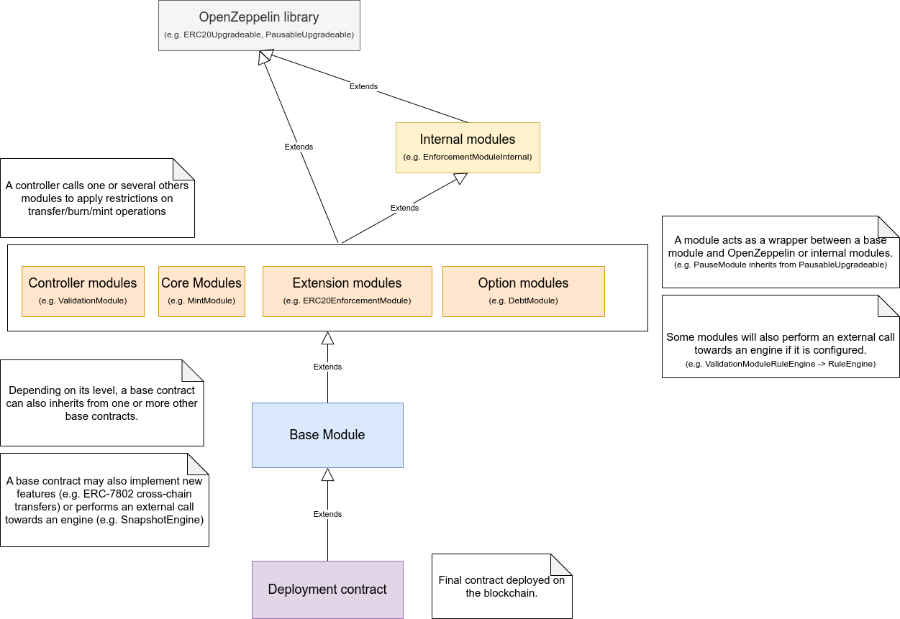
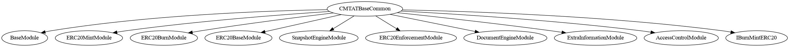
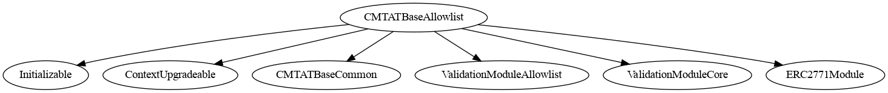
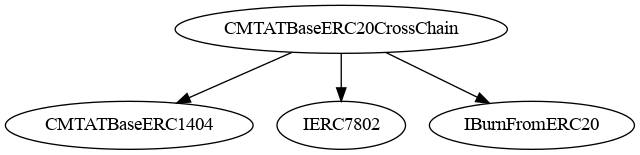
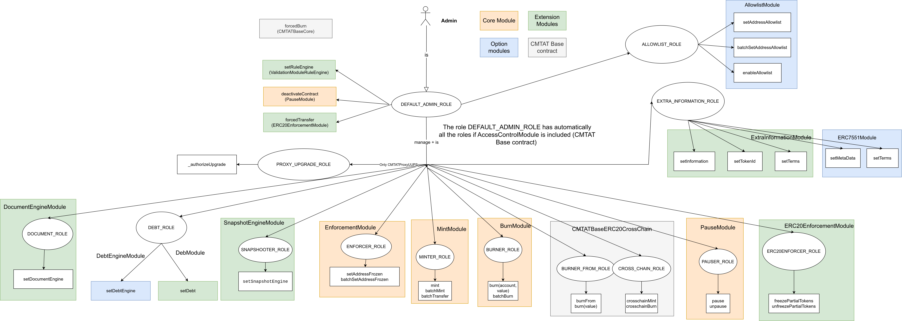
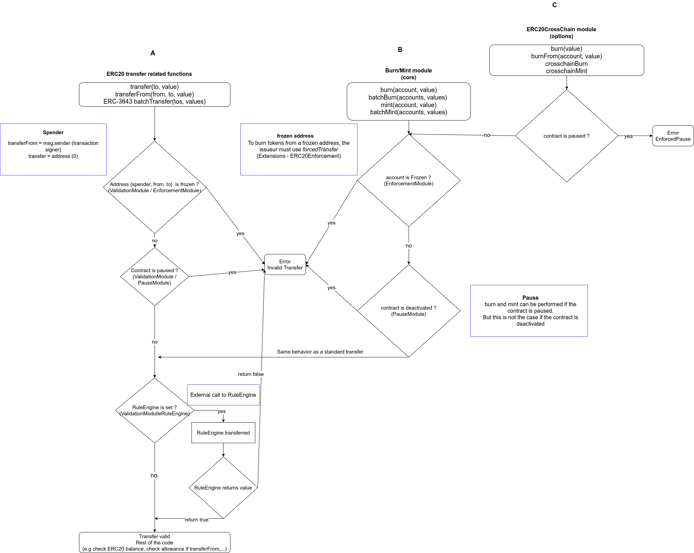
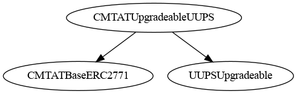

# CMTA Token 

> To use the CMTAT, we recommend the latest audited version, from the [Releases](https://github.com/CMTA/CMTAT/releases) page. Currently, it is the version [v3.0.0](https://github.com/CMTA/CMTAT/releases/tag/v3.0.0).
>
> A pdf file of the v3.0.0 README is available here:  [CMTATSpecificationV3.0.0.pdf](./doc/specification/CMTATSpecificationV3.0.0.pdf) 

## Introduction

The CMTA token (CMTAT) is a security token framework that includes various compliance features such as conditional transfer, account freeze, and token pause, as well as several technical features such as [ERC-7802](https://eips.ethereum.org/EIPS/eip-7802) for cross-chain transfer and [ERC-7201](https://eips.ethereum.org/EIPS/eip-7201) for upgradeadibility.

This repository provides CMTA's reference Solidity implementation of CMTAT, suitable for EVM chains such as Ethereum.

[TOC]

### History

The CMTA token (CMTAT) is a security token framework that includes various compliance features such as conditional transfer, account freeze, and token pause. CMTAT was initially optimized for the Swiss law framework, however, these numerous features and extensions make it suitable for other jurisdictions too. 

The CMTAT is an open standard from the [Capital Markets and Technology Association](https://www.cmta.ch/) (CMTA), which gathers organizations from the financial, legal and technology sectors.
The CMTAT was first developed by a working group of CMTA's [members](https://cmta.ch/members) and its development is now overseen by the [Technical Committee of CMTA's Advisory Board](https://cmta.ch/advisory-board). 

### Goal

CMTAT has been built with five main goals:

1. Suitable for various regulatory financial assets and instruments (Equities, Structured products, Debt and Stablecoin) and adapted to any jurisdiction (international)

2. Easy to modify and adapt for specific use-case (customization) through its modular architecture
3. Interoperability with the Ethereum ecosystem by implementing recognized standards: 
   - Tokenization: [ERC-20](https://eips.ethereum.org/EIPS/eip-20), [ERC-3643](https://eips.ethereum.org/EIPS/eip-3643) (without on-chain identity), [ERC-1404](https://github.com/ethereum/EIPs/issues/1404), [ERC-7551](https://ethereum-magicians.org/t/erc-7551-crypto-security-token-smart-contract-interface-ewpg-reworked/25477), [ERC-1363](https://eips.ethereum.org/EIPS/eip-1363),...
   - Technicals: [ERC-2771](https://eips.ethereum.org/EIPS/eip-2771) (MetaTx/Gasless), [ERC-7201](https://eips.ethereum.org/EIPS/eip-7201), [ERC-7802](https://eips.ethereum.org/EIPS/eip-7802)...

4. Security by undergoing audits from trusted firms like [ADBK](https://abdk.consulting) and [Halborn](https://www.halborn.com), and by implementing a range of industry best practices.
   - Strong code coverage(~99.17%) with 2635 automated tests executed
   - Run static analyzer ([Aderyn](https://github.com/Cyfrin/aderyn), [Slither](https://github.com/crytic/slither/tree/master)) before and after the audits
   - RBAC Access Control to clearly separates the different roles and permissions
   
5. Freedom of use through an open-source weak copyleft license ([MPL-2.0](https://www.mozilla.org/en-US/MPL/2.0/FAQ/))


By taking these five main goals, here a comparison with others known implementations to deploy financial instruments on-chain.

|                                                       | CMTAT                                                        | ERC-3643<br />(Tokeny implementation)                        | ERC-1400<br />(UniversalToken)                               | TokenF                                                       | ERC-20 Smart Coin (Cast framework)                           |
| ----------------------------------------------------- | ------------------------------------------------------------ | ------------------------------------------------------------ | ------------------------------------------------------------ | ------------------------------------------------------------ | ------------------------------------------------------------ |
| Version/Commit                                        | v3.0.0<br />(09/2025)                                        | [4.2.0-beta2](https://github.com/TokenySolutions/T-REX/releases/tag/4.2.0-beta2)<br /> (01/2025) | [54320c6](https://github.com/Consensys/UniversalToken/commit/54320c6f7a8ee1fd7fcb19073e9c122e1e8f96f9) <br />(01/2024) | [0c1c2ac](https://github.com/dl-tokenf/contracts/commit/0c1c2ac0aa8c95423928a9ed09ab14bce64054f5)<br />(04/2025) | [dd8bf5e](https://github.com/castframework/smartcoin/commit/dd8bf5e1ba24d2379b102db74bfc8326fb649b65) <br />(01/2025) |
| Company / Association behind                          | [CMTA](https://cmta.ch/)                                     | [Tokeny](https://tokeny.com/), [ERC3643 Association](https://www.erc3643.org/) | [Consensys](https://consensys.io/)                           | [Distributed Lab](https://distributedlab.com/)               | [SOCIÉTÉ GÉNÉRALE  FORGE](https://www.sgforge.com)           |
| 1<br />(suitable for various financial instruments)   | &#x2611;                                                     | Partial                                                      | &#x2611;                                                     | Partial                                                      | Partial                                                      |
| Details                                               | -                                                            | Lack of support for Debt product<br /><br />On-chain identity management can potentially make it too complex for stablecoins<br />Also lacks support for adding information related to on-chain terms (hash, uri) | -                                                            | Lacks support for adding information related to on-chain terms (hash, uri) as well as Debt product but contracts could be extended. | Lacks support for adding information related to on-chain terms (hash, uri) as well as Debt product |
| 2<br />(customizable)                                 | &#x2611;                                                     | &#x2612;                                                     | &#x2612;                                                     | &#x2611;                                                     | &#x2611;                                                     |
| Details                                               | Modular architecture                                         | Code difficult to modify because functionalities are not clearly separated and onchain identity management is required | Code difficult to modify because functionalities are not clearly separated | Customizable but uses the [Diamant proxy](https://eips.ethereum.org/EIPS/eip-2535) pattern structure which makes it more complex to implement | Contracts are minimalist and easy to modify                  |
| 3<br />(interoperability)                             | &#x2611;                                                     | &#x2611;                                                     | Partial                                                      | &#x2611;                                                     | &#x2611;                                                     |
| Details                                               | Tokenization: ERC-3643 (without on-chain identity), ERC-1404, ERC-7551, ERC-1363,... <br />Technicals: ERC-20, ERC-2771, ERC-7201, ERC-7802, ... | ERC-20 and ERC-3643                                          | While ERC-1400 is an ERC-20, <br />the standard ERC-1400 is not itself an official standard<br />It has also a dependence with [ERC-1820](https://eips.ethereum.org/EIPS/eip-1820) registry contract, which is not always available/deployed on some layer2. | [ERC-20](https://eips.ethereum.org/EIPS/eip-20) and [ERC-2535](https://eips.ethereum.org/EIPS/eip-2535) | [ERC-20](https://eips.ethereum.org/EIPS/eip-20)              |
| 4<br />(Security)                                     | &#x2611;                                                     | &#x2611;                                                     | &#x2612;                                                     | &#x2612;                                                     | &#x2612;                                                     |
|                                                       | - 1.0 and 2.3.0: audited by [ABDK](https://abdk.consulting)<br />3.0.0 audited by [Halborn](https://www.halborn.com)<br />- RBAC Access Control | -  Past version audited by [Hacken](https://hacken.io).<br />- Lack of granularity in term of Access Control (only two roles: Agent and Owner) | No official public audit for the last commits,<br />last audit was done in 2020 | No official audit available                                  | No official audit available                                  |
| 5<br />(License - Open source & Allow Commercial use) | &#x2611;                                                     | Partial<br />(only ERC-3643 core)                            | &#x2611;                                                     | &#x2611;                                                     | &#x2611;                                                     |
|                                                       | [MPL-2.0](https://www.mozilla.org/en-US/MPL/2.0/FAQ/)<br />(weak copyleft) | - ERC-3643 core: GPL 3.0 (strong copyleft)<br />- Compliance module: CC-BY-NC-4.0(forbid commercial use) | Apache 2.0<br/>(permissive)                                  | MIT<br/>(permissive)                                         | [Apache-2.0 license](https://github.com/castframework/smartcoin/tree/main#Apache-2.0-1-ov-file)<br />(permissive) |


### Who uses CMTAT and for what?

CMTAT is suitable for the digitalization of various financial assets. Below is a selection of public case studies 

More details are available here: [cmta.ch/faqs](https://cmta.ch/faqs#what-cases-has-cmtat-already-been-used-in)

#### Digitalization of equity securities

The CMTAT was initially designed for the digitalization of company shares. For SMEs, digitalization provides an opportunity to access new financing and investment models by selling digital shares through online exchanges. Some companies that have digitalized shares using the CMTAT include:

- [Daura](https://thetokenizer.io/2022/12/13/daura-counts-on-smart-contract-standard-cmtat-for-the-tokenization-of-swiss-shares/) uses the CMTAT through their own fork to digitalize the shares of companies using its [platform](https://www.daura.ch), deployed on [zkSync](https://zksync.io/).
- [Taurus SA](https://www.taurushq.com) (partial list): [Magic Tomato SA (2022)](https://www.taurushq.com/blog/magictomato-1st-foodtech-to-tokenise-its-shares-and-raise-equity/)  - an online grocery platform opened its governance and capital to its community, by issuing digital non-voting shares (bons de participation), [Qoqa Brew (2022)](https://www.taurushq.com/blog/qoqa-brew-brasserie-du-futur-tokenisation-et-financement-by-taurus/) - an online retailer opened the capital of its on-site brewery Q-Brew to its community by issuing digital non-voting shares, [Cité Gestion SA (2023)](https://cmta.ch/news-articles/cite-gestion-becomes-cmta-certified-issuer-of-tokenized-shares) - a Swiss bank and wealth manager, issued digitalized shares in 2022, using the CMTAT, [CODE41 (2023)](https://www.taurushq.com/blog/code41-tokenises-its-shares-for-a-capital-increase-amongst-its-community-through-taurus-technology/) - a Swiss watchmaking company tokenized its shares  for a capital increase using CMTAT.

#### Digitalization of debt securities

- [Project Guardian - UBS (2024)](https://www.linkedin.com/posts/cmta-ch_shareubs-activity-7137735139438002177-oDUL): CMTAT was used to issue a digital bond by UBS, as part of the first live repo transaction with a natively-issued digital bond on a public blockchain as part of the Monetary Authority of Singapore’s (MAS) Project Guardian.
- The Obligate platform [Enote Protocol](https://docs.obligate.com/obligate/enote-protocol) enables BulletBond issuances using smart contracts, deployed on Polygon PoS. For this purpose, they use a fork of CMTAT with the `SnapshotModule`(replaced in CMTAT v3.0.0 by the SnapshotEngine) and the DebtModule.
- [SCCF (2023)](https://www.taurushq.com/blog/sccf-and-horizon-capital-leverage-taurus-technology-to-execute-landmark-tokenized-trade-finance-debt-transaction/): trade finance firm SCCF issued short term tokenized notes to refinance a loan to a commodity trading firm active in biofuels through [Taurus SA](https://www.taurushq.com). See also [SCCF and Taurus Announce Successful Tokenization of End-to-End Trade Finance Transaction on TDX Marketplace (2024)](https://www.taurushq.com/blog/sccf-and-taurus-announce-successful-tokenization-of-end-to-end-trade-finance-transaction-on-tdx-marketplace/)

#### Digitalization of structured products

- In early 2024, [UBS](https://www.ubs.com/global/en/investment-bank/tokenize.html) executed a pilot transaction with OSL, a licensed professional investor in Hong Kong, to issue a tokenized warrant on Ethereum using the CMTAT smart contract framework. The tokenization arrangement for this warrant utilizes the CMTAT codebase to represent the warrant smart contract, which forms part of the tokenized register of holders. See [ubs.com - UBS expands its digital asset capabilities by launching Hong Kong’s first-ever tokenized warrant on the Ethereum network [ubs.com]](https://www.ubs.com/global/en/media/display-page-ndp/en-20240207-tokenized-warrant.html).
- [Credit Suisse, Pictet and Vontobel (2022)](https://cmta.ch/news-articles/trading-and-settlement-in-digital-securities) issued tokenized investment products that were traded on [BX Swiss](https://www.bxswiss.com/news/20221213-BX-Swiss-legt-das-technische-Fundament-fuer-die-Zukunft-des-regulierten-Handels-mit-tokenisierten-Wertpapieren) as part of a proof-of-concept leveraging the CMTAT.

#### Digitalization of piece of art

- [Syz Group](https://www.syzgroup.com/en) has digitalized two piece of Art by using CMTAT in 2023 and 2024. See [Syz Art Tokenisation](https://www.syzgroup.com/en/tokenization-syzart)

#### Tokenized market funds

- In 2024, [UBS](https://www.ubs.com/global/en/investment-bank/tokenize.html) launched UBS USD Money Market Investment Fund Token (uMINT), a Money Market investment built on Ethereum distributed ledger technology. The tokenization arrangement for this fund utilizes CMTAT codebase to represent the fund smart contract, which forms part of the fund’s tokenized register of members. See [ubs.com - UBS Asset Management launches its first tokenized investment fund [ubs.com]](https://www.ubs.com/global/en/media/display-page-ndp/en-20241101-first-tokenized-investment-fund.html)

#### Tokenization platform

- Fireblocks integrates CMTAT into their [tokenization platform](https://www.fireblocks.com/platforms/tokenization/). See also [Fireblocks - Fireblocks joins CMTA to define the standards for tokenization in traditional capital markets](https://www.fireblocks.com/blog/fireblocks-joins-cmta-to-define-the-standards-for-tokenization-in-traditional-capital-markets/)
- Taurus SA integrates CMTAT (Solidity and [Tezos version](https://www.taurushq.com/blog/taurus-supports-tokenisation-of-equity-on-the-tezos-blockchain/)) into their tokenization platform called [Taurus-CAPITAL](https://www.taurushq.com/capital/)

#### Wrapped Tokens

- 21.co (the parent company of 21Shares acquired by FalconX) used CMTAT through their own [fork](https://github.com/amun/CMTAT) to create Wrapped Tokens on Ethereum. See for example Wrapped Bitcoin(21BTC) on [Etherscan](https://etherscan.io/token/0x3f67093dffd4f0af4f2918703c92b60acb7ad78b) and [their announcement](https://www.globenewswire.com/news-release/2024/09/03/2939399/0/en/21-co-Expands-its-Wrapped-Tokens-Lineup-with-the-Launch-of-Wrapped-Bitcoin-21BTC-on-Ethereum.html)

### Where CMTAT is mentioned?

CMTAT is mentioned in several different reports. While these reports do not take into account the latest changes with the version v.3.0.0, it gives already a good indication of how CMTAT can be used. The points raised by these also allowed for numerous improvements to be made to the CMTAT.

- [Forum - Asset Tokenization in Financial Markets: The Next Generation of Value Exchange (2025)](https://reports.weforum.org/docs/WEF_Asset_Tokenization_in_Financial_Markets_2025.pdf), page 38
- [King's Business School/Rhys Bidder - What Is The Future Of Stablecoins, And How Do We Get There? (2025)](https://www.kcl.ac.uk/business/assets/PDF/qcgbf-working-papers/taking-the-next-step-v5.pdf), page 33
- [Nethermind - Tokenization Standards: The Missing Link for Institutional Adoption (2025)](https://www.nethermind.io/blog/tokenization-standards-the-missing-link-for-institutional-adoption): page 2, 16, 19, 33-36 & 39
- [Project Guardian - Fixed Income Framework (2024)](https://www.mas.gov.sg/-/media/mas-media-library/development/fintech/guardian/guardian-fixed-income-framework.pdf): page 13, 39, 59 & 65
- [ICMA contribution to MAS Guardian Fixed Income Framework (GFIF) publication (2024)](https://www.icmagroup.org/assets/Summary-of-third-party-proposals-for-integrating-ICMAs-Bond-Data-Taxonomy-in-token-frameworks-and-DLT-platforms-complementing-section-6-Data-Model-of-GFIF.pdf)


### Use case

#### Financial instruments

This reference implementation allows the issuance and management of tokens representing equity securities, and other forms of financial instruments such as debt securities and structured products. It can also be used for stablecoins.

#### Jurisdiction

CMTAT was initially optimized for the Swiss law framework, it then took a more **international** path with the version v3.0.0. Subsequently, its numerous compliance features, as well as the numerous configuration possibilities during deployment, make it also suitable for other jurisdictions.

Its modular structure allows it to be easily modified to suit specific cases. For example, a deployment version has been made for Germany (ERC-7551 / eWpG).

You may modify the token code by adding, removing, or modifying features. However, the core modules must remain in place for compliance with the CMTA specification.

#### Specific deployment version tailored to use case

##### Product use case (equities, stablecoins)

CMTAT comes with several different deployment versions to meet specific use cases.

| Product                    | Deployment version | Note                                                         |
| -------------------------- | ------------------ | ------------------------------------------------------------ |
| Equities                   | CMTAT Standard     | All features, without those directly to Debt                 |
| Equities in Germany        | CMTAT ERC-7551     | The standard version with a few supplementary functions to meet the standard [ERC-7551](https://ethereum-magicians.org/t/erc-7551-crypto-security-token-smart-contract-interface-ewpg-reworked/25477), tailored for the Germany and eWpg. |
| Debt/bond                  | CMTAT Debt<br />   | CMTAT Standard is also suitable but this version adds the possibility to put several on-chain information related to debt and bond product |
| Stablecoin (e.g USDC/USDT) | CMTAT Light        | The core features (i.e., minting, burning,address freeze / blacklisting, pause) without additional functions required by equities and debt instruments (e.g., document management, snapshot, partial freeze of balances). |

##### Technical use case (whitelist, upgradeable/proxy)

| Features                                                     | Deployment version supported                                 |
| ------------------------------------------------------------ | ------------------------------------------------------------ |
| Restrict transfer to inside a whitelist / Allowlist          | CMTAT Allowlist<br />Or all other deployment (except Light) version with a `RuleEngine` configured |
| On-chain snapshot<br />(useful for on-chain dividend distribution) | All deployment version (except Light) with a `SnapshotEngine`configured |
| Deployment through proxy (Upgradeable)<br />Deployment immutable (standalone / without proxy) | Each deployment version comes with a standalone (immutable) or upgradeable mode.<br />A specific deployment version exists for UUPS Proxy |
| MetaTx/Gasless with ERC-2771                                 | All deployment version, except Debt & Light version          |

#### CMTAT for stablecoins

Here is a comparison between the features present in major custodian stablecoin and the library CMTAT.

|                                |                                                              | **Monerium**                                                 | **USDC**                                                     | **USDT**                                                     | **CMTAT 3.0.0 Light**    | CMTAT 3.0.0 Standard                                         |
| :----------------------------- | :----------------------------------------------------------- | :----------------------------------------------------------- | :----------------------------------------------------------- | :----------------------------------------------------------- | :----------------------- | ------------------------------------------------------------ |
| Source                         |                                                              | [ec59a36](https://github.com/monerium/smart-contracts/commit/ec59a3677a17a06610d7e4788211c19da561241b) | [Ethereum USDC implementation contract](https://etherscan.io/address/0x43506849d7c04f9138d1a2050bbf3a0c054402dd#code) | [Ethereum USDT address](https://etherscan.io/address/0xdac17f958d2ee523a2206206994597c13d831ec7) |                          |                                                              |
| Currency                       |                                                              | $, euros, pound sterling,  Icelandic króna                   | $                                                            | $                                                            | -                        | -                                                            |
| Company behind                 |                                                              | [Monerium](https://monerium.com)                             | [Circle](https://www.circle.com)                             | [Tether](https://tether.to/en/)                              | [CMTA](https://cmta.ch/) | [CMTA](https://cmta.ch/)                                     |
| **Standard**                   |                                                              |                                                              |                                                              |                                                              |                          |                                                              |
|                                | [ERC-20](https://eips.ethereum.org/EIPS/eip-20)              | &#x2611;                                                     | &#x2611;                                                     | &#x2611;                                                     | Same as standard version | &#x2611;                                                     |
|                                | [ERC-2612 Permit](https://eips.ethereum.org/EIPS/eip-2612)   | &#x2611;<br /> ([GitHub)](https://github.com/monerium/smart-contracts/blob/ec59a3677a17a06610d7e4788211c19da561241b/src/Token.sol#L152) | &#x2611;                                                     | &#x2612;                                                     | Same as standard version | &#x2612;                                                     |
|                                | [ERC-3009](https://eips.ethereum.org/EIPS/eip-3009)<br />(Transfer With Authorization) | &#x2612;                                                     | &#x2611;                                                     | &#x2612;                                                     | Same as standard version | &#x2612;                                                     |
|                                | [ERC-2771](https://eips.ethereum.org/EIPS/eip-2771) (MetaTX) | &#x2612;                                                     | &#x2612;                                                     | &#x2612;                                                     | &#x2612;                 | &#x2611;<br />(ERC2771Module / CMTATBaseERC2771)             |
| ERC-20 extends functionalities |                                                              |                                                              |                                                              |                                                              |                          |                                                              |
|                                | Mint/issue                                                   | &#x2612; <br />(see mint with allowance)                     | &#x2612;<br />(see mint with allowance)                      | &#x2611;                                                     | Same as standard version | &#x2611;                                                     |
|                                | Mint with dedicated allowance ("mintFrom")                   | &#x2611;<br /> ([Github](https://github.com/monerium/smart-contracts/blob/ec59a3677a17a06610d7e4788211c19da561241b/src/MintAllowanceUpgradeable.sol#L3)) | &#x2611;                                                     | &#x2612;                                                     | Same as standard version | &#x2612;                                                     |
|                                | Batch Mint version                                           | &#x2612;                                                     | &#x2612;                                                     | &#x2612;                                                     | Same as standard version | &#x2611;                                                     |
|                                | burn / redeem                                                | &#x2611; <br />([Github](https://github.com/monerium/smart-contracts/blob/ec59a3677a17a06610d7e4788211c19da561241b/src/Token.sol#L74)) | &#x2611;                                                     | &#x2611; <br />(`redeem`/ `destroyBlackFunds`                | Same as standard version | &#x2611;                                                     |
|                                | Set name after deployment                                    | &#x2612;                                                     | &#x2612;                                                     | &#x2612;                                                     | Same as standard version | &#x2611;<br />(ERC20BaseModule)                              |
|                                | Set symbol after deployment                                  | &#x2612;                                                     | &#x2612;                                                     | &#x2612;                                                     | Same as standard version | &#x2611;<br />(ERC20BaseModule)                              |
| Regulatory                     |                                                              |                                                              |                                                              |                                                              |                          |                                                              |
|                                | Integrated blacklist<br />(inside token smart contract)      | &#x2612;                                                     | &#x2611;                                                     | &#x2611;                                                     | Same as standard version | &#x2611;                                                     |
|                                | External blacklist<br />(can be shared with several different tokens) | &#x2611;<br />[GitHub](https://github.com/monerium/smart-contracts/blob/ec59a3677a17a06610d7e4788211c19da561241b/src/BlacklistValidatorUpgradeable.sol#L102) | &#x2612;                                                     | &#x2612;                                                     | &#x2612;                 | &#x2611; <br />(through a dedicated smart contract RuleEngine) |
|                                |                                                              | **Monerium**                                                 | **USDC**                                                     | **USDT**                                                     | **CMTAT 3.0.0 Light**    | **CMTAT 3.0 Standard**                                       |
| Access Control                 |                                                              |                                                              |                                                              |                                                              |                          |                                                              |
|                                | [Ownership](https://docs.openzeppelin.com/contracts/5.x/api/access#Ownable) | &#x2611;<br />[(Github](https://github.com/monerium/smart-contracts/blob/ec59a3677a17a06610d7e4788211c19da561241b/src/SystemRoleUpgradeable.sol#L8)) | &#x2611;                                                     | &#x2611;                                                     | Same as standard version | &#x2612;<br />(use Access Control instead, but ownership could be added) |
|                                | [RBAC Access control](https://docs.openzeppelin.com/contracts/5.x/api/access#AccessControl) | &#x2611;<br />[GitHub](https://github.com/monerium/smart-contracts/blob/ec59a3677a17a06610d7e4788211c19da561241b/src/SystemRoleUpgradeable.sol#L7) | &#x2611;<br />(Minter & Blacklister)                         | &#x2612;                                                     | Same as standard version | &#x2611;                                                     |
| Upgradeability                 |                                                              |                                                              |                                                              |                                                              |                          |                                                              |
|                                | Upgradable (transparent/Beacon)                              | &#x2612;                                                     | &#x2611;                                                     | &#x2612;                                                     | Same as standard version | &#x2611;                                                     |
|                                | Upgradeable UUPS<br />                                       | &#x2611;<br />([GitHub](https://github.com/monerium/smart-contracts/blob/ec59a3677a17a06610d7e4788211c19da561241b/src/Token.sol#L23)) | &#x2612;                                                     | &#x2612;                                                     | &#x2612;                 | &#x2611; <br />(through a dedicated deployment version)      |
|                                | Migrate function integrated                                  | &#x2612;                                                     | &#x2612;                                                     | &#x2611;<br />(because USDT was made before the apparition of proxy architecture) | Same as standard version | &#x2612;                                                     |
| Standalone (immutable)         |                                                              | &#x2612;                                                     | &#x2612;                                                     | &#x2611;                                                     | Same as standard version | &#x2611; (through a dedicated deployment version)            |
| Pause transfers                |                                                              | Partial<br />Could use the `validator` contract to pause all transfers ([GitHub](https://github.com/monerium/smart-contracts/blob/ec59a3677a17a06610d7e4788211c19da561241b/src/Token.sol#L122C13-L122C22)) | &#x2611;                                                     | &#x2611;                                                     | Same as standard version | &#x2611;<br />(PauseModule)                                  |
| Fee on transfer                |                                                              | &#x2612;                                                     | &#x2612;                                                     | &#x2611;<br />(currently set at 0)                           | Same as standard version | &#x2612;                                                     |


#### CMTAT for tokenized market funds

Here is a comparison between the features present in known tokenized market funds and the library CMTAT.

|                                                              |                                                              | Spiko<br />(EUTBL and USTBL)                                 | Franklin Templeton <br />(FOBXX / Benji)                     | Blackrock<br />(BUIDL)                                       | CMTAT 3.0.0 Standard                                | CMTAT 3.00 ERC-1363      |
| :----------------------------------------------------------- | :----------------------------------------------------------- | :----------------------------------------------------------- | ------------------------------------------------------------ | ------------------------------------------------------------ | --------------------------------------------------- | ------------------------ |
| Reference                                                    |                                                              |                                                              | [Franklin OnChain U.S. Government Money Fund (FOBXX)](https://www.franklintempleton.com/investments/options/money-market-funds/products/29386/SINGLCLASS/franklin-on-chain-u-s-government-money-fund/FOBXX)<br />[Avalanche - Franklin Templeton Launches Tokenized Money Market Fund BENJI On The Avalanche Network](https://www.avax.network/about/blog/franklin-templeton-launches-tokenized-money-market-fund-benji-avalanche) | Securitize contracts<br />[Proxy](https://etherscan.io/address/0x7712c34205737192402172409a8f7ccef8aa2aec)<br />[Implementation](https://etherscan.io/address/0x603bb6909be14f83282e03632280d91be7fb83b2#code) | -                                                   | -                        |
| Source                                                       |                                                              | [9ef58f3](https://github.com/spiko-tech/contracts/commit/9ef58f31bc8dc9cb562dfcbae6091866b3da5121) | [Franklin Templeton Digital Assets - contracts](https://digitalassets.franklintempleton.com/benji/benji-contracts/)<br />[Contract proxy](https://snowtrace.io/token/0xE08b4c1005603427420e64252a8b120cacE4D122?chainid=43114)<br />[Contract implementation](https://snowtrace.io/address/0x5c118e6A0bD2de0AF66655806E3001727C13d105/contract/43114/code) |                                                              | -                                                   | -                        |
| Company behind                                               |                                                              | [Spiko](https://www.spiko.io/)                               | [Franklin Templeton](https://digitalassets.franklintempleton.com) | [Blackrock](https://www.blackrock.com/) through [Securitize](https://securitize.io) | [CMTA](https://cmta.ch/)                            | [CMTA](https://cmta.ch/) |
| **Standard**                                                 |                                                              |                                                              |                                                              |                                                              |                                                     |                          |
|                                                              | [ERC-20](https://eips.ethereum.org/EIPS/eip-20)              | &#x2611;                                                     | &#x2611;                                                     | &#x2611;                                                     | &#x2611;                                            | Same as standard version |
|                                                              | [ERC-1363](https://eips.ethereum.org/EIPS/eip-1363)          | &#x2611;                                                     | &#x2612;                                                     | &#x2612;                                                     | &#x2612;                                            | &#x2611;                 |
|                                                              | [ERC-2612 Permit](https://eips.ethereum.org/EIPS/eip-2612)   | &#x2611; <br />([GitHub)](https://github.com/spiko-tech/contracts/blob/9ef58f31bc8dc9cb562dfcbae6091866b3da5121/contracts/token/Token.sol#L26) | &#x2612;                                                     | &#x2612;                                                     | &#x2612;<br />(Could be extended to support it)     | Same as standard version |
|                                                              | [ERC-2771](https://eips.ethereum.org/EIPS/eip-2771) (MetaTX) | &#x2611;<br />([GitHub](https://github.com/spiko-tech/contracts/blob/9ef58f31bc8dc9cb562dfcbae6091866b3da5121/contracts/token/Token.sol#L22)) | &#x2612;                                                     | &#x2612;                                                     | &#x2611;                                            | Same as standard version |
| ERC-20 extends functionalities                               |                                                              |                                                              |                                                              |                                                              |                                                     |                          |
|                                                              | Mint/issue                                                   | &#x2611;<br />([GitHub](https://github.com/spiko-tech/contracts/blob/9ef58f31bc8dc9cb562dfcbae6091866b3da5121/contracts/token/Token.sol#L59)) | &#x2611;                                                     | &#x2611;                                                     | &#x2611;                                            | Same as standard version |
|                                                              | Mint with dedicated allowance ("mintFrom")                   | &#x2612;                                                     | &#x2612;                                                     | &#x2612;                                                     | &#x2612;                                            | Same as standard version |
|                                                              | Batch Mint version                                           | &#x2612;                                                     | &#x2612;                                                     | &#x2612;                                                     | &#x2611;                                            | Same as standard version |
|                                                              | burn / redeem                                                | &#x2611; <br />([Github](https://github.com/spiko-tech/contracts/blob/9ef58f31bc8dc9cb562dfcbae6091866b3da5121/contracts/token/Token.sol#L63)) | &#x2611;                                                     | &#x2611;<br />(burn & omnibusBurn)                           | &#x2611;                                            | Same as standard version |
| Regulatory                                                   |                                                              |                                                              |                                                              |                                                              |                                                     |                          |
|                                                              | Whitelist / Allowlist                                        | &#x2611;                                                     | &#x2611;<br />(through external contract `moduleRegistry`)   | &#x2611;<br />(through external contract `ComplianceServiceWhitelisted`) | &#x2611;<br />(through *RuleEngine*)                | Same as standard version |
|                                                              | On-chain country investor restriction /banned                | &#x2612;                                                     | &#x2612;                                                     | &#x2611;<br />(though an on-chain list of investor and the library  `ComplianceServiceLibrary` ) |                                                     |                          |
|                                                              | Integrated blacklist<br />(inside token smart contract)      | &#x2612;<br />(Could be implemented, but use a whitelist system currently) | &#x2612;                                                     | &#x2612;                                                     | &#x2611;<br />(EnforcementModule)                   | Same as standard version |
|                                                              | External blacklist<br />(can be shared with several different tokens) | &#x2611;<br />[GitHub](https://github.com/monerium/smart-contracts/blob/d2a633e8d2d028dcc6f251a394273a9cac1b1e43/src/BlacklistValidatorUpgradeable.sol#L102) | &#x2611;<br />(through external contract `moduleRegistry`)   | &#x2612;                                                     | &#x2611;<br />(RuleEngine)                          | Same as standard version |
|                                                              | Forced Transfer                                              | &#x2612;                                                     | &#x2611;<br />(called `instantTransfer`)                     | &#x2611;<br />(called *size*)                                | &#x2611;                                            | Same as standard version |
|                                                              | Restriction on `transferFrom`                                | &#x2612;                                                     | &#x2611;<br />(through `disableERC20ThirdPartyTransfer` & `enableERC20ThirdPartyTransfer`) | &#x2612;                                                     | Partial<br />(transfer revert if spender is frozen) | Same as standard version |
|                                                              |                                                              | **Spiko**                                                    | **Franklin Templeton <br />(FOBXX / Benji)**                 | **Blackrock<br />(BUILD)**                                   | **CMTAT 3.0.0 Standard**                            | **CMTAT 3.00 ERC-1363**  |
| Access Control                                               |                                                              |                                                              |                                                              |                                                              |                                                     |                          |
|                                                              | [Ownership](https://docs.openzeppelin.com/contracts/5.x/api/access#Ownable) | &#x2611;<br />[(Github](https://github.com/spiko-tech/contracts/blob/9ef58f31bc8dc9cb562dfcbae6091866b3da5121/contracts/token/Token.sol#L23)) | &#x2612;<br />(only `ModuleRegistry` is ownable)             | &#x2611;                                                     | &#x2612;<br />(easily adaptable to support this)    | Same as standard version |
|                                                              | [RBAC Access control](https://docs.openzeppelin.com/contracts/5.x/api/access#AccessControl) | &#x2611;<br />[GitHub](https://github.com/spiko-tech/contracts/blob/9ef58f31bc8dc9cb562dfcbae6091866b3da5121/contracts/permissions/PermissionManager.sol) | &#x2611;                                                     | &#x2611;<br />(several roles: Exchange, Issuer, transfer agent and master) | &#x2611;                                            | Same as standard version |
|                                                              | [Access Control Manager](https://docs.openzeppelin.com/contracts/5.x/api/access#AccessManaged) | &#x2611;<br />([GitHub](https://github.com/spiko-tech/contracts/blob/9ef58f31bc8dc9cb562dfcbae6091866b3da5121/contracts/permissions/PermissionManager.sol#L14C5-L14C15)) | &#x2612;                                                     | &#x2612;                                                     | &#x2612;<br />(Could be extended to support it)     | Same as standard version |
| Upgradeability                                               |                                                              |                                                              |                                                              |                                                              |                                                     |                          |
|                                                              | Upgradable (transparent/Beacon)                              | &#x2611;                                                     | &#x2611;<br />                                               | &#x2611;                                                     | &#x2611;                                            | Same as standard version |
|                                                              | Upgradeable UUPS<br />                                       | &#x2611;<br />([GitHub](https://github.com/spiko-tech/contracts/blob/9ef58f31bc8dc9cb562dfcbae6091866b3da5121/contracts/token/Token.sol#L29)) | &#x2611;<br />                                               | &#x2612;                                                     | &#x2612;<br />(Could be extended to support it)     | Same as standard version |
| Pause transfers                                              |                                                              | &#x2611;<br />([GitHub](https://github.com/spiko-tech/contracts/blob/9ef58f31bc8dc9cb562dfcbae6091866b3da5121/contracts/token/Token.sol#L67)) | &#x2611;<br />(trough  `enableERC20Transfer` and `disableERC20Transfer`) | &#x2611;                                                     | &#x2611;                                            | Same as standard version |
| Lock tokens                                                  |                                                              | &#x2612;                                                     | &#x2612;                                                     | &#x2611;                                                     | &#x2612;                                            | Same as standard version |
| Specific functions for omnibus wallet                        |                                                              | &#x2612;                                                     | &#x2612;                                                     | &#x2611;                                                     | &#x2612;<br />(see specific deployment version)     | Same as standard version |
| Dedicated function to fetch the list of token holders and their balance |                                                              | &#x2612;                                                     | &#x2611;<br />(`getAccountsBalances`)                        | &#x2611;<br />(`checkWalletsForList` & `balanceOfInvestor`)  | &#x2612;                                            | Same as standard version |
| Price indicated on-chain                                     |                                                              | &#x2612;                                                     | &#x2611;<br />(`lastKnownPrice`)                             | &#x2612;                                                     | &#x2612;                                            | Same as standard version |

**Note**

- *Fasanara Capital Ltd* has also tokenized a money market fund. Since they have worked with [Tokeny](https://tokeny.com) and use therefore the ERC-3643 standard, a comparison with this standard is provided in other sections of this document. See also [Tokeny - How Tokeny Powers Fasanara’s Tokenized Money Market Funds](https://tokeny.com/customer-story-fasanaras-tokenized-mmf/)
- Upgradeability: a specific CMTAT deployment version allows to use UUPS proxy

### Comparison of CMTAT and other tokenization frameworks

Here is a comparison between the features present in known tokenization framework and the library CMTAT.

|                            Label                             |                     CMTAT Solidity code                      |                         **E**RC-1400                         | ERC-3643                                                     | Cast Framework                                               |
| :----------------------------------------------------------: | :----------------------------------------------------------: | :----------------------------------------------------------: | ------------------------------------------------------------ | ------------------------------------------------------------ |
|               Version/implementation compared                | [CMTAT v3.1.0](https://github.com/CMTA/CMTAT/releases/tag/v3.1.0) | [UniversalToken (Consensys)](https://github.com/Consensys/UniversalToken/tree/54320c6f7a8ee1fd7fcb19073e9c122e1e8f96f9) | [Tokeny's T-Rex](https://github.com/TokenySolutions/T-REX)<br /><br />[3fcf44d](https://github.com/TokenySolutions/T-REX/tree/3fcf44d4fc102fb891aaad27ee58e8936d885542) <br />(06/02/2025) | Smart Coin (ERC-20 version)<br />[dd8bf5e](https://github.com/castframework/smartcoin/tree/dd8bf5e1ba24d2379b102db74bfc8326fb649b65) |
|                 Company / Association behind                 |                   [CMTA](https://cmta.ch/)                   |              [Consensys](https://consensys.io/)              | [Tokeny](https://tokeny.com/), [ERC3643 Association](https://www.erc3643.org/) | [SOCIÉTÉ GÉNÉRALE  FORGE](https://www.sgforge.com)           |
|                                                              |                                                              |                                                              |                                                              |                                                              |
|                            ERC-20                            |                           &#x2611;                           |                           &#x2611;                           | &#x2611;                                                     | &#x2611;                                                     |
|                   **Regulatory features**                    |                                                              |                                                              |                                                              |                                                              |
|    Transfer restriction<br />(blacklist / address freeze)    |                           &#x2611;                           |                           &#x2611;                           | &#x2611;                                                     | &#x2611;                                                     |
| Transfer restriction on the spender address (*transferFrom*) |                           &#x2611;                           |                         **&#x2612;**                         | **&#x2612;**                                                 | &#x2611;<br />[(GitHub)](https://github.com/castframework/smartcoin/blob/dd8bf5e1ba24d2379b102db74bfc8326fb649b65/contracts/smartCoin/SmartCoin.sol#L342) |
|                 On-chain identity management                 |    **&#x2612;**<br />(could be added with a `RuleEngine`)    |                         **&#x2612;**                         | &#x2611;                                                     | **&#x2612;**                                                 |
|                     Document management                      | &#x2611;<br />([ERC-1643](https://github.com/ethereum/eips/issues/1643)) | &#x2611;<br />([ERC-1643](https://github.com/ethereum/eips/issues/1643)) | **&#x2612;**                                                 | **&#x2612;**                                                 |
|                     Whitelist management                     |       &#x2611;<br />(deployment version or RuleEngine)       |                           &#x2611;                           | &#x2611;<br />(on-chain id)                                  | **&#x2612;**                                                 |
|                     Token contract pause                     |                           &#x2611;                           |                           &#x2611;                           | &#x2611;                                                     | &#x2611;                                                     |
|         Conditional Transfer for specific addresses          |                         **&#x2612;**                         |                         **&#x2612;**                         | **&#x2612;**                                                 | &#x2611;<br />(integrated into the token contract)           |
|            Conditional Transfer for all addresses            |              &#x2611;<br />(through RuleEngine)              |                         **&#x2612;**                         | &#x2611;<br />(through compliance contract)                  | **&#x2612;**                                                 |
|                    **Technical features**                    |                                                              |                                                              |                                                              |                                                              |
|                 Configurable ERC-20 decimals                 |                           &#x2611;                           | **&#x2612;**<br />Set at 18<br />([Github](https://github.com/Consensys/UniversalToken/blob/master/contracts/ERC1400.sol#L680)) | &#x2611;                                                     | **&#x2612;**<br />(18 by default)                            |
|                  Role-based access control                   |                           &#x2611;                           |                           &#x2611;                           | Partial <br />(only one role Agent)                          | &#x2611;                                                     |
| Adaptable access control<br />(code can be easily adapted to other type of access control) |                           &#x2611;                           |                         **&#x2612;**                         | **&#x2612;**                                                 | Partial                                                      |
|                  Mint & burn to any address                  |                           &#x2611;                           |                           &#x2611;                           | &#x2611;                                                     | &#x2611;                                                     |
|                   Forced transfer function                   |                           &#x2611;                           |                           &#x2611;                           | &#x2611;                                                     | Partial<br />Only force burn is available<br />([GitHub](https://github.com/castframework/smartcoin/blob/dd8bf5e1ba24d2379b102db74bfc8326fb649b65/contracts/smartCoin/SmartCoin.sol#L97)) |
|               Partially fungible token support               |                         **&#x2612;**                         |                           &#x2611;                           | **&#x2612;**                                                 | **&#x2612;**                                                 |
|                  Contract version on-chain                   |                           &#x2611;                           |                           &#x2611;                           | &#x2611;                                                     | &#x2611;<br />([GitHub](https://github.com/castframework/smartcoin/blob/dd8bf5e1ba24d2379b102db74bfc8326fb649b65/contracts/smartCoin/SmartCoin.sol#L228)) |
|        Deployable on Layer2 and other EVM blockchains        |                &#x2611;<br />(require PUSH0)                 | Partial<br />Requires [ERC-1820](https://eips.ethereum.org/EIPS/eip-1820) Registry contract | &#x2611;<br />(require PUSH0)                                | &#x2611;                                                     |
|                          **Other**                           |                                                              |                                                              |                                                              |                                                              |
|                           License                            |                   MPL 2.0 (weak copyleft)                    |                   Apache 2.0 (permissive)                    | GPL 3.0 (strong copyleft)                                    | Apache 2.0 (permissive)                                      |
|                  Third-party security audit                  | &#x2611;<br />([ABDK](https://abdk.consulting) & [Halborn](https://www.halborn.com)) |                         **&#x2612;**                         | &#x2611;<br />[Hacken](https://hacken.io))                   | **&#x2612;**                                                 |
|                  **CMTAT unique features**                   |                                                              |                                                              |                                                              |                                                              |
|                    *Regulatory features*                     |                                                              |                                                              |                                                              |                                                              |
|                     Security identifiers                     |                           &#x2611;                           |                         **&#x2612;**                         | **&#x2612;**                                                 | **&#x2612;**                                                 |
|             Explicit support of debt instruments             |                           &#x2611;                           |                         **&#x2612;**                         | **&#x2612;**                                                 | **&#x2612;**                                                 |
|                         *Technical*                          |                                                              |                                                              |                                                              |                                                              |
| MetaTx ("Gasless") support ([ERC-2771](https://eips.ethereum.org/EIPS/eip-2771)) |                           &#x2611;                           |                         **&#x2612;**                         | **&#x2612;**                                                 | **&#x2612;**                                                 |
|                 Customizable modular design                  |                           &#x2611;                           |                         **&#x2612;**                         | **&#x2612;**                                                 | **&#x2612;**                                                 |
| ERC-20 custom errors ([ERC-6093](https://eips.ethereum.org/EIPS/eip-6093)) |             &#x2611;<br />(use OpenZeppelin v5)              |                         **&#x2612;**                         | **&#x2612;**<br />(use OpenZeppelin v4)                      | **&#x2612;**<br />(use OpenZeppelin v4)                      |
| [ERC-5679: Token minting and Burning](https://eips.ethereum.org/EIPS/eip-5679) |                           &#x2611;                           |                         **&#x2612;**                         | **&#x2612;**                                                 | **&#x2612;**                                                 |
| Upgradibility with [ERC-7201](https://eips.ethereum.org/EIPS/eip-7201) |                           &#x2611;                           |                         **&#x2612;**                         | **&#x2612;**                                                 | **&#x2612;**                                                 |
|                    Snapshots/checkpoints                     |   &#x2611;<br />(external contract or by extending CMTAT)    |                         **&#x2612;**                         | **&#x2612;**                                                 | **&#x2612;**                                                 |
|                    **Cross-chain bridge**                    |                                                              |                                                              |                                                              |                                                              |
| [ERC-7802](https://eips.ethereum.org/EIPS/eip-7802) Cross-chain transfer |                           &#x2611;                           |                         **&#x2612;**                         | **&#x2612;**                                                 | **&#x2612;**                                                 |
| [Chainlink CCT](https://docs.chain.link/ccip/concepts/cross-chain-token) support |                           &#x2611;                           |         **&#x2612;**<br />(Lack burn/burnFrom/mint)          | Partial<br />(Lack burn/burnFrom)                            | **&#x2612;**<br />(Lack owner/getCCIPAdmin/burnFrom)         |

**Note**

- At the time of our analysis (July 2025), the next version of T-REX/ERC-3643 had not yet been merged into the main branch and officially released. However, we assumed that it would be merged soon and that it would also be audited.
- Access control: CMTAT Access control is easily adaptable because it is implemented in high level contracts (base modules) instead of low level modules (wrapper).

### Technical

#### Security and contribution

The design and security of the CMTAT was supported by [ABDK](https://abdk.consulting) (CMTAT v1.0 and v2.3.0) and [Halborn](https://www.halborn.com) (CMTAT v3.0.0), two leading audit companies in smart contract security.

- The preferred way to receive comments is through the GitHub issue tracker.  
- Private comments and questions can be sent to the CMTA secretariat at <a href="mailto:admin@cmta.ch">admin@cmta.ch</a>. 
- For security matters, please see [SECURITY.md](./SECURITY.md).

#### Overview

> Core means that they are the main features to build CMTAT

##### Core features

The CMTAT supports the following core features:

* ERC-20:
  * Mint, burn, and transfer operations
  * Configure `name`, `symbol`and `decimals`at deployment, as well as [ERC-3643](https://eips.ethereum.org/EIPS/eip-3643) functions to update `name`and `symbol`once deployed

* Pause of the contract and mechanism to deactivate it
* Freeze of specific accounts through ERC-3643 functions.

##### Extended features

> Extended features are nice-to-have features. They are generally included in the majority of deployment version.

The CMTAT supports the following extended features:

- Add information related to several documents ([ERC-1643](https://github.com/ethereum/EIPs/issues/1643)) though an external contract (`DocumentEngine`)

- Perform snapshot on-chain through an external contract (`SnapshotEngine`)
- Conditional transfers, via an external contract (`RuleEngine`)
- Put several information on-chain such as `tokenId` (ISIN or other identifier), `terms` (reference to any legally required documentation) and additional information (`information`)

##### Optional features

> Optional means that they are generally specific to deployment version

The CMTAT supports the following optional features:

- Transfer restriction through allowlisting/whitelisting (can be also done with a `RuleEngine`)
  - Deployment: CMTAT Standalone Allowlist / CMTAT Upgradeable Allowlist
  - Module: AllowlistModule

- Put Debt information and Credit Events on-chain
  - Deployment:  CMTAT Standalone Debt / CMTAT Upgradeable Debt
  - Module: DebtModule & DebtEngineModule

- Cross-chain functionalities with [ERC-7802](https://eips.ethereum.org/EIPS/eip-7802)
  - Define directly in a CMTAT Base contract (not a module)

- "Gasless" (MetaTx) transactions with [ERC-2771](https://eips.ethereum.org/EIPS/eip-2771)
  - Module: ERC2771Module


Furthermore, the present implementation uses standard mechanisms in
order to support `upgradeability`, via deployment of the token with a proxy by implementing [ERC-7201](https://eips.ethereum.org/EIPS/eip-7201)

## Standard ERC

Here the list of ERC used by CMTAT v3.0.0

### Schema


### CMTAT version support

Here the list of ERC supported between different version:

|                                                              | Associated contracts/modules               | ERC status               | CMTAT v1.0.0 | CMTAT v2.3.0 | CMTAT v3.0.0                                                 | CMTAT v3.1.0                                                 |           |          |          |                            |          |
| ------------------------------------------------------------ | ------------------------------------------ | ------------------------ | ------------ | ------------ | ------------------------------------------------------------ | ------------------------------------------------------------ | --------- | -------- | -------- | -------------------------- | -------- |
| Deployment version                                           |                                            |                          |              |              | (Standalone & Proxy)                                         |                                                              | Light     | UUPS     | ERC1363  | Allowlist<br />(whitelist) | Debt     |
| **Fungible tokens**                                          |                                            |                          |              |              |                                                              |                                                              |           |          |          |                            |          |
| [ERC-20](https://eips.ethereum.org/EIPS/eip-20)              | ERC20BaseModule                            | Standard Track (final)   | &#x2611;     | &#x2611;     | &#x2611;                                                     | &#x2611;                                                     | &#x2611;  | &#x2611; | &#x2611; | &#x2611;                   | &#x2611; |
| [ERC-1363](https://eips.ethereum.org/EIPS/eip-1363)          | CMTATBaseERC1363                           | Standard Track (final)   | &#x2612;     | &#x2612;     | &#x2612;                                                     | &#x2612;                                                     | &#x2612;  | &#x2612; | &#x2611; | &#x2612;                   | &#x2612; |
| **Tokenization**                                             |                                            |                          |              |              |                                                              |                                                              |           |          |          |                            |          |
| [ERC-1404](https://github.com/ethereum/eips/issues/1404)<br />(Simple Restricted Token Standard) | ValidationModuleERC1404<br />(Exensions)   | Draft                    | &#x2611;     | &#x2611;     | &#x2611;                                                     | &#x2611;                                                     | &#x2612;  | &#x2611; | &#x2611; | &#x2612;                   | &#x2612; |
| [ERC-1643](https://github.com/ethereum/eips/issues/1643) (Document Management Standard) <br />(Standard from [ERC-1400](https://github.com/ethereum/EIPs/issues/1411))<br />(Slightly improved) | DocumentModule<br />(Exensions)            | Draft                    | &#x2612;     | &#x2612;     | &#x2611;<br />(through DocumentEngine with small improvement) | &#x2611;<br />(through DocumentEngine with small improvement) | &#x2612;  | &#x2611; | &#x2611; | &#x2611;                   | &#x2611; |
| [ERC-3643](https://eips.ethereum.org/EIPS/eip-3643)<br /><br />(Without on-chain identity) | Core + ERC20EnforcementModule (extensions) | Standard Track (final)   | &#x2612;     | &#x2612;     | &#x2611;                                                     | &#x2611;                                                     | &#x2612;  | &#x2611; | &#x2611; | &#x2611;                   | &#x2611; |
| [ERC-7551](https://ethereum-magicians.org/t/erc-7551-crypto-security-token-smart-contract-interface-ewpg-reworked/25477) | Core + ERC20EnforcementModule (extensions) | Draft                    | &#x2612;     | &#x2612;     | &#x2611;                                                     | &#x2611;                                                     | Partially | &#x2611; | &#x2611; | &#x2611;                   | &#x2611; |
| **Proxy support related**                                    |                                            |                          |              |              |                                                              |                                                              |           |          |          |                            |          |
| Deployment with a UUPS proxy ([ERC-1822](https://eips.ethereum.org/EIPS/eip-1822)) | -                                          | Stagnant<br />(but used) | &#x2612;     | &#x2612;     | &#x2612;                                                     | &#x2612;                                                     | &#x2612;  | &#x2611; | &#x2612; | &#x2612;                   | &#x2612; |
| [ERC-7201](https://eips.ethereum.org/EIPS/eip-7201)<br/>(Storage namespaces for proxy contract) | All                                        | Standard Track (final)   | &#x2612;     | &#x2612;     | &#x2611;                                                     | &#x2611;                                                     | &#x2611;  | &#x2611; | &#x2611; | &#x2611;                   | &#x2611; |
| **Technical**                                                |                                            |                          |              |              |                                                              |                                                              |           |          |          |                            |          |
| [ERC-2771](https://eips.ethereum.org/EIPS/eip-2771) (Meta Tx / gasless) | ERC2771Module <br />(options)              | Standard Track (final)   | &#x2611;     | &#x2611;     | &#x2611;                                                     | &#x2611;                                                     | &#x2612;  | &#x2611; | &#x2611; | &#x2611;                   | &#x2612; |
| [ERC-6093](https://eips.ethereum.org/EIPS/eip-6093) (Custom errors for ERC-20 tokens) | -                                          | Standard Track (final)   | &#x2612;     | &#x2612;     | &#x2611;                                                     | &#x2611;                                                     | &#x2611;  | &#x2611; | &#x2611; | &#x2611;                   | &#x2611; |
| [ERC-7802](https://eips.ethereum.org/EIPS/eip-7802) (cross-chain token/transfers) | ERC20CrossChainModule<br />(options)       | Draft                    | &#x2612;     | &#x2612;     | &#x2611;                                                     | &#x2611;                                                     | &#x2612;  | &#x2611; | &#x2611; | &#x2612;                   | &#x2612; |
| [ERC-5679](https://eips.ethereum.org/EIPS/eip-5679) (Token minting and burning with data) | ERC20MintModule<br />ERC20BurnModule       | Standard Track (final)   | &#x2612;     | &#x2612;     | Partial<br />(without ERC-165 support)                       | &#x2611;                                                     | &#x2611;  | &#x2611; | &#x2611; | &#x2611;                   | &#x2611; |

### Details

#### ERC-3643

> [ERC specification](https://eips.ethereum.org/EIPS/eip-3643)
> Status: Standards Track

The [ERC-3643](https://eips.ethereum.org/EIPS/eip-3643) is an official Ethereum standard, unlike ERC-1400 and ERC-1404. This standard, also built on top of ERC-20, offers a way to manage and perform compliant transfers of security tokens.

ERC-3643 enforces identity management as a core component of the standards by using a decentralized identity system called [onchainid](https://www.onchainid.com/).

While CMTAT does not include directly the identity management system, it shares with ERC-3643 many of the same functions. The interface is available in [IERC3643Partial.sol](./contracts/interfaces/tokenization/IERC3643Partial.sol)

If you want to use CMTAT to create a version implementing all functions from ERC-3643, you can create it through a dedicated deployment version (like what has been done for UUPS and ERC-1363).

The implemented interface is available in [IERC3643Partial](./contracts/interfaces/tokenization/IERC3643Partial.sol).

The main reason the argument names change is because CMTAT relies on OpenZeppelin to name the arguments.

##### All functions

```solidity
// interface IERC3643Pause 
// PauseModule
function paused() external view returns (bool)
function pause() external
function unpause() external

// interface IERC3643ERC20Base 
// ERC20BaseModule
function setName(string calldata name) external
function setSymbol(string calldata symbol) external

// IERC3643BatchTransfer
// ERC20MintModule
function batchTransfer(address[] calldata tos,uint256[] calldata values) external returns (bool)

// IERC3643Version
// VersionModule
function version() external view returns (string memory)

// IERC3643Enforcement 
// EnforcementModule
function isFrozen(address account) external view returns (bool)
function setAddressFrozen(address account, bool freeze) external
function batchSetAddressFrozen(address[] calldata accounts, bool[] calldata freeze) external;

// IERC3643ERC20Enforcement
// ERC20EnforcementModule
function getFrozenTokens(address account) external view returns (uint256);
function freezePartialTokens(address account, uint256 value) external;
function unfreezePartialTokens(address account, uint256 value) external;
function forcedTransfer(address from, address to, uint256 value) external returns (bool);


// IERC3643Mint
// MintModule
function mint(address account, uint256 value) external;
function batchMint( address[] calldata accounts,uint256[] calldata values) external;

// IERC3643Burn
// BurnModule
function burn(address account, uint256 value) external;
function batchBurn(address[] calldata accounts,uint256[] calldata values) external;

// IERC3643ComplianceRead
// ValidationModuleCore
function canTransfer(
        address from,
        address to,
        uint256 value
    ) external view returns (bool isValid);
}
```


##### Functions not implemented

All functions related to on-chain identity are **not** implemented inside CMTAT:

- ` setOnchainID`
- `setIdentityRegistry`
- `recoveryAddress` because this function takes the ` investorOnchainID` as an argument

These following functions to reduce contract code size:

- `batchForcedTransfer`to reduce contract code size
- `batchFreezePartialTokens` and `batchUnfreezePartialTokens`

All functions related to the interface `IAgentRole`because CMTAT uses a RBAC Access Control to offer more granularity in terms of access control.

And finally `setCompliance` because CMTAT uses a different architecture for its `ruleEngine`.

##### Version

Module: VersionModule

| **ERC-3643**                                               | **CMTAT v3.0.0** | Deployment version |
| :--------------------------------------------------------- | :--------------- | ------------------ |
| `version() external view returns (string memory version_)` | Same             | All                |

##### Pause

Module: PauseModule

| **ERC-3643**                             | **CMTAT v3.0.0**                  | Deployment version |
| :--------------------------------------- | :-------------------------------- | ------------------ |
| `pause() external`                       | Same                              | All                |
| `unpause() external`                     | Same                              | All                |
| `paused() external view returns (bool);` | Same                              | All                |
| `  event Paused(address _userAddress);`  | `event Paused(address account)`   | All                |
| ` event Unpaused(address _userAddress);` | `event Unpaused(address account)` | All                |

##### ERC20Base

| **ERC-3643**                                  | **CMTAT v3.0.0**                     | Deployment version |
| :-------------------------------------------- | :----------------------------------- | ------------------ |
| `setName(string calldata _name) external;`    | `setName(string calldata name_)`     | All                |
| `setSymbol(string calldata _symbol) external` | `setSymbol(string calldata symbol_)` | All                |

##### Supply Management (burn/mint)

| **ERC-3643**                                                 | **CMTAT v3.0.0 Modules** | **CMTAT v3.0.0 Functions**                                   | Deployment version |
| :----------------------------------------------------------- | :----------------------- | :----------------------------------------------------------- | ------------------ |
| `  batchMint(address[] calldata _toList, uint256[] calldata _amounts) external;` | ERC20MintModule          | `mint(address account, uint256 value)`                       | All                |
| `  batchMint(address[] calldata _toList, uint256[] calldata _amounts) external;` | ERC20MintModule          | `batchMint(address[] calldata accounts,uint256[] calldata values) ` | All                |
| `batchTransfer(address[] calldata _toList, uint256[] calldata _amounts) external;` | ERC20MintModule          | `batchTransfer(address[] calldata tos,uint256[] calldata values)` | All                |
| `burn(address _userAddress, uint256 _amount) external`       | ERC20BurnModule          | `function burn(address account,uint256 value)`               | All                |
| `batchBurn(address[] calldata _userAddresses, uint256[] calldata _amounts) external` | ERC20BurnModule          | `batchBurn(address[] calldata accounts,uint256[] calldata values)` | All                |

Warning: `batchTransfer` is restricted to the MINTER_ROLE to avoid the possibility to use non-standard function to move tokens.

##### ERC20Enforcement

| **ERC-3643**                                                 | **CMTAT v3.0.0**                                             | Deployment version                                  |
| :----------------------------------------------------------- | :----------------------------------------------------------- | --------------------------------------------------- |
| ` isFrozen(address _userAddress)`                            | `isFrozen(address account)`                                  | All                                                 |
| `forcedTransfer(address _from, address _to, uint256 _amount) external returns (bool)` | `forcedTransfer(address from, address to, uint256 value) external returns (bool)` | All except Light version (replaced by `forcedBurn`) |
| `batchForcedTransfer(address[] calldata _fromList, address[] calldata _toList, uint256[] calldata _amounts) external` | Not implemented                                              | -                                                   |

##### ValidationModuleCore

Note: `canTransfer` is defined for the compliance contract in ERC-3643.

| **ERC-3643**                                                 | **CMTAT v3.0.0**                                       | Deployment version |
| :----------------------------------------------------------- | :----------------------------------------------------- | ------------------ |
| `canTransfer(address _from, address _to, uint256 _amount) external view returns (bool)` | `canTransfer(address from, address to, uint256 value)` | All                |

####  ERC-7551 (eWPG)

> [ERC specification](https://github.com/ethereum/ERCs/blob/60a282eb3c867af2dbed8eff12e7549b548cf1bf/ERCS/erc-7551.md) / [Ethereum magician](https://ethereum-magicians.org/t/erc-7551-crypto-security-token-smart-contract-interface-ewpg-reworked/25477)
>
> Status: draft

ERC-7551 ([eWpG](https://www.gesetze-im-internet.de/ewpg/)) is a proposal by the German Federal Association of Crypto Registrars for a smart contract interface tailored to *crypto securities* in Germany (eWpG). It aims to provide a flexible, minimal foundational layer so that tokens can meet legal/compliance requirements while leaving the door open on how to restrict the use of the token (on-chain id like ERC-3643). 

The implemented interface is available in [IERC7551](./contracts/interfaces/tokenization/draft-IERC7551.sol).

Only the specific deployment version dedicated (CMTATERC7551) implements the full interface.

##### Link to off-chain document

Contrary to the ERC-7551 specification, CMTAT does not enforce a non-zero value for the `termsHash`.  

`unpause`will not revert if `termsHash == 0x0`.

##### Summary tab

The following table compares the functionalities and details how the relevant functionalities are implemented in CMTAT's reference Solidity implementation:

| **N°**                       | **Functionalities**                                          | **ERC-7551 Functions**                                       | **CMTAT v3.0.0 standard**                             | CMTAT v3.0.0 ERC7551 | Implementations details                                      | Modules                                                      |
| :--------------------------- | :----------------------------------------------------------- | :----------------------------------------------------------- | :---------------------------------------------------- | -------------------- | ------------------------------------------------------------ | ------------------------------------------------------------ |
| 1                            | Freeze and unfreeze a specific amount of tokens              | `freezePartialTokens(address account, uint256 amount, bytes calldata data)`<br />`unfreezePartialTokens(address account, uint256 amount, bytes calldata data)` | &#x2611;                                              | &#x2611;             | -                                                            | EnforcementModule (core)<br />ERC20EnforcementModule (extensions) |
| 2                            | Pausing transfers The operator can pause and unpause transfers | `pause()/unpause()`                                          | &#x2611;                                              | &#x2611;             | -                                                            | PauseModule (core)                                           |
| 3                            | Link to off-chain document<br />Add the hash of a document   | `setTerms(bytes32 _hash, string calldata _uri)`              | &#x2612;                                              | &#x2611;             | The hash is put in the field ` Terms`<br />Terms is represented as a Document (name, uri, hash, last on-chain modification date) based on [ERC-1643](https://github.com/ethereum/eips/issues/1643). | ERC7751Module<br />(options)                                 |
|                              | Equivalent functionality                                     |                                                              | &#x2611;                                              | &#x2611;             | `setTerms(IERC1643CMTAT.DocumentInfo calldata terms_)`       | ExtraInformationModule (extensions)                          |
| 4                            | Metadata JSON file                                           | `setMetaData(string calldata _metadata) `                    | &#x2612;<br />(can be put in the field `information`) | &#x2611;             | -                                                            | ERC7751Module<br />(options)                                 |
| 5                            | Forced transfers<br />Transfer `amount` tokens to `to` without requiring the consent of `from` | `forcedTransfer(address account, address to, uint256 value, bytes calldata data) ` | &#x2611;                                              | &#x2611;             | -                                                            | ERC20EnforcementModule                                       |
| 6                            | Token supply management<br />Reduce the balance of `tokenHolder` by `amount` without increasing the amount of tokens of any other holder | `burn(address tokenHolder, uint256 amount, bytes calldata data) ` | &#x2611;                                              | &#x2611;             | -                                                            | BurnModule (core)                                            |
| 7                            | Token supply management<br />Increase the balance of `to` by `amount` without decreasing the amount of tokens from any other holder. | `mint(address to, uint256 amount, bytes calldata data)`      | &#x2611;                                              | &#x2611;             | -                                                            | MintModule (core)                                            |
| **View/read-only functions** |                                                              |                                                              |                                                       |                      |                                                              |                                                              |
| 8                            | Transfer compliance<br />Check if a transfer is valid        | `canTransfer(address from, address to, uint256 value) ` `canTransferFrom()` | &#x2611;                                              | &#x2611;             | -                                                            | ValidationModuleCore                                         |
| 9                            | Transfer compliance<br />Check if a transfer with a spender is valid | `canTransferFrom(address spender, address from, address to, uint256 value) ` | &#x2611;                                              | &#x2611;             | -                                                            | ValidationModuleCore                                         |
| 10                           | Active/Frozen <br/>Balance                                   | `getActiveBalanceOf(address tokenHolder)`<br />`getFrozenTokens(address tokenHolder)` | &#x2611;                                              | &#x2611;             | -                                                            | ERC20EnforcementModule                                       |

#####  Fulls functions

```solidity
// IERC7551Mint 
// MintModule
event Mint(address indexed minter, address indexed account, uint256 value, bytes data);
function mint(address account, uint256 value, bytes calldata data) external;

// IERC7551Burn
// BurnModule
event Burn(address indexed burner, address indexed account, uint256 value, bytes data);
function burn(address account, uint256 amount, bytes calldata data) external;

// IERC7551Pause
// PauseModule
function paused() external view returns (bool);
function pause() external;
function unpause() external;

// IERC7551ERC20Enforcement
// ERC20EnforcementModule
function getActiveBalanceOf(address account) external view returns (uint256);
function getFrozenTokens(address account) external view returns (uint256);
function freezePartialTokens(address account, uint256 amount, bytes memory data) external;
function unfreezePartialTokens(address account, uint256 amount, bytes memory data) external;
function forcedTransfer(address account, address to, uint256 value, bytes calldata data) external returns (bool);


// IERC7551Compliance is IERC3643ComplianceRead
// ValidationModuleCore
function canTransferFrom(
        address spender,
        address from,
        address to,
        uint256 value
    )  external view returns (bool);
// From IERC3643ComplianceRead
function canTransfer(address from, address to, uint256 value) external view returns (bool);


// IERC7551Document
// IERC7551Module
event Terms(bytes32 hash_, string uri_);
event MetaData(string newMetaData);
function termsHash() external view returns (bytes32);
function setTerms(bytes32 _hash, string calldata _uri) external;
function metaData() external view returns (string memory);
function setMetaData(string calldata metaData_) external;
```


#### ERC-7802 (Crosschain transfers)

>  [ERC specification](https://eips.ethereum.org/EIPS/eip-7802)
> Status: draft

This standard introduces a minimal and extendable interface, `IERC7802`, for tokens to enable standardized crosschain communication.

CMTAT implements this standard in the option module `ERC20CrossChain`

This standard is notably used by Optimism to provide cross-chain bridge between Optimism chain, see [docs.optimism.io/interop/superchain-erc20](https://docs.optimism.io/interop/superchain-erc20)

More information available in the cross chain section.

Deployment version: since it is an option module, it is not currently used in the deployment version `debt`, `light` & `allowlist`.

```solidity
interface IERC7802 is IERC165 {
    /// @notice Emitted when a crosschain transfer mints tokens.
    event CrosschainMint(address indexed to, uint256 value, address indexed sender);

    /// @notice Emitted when a crosschain transfer burns tokens.
    event CrosschainBurn(address indexed from, uint256 value, address indexed sender);

    /// @notice Mint tokens through a crosschain transfer.
    function crosschainMint(address to, uint256 value) external;

    /// @notice Burn tokens through a crosschain transfer.
    function crosschainBurn(address from, uint256 value) external;
}
```


-----

## Architecture

CMTAT architecture is divided in two main components: modules and engines.

### Overview

#### Schema

Here is an overview on how CMTAT is build:



#### Tree file structure

Here is the GitHub file structure for CMTAT repository.

- Contracts

```
├── deployment
│   ├── allowlist
│   │   ├── CMTATStandaloneAllowlist.sol
│   │   └── CMTATUpgradeableAllowlist.sol
│   ├── CMTATStandalone.sol
│   ├── CMTATUpgradeable.sol
│   ├── CMTATUpgradeableUUPS.sol
│   ├── debt
│   │   ├── CMTATStandaloneDebt.sol
│   │   └── CMTATUpgradeableDebt.sol
│   ├── ERC1363
│   │   ├── CMTATStandaloneERC1363.sol
│   │   └── CMTATUpgradeableERC1363.sol
│   ├── ERC7551
│   │   ├── CMTATStandaloneERC7551.sol
│   │   └── CMTATUpgradeableERC7551.sol
│   └── light
│       ├── CMTATStandaloneLight.sol
│       └── CMTATUpgradeableLight.sol
├── interfaces
│   ├── engine
│   │   ├── IDebtEngine.sol
│   │   ├── IDocumentEngine.sol
│   │   ├── IRuleEngine.sol
│   │   └── ISnapshotEngine.sol
│   ├── modules
│   │   ├── IAllowlistModule.sol
│   │   ├── IDebtModule.sol
│   │   ├── IDocumentEngineModule.sol
│   │   └── ISnapshotEngineModule.sol
│   ├── technical
│   │   ├── ICMTATConstructor.sol
│   │   ├── IERC20Allowance.sol
│   │   ├── IERC5679.sol
│   │   ├── IERC7802.sol
│   │   ├── IGetCCIPAdmin.sol
│   │   └── IMintBurnToken.sol
│   └── tokenization
│       ├── draft-IERC1404.sol
│       ├── draft-IERC1643CMTAT.sol
│       ├── draft-IERC1643.sol
│       ├── draft-IERC7551.sol
│       ├── ICMTAT.sol
│       └── IERC3643Partial.sol
├── libraries
│   └── Errors.sol
├── mocks
│   ├── DebtEngineMock.sol
│   ├── DocumentEngineMock.sol
│   ├── ERC1363ReceiverMock.sol
│   ├── ERC721MockUpgradeable.sol
│   ├── library
│   │   └── snapshot
│   │       ├── ICMTATSnapshot.sol
│   │       ├── SnapshotErrors.sol
│   │       └── SnapshotModuleBase.sol
│   ├── MinimalForwarderMock.sol
│   ├── readme.txt
│   ├── RuleEngine
│   │   ├── CodeList.sol
│   │   ├── interfaces
│   │   │   ├── IRuleEngineMock.sol
│   │   │   └── IRule.sol
│   │   ├── RuleEngineMock.sol
│   │   ├── RuleMockMint.sol
│   │   └── RuleMock.sol
│   ├── SnapshotEngineMock.sol
│   └── test
│       └── proxy
│           ├── CMTAT_PROXY_TEST.sol
│           └── CMTAT_PROXY_TEST_UUPS.sol
└── modules
    ├── 0_CMTATBaseCommon.sol
    ├── 0_CMTATBaseCore.sol
    ├── 0_CMTATBaseGeneric.sol
    ├── 1_CMTATBaseAllowlist.sol
    ├── 1_CMTATBaseRuleEngine.sol
    ├── 2_CMTATBaseDebt.sol
    ├── 2_CMTATBaseERC1404.sol
    ├── 3_CMTATBaseERC20CrossChain.sol
    ├── 4_CMTATBaseERC2771.sol
    ├── 5_CMTATBaseERC1363.sol
    ├── 5_CMTATBaseERC7551.sol
    ├── internal
    │   ├── AllowlistModuleInternal.sol
    │   ├── common
    │   │   └── EnforcementModuleLibrary.sol
    │   ├── EnforcementModuleInternal.sol
    │   ├── ERC20BurnModuleInternal.sol
    │   ├── ERC20EnforcementModuleInternal.sol
    │   ├── ERC20MintModuleInternal.sol
    │   └── ValidationModuleRuleEngineInternal.sol
    └── wrapper
        ├── controllers
        │   ├── ValidationModuleAllowlist.sol
        │   └── ValidationModule.sol
        ├── core
        │   ├── EnforcementModule.sol
        │   ├── ERC20BaseModule.sol
        │   ├── ERC20BurnModule.sol
        │   ├── ERC20MintModule.sol
        │   ├── PauseModule.sol
        │   ├── ValidationModuleCore.sol
        │   └── VersionModule.sol
        ├── extensions
        │   ├── DocumentEngineModule.sol
        │   ├── ERC20EnforcementModule.sol
        │   ├── ExtraInformationModule.sol
        │   ├── SnapshotEngineModule.sol
        │   └── ValidationModule
        │       ├── ValidationModuleERC1404.sol
        │       └── ValidationModuleRuleEngine.sol
        ├── options
        │   ├── AllowlistModule.sol
        │   ├── CCIPModule.sol
        │   ├── DebtEngineModule.sol
        │   ├── DebtModule.sol
        │   ├── ERC20CrossChain.sol
        │   ├── ERC2771Module.sol
        │   └── ERC7551Module.sol
        └── security
            └── AccessControlModule.sol

29 directories, 93 files
```

- Docs

```
.
├── audits
│   ├── ABDK_CMTA_CMTATRuleEngine_v_1_0
│   │   ├── ABDK_CMTA_CMTATRuleEngine_v_1_0.pdf
│   │   ├── Taurus.Audit3.1.CollectedIssues.ods
│   │   └── Taurus. Audit 3.3. Collected.ods
│   ├── ABDK-CMTAT-audit-20210910
│   │   ├── ABDK-CMTAT-audit-20210910.pdf
│   │   ├── CMTAT-Audit-20210910-summary.odt
│   │   └── CMTAT-Audit-20210910-summary.pdf
│   └── tools
│       ├── aderyn
│       │   └── v3.0.0-aderyn-report.md
│       ├── mythril
│       │   └── v2.5.0
│       │       ├── myth_proxy_report.md
│       │       └── myth_standalone_report.md
│       └── slither
│           ├── v2.3.0-slither-report.md
│           ├── v2.5.0-slither-report.md
│           └── v3.0.0-slither-report.md
├── general
│   ├── contract-size.png
│   ├── coverage.png
│   ├── crosschain-bridge-support.md
│   └── FAQ.md
├── modules
│   ├── base
│   │   ├── 0_CMTATBaseCore.md
│   │   ├── 3_CMTATERC20CrossChain.md
│   │   └── surya_report
│   ├── controllers
│   │   ├── surya_report_ValidationModuleAllowlist.sol.md
│   │   ├── surya_report_ValidationModuleCore.sol.md
│   │   ├── surya_report_ValidationModuleERC1404.sol.md
│   │   ├── surya_report_ValidationModuleRuleEngineInternal.sol.md
│   │   ├── surya_report_ValidationModuleRuleEngine.sol.md
│   │   ├── surya_report_ValidationModule.sol.md
│   │   ├── validationAllowlist.md
│   │   ├── validation.md
│   │   └── validationRuleEngine.md
│   ├── core
│   │   ├── Base
│   │   │   ├── base.md
│   │   │   └── surya_report_VersionModule.sol.md
│   │   ├── Enforcement
│   │   │   ├── enforcement.md
│   │   │   ├── surya_report_EnforcementModuleInternal.sol.md
│   │   │   ├── surya_report_EnforcementModuleLibrary.sol.md
│   │   │   └── surya_report_EnforcementModule.sol.md
│   │   ├── ERC20Base
│   │   │   ├── ERC20base.md
│   │   │   └── surya_report_ERC20BaseModule.sol.md
│   │   ├── ERC20Burn
│   │   │   ├── ERC20Burn.md
│   │   │   ├── surya_report_ERC20BurnModuleInternal.sol.md
│   │   │   └── surya_report_ERC20BurnModule.sol.md
│   │   ├── ERC20Mint
│   │   │   ├── ERC20Mint.md
│   │   │   ├── surya_report_ERC20MintModuleInternal.sol.md
│   │   │   └── surya_report_ERC20MintModule.sol.md
│   │   └── Pause
│   │       ├── pause.md
│   │       └── surya_report_PauseModule.sol.md
│   ├── deployment
│   │   └── surya_report
│   ├── extensions
│   │   ├── documentEngine
│   │   │   ├── document.md
│   │   │   └── surya_report_DocumentEngineModule.sol.md
│   │   ├── ERC20Enforcement
│   │   │   ├── erc20enforcement.md
│   │   │   ├── surya_report_ERC20EnforcementModuleInternal.sol.md
│   │   │   └── surya_report_ERC20EnforcementModule.sol.md
│   │   ├── ExtraInformation
│   │   │   ├── extraInformation.md
│   │   │   └── surya_report_ExtraInformationModule.sol.md
│   │   └── snapshotEngine
│   │       ├── Snapshot.md
│   │       └── surya_report_SnapshotEngineModule.sol.md
│   ├── options
│   │   ├── allowlist
│   │   │   ├── allowlist.md
│   │   │   ├── surya_report_AllowlistModuleInternal.sol.md
│   │   │   └── surya_report_AllowlistModule.sol.md
│   │   ├── debt
│   │   │   ├── debt.md
│   │   │   └── surya_report_DebtModule.sol.md
│   │   ├── debtEngine
│   │   │   ├── debtEngine.md
│   │   │   └── surya_report_DebtEngineModule.sol.md
│   │   ├── erc2771
│   │   │   ├── erc2771.md
│   │   │   └── surya_report_ERC2771Module.sol.md
│   │   └── erc7551
│   │       ├── erc7551.md
│   │       └── surya_report_ERC7551Module.sol.md
│   └── security
│       ├── access.md
│       └── surya_report_AccessControlModule.sol.md
├── schema
│   ├── accessControl
│   │   ├── RBAC-diagram.drawio
│   │   └── RBAC-diagram-RBAC.drawio.png
│   ├── drawio
│   │   ├── architecture.drawio
│   │   ├── architecture-ERC.drawio.png
│   │   ├── architecture.pdf
│   │   ├── Engine-AuthorizationEngine.drawio.png
│   │   ├── Engine-DebtVault.drawio.png
│   │   ├── Engine.drawio
│   │   ├── Engine-Engine.drawio.png
│   │   ├── Engine-RuleEngine-Base.drawio.png
│   │   ├── Engine-RuleEngine.drawio.png
│   │   ├── RuleEngine.drawio
│   │   ├── RuleEngine.png
│   │   ├── transfer_restriction-allowlist.drawio.png
│   │   ├── transfer_restriction.drawio
│   │   └── transfer_restriction.drawio.png
│   └── uml
├── script
│   ├── script_surya_graph.sh
│   ├── script_surya_inheritance.sh
│   └── script_surya_report.sh
├── test
│   ├── coverage
│   └── coverage.json
└── USAGE.md
```


### Base contract

The base contracts are abstract contracts, so not directly deployable, which inherits from several different modules.

Base contracts are used by the different deployable contracts (CMTATStandalone, CMTATUpgradeable,...) to inherits from the different modules

| Name                                                         | Level | Description                                                  | Associated contracts deployments                             |
| ------------------------------------------------------------ | ----- | ------------------------------------------------------------ | ------------------------------------------------------------ |
| [CMTATBaseCommon](./contracts/modules/0_CMTATBaseCommon.sol) | 0     | Inherits from all core and extension modules, except ValidationModule | No deployment contract directly inherits from this base contract (see next level) |
| [CMTATBaseCore](./contracts/modules/0_CMTATBaseCore.sol)     | 0     | Inherits from all core modules                               | CMTAT Light (Upgradeable & Standalone                        |
| [CMTATBaseGeneric](./contracts/modules/0_CMTATBaseGeneric.sol) | 0     | Inherits from non-ERC20 related modules                      | -<br />(Only mock available)                                 |
| [CMTATBaseAllowlist](./contracts/modules/1_CMTATBaseAllowlist.sol) | 1     | Inherits from CMTATBaseCommon, but also from ValidationModuleAllowlist | CMTAT Allowlist (upgradeable & Standalone)                   |
| [CMTATBaseRuleEngine](./contracts/modules/1_CMTATBaseRuleEngine.sol) | 1     | Add RuleEngine support by inheriting from ValidationModuleRuleEngine | No deployment contract directly inherits from this base contract (see next level) |
| [CMTATBaseDebt](./contracts/modules/2_CMTATBaseDebt.sol)     | 2     | Add debt support by inheriting from Debt and DebtEngine module | CMTAT Debt (Standalone & Upgradeable)                        |
| [CMTATBaseERC1404](./contracts/modules/2_CMTATBaseERC1404.sol) | 2     | Add ERC-1404 support                                         | CMTAT Standalone / Upgradeable                               |
| [CMTATBaseERC20CrossChain](./contracts/modules/3_CMTATBaseERC20CrossChain.sol) | 3     | Add cross-chain support                                      | No deployment contract directly inherits from this base contract (see next level) |
| [CMTATBaseERC2771](./contracts/modules/3_CMTATBaseERC2771.sol) | 4     | Add ERC-2771 support by inheriting from ERC2771Module        | CMTAT Standalone / Upgradeable<br />CMTAT Upgradeable UUPS   |
| [CMTATBaseERC1363](./contracts/modules/5_CMTATBaseERC1363.sol) | 5     | Add ERC-1363 support by inheriting directly from OpenZeppelin contract | CMTAT ERC1363 (Upgradeable & Standalone)                     |
| [CMTATBaseERC7551](./contracts/modules/5_CMTATBaseERC7551.sol) | 5     | Add ERC-7551 support by inheriting from ERC7551 Module       | CMTAT ERC7551 (Upgradeable & Standalone)                     |

#### Level 0 (main modules)

#### CMTAT Base Common




CMTAT Base adds several functions: 

- `burnAndMint`to burn and mint atomically in the same function.

##### CMTAT Base Core

CMTAT Base Core adds several functions: 

- `burnAndMint`to burn and mint atomically in the same function.
- `forcedBurn`to allow the admin to burn tokens from a frozen address (defined in EnforcementModule)
  
  - This function is not required in CMTATBase because the function `forcedTransfer` (ERC20EnforcementModule) can be used instead.
  
  


##### CMTAT Base Generic


#### Level 1 (ERC-20 Transfer restriction)

##### CMTAT Base RuleEngine


##### CMTAT Base Allowlist




#### Level 2 (add heavy modules)

##### CMTATBaseDebt


##### CMTATBaseERC1404


#### Level 3 (cross-chain transfer)



#### Level 4 (metaTx)

##### CMTAT Base ERC2771


#### Level 5 (use case)

##### CMTAT Base ERC1363  (payable token)


##### CMTAT  Base ERC7551


### Module

#### Description

Modules describe a **logical** code separation inside CMTAT.  They are defined as abstract contracts.
Their code and functionalities are part of the CMTAT and therefore are also included in the calculation of the contract size and the maximum size limit of 24 kB.

It is always possible to delete a module, but this requires modifying the code and compiling it again, which would require a security audit to be performed on these modifications.

Modules are also separated in different categories.

- **Internal** modules: implementation for a module when OpenZeppelin does not provide a library to use. For example, this is the case for the `EnforcementModule`.
- **Wrapper** modules: abstract contract around OpenZeppelin contracts or internal module.
  For example, the wrapper `PauseModule` provides public functions to call the internal functions from OpenZeppelin.
  - **Core** (Wrapper sub-category): Contains the modules required to be CMTA compliant
  - **Security**: module related to access control
  - **Extension** (Wrapper sub-category): not required to be CMTA compliant, "bonus features" (snapshotModule, debtModule)
  - **Options**:  also bonus features to meet specific use cases through specific deployment version.
  


#### List

Here is the list of modules supported between different versions and the differences.

For simplicity, the module names and function locations are those of version 3.0.0

- "fn" means function
- Changes made in a release are considered maintained in the following release unless explicitly stated otherwise

##### Controllers

| Modules                            | Type        | Description                                                  | File                                                         | CMTAT 1.0 | CMTAT 2.30 | CMTAT >= 3.0.0                                        |            |                 |             |
| ---------------------------------- | ----------- | ------------------------------------------------------------ | ------------------------------------------------------------ | --------- | ---------- | ----------------------------------------------------- | ---------- | --------------- | ----------- |
| Deployment version                 |             |                                                              |                                                              |           |            | Standalone, Upgradeable, UUPS, Debt, ERC1363, ERC7551 | CMTAT Debt | CMTAT Allowlist | CMTAT Light |
| ValidationModule                   | Controllers | Check transfer validity by calling the Pause and Enforcement modules | [ValidationModule.sol](./contracts/modules/wrapper/controllers/ValidationModule.sol) | &#x2611;  | &#x2611;   | &#x2611;                                              | &#x2611;   | &#x2611;        | &#x2611;    |
| ValidationModuleAllowlist          | Controllers | Check transfer validity by calling Allowlist module          | [ValidationModuleAllowlist.sol](./contracts/modules/wrapper/controllers/ValidationModuleAllowlist.sol) | &#x2612;  | &#x2612;   | &#x2612;                                              | &#x2612;   | &#x2611;        | &#x2612;    |
| ValidationModuleRuleEngineInternal | Internal    | Configure a `RuleEngine`                                     | [ValidationModuleRuleEngineInternal.sol](./contracts/modules/internal/ValidationModuleRuleEngineInternal.sol) | &#x2611;  | &#x2611;   | &#x2611;                                              | &#x2611;   | &#x2612;        | &#x2612;    |
| ValidationModuleCore<br />         | Core        | Implements`canTransfer`and `canTransferFrom`<br />The core module does not implement ERC-1404 and the RuleEngine | [ValidationModuleCore.sol](./contracts/modules/wrapper/core/ValidationModuleCore.sol) | &#x2611;  | &#x2611;   | &#x2611;                                              | &#x2611;   | &#x2611;        | &#x2611;    |
| ValidationModuleRuleEngine         | Extensions  | Set and call the ruleEngine to check transfer.               | [ValidationModuleRuleEngine.sol](./contracts/modules/wrapper/extensions/ValidationModule/ValidationModuleRuleEngine.sol) | &#x2611;  | &#x2611;   | &#x2611;                                              | &#x2611;   | &#x2612;        | &#x2612;    |
| ValidationModuleERC1404            | Extensions  | Implements ERC-1404                                          | [ValidationModuleERC1404.sol](./contracts/modules/wrapper/extensions/ValidationModule/ValidationModuleERC1404.sol) | &#x2611;  | &#x2611;   | &#x2611;                                              | &#x2612;   | &#x2612;        | &#x2612;    |


**Controllers**

- ValidationModule


- ValidationModuleAllowlist


**Internal**

- ValidationModuleRuleEngineInternal


**Core**

- ValidationModuleCore


**Extensions**

- ValidationModuleRuleEngine


- ValidationModuleERC1404


##### Core modules

Generally, these modules are required to be compliant with the CMTA specification.

| Modules                                                      | Description                    | File                                                         | CMTAT 1.0 | CMTAT 2.30                                                   | CMTAT >= 3.0.0                                               |
| ------------------------------------------------------------ | ------------------------------ | ------------------------------------------------------------ | --------- | ------------------------------------------------------------ | ------------------------------------------------------------ |
| [VersionModule](./doc/modules/core/Version/version.md)       | Contract version               | [VersionModule.sol](./contracts/modules/wrapper/core/VersionModule.sol) | &#x2611;  | &#x2611;<br />(Add two fields: flag and information)         | &#x2611;<br />Remove field flag (not used)<br />Keep only the field VERSION and move the rest (tokenId, information,..) to an extension module `ExtraInformation`<br />CMTAT 3.0.1: update name baseModule -> VersionModule |
| [ERC20 Burn](./doc/modules/core/ERC20Burn/ERC20Burn.md)<br />(Prev. BurnModule) | Burn functions                 | [ERC20BurnModule.sol](./contracts/modules/wrapper/core/ERC20BurnModule.sol) | &#x2611;  | &#x2611;<br />Replace fn `burnFrom` by fn `forcedBurn`       | Add fn `burnBatch`<br />Rename `forceBurn` in `burn`<br />`burnFrom` is moved to the option module `ERC20CrossChain`(v3.1.0) |
| [Enforcement](./doc/modules/core/Enforcement/enforcement.md) | Freeze/unfreeze address        | [EnforcementModule.sol](./contracts/modules/wrapper/core/EnforcementModule.sol) | &#x2611;  | &#x2611;                                                     | &#x2611;                                                     |
| [ERC20Base](./doc/modules/core/ERC20Base/ERC20base.md)       | decimals, set name & symbol    | [ERC20BaseModule.sol](./contracts/modules/wrapper/core/ERC20BaseModule.sol) | &#x2611;  | &#x2611;<br />Remove fn `forceTransfer`<br />(replaced by `burn`and `mint`)<br /> | Add fn `balanceInfo` (useful to distribute dividends)<br />Add  fn `forcedTransfer`<br />Add fn `setName`and `setSymbol`<br />Remove custom fn `approve`(keep only ERC-20 approve) |
| [ERC20 Mint](./doc/modules/core/ERC20Mint/ERC20Mint.md)      | Mint functions + BatchTransfer | [ERC20MintModule.sol](./contracts/modules/wrapper/core/ERC20MintModule.sol) | &#x2611;  | &#x2611;                                                     | Add fn `mintBatch`<br />Add fn `transferBatch` <br />        |
| [Pause Module](./doc/modules/core/Pause/pause.md)            | Pause and deactivate contract  | [PauseModule.sol](./contracts/modules/wrapper/core/PauseModule.sol) | &#x2611;  | &#x2611;                                                     | Replace fn `kill` by fn `deactivateContract`                 |


  

##### Extensions modules

Generally, these modules are not required to be compliant with the CMTA specification.

| Modules                                                      | Description                                                  | File                                                         | CMTAT 1.0            | CMTAT 2.30                                               | CMTAT >= 3.0.0                                      |
| ------------------------------------------------------------ | ------------------------------------------------------------ | ------------------------------------------------------------ | -------------------- | -------------------------------------------------------- | --------------------------------------------------- |
| [ExtraInformation](./doc/modules/extensions/ExtraInformation/extraInformation.md) | Set extra information (tokenId, terms, metadata)             | [ExtraInformationModule.sol](./contracts/modules/wrapper/extensions/ExtraInformationModule.sol) | &#x2611;(BaseModule) | &#x2611;(BaseModule)                                     | &#x2611;<br />                                      |
| [SnapshotEngineModule](./doc/modules/extensions/snapshotEngine/Snapshot.md)<br />(Prev. SnapshotModule) | Set snapshotEngine                                           | [SnapshotEngineModule.sol](./contracts/modules/wrapper/extensions/SnapshotEngineModule.sol) | &#x2611;             | Partial<br />(Not included by default because unaudited) | &#x2611; <br />(require an external SnapshotEngine) |
| [DocumentEngineModule](./doc/modules/extensions/documentEngine/document.md) | Set additional document (ERC1643) through a DocumentEngine   | [DocumentEngineModule.sol](./contracts/modules/wrapper/extensions/DocumentEngineModule.sol) | &#x2612;             | &#x2612;                                                 | &#x2611;                                            |
| [ERC20EnforcementModule](./doc/modules/extensions/ERC20Enforcement/erc20enforcement.md) | The admin (or a third party appointed by it) can partially freeze a part of the balance of a token holder. | [ERC20EnforcementModule.sol](./contracts/modules/wrapper/extensions/ERC20EnforcementModule.sol) | &#x2612;             | &#x2612;                                                 | &#x2611;                                            |

##### Options modules

| Modules                                                      | Description                                                | File                                                         | CMTAT 1.0 | CMTAT 2.3.0                         | CMTAT >= 3.0.0           |           |                                                              |          |
| ------------------------------------------------------------ | ---------------------------------------------------------- | ------------------------------------------------------------ | --------- | ----------------------------------- | ------------------------ | --------- | ------------------------------------------------------------ | -------- |
| Deployment version                                           |                                                            |                                                              |           |                                     | Standalone & Upgradeable | Allowlist | Debt                                                         | ERC7551  |
| [DebtModule](doc/modules/options/debt/debt.md)               | Set Debt Info                                              | [DebtModule.sol](./contracts/modules/wrapper/options/DebtModule.sol) | &#x2612;  | &#x2611;                            | &#x2612;                 | &#x2612;  | &#x2611;  <br />(Don't include CreditEvents managed by DebtEngineModule) | &#x2612; |
| [DebtEngineModule](doc/modules/options/debtEngine/debtEngine.md) | Add a DebtEngine module (requires to set CreditEvents)     | [DebtEngineModule.sol](./contracts/modules/wrapper/options/DebtEngineModule.sol) | &#x2612;  | &#x2612;                            | &#x2612;<br />           | &#x2612;  | &#x2611;                                                     | &#x2612; |
| [ERC2771Module](doc/modules/options/erc2771/erc2771.md)      | ERC-2771 support                                           | [ERC2771Module.sol](./contracts/modules/wrapper/options/ERC2771Module.sol) | &#x2611;  | &#x2611;<br />(forwarder immutable) | &#x2611;                 | &#x2611;  | &#x2612;                                                     | &#x2611; |
| [Allowlist](doc/modules/options/allowlist/allowlist.md)      | Add integrated allowlist support                           | [AllowlistModule.sol](./contracts/modules/wrapper/options/AllowlistModule.sol) | &#x2612;  | &#x2612;                            | &#x2612;                 | &#x2611;  | &#x2612;                                                     | &#x2612; |
| [ERC7551Module](doc/modules/options/debt/erc7551.md)         | Add specific ERC-7551 functions                            | [ERC7551Module.sol](./contracts/modules/wrapper/options/ERC7551Module.sol) | &#x2612;  | &#x2612;                            | &#x2612;                 | &#x2612;  | &#x2612;                                                     | &#x2611; |
| [ERC20CrossChainModule](doc/modules/options/erc20crosschain/ERC20CrossChain.md) | Add cross-chain functionalities (ERC-7802, burn, burnFrom) | [ERC20CrossChainModule.sol](./contracts/modules/wrapper/options/ERC20CrossChainModule.sol) | &#x2612;  | &#x2612;                            | &#x2611;<br />(v3.1.0)   | &#x2612;  | &#x2612;                                                     | &#x2611; |
| [CCIPModule](doc/modules/options/ccip/ccip.md)               | Add CCIP specific function                                 | [CCIPModule.sol](./contracts/modules/wrapper/options/CCIPModule.sol) | &#x2612;  | &#x2612;                            | &#x2611;<br />(v3.1.0)   | &#x2612;  | &#x2612;                                                     | &#x2611; |


##### Security

|                                                       | Description    | File                                                         | CMTAT 1.0 | CMTAT 2.30                                         | CMTAT >= 3.0.0 |
| ----------------------------------------------------- | -------------- | ------------------------------------------------------------ | --------- | -------------------------------------------------- | -------------- |
| [AccessControlModule](doc/modules/security/access.md) | Access Control | [AccessControlModule.sol](./contracts/modules/wrapper/security/AccessControlModule.sol) | &#x2611;  | &#x2611;<br />(Admin has all the roles by default) | &#x2611;       |


### Access Control (RBAC)

CMTAT access control is also modular and flexible. 

**Wrapper modules**

Firstly, wrapper modules will separately:

-  define the roles useful to restrict its own functions
-  define virtual functions `authorize<specific role name>` which require to be overridden in CMTAT base module to add access control check.

To allow flexibility and customization, wrapper modules do not implement themselves the access control. Access control is defined in CMTAT base modules. Therefore,  it is possible to create a new base module to use a different access control.

**CMTAT base module**

Current CMTAT base module use the standard RBAC access control by using the contract `AccessControl`from OpenZeppelin.

The `AccessControlModule`which is used by the different CMTAT base module and deployment contracts override the OpenZeppelin function `hasRole`to give by default all the roles to the `admin`.

See also [docs.openzeppelin.com - AccessControl](https://docs.openzeppelin.com/contracts/5.x/api/access#AccessControl)

#### Key management

As with any token contract, access to the admin key must be adequately restricted.

Likewise, access to the proxy contract must be restricted and segregated from the token contract.

##### UUPS Proxy

For the deployment version for **UUPS proxies**, unfortunately there is no segregation between contract rights (admin) and the proxy. A possible improvement would be to add an owner who would only have the rights to update the proxy.

Any compromise to the DEFAULT_ADMIN_ROLE account may allow a hacker to take advantage of this authority and change the implementation contract which is pointed by proxy and therefore execute potential malicious functionality in the implementation contract.

#### Role list

Here is the list of roles and their 32 bytes identifier.

|                        | Defined in                                                | 32 bytes identifier                                          |
| ---------------------- | --------------------------------------------------------- | ------------------------------------------------------------ |
| DEFAULT_ADMIN_ROLE     | OpenZeppelin<br />AccessControl                           | 0x0000000000000000000000000000000000000000000000000000000000000000 |
| **Core Modules**       |                                                           |                                                              |
| BURNER_ROLE            | BurnModule                                                | 0x3c11d16cbaffd01df69ce1c404f6340ee057498f5f00246190ea54220576a848 |
| MINTER_ROLE            | MintModule                                                | 0x9f2df0fed2c77648de5860a4cc508cd0818c85b8b8a1ab4ceeef8d981c8956a6 |
| ENFORCER_ROLE          | EnforcementModule                                         | 0x973ef39d76cc2c6090feab1c030bec6ab5db557f64df047a4c4f9b5953cf1df3 |
| PAUSER_ROLE            | PauseModule                                               | 0x65d7a28e3265b37a6474929f336521b332c1681b933f6cb9f3376673440d862a |
| **Extension Modules**  |                                                           |                                                              |
| SNAPSHOOTER_ROLE       | SnashotModule                                             | 0x809a0fc49fc0600540f1d39e23454e1f6f215bc7505fa22b17c154616570ddef |
| DOCUMENT_ROLE          | DocumentModule                                            | 0xdd7c9aafbb91d54fb2041db1d5b172ea665309b32f5fffdbddf452802a1e3b20 |
| EXTRA_INFORMATION_ROLE | ExtraInformationModule<br />(Also used by ERC7551 module) | 0x921df7a58eb4ea112afa962b8186161404ecda2e8fe97f8246026d02ad1a74b7 |
| ERC20ENFORCER_ROLE     | ERC20EnforcementModule                                    | 0xd62f75bf68b069bc8e2abd495a949fafec67a4e5a5b7cb36aedf0dd51eec7e72 |
| **Option Modules**     |                                                           |                                                              |
| ALLOWLIST_ROLE         | AllowlistModule                                           | 0x26a560d834a19637eccba4611bbc09fb32970bb627da0a70f14f83fdc9822cbc |
| DEBT_ROLE              | DebtModule<br />(also used by DebtEngineModule)           | 0xc6f3350ab30f55ce45863160fc345c1663d4633fe7cacfd3b9bbb6420a9147f8 |
| CROSS_CHAIN_ROLE       | ERC20CrossChainModule                                     | 0x620d362b92b6ef580d4e86c5675d679fe08d31dff47b72f281959a4eecdd036a |
| BURNER_FROM_ROLE       | ERC20CrossChainModule                                     | 0x5bfe08abba057c54e6a28bce27ce8c53eb21d7a94376a70d475b5dee60b6c4e2 |
| BURNER_SELF_ROLE       | ERC20CrossChainModule                                     | 0x13d9f3ea33477b975af6cd01437366c28412d5bd9b872fa0fc25bd3a160683af |


#### Role by modules

Here a summary tab for each restricted functions defined in a module
For function signatures,  struct arguments are represented with their corresponding native type.

Roles are defined in their specific modules but enforced in CMTAT Base module.

Thus, you are free to use a module, for example `PauseModule` and apply a different access control to restrict the function.

|                                               | Function signature<br />                                     | Visibility [public/external] | Input variables (Function arguments)                         | Output variables<br />(return value) | Role Required                                                |
| --------------------------------------------- | ------------------------------------------------------------ | ---------------------------- | ------------------------------------------------------------ | ------------------------------------ | ------------------------------------------------------------ |
| **Core Modules**                              |                                                              |                              |                                                              |                                      |                                                              |
| ERC20BaseModule                               |                                                              |                              |                                                              |                                      |                                                              |
|                                               | `setName(string name_)`                                      | public                       | `string name_`                                               | -                                    | DEFAULT_ADMIN_ROLE                                           |
|                                               | `setSymbol(string symbol_)`                                  | public                       | `string  symbol_`                                            | -                                    | DEFAULT_ADMIN_ROLE                                           |
| ERC20BurnModule                               |                                                              |                              |                                                              |                                      |                                                              |
|                                               | `burn(address account, uint256 value,  bytes data)`          | public                       | `address account, uint256 value,  bytes data`                | -                                    | BURNER_ROLE                                                  |
|                                               | `burn(address account, uint256 value)`                       | public                       | `address account, uint256 value`                             | -                                    | BURNER_ROLE                                                  |
|                                               | `batchBurn(address[] accounts, uint256[] values, bytes data)` | public                       | `address[]  accounts,  uint256[] values,   bytes data`       | -                                    | BURNER_ROLE                                                  |
|                                               | `batchBurn(address[] accounts, uint256[] values)`            | public                       | `address[]  accounts, uint256[] values`                      | -                                    | BURNER_ROLE                                                  |
| ERC20MintModule                               |                                                              |                              |                                                              |                                      |                                                              |
|                                               | `mint(address account, uint256 value, bytes data)`           | public                       | `address account, uint256 value, bytes data`                 | -                                    | MINTER_ROLE                                                  |
|                                               | `mint(address account, uint256 value)`                       | public                       | `address account, uint256 value`                             | -                                    | MINTER_ROLE                                                  |
|                                               | `batchMint(address[] accounts, uint256[] values)`            | public                       | `address[]  accounts,    uint256[] values`                   | -                                    | MINTER_ROLE                                                  |
|                                               | `batchTransfer( address[] tos, uint256[] values)`            | public                       | `address[]  tos,  uint256[]  values`                         | bool                                 | MINTER_ROLE                                                  |
| EnforcementModule                             |                                                              |                              |                                                              |                                      |                                                              |
|                                               | `setAddressFrozen(address account, bool freeze)`             | public                       | `address account, bool freeze`                               | -                                    | ENFORCER_ROLE                                                |
|                                               | `setAddressFrozen(address account, bool freeze, bytes data)` | public                       | `address account, bool freeze, bytes data`                   | -                                    | ENFORCER_ROLE                                                |
|                                               | `batchSetAddressFrozen( address[] accounts, bool[] freezes)` | public                       | `address[] accounts, bool[] freezes`                         | -                                    | ENFORCER_ROLE                                                |
| PauseModule                                   |                                                              |                              |                                                              |                                      |                                                              |
|                                               | `pause()`                                                    | public                       | -                                                            | -                                    | PAUSER_ROLE                                                  |
|                                               | `unpause()`                                                  | public                       | -                                                            | -                                    | PAUSER_ROLE                                                  |
|                                               | `deactivateContract()`                                       | public                       | -                                                            | -                                    | DEFAULT_ADMIN_ROLE                                           |
| **Extension Modules**                         |                                                              |                              |                                                              |                                      |                                                              |
| DocumentEngineModule                          |                                                              |                              |                                                              |                                      |                                                              |
|                                               | `setDocumentEngine(address documentEngine_ )`                | public                       | `IERC1643 documentEngine_`                                   | -                                    | DOCUMENT_ROLE                                                |
| ERC20EnforcementModule                        |                                                              |                              |                                                              |                                      |                                                              |
|                                               | `forcedTransfer(address from, address to, uint256 value, bytes data)` | public                       | `address from, address to, uint256 value, bytes data`        | bool                                 | DEFAULT_ADMIN_ROLE                                           |
|                                               | `forcedTransfer(address from, address to, uint256 value)`    | public                       | `address from, address to, uint256 value`                    | bool                                 | DEFAULT_ADMIN_ROLE                                           |
|                                               | `freezePartialTokens(address account, uint256 value)`        | public                       | `address account, uint256 value`                             | -                                    | ERC20ENFORCER_ROLE                                           |
|                                               | `unfreezePartialTokens(address account, uint256 value)`      | public                       | `address account, uint256 value`                             | -                                    | ERC20ENFORCER_ROLE                                           |
|                                               | `freezePartialTokens(address account, uint256 value, bytes data)` | public                       | `address account, uint256 value, bytes data`                 | -                                    | ERC20ENFORCER_ROLE                                           |
|                                               | `unfreezePartialTokens(address account, uint256 value, bytes data)` | public                       | `address account, uint256 value, bytes data`                 | -                                    | ERC20ENFORCER_ROLE                                           |
| ExtraInformationModule                        |                                                              |                              |                                                              |                                      |                                                              |
|                                               | `setTokenId(string tokenId_ )`                               | public                       |                                                              |                                      | EXTRA_INFORMATION_ROLE                                       |
|                                               | `setTerms((string,string,bytes32) terms_)`                   | public                       | `IERC1643CMTAT.DocumentInfo terms_`                          |                                      |                                                              |
|                                               | `setInformation(string information_)`                        | public                       | `string information_`                                        |                                      |                                                              |
| SnapshotEngineModule                          |                                                              |                              |                                                              |                                      | ERC20ENFORCER_ROLE                                           |
|                                               | `setSnapshotEngine(address snapshotEngine_)`                 | public                       | `ISnapshotEngine snapshotEngine_`                            |                                      | SNAPSHOOTER_ROLE                                             |
| **Option Modules**                            |                                                              |                              |                                                              |                                      |                                                              |
| AllowlistModule                               |                                                              |                              |                                                              |                                      |                                                              |
|                                               | `setAddressAllowlist(address account, bool status)`          | public                       | `address account, bool status`                               | -                                    | ALLOWLIST_ROLE                                               |
|                                               | `setAddressAllowlist(address account, bool status, bytes data)` | public                       | `address account, bool status, bytes data`                   | -                                    | ALLOWLIST_ROLE                                               |
|                                               | `batchSetAddressAllowlist(address[] accounts, bool[] status)` | public                       | `address[] accounts, bool[] status`                          | -                                    | ALLOWLIST_ROLE                                               |
| DebtEngineModule                              |                                                              |                              |                                                              |                                      | BURNER_FROM_ROLE                                             |
|                                               | `setDebtEngine(address debtEngine_)`                         | public                       | `IDebtEngine debtEngine_`                                    | -                                    | DEBT_ROLE                                                    |
| DebtModule                                    |                                                              |                              |                                                              |                                      |                                                              |
|                                               | `setCreditEvents( (bool,bool,string) creditEvents_)`         | public                       | `CreditEvents creditEvents_`                                 | -                                    | DEBT_ROLE                                                    |
|                                               | `setDebt((string,string,string,string),(uint256,uint256,uint256,string,string,string,string,string,string,string,string,address) debt_)` | public                       | `ICMTATDebt.DebtInformation debt_`                           | -                                    | DEBT_ROLE                                                    |
| ERC7551Module                                 |                                                              |                              |                                                              |                                      |                                                              |
|                                               | `setMetaData(string metadata_)`                              | public                       | `string metadata_`                                           | -                                    | EXTRA_INFORMATION_ROLE                                       |
|                                               | `setTerms(bytes32 hash, string uri)`                         | public                       | `bytes32 hash, string uri`                                   | -                                    | EXTRA_INFORMATION_ROLE                                       |
| ERC20CrossChain                               |                                                              |                              |                                                              |                                      |                                                              |
|                                               | `crosschainMint(address to, uint256 value)`                  | public                       | `address to, uint256 value`                                  | -                                    | CROSS_CHAIN_ROLE                                             |
|                                               | `crosschainBurn(address from, uint256 value)`                | public                       | `address from, uint256 value`                                | -                                    | CROSS_CHAIN_ROLE                                             |
|                                               | `burnFrom(address account, uint256 value)`                   | public                       | `burnFrom(address account, uint256 value)`                   | -                                    | BURNER_FROM_ROLE                                             |
|                                               | `burn(uint256 value)`                                        | public                       | `burn(uint256 value)`                                        | -                                    | BURNER_SELF_ROLE                                             |
| CCIPModule                                    |                                                              |                              |                                                              |                                      |                                                              |
| **Base contract**                             |                                                              |                              |                                                              |                                      |                                                              |
| BaseCommon                                    |                                                              |                              |                                                              |                                      |                                                              |
|                                               | `burnAndMint(address from, address to, uint256 amountToBurn, uint256 amountToMint, bytes data)` | public                       | `address from, address to, uint256 amountToBurn, uint256 amountToMint, bytes data` | -                                    | Same role requirement as `burn`and `mint`, so BURNER_ROLE and MINTER_ROLE |
| CMTATBaseCore<br />(only CMTAT light version) |                                                              |                              |                                                              |                                      |                                                              |
|                                               | `burnAndMint(address from, address to, uint256 amountToBurn, uint256 amountToMint, bytes data)` | public                       | `address from, address to, uint256 amountToBurn, uint256 amountToMint, bytes data` | -                                    | Same role requirement as `burn`and `mint`, so BURNER_ROLE and MINTER_ROLE |
|                                               | `forcedBurn(address account, uint256 value, bytes data)`     | public                       | `address account, uint256 value, bytes data`                 | -                                    | DEFAULT_ADMIN_ROLE                                           |


#### Schema

This schema contains the different roles and their restricted functions.




The OpenZepplin functions `grantRole`and `revokeRole`can be used by the admin to grant and revoke role to an address.

#### Transfer adminship

To transfer the adminship to a new admin, the current admin must call two functions:

1) `grantRole()` by specifying the DEFAULT_ADMIN_ROLE identifier and the new admin address
2) `renounceRole()` to revoke the DEFAULT_ADMIN_ROLE from its own account.

The new admin can also revoke a role from the current/old admin by calling `revokeRole`.

It is also possible to have several different admins.

### Engines

Engines are external smart contracts called by CMTAT modules.

These engines are **optional** and their addresses can be left to zero.

#### Schema

Here is a schema with the different modules and the associated engines.


#### RuleEngine (IERC-1404)

The `RuleEngine` is an external contract used to apply transfer restrictions to the CMTAT through whitelisting, blacklisting,...

This contract is defined in the `ValidationModule`.

##### Requirement

Since the version v3.0.0, the requirements to use a RuleEngine are the following:

> The `RuleEngine` must import and implement the interface `IRuleEngine` which declares the ERC-3643 functions `transferred`(read-write) and `canTransfer`(ready-only) with several other functions related to [ERC-1404](https://github.com/ethereum/eips/issues/1404), [ERC-7551](https://ethereum-magicians.org/t/erc-7551-crypto-security-token-smart-contract-interface-ewpg/16416) and [ERC-3643](https://eips.ethereum.org/EIPS/eip-3643).

This interface can be found in [IRuleEngine.sol](./contracts/interfaces/engine/IRuleEngine.sol).

Warning: The `RuleEngine` has to restrict the access of the function `transferred` to only the `CMTAT token contract`. 

##### How it works

Before each transfer (standard transfer/mint/burn), the CMTAT calls the ERC-3643 function `transferred` which is the entrypoint for the RuleEngine.

```solidity
function transferred(address from, address to, uint256 value) external;
```

CMTAT defines the interaction with the RuleEngine inside a specific module, [ValidationModuleRuleEngine](https://github.com/CMTA/CMTAT/blob/master/contracts/modules/wrapper/extensions/ValidationModule/ValidationModuleRuleEngine.sol) and [CMTATBaseRuleEngine](https://github.com/CMTA/CMTAT/blob/master/contracts/modules/1_CMTATBaseRuleEngine.sol).

- ValidationModuleRuleEngine


- CMTATBaseRuleEngine


This function `_transferred` is called before each transfer/burn/mint through the internal function `_checkTransferred` defined in [CMTAT_BASE](https://github.com/CMTA/CMTAT/blob/23a1e59f913d079d0c09d32fafbd95ab2d426093/contracts/modules/CMTAT_BASE.sol#L198).

Here is a schema to show how it works:


1. The token holders initiate a transfer transaction on CMTAT contract.
2. The validation module inside the CMTAT calls the ERC-3643 function `transferred` from the RuleEngine if set with the following parameters inside: `from, to, value`.
3. The Rule Engine performs the restriction check and revert if the transfer is not authorised.

###### TransferFrom - Spender restriction

The `RuleEngine`is also called with the function `transferFrom`.

In this case, the `transferred`function called contains an additional `spender`argument:

```solidity
function transferred(address spender, address from, address to, uint256 value) external;
```

This allows the `RuleEngine`to also apply restriction on the spender.

##### Interface

Here the list of functions defined by the RuleEngine interface through inheritance

```solidity
// IRuleEngine
function transferred(address spender, address from, address to, uint256 value) 
external;

// IERC-1404
function detectTransferRestriction(address from,address to,uint256 value) 
external view returns (uint8);

function messageForTransferRestriction(uint8 restrictionCode) 
external view returns (string memory);
    
// IERC-1404Extend    
enum REJECTED_CODE_BASE {
        TRANSFER_OK,
        TRANSFER_REJECTED_DEACTIVATED,
        TRANSFER_REJECTED_PAUSED,
        TRANSFER_REJECTED_FROM_FROZEN,
        TRANSFER_REJECTED_TO_FROZEN,
        TRANSFER_REJECTED_SPENDER_FROZEN,
        TRANSFER_REJECTED_FROM_INSUFFICIENT_ACTIVE_BALANCE
    }

function detectTransferRestrictionFrom(address spender,address from,address to,uint256 value) 
external view returns (uint8);
   
 
// IERC7551Compliance
function canTransferFrom(address spender,address from,address to,uint256 value)
external view returns (bool);


// IER3643ComplianceRead
function canTransfer(address from,address to,uint256 value) 
external view returns (bool isValid);

// IERC3643IComplianceContract
function transferred(address from, address to, uint256 value) 
external;
```


##### Interface details

###### IRuleEngine

`IRuleEngine` is the main interface which inherits from all other interfaces: `IERC1404Extend`, `IERC7551Compliance` and `IERC3643IComplianceContract`.

```solidity
interface IRuleEngine is IERC1404Extend, IERC7551Compliance, IERC3643IComplianceContract {
    /**
     *  @notice
     *  Function called whenever tokens are transferred from one wallet to another
     *  @dev 
     *  Must revert if the transfer is invalid
     *  Same name as ERC-3643 but with one supplementary argument `spender`
     *  This function can be used to update state variables of the RuleEngine contract
     *  This function can be called ONLY by the token contract bound to the RuleEngine
     *  @param spender spender address (sender)
     *  @param from token holder address
     *  @param to receiver address
     *  @param value value of tokens involved in the transfer
     */
    function transferred(address spender, address from, address to, uint256 value) external;
}
```

###### IERC7551 & ERC-3643 Compliance

A RuleEngine must implement the ERC-7551 function `canTransferFrom`& ERC-3643 compliance function `canTransfer`.

```solidity
interface IERC7551Compliance is IERC3643ComplianceRead {
    /*
    * @notice This function return true if the message sender is able to transfer amount tokens to to respecting all compliance.
    * @dev Don't check the balance and the user's right (access control)
    */
    function canTransferFrom(
        address spender,
        address from,
        address to,
        uint256 value
    )  external view returns (bool);
}
interface IERC3643ComplianceRead {
    /**
     * @notice Returns true if the transfer is valid, and false otherwise.
     * @dev Don't check the balance and the user's right (access control)
     */
    function canTransfer(
        address from,
        address to,
        uint256 value
    ) external view returns (bool isValid);
}
```


###### ERC-1404 & ERC1404Extend

A RuleEngine must implement the `ERC1404Extend` interface which inherits from `IERC1404`

- IERC1404

```solidity
interface IERC1404 {

    /**
     * @notice Returns a uint8 code to indicate if a transfer is restricted or not
     * @dev 
     * See {ERC-1404}
     * This function is where an issuer enforces the restriction logic of their token transfers. 
     * Some examples of this might include:
     * - checking if the token recipient is whitelisted, 
     * - checking if a sender's tokens are frozen in a lock-up period, etc.
     * @return uint8 restricted code, 0 means the transfer is authorized
     *
     */
    function detectTransferRestriction(
        address from,
        address to,
        uint256 value
    ) external view returns (uint8);


    /**
     * @dev See {ERC-1404}
     * This function is effectively an accessor for the "message", 
     * a human-readable explanation as to why a transaction is restricted. 
     *
     */
    function messageForTransferRestriction(
        uint8 restrictionCode
    ) external view returns (string memory);
}
```


- IERC1404Extend

```solidity
/**
* @title IERC1404 with custom related extensions
*/
interface IERC1404Extend is IERC1404{
    /* 
    * @dev leave the code 6-9 free/unused for further CMTAT additions in your ruleEngine implementation
    */
    enum REJECTED_CODE_BASE {
        TRANSFER_OK,
        TRANSFER_REJECTED_PAUSED,
        TRANSFER_REJECTED_FROM_FROZEN,
        TRANSFER_REJECTED_TO_FROZEN,
        TRANSFER_REJECTED_SPENDER_FROZEN,
        TRANSFER_REJECTED_FROM_INSUFFICIENT_ACTIVE_BALANCE
    }

    /**
     * @notice Returns a uint8 code to indicate if a transfer is restricted or not
     * @dev 
     * See {ERC-1404}
     * Add an additionnal argument `spender`
     * This function is where an issuer enforces the restriction logic of their token transfers. 
     * Some examples of this might include:
     * - checking if the token recipient is whitelisted, 
     * - checking if a sender's tokens are frozen in a lock-up period, etc.
     * @return uint8 restricted code, 0 means the transfer is authorized
     *
     */
    function detectTransferRestrictionFrom(
        address spender,
        address from,
        address to,
        uint256 value
    ) external view returns (uint8);
}
```

##### RuleEngine CMTA implementation

CMTA provides an implementation of a [RuleEngine](https://github.com/CMTA/RuleEngine) compatible with CMTAT. This RuleEngine is also compatible with ERC-3643 tokens.

In this implementation, the token holder calls the ERC-20 function `transfer` which triggers a call to the `RuleEngine` (ERC-3643 `transferred`) and the different rules associated. 

The different rules are not included in the RuleEngine interface and you are free to build a different RuleEngine.

###### Schema


###### Version

Here is the list of the different versions available for each CMTAT version.

| CMTAT version           | RuleEngine                                                   |
| ----------------------- | ------------------------------------------------------------ |
| CMTAT v3.0.0            | [RuleEngine v3.0.0-rc0](https://github.com/CMTA/RuleEngine/releases/tag/v3.0.0-rc0)<br /> (unaudited) |
| CMTAT 2.5.0 (unaudited) | RuleEngine >= [v2.0.3](https://github.com/CMTA/RuleEngine/releases/tag/v2.0.3) (unaudited) |
| CMTAT 2.4.0 (unaudited) | RuleEngine >=v2.0.0<br />Last version: [v2.0.2](https://github.com/CMTA/RuleEngine/releases/tag/v2.0.2)(unaudited) |
| CMTAT 2.3.0             | [RuleEngine v1.0.2](https://github.com/CMTA/RuleEngine/releases/tag/v1.0.2) |
| CMTAT 2.0 (unaudited)   | [RuleEngine 1.0](https://github.com/CMTA/RuleEngine/releases/tag/1.0) (unaudited) |
| CMTAT 1.0               | No ruleEngine available                                      |

This contract acts as a controller and can call different contract rules to apply rules on each transfer.

###### Rules

Rules have their own dedicated repository: [github.com/CMTA/Rules](https://github.com/CMTA/Rules) and they can be used through a RuleEngine or directly with CMTAT.

Here are the list of rules in development:

| Rule                         | Type <br />[ready-only / read-write] | Security Audit planned in the roadmap | Description                                                  |
| ---------------------------- | ------------------------------------ | ------------------------------------- | ------------------------------------------------------------ |
| RuleWhitelist                | Ready-only                           | ☑                                     | This rule can be used to restrict transfers from/to only addresses inside a whitelist. |
| RuleWhitelistWrapper         | Ready-only                           | ☑                                     | This rule can be used to restrict transfers from/to only addresses inside a group of whitelist rules managed by different operators. |
| RuleBlacklist                | Ready-only                           | ☑                                     | This rule can be used to forbid transfer from/to addresses in the blacklist |
| RuleSanctionList             | Ready-only                           | ☑                                     | The purpose of this contract is to use the oracle contract from Chainalysis to forbid transfer from/to an address included in a sanctions designation (US, EU, or UN). |
| RuleConditionalTransferLight | Ready-Write                          | In development                        | This rule requires that transfers have to be approved before being executed by the token |
| RuleConditionalTransfer      | Ready-Write                          | ☒<br /> (experimental rule)           | Same principle as the light version (see above) but we more options such as a time limit for approving a request as well as for carrying out the transfer |

#### SnapshotEngine

This Engine allows to perform snapshot on-chain. 

- This engine is defined in the module `SnapshotModule`.
- CMTAT implements only one function defined in the interface [ISnapshotEngine](./contracts/interfaces/engine/ISnapshotEngine.sol)

**Before** each transfer, the CMTAT calls the function `operateOnTransfer` which is the entrypoint for the SnapshotEngine.

```solidity
/*
* @dev minimum interface to define a SnapshotEngine
*/
interface ISnapshotEngine {
   /**
    * @notice Records balance and total supply snapshots before any token transfer occurs.
    * @dev This function should be called inside the {_update} hook so that
    * snapshots are updated prior to any state changes from {_mint}, {_burn}, or {_transfer}.
    * It ensures historical balances and total supply remain accurate for snapshot queries.
    *
    * @param from The address tokens are being transferred from (zero address if minting).
    * @param to The address tokens are being transferred to (zero address if burning).
    * @param balanceFrom The current balance of `from` before the transfer (used to update snapshot).
    * @param balanceTo The current balance of `to` before the transfer (used to update snapshot).
    * @param totalSupply The current total supply before the transfer (used to update snapshot).
    */
    function operateOnTransfer(address from, address to, uint256 balanceFrom, uint256 balanceTo, uint256 totalSupply) external;
}
```

##### SnapshotEngine CMTA implementation

CMTA provides an implementation of a [SnapshotEngine](https://github.com/CMTA/SnapshotEngine) compatible with CMTAT.

| CMTAT                            | SnapshotEngine                                               |
| -------------------------------- | ------------------------------------------------------------ |
| CMTAT v3.0.0                     | [v0.3.0](https://github.com/CMTA/SnapshotEngine/releases/tag/v0.3.0)<br />(unaudited) |
| CMTAT v2.3.0                     | SnapshotEngine v0.1.0 (unaudited)                            |
| CMTAT v2.4.0, v2.5.0 (unaudited) | Include inside SnapshotModule (unaudited)                    |
| CMTAT v2.3.0                     | Include inside SnapshotModule (unaudited)                    |
| CMTAT v1.0.0                     | Include inside SnapshotModule, but not gas efficient (audited) |

##### CMTAT Snapshot - Deployment version

Instead of an external contract, it is also possible to extend CMTAT to include the logic to perform snapshots.

The [SnapshotEngine](https://github.com/CMTA/SnapshotEngine) repository provides also a specific deployment version which extends CMTAT to include a part of the SnapshotEngine codebase to perform snapshot on-chain. 

#### DebtEngine

This engine can be used to configure Debt and Credits Events information

- It is defined in the `DebtEngineModule` (option module)
- It extends the `DebtModule`(option module) by allowing to set Credit Events  and Debt info through an external contract called `DebtEngine`.
- If a `DebtEngine` is configured, the function `debt` will return the debt configured by the `DebtEngine` instead of the `DebtModule`.

This module only implements two functions, available in the interface [IDebtEngine](./contracts/interfaces/engine/IDebtEngine.sol) to get information from the `DebtEngine`.

```solidity
interface IDebtEngine is ICMTATDebt, ICMTATCreditEvents {
    // nothing more
}
interface ICMTATDebt {
    /**
     * @notice Returns debt information
     */
    function debt() external view returns(DebtInformation memory);
}
interface ICMTATCreditEvents {
     /**
     * @notice Returns credit events
     */
    function creditEvents() external view returns(CreditEvents memory);
}
```

Use an external contract provides two advantages: 

- Reduce code size of CMTAT, which is near of the maximal size limit 
- Allow to manage this information for several different tokens  (CMTAT or not).

Here is the list of the different version available for each CMTAT version.

| CMTAT version            | DebtEngine                                                   |
| ------------------------ | ------------------------------------------------------------ |
| CMTAT v3.0.0             | Under development                                            |
| CMTAT v2.5.0 (unaudited) | [DebtEngine v0.2.0](https://github.com/CMTA/DebtEngine/releases/tag/v0.2.0) (unaudited) |

#### DocumentEngine (IERC-1643)

The `DocumentEngine` is an external contract to support [*ERC-1643*](https://github.com/ethereum/EIPs/issues/1643) inside CMTAT, a standard proposition to manage documents on-chain. This standard is notably used by [ERC-1400](https://github.com/ethereum/eips/issues/1411) from Polymath. 

This engine is defined in the module `DocumentModule`

This EIP defines a document with three attributes:

- A short name (represented as a `bytes32`)
  - In CMTAT, since this EIP is not official, we decided to use the type `string` instead of `bytes32`to allow `name` with more than 32 characters as suggested in this [comment](https://github.com/ethereum/EIPs/issues/1643#issuecomment-453970278).

- A generic URI (represented as a `string`) that could point to a website or other document portal.
- The hash of the document contents associated with it on-chain.

CMTAT only implements two functions from this standard, available in the interface [IERC1643](./contracts/interfaces/tokenization/draft-IERC1643.sol) to get the documents from the documentEngine.

```solidity
interface IERC1643 {
    struct Document {
        string uri;
        bytes32 documentHash;
        uint256 lastModified;
    }
    /**
     * @notice return a document identified by its name
     */
    function getDocument(string memory name) external view returns (Document memory doc);
    /**
     * @notice return all documents
     */
    function getAllDocuments() external view returns (string[] memory);
}
```

The `DocumentEngine` has to import and implement this interface. To manage the documents, the engine is completely free on how to do it.

Using an external contract provides two advantages: 

- Reduce code size of CMTAT, which is near the maximal size limit 
- Allow documents management for several different tokens  (CMTAT or not).

Here is the list of the different versions available for each CMTAT version.

| CMTAT version            | DocumentEngine                                               |
| ------------------------ | ------------------------------------------------------------ |
| CMTAT v3.0.0             | Under development                                            |
| CMTAT v2.5.0 (unaudited) | [DocumentEngine v0.3.0](https://github.com/CMTA/DocumentEngine/releases/tag/v0.3.0) (unaudited) |

#### AuthorizationEngine (Deprecated)

> Warning: this engine has been removed since CMTAT v3.0.0

The `AuthorizationEngine` was an external contract to add supplementary checks on AccessControl (functions `grantRole` and `revokeRole`) from the CMTAT. Since delegating access rights to an external contract is complicated and it is better to manage access control directly in CMTAT, we removed it in version 3.0.0.

There was only one prototype available: [CMTA/AuthorizationEngine](https://github.com/CMTA/AuthorizationEngine)

| CMTAT version                          | AuthorizationEngine                    |
| -------------------------------------- | -------------------------------------- |
| CMTAT v3.0.0                           | Removed                                |
| CMTAT v2.4.0, 2.5.0, 2.5.1 (unaudited) | AuthorizationEngine v1.0.0 (unaudited) |
| CMTAT 2.3.0 (audited)                  | Not available                          |
| CMTAT 1.0 (audited)                    | Not available                          |

----

## Functionality details

### ERC-20 properties 

All ERC-20 properties (`name`, `symbol`and `decimals`) can be set at deployment or initialization if a proxy is used.

Once the contract is deployed, the core module `ERC20BaseModule` offers two ERC-3643 functions which allow to update the name and the symbol (but not the decimals).

```solidity
interface IERC3643ERC20Base {
    /**
     *  @notice sets the token name
     */
    function setName(string calldata name) external;
    /**
     *  @notice sets the token symbol
     */
    function setSymbol(string calldata symbol) external;
}
```


### MetaTx/Gasless support (ERC-2771 module)

The CMTAT supports client-side gasless transactions using the standard [ERC-2771](https://eips.ethereum.org/EIPS/eip-2771).

The contract uses the OpenZeppelin contract `ERC2771ContextUpgradeable`, which allows a contract to get the original client with `_msgSender()` instead of the feepayer given by `msg.sender`.

At deployment, the parameter  `forwarder` inside the CMTAT contract constructor has to be set  with the defined address of the forwarder. 

After deployment:

- In standalone deployment, the forwarder is immutable and can not be changed after deployment.

- In upgradeable deployment (with a proxy), it is possible to change the forwarder by deploying a new implementation. This is possible because the forwarder is stored inside the implementation contract bytecode instead of the proxy's storage.

References:

- [OpenZeppelin Meta Transactions](https://docs.openzeppelin.com/contracts/5.x/api/metatx)

- OpenGSN has deployed several forwarders, see their [documentation](https://docs.opengsn.org/contracts/#receiving-a-relayed-call) to see some examples.

### Enforcement / Transfer restriction

There are several ways to restrict transfers as well as burn/mint operations.

#### Enforcement Module

Specific addresses can be frozen with the following ERC-3643 functions `setAddressFrozen`and `batchSetAddressFrozen`

```solidity
interface IERC3643Enforcement {
    function isFrozen(address account) external view returns (bool);
    function setAddressFrozen(address account, bool freeze) external;
    function batchSetAddressFrozen(address[] calldata accounts, bool[] calldata freeze) external;
}
```

Additionally,  a `data`parameter can be also used, which will be emitted inside the smart contract

```solidity
function setAddressFrozen(address account, bool freeze, bytes calldata data)
```

Due to a limited contract size, there is no batch version with a data parameter available.

When an address is frozen, it is not possible to mint tokens to this address or burn its tokens. To move tokens from a frozen address, the issuer must use the function `forcedTransfer`.

#### ERC20EnforcementModule

- A part of the balance of a specific address can be frozen with the following ERC3643 function `freezePartialTokens` and `unfreezePartialTokens`
- Transfer/burn can be forced by the admin  (ERC20EnforcementModule) with the following ERC3643 function `forcedTransfer`.
  - In this case, if a part of the balance is frozen, the tokens are unfrozen before being burnt or transferred.

```solidity
interface IERC3643ERC20Enforcement {
    /**
     *  @notice Returns the amount of tokens that are partially frozen on a wallet
     */
    function getFrozenTokens(address account) external view returns (uint256);

    /**
     *  @notice freezes token amount specified for given address.
     */
    function freezePartialTokens(address account, uint256 value) external;
    /**
     *  @notice unfreezes token amount specified for given address
     */
    function unfreezePartialTokens(address account, uint256 value) external;
    /**
     *  
     *  @notice Triggers a forced transfer.
     */ 
    function forcedTransfer(address from, address to, uint256 value) external returns (bool);
}
```

#### Pause & Deactivate contract (PauseModule)

##### Pause

- Standard transfers can be put in pause with the following ERC3643 function `pause`and `unpause`

- From ERC-3643

```solidity
interface IERC3643Pause {
    /**
     * @notice Returns true if the contract is paused, and false otherwise.
     */
    function paused() external view returns (bool);
    /**
     *  @notice pauses the token contract, 
     *  @dev When contract is paused token holders cannot transfer tokens anymore
     *  
     */
    function pause() external;

    /**
     *  @notice unpauses the token contract, 
     *  @dev When contract is unpaused token holders can transfer tokens
     * 
     */
    function unpause() external;
}
```

**Note:**

The pause function does not affect burn and mint operations implemented in the contracts `ERC20MintModule` and `ERC20BurnModule`.

By separating burn/mint from standard transfer, the admin can re-adjust the supply while the standard transfers are paused. The alternative in this case to block mint and burn operations is to remove the MINTER and BURNER roles from the addresses concerned.

On the other hand, specific function for cross-chain bridge (`3_CMTATBaseERC20CrossChain.sol`) will revert if contract is paused because they are not intended to be used by the issuer to manage the supply.

**Future possible improvement:**

An alternative solution would be to provide an additional function `pauseAllTransfers` which would pause standard transfers, as well as all burn and mint operations.
However, due to the architecture of current contracts, it is not possible to add this functionality without exceeding the maximum contract size on Ethereum. 
Consideration will be given to how this can be achieved in a future release.

##### Deactivate contracts

```solidity
interface ICMTATDeactivate {
    event Deactivated(address account);
    /**
    * @notice deactivate the contract
    * Warning: the operation is irreversible, be careful
    */
    function deactivateContract() external;

    /**
    * @notice Returns true if the contract is deactivated, and false otherwise.
    */
    function deactivated() external view returns (bool) ;
}
```

Since the version v2.3.1, a function `deactivateContract` is implemented in the PauseModule to deactivate the contract.

If a contract is deactivated, it is no longer possible to perform transfer and burn/mint operations.

###### Kill (previous version)

CMTAT initially supported a `kill()` function relying on the SELFDESTRUCT opcode (which effectively destroyed the contract's storage and code).
However, Ethereum's [Cancun upgrade](https://github.com/ethereum/execution-specs/blob/master/network-upgrades/mainnet-upgrades/cancun.md) (rolled out in Q1 of 2024)  has removed support for SELFDESTRUCT (see [EIP-6780](https://eips.ethereum.org/EIPS/eip-6780)).

From then on, the `kill` function no longer worked as expected, and we have replaced it by the function `deactivateContract` .

###### How it works

Firstly, the contract must be in `pause`state, by calling the function `pause`, otherwise the function reverts.

This function sets a boolean state variable `isDeactivated` to true.
The function `unpause `is updated to revert if the previous variable is set to true, thus the contract is in the pause state "forever".

The consequences are the following:

- In standalone deployment, this operation is irreversible, it is not possible to rollback.
- In upgradeable deployment (with a proxy), it is still possible to rollback by deploying a new implementation which sets the variable `isDeactivated`to false.


#### Supply management (burn & mint)

This tab summarizes the different behavior of burn/mint functions if:

- The target address is frozen (EnforcementModule)
- The target address does not have enough active balance (ERC20EnforcementModule)
- If a `ruleEngine` is configured (ValidationModuleInternal)
- If the contract is in pause state
- If the contract is deactivated

|                                                              | burn      | batchBurn | burnFrom                 | burnAndMint          | mint      | batchMint | batchTransfer | crosschain burn          | Crosschain mint          | forcedTransfer   |
| ------------------------------------------------------------ | --------- | --------- | ------------------------ | -------------------- | --------- | --------- | ------------- | ------------------------ | ------------------------ | ---------------- |
| Module                                                       | ERC20Burn | ERC20Burn | CMTATBaseERC20CrossChain | CMTATBaseCommon      | ERC20Mint | ERC20Mint | ERC20Mint     | CMTATBaseERC20CrossChain | CMTATBaseERC20CrossChain | ERC20Enforcement |
| Module type                                                  | Core      | Core      | Options                  | Base module          | Core      | Core      | Core          | Options                  | Options                  | Extensions       |
| Allow operation on a frozen address                          | &#x2612;  | &#x2612;  | &#x2612;                 | Same as burn  & mint | &#x2612;  | &#x2612;  | &#x2612;      | &#x2612;                 | &#x2612;                 | &#x2611;         |
| Unfreeze missing funds if active balance is not enough<br />(`ERC20EnforcementModule`) | &#x2612;  | &#x2612;  | &#x2612;                 | Same as burn  & mint | -         | -         | &#x2612;      | &#x2612;                 | -                        | &#x2611;         |
| Call the `RuleEngine`                                        | &#x2611;  | &#x2611;  | &#x2611;                 | Same as burn  & mint | &#x2611;  | &#x2611;  | &#x2611;      | &#x2611;                 | &#x2611;                 | &#x2612;         |
| Authorised if contract is in pause state                     | &#x2611;  | &#x2611;  | &#x2612;                 | Same as burn  & mint | &#x2611;  | &#x2611;  | &#x2612;      | &#x2612;                 | &#x2612;                 | &#x2611;         |
| Authorised if the contract is deactivated                    | &#x2612;  | &#x2612;  | &#x2612;                 | Same as burn  & mint | &#x2612;  | &#x2612;  | &#x2612;      | &#x2612;                 | &#x2612;                 | &#x2611;         |

**Note**

Contrary to a `mint`operation, the function `batchTransfer` will perform the compliance check on the `from`address, which will be an address with the minter role. Another difference is the function will revert if the contract is in pause state.


#### Allowlist (whitelist) module

With the `Allowlist` module and the associated `ValidationModuleAllowlist`, a supplementary check will be performed on the concerned address to determine if they are in the allowlist.

```solidity
interface IAllowlistModule {
    /* ============ Events ============ */
    /**
     * @notice Emitted when an address is added to or removed from the allowlist
     */
    event AddressAddedToAllowlist(address indexed account, bool indexed status, address indexed enforcer, bytes data);
    /**
     * @notice Emitted when the allowlist is enabled or disabled
     */
    event AllowlistEnableStatus(address indexed operator, bool status);
    /* ============ Functions ============ */
    /**
     * @notice Checks if an account is allowlisted
     */
    function isAllowlisted(address account) external view returns (bool);
    /**
     * @notice Adds or removes an address from the allowlist
     */
    function setAddressAllowlist(address account, bool status) external;

    /**
     * @notice Adds or removes an address from the allowlist with additional data
     */
    function setAddressAllowlist(address account, bool status, bytes calldata data) external;
    /**
    * @notice Batch version of {setAddressAllowlist}
    */
    function batchSetAddressAllowlist(address[] calldata accounts, bool[] calldata status) external;
    /**
     * @notice Enables or disables the allowlist
     */
    function enableAllowlist(bool status) external;
    
    /**
     * @notice Returns whether the allowlist is currently enabled
     */
    function isAllowlistEnabled() external view returns (bool);
}

```


#### Schema

Here a schema describing the different check performed during:

- `transfer`, `transferFrom` and `batchTransfer`
- `burn` / `mint` (supply management)
- `burn` / `mint` for crosschain transfers




### Supply management

#### Event

Here the list of events emitted by functions, which modify the total supply.

| Name                                                         | Defined                       | Standard              | Concerned functions                                          |
| ------------------------------------------------------------ | ----------------------------- | --------------------- | ------------------------------------------------------------ |
| `Transfer(address indexed from, address indexed to, uint256 value)` | IERC20<br />(OpenZeppelin)    | ERC-20                | All functions which impact the supply because a burn/mint is a transfer |
| `Mint(address indexed account, uint256 value, bytes data)`   | IERC7551Mint                  | ERC-7551<br />(draft) | `mint` <br />(ERC20MintModule)<br />                         |
| `BatchMint( address indexed minter, address[] accounts, uint256[] values` |                               | -                     | `batchMint`<br />(ERC20MintModule)                           |
| `Burn(address indexed account, uint256 value, bytes data)`   | IERC7551Burn                  | ERC-7551<br/>(draft)  | `burn`<br />(ERC20BurnModule)                                |
| `BatchBurn(address indexed burner, address[] accounts,  uint256[] values)` |                               | -                     | `batchMint`<br />(ERC20BurnModule)                           |
| `BurnFrom(address indexed burner, address indexed account, address indexed spender, uint256 value)` | IBurnERC20                    | -                     | `burnFrom(address account, uint256 value)`<br /><br />`burn(uint256 value)`<br />(ERC20CrossChain) |
| `CrosschainMint(address indexed to, uint256 value, address indexed sender)` | IERC7551                      | ERC-7802              | `crosschainMint`<br />(ERC20CrossChain)                      |
| `CrosschainBurn(address indexed from, uint256 value, address indexed sender)` | IERC7551                      | ERC-7802              | `crosschainMint`<br />(ERC20CrossChain)                      |
| `Enforcement (address indexed enforcer, address indexed account, uint256 amount, bytes data)`<br />(Enforcement )<br /> | IERC7551ERC20EnforcementEvent | ERC-7551 (draft)      | `forcedTransfer`<br />(ERC20EnforcementModule)<br />`forcedBurn`<br />(CMTATBaseCore) |
| `Spend(address indexed account, address indexed spender, uint256 value)` | IERC20Allowance               | -                     | `transferFrom`<br />(ERC20BaseModule)<br />`transferFrom`don't change the supply<br />`burnFrom(address account, uint256 value)` |


#### Burn (ERC20BurnModule)

Core modue

##### ERC-3643

```solidity
interface IERC3643Burn{
	/**
	*  @notice Burns tokens from a given address, by transferring them to address(0)
	*/
    function burn(address account,uint256 value) external;
    /**
    * @notice Batch version of {burn}
    */
    function batchBurn(address[] calldata accounts,uint256[] calldata values) external;
}
```

##### ERC-7551

```solidity
interface IERC7551Burn {
    /**
    * @notice Emitted when the specified `value` amount of tokens owned by `owner`are destroyed with the given `data`
    */
    event Burn(address indexed burner, address indexed account, uint256 value, bytes data);
    /**
	*  @notice Burns tokens from a given address, by transferring them to address(0)
	*/
    function burn(address account, uint256 amount, bytes calldata data) external;
}
```


#### Mint (ERC20MintModule)

Core module

##### ERC-3643

```solidity
interface IERC3643Mint{
	/** 
	* @notice Creates a `value` amount of tokens and assigns them to `account`, by transferring it from address(0)
	*/
    function mint(address account, uint256 value) external;
    /**
    * @notice batch version of {mint}
    */
    function batchMint( address[] calldata accounts,uint256[] calldata values) external;
}
```

##### ERC7551

```solidity
interface IERC7551Mint {
    /**
     * @notice Emitted when the specified  `value` amount of new tokens are created and
     * allocated to the specified `account`.
     */
    event Mint(address indexed minter, address indexed account, uint256 value, bytes data);
    /** 
	* @notice Creates a `value` amount of tokens and assigns them to `account`, by transferring it from address(0)
	*/
    function mint(address account, uint256 value, bytes calldata data) external;
}
```


#### Cross-chain (ERC20Crosschain)

This part is implemented in the option module `ERC20CrossChain`

##### BurnFrom / burn

```solidity
/**
 * @notice Standard interface for token burning operations with allowance.
 */
interface IBurnFromERC20 {
   /** ============ Events ============ **/
    /**
     * @notice Emitted when a spender burns tokens on behalf of an account, reducing the spender's allowance.
    */
    event BurnFrom(address indexed burner, address indexed account, address indexed spender, uint256 value);

    /** ============ Functions ============ **/
   /**
     * @notice Burns a specified amount of tokens from a given account, deducting from the caller's allowance.
	 */
  function burnFrom(address account, uint256 value) external;

    /**
    * @notice Burns a specified amount of tokens from the caller's own balance.
    * @param value The number of tokens to burn.
    * @dev This function is restricted to authorized roles.
    */
    function burn(uint256 value) external;
}
```

##### ERC-7802

See the dedicated section (at the beginning of this document)

##### Access control

in the different `CMTATBase`modules, the  function responsible to manage the access control are overridden to forbid `self burn`.

It means that a token holder can not burn its own tokens.

Example (ERC20CrossChainModule):

```solidity
function _authorizeBurnFrom() internal virtual override(ERC20CrossChainModule) onlyRole(BURNER_FROM_ROLE) whenNotPaused{}
```

**Reason**

It's deliberate that only the issuer (and not the tokenholder) can cancel a token, and that this corresponds to a legal requirement in several countries.

Indeed, once issued, a security can only be cancelled by its issuer, not by its holder. Since the token serves as a vehicle for the security, the same must apply to the token itself. An investor wishing to "get rid of" a token must transfer it to the issuer, who can then cancel it when the law allows.

**Alternative**

You can still allow `self burn`by creating a new function or by overriden the corresponding functions.

### Manage on-chain document

#### Terms

Tokenization terms are defined by the extension module `ExtraInformationModule `

The term is made of:

- A name (string)
- An `IERC1643.Document`document, which means:
  - A string uri (optional)
  - The document hash (optional)
  - The last on-chain modification date (set by the smart contract)

```solidity
interface IERC1643 {
    struct Document {
        string uri;
        bytes32 documentHash;
        uint256 lastModified;
    }
   // rest of the interface
}
interface ICMTATBase {
     /*
     * @dev A reference to (e.g. in the form of an Internet address) or a hash of the tokenization terms
     */ 
     struct Terms {
 	    string name;
 	    IERC1643.Document doc;
    }
    event Term(Terms newTerm);
    /*
    * @notice returns tokenization terms
    */
    function terms() external view returns (Terms memory);
    /*
    * @notice set tokenization terms
    */
    function setTerms(IERC1643CMTAT.DocumentInfo calldata terms_) external;
}
```

#### Additional documents through ERC1643 and DocumentEngine

Additional documents can be added through the `DocumentEngine`

For more information, see the section dedicated to the `DocumentEngine`

### Cross-chain transfers (ERC-7802, CCIP-CCT)

#### Chainlink CCIP - CCT

CMTAT implements the required function of the [Cross-Chain Token Standard](https://docs.chain.link/ccip/concepts/cross-chain-token) (CCT) which means:

- CMTAT CCIP admin can enable the token in CCIP, without the need of requesting assistance to [Chainlink](https://chain.link).
- Chainlink CCIP pool can perform the relevant mint and burn operations on CMTAT tokens.

See also [docs.chain.link - Cross Chain Token (EVM)](https://docs.chain.link/ccip/concepts/cross-chain-token/evm/tokens#overview)

##### [Registration functions](https://docs.chain.link/ccip/concepts/cross-chain-token/evm/tokens#registration-functions)

CMTAT implements the following function `getCCIPAdmin()` to return the address authorized to register the token in CCIP.

The alternative function proposed by CCIP, `owner`, is not implemented by CMTAT but this could be done easily. Note that `getCCIPAdmin`is the recommended function to use in the CCIP documentation.

##### [Transfer functions](https://docs.chain.link/ccip/concepts/cross-chain-token/evm/tokens#transfer-functions)

Here is the list of functions required to implement CCT and be compatible with CCIP.

|                            |                                             | Implemented | CCIP Pool<br />[BurnMint Requirements](https://docs.chain.link/ccip/concepts/cross-chain-token/evm/tokens#burnmint-requirements) | CCIP Pool<br />[Lock-Release requirements](https://docs.chain.link/ccip/concepts/cross-chain-token/evm/tokens#lockrelease-requirements) | Pausable | CMTAT Module<br />                 | Role             |
| -------------------------- | ------------------------------------------- | ----------- | ------------------------------------------------------------ | ------------------------------------------------------------ | -------- | ---------------------------------- | ---------------- |
| Register CCIP token        |                                             |             |                                                              |                                                              |          |                                    |                  |
|                            | `owner()`                                   | &#x2612;    | -                                                            | -                                                            |          | -                                  |                  |
|                            | `getCCIPAdmin()`                            | &#x2611;    | -                                                            | -                                                            |          | CCIPModule                         | -                |
| Burn and Mint Requirements |                                             |             |                                                              |                                                              |          |                                    |                  |
|                            | `mint(address account, uint256 amount)`     | &#x2611;    | &#x2611;                                                     | &#x2612;                                                     | &#x2612; | MintModule<br />(Core module)      | MINTER_ROLE      |
|                            | `burn(uint256 amount)`                      | &#x2611;    | &#x2611;                                                     | &#x2612;                                                     | &#x2612; | ERC20CrossChain                    | BURNER_FROM_ROLE |
|                            | ERC-20<br />`decimals()`                    | &#x2611;    | &#x2611;                                                     | &#x2611;                                                     | -        | ERC20BaseModule<br />(Core module) |                  |
|                            | ERC-20<br />`balanceOf(address account)`    | &#x2611;    | &#x2611;                                                     | &#x2611;                                                     | -        | OpenZeppelin inheritance           |                  |
|                            | `burnFrom(address account, uint256 amount)` | &#x2611;    | &#x2611;                                                     | &#x2612;                                                     | &#x2611; | ERC20CrossChain                    | BURNER_FROM_ROLE |

Note:

-  `Lock and Mint` and `Burn and Unlock` models are also compatible with CMTAT through the implementation of `Burn and Mint`requirements.
-  `Lock and Unlock`model does not need specific requirement from the token contract.
-  The admin must grant the required permissions to mint/burn to the CCIP token pool.
-  Pausing the contract through the PauseModule will not affect the mint and burn functions of the MintModule and BurnModule. The alternative solution in this case is to revoke the MINTER_ROLE and BURNER_ROLE from the relevant addresses to prevent minting and burning.

##### CMTAT implementation

Here is the list of implemented functions and their respective modules.

```solidity
// ERC20BaseModule
function decimals() public view virtual override(ERC20Upgradeable) returns (uint8)
// OpenZeppelin ERC20Upgrdeable
function balanceOf(address account) public view virtual returns (uint256)
// CCIPModule
function setCCIPAdmin(address newAdmin) public virtual onlyCCIPSetAdmin
function getCCIPAdmin() public view virtual returns (address)
// MintModule
function mint(address account, uint256 value) public virtual override(IERC5679Mint) onlyMinter
// ERC20CrossChain
function burnFrom(address account, uint256 value) public virtual override(IBurnFromERC20) onlyBurnerFrom
function burn(uint256 value) public virtual onlyBurnerFrom
```


#### Optimism superchain ERC-20 (ERC-7802)

> CMTAT implements ERC-7802 in the option module `ERC20CrossChain`

The  [`SuperchainTokenBridge`](https://github.com/ethereum-optimism/optimism/blob/develop/packages/contracts-bedrock/src/L2/SuperchainTokenBridge.sol) uses [ERC-7802](https://eips.ethereum.org/EIPS/eip-7802) to enable asset interoperability within the Superchain.

- Asset interoperability allows tokens to move across the Superchain by burning tokens on the source chain and minting an equivalent amount on the destination chain. 
- Instead of wrapping assets, this mechanism effectively "teleports" tokens between chains in the Superchain.

Reference: [docs.optimism.io/interop/superchain-erc20](https://docs.optimism.io/interop/superchain-erc20)

##### Initiating message (source chain)

>  Example of use

1. The user (or a contract) calls [`SuperchainTokenBridge.sendERC20`](https://github.com/ethereum-optimism/optimism/blob/develop/packages/contracts-bedrock/src/L2/SuperchainTokenBridge.sol#L52-L78).
2. The token bridge calls the function [`CMTAT.crosschainBurn`](https://github.com/ethereum-optimism/optimism/blob/develop/packages/contracts-bedrock/src/L2/SuperchainERC20.sol#L37-L46) to burn those tokens on the source chain.
3. The source token bridge calls [`SuperchainTokenBridge.relayERC20`](https://github.com/ethereum-optimism/optimism/blob/develop/packages/contracts-bedrock/src/L2/SuperchainTokenBridge.sol#L80-L97) on the destination token bridge. This call is relayed using [`L2ToL2CrossDomainMessenger`](https://docs.optimism.io/interop/message-passing). The call is *initiated* here, by emitting an initiating message. It will be executed later, after the destination chain receives an executing message to [`L2ToL2CrossDomainMessenger`](https://docs.optimism.io/interop/message-passing).

##### Executing message (destination chain)

1. The autorelayer (or the user, or any offchain entity) sends an executing message to [`L2ToL2CrossDomainMessenger`](https://docs.optimism.io/interop/message-passing) to relay the message.
2. The destination token bridge calls [`CMTAT.crosschainMint`](https://github.com/ethereum-optimism/optimism/blob/develop/packages/contracts-bedrock/src/L2/SuperchainERC20.sol#L26-L35) to mint tokens for the user/contract that called `SuperchainTokenBridge.sendERC20` originally.

##### Requirement

- You must allow the `SuperchainTokenBridge` to call `crosschainMint` and `crosschainBurn`. No additional permission or role setup is required. 

- Deploy the `CMTAT` at the same address on every chain in the Superchain where you want your token to be available. If you do not deploy the contract to a specific destination chain, users will be unable to successfully move their tokens to that chain.


## Deployment model 

Contracts for deployment are available in the directory [contracts/deployment](./contracts/deployment)

### Summary tab

| CMTAT Model          | Description                                                  | Standalone/Proxy | Contract                                                     | Note                                                         |
| -------------------- | ------------------------------------------------------------ | ---------------- | ------------------------------------------------------------ | ------------------------------------------------------------ |
| CMTAT Standard       | Deployment without proxy <br />(immutable)                   | Standalone       | [CMTATStandalone](./contracts/deployment/CMTATStandalone.sol) | Core & extension module without Debt, Allowlist, ERC-3643 and UUPS<br />Include also the option module `ERC2771`, as well as `ERC20CrossChain`support |
|                      | Deployment with a standard proxy (Transparent or Beacon Proxy) | Upgradeable      | [CMTATUpgradeable](./contracts/deployment/CMTATUpgradeable.sol) | -                                                            |
| Upgradeable UUPS     | Deployment with a UUPS proxy                                 | Only upgradeable | [CMTATUpgradeableUUPS](./contracts/deployment/CMTATUpgradeableUUPS.sol) | Same as standard version, but adds also the UUPS proxy support |
| ERC-1363             | Implements [ERC-1363](https://eips.ethereum.org/EIPS/eip-1363) | Standalone       | [CMTATStandaloneERC1363](./contracts/deployment/ERC1363/CMTATStandaloneERC1363.sol) | Same as standard version, but adds also the support of `ERC-1363` |
|                      | -                                                            | Upgradeable      | [CMTATUpgradeableERC1363](./contracts/deployment/ERC1363/CMTATUpgradeableERC1363.sol) |                                                              |
| Light                | Only core modules                                            | Standalone       | [CMTATStandaloneLight](./contracts/deployment/light/CMTATStandaloneLight.sol) | The core features (i.e., minting, burning,address freeze / blacklisting, pause) without additional functions required by equities and debt instruments (e.g., document management, snapshot, partial freeze of balances). |
|                      |                                                              | Upgradeable      | [CMTATUpgradeableLight](./contracts/deployment/light/CMTATUpgradeableLight.sol) |                                                              |
| Debt                 | Set Debt information and Credit Events                       | Standalone       | [CMTATStandaloneDebt](./contracts/deployment/debt/CMTATStandaloneDebt.sol) | Add the debt support.<br />Contrary to the standard version, it does not include the module `ERC2771Module` and the support of `ERC20CrossChain` |
|                      |                                                              | Upgradeable      | [CMTATUpgradeableDebt](./contracts/deployment/debt/CMTATUpgradeableDebt.sol) | -                                                            |
| Allowlist            | Restrict transfer to an allowlist (whitelist)                | Standalone       | [CMTATStandaloneAllowlist](./contracts/deployment/allowlist/CMTATStandaloneAllowlist.sol) | Contrary to the standard version, it does not include the `RuleEng`ERC-1404` support (ValidationModuleERC1404) & ERC20Crosschain |
|                      |                                                              | Upgradeable      | [CMTATUpgradeableAllowlist](./contracts/deployment/allowlist/CMTATUpgradeableAllowlist.sol) | -                                                            |
| ERC7551              | Deployment specific for ERC-7551                             | Standalone       | [CMTATStandaloneERC7551](./contracts/deployment/ERC7551/CMTATStandaloneERC7551.sol) | Add  support of `ERC7551Module`                              |
|                      |                                                              | Upgradeable      | [CMTATUpgradeableERC7551](./contracts/deployment/ERC7551/CMTATUpgradeableERC7551.sol) | -                                                            |
| CMTAT with snapshots | Deployment version that performs time-based snapshots directly on-chain and without relying on the external contract `SnapshotEngine` | Upgradeable      | [CMTA - SnapshotEngine](https://github.com/CMTA/SnapshotEngine)<br />(external repository) |                                                              |

### Standard Standalone

To deploy CMTAT without a proxy, in standalone mode, you need to use the contract version `CMTATStandalone`.

Here is the surya inheritance schema:


### Upgradeable (with a proxy)

The CMTAT supports deployment via a proxy contract.  Furthermore, using a proxy permits to upgrade the contract, using a standard proxy upgrade pattern.

- The  implementation contract to use with a TransparentProxy  is the `CMTATUpgradeable`.
- The  implementation contract to use with a UUPSProxy  is the `CMTATUpgradeableUUPS`.

Please see the OpenZeppelin [upgradeable contracts documentation](https://docs.openzeppelin.com/upgrades-plugins/1.x/writing-upgradeable) for more information about the proxy requirements applied to the contract.

See the OpenZeppelin [Upgrades plugins](https://docs.openzeppelin.com/upgrades-plugins/1.x/) for more information about plugin upgrades in general.

#### Inheritance

- UUPS



- Proxy standard


#### Implementation details

##### Storage

CMTAT also implements the standard [ERC-7201](https://eips.ethereum.org/EIPS/eip-7201) to manage the storage location. See [this article](https://www.rareskills.io/post/erc-7201) by RareSkills for more information.

| Modules                        | Variable                                  | bytes32 Value                                                |
| ------------------------------ | ----------------------------------------- | ------------------------------------------------------------ |
| **Internal**                   |                                           |                                                              |
| AllowlistModuleInternal        | AllowlistModuleInternalStorageLocation    | 0x53076eaf2d1e2f915f2e0487c9f92cca686c37fd47bf11f95f0da313b2809800 |
| EnforcementModuleInternal      | EnforcementModuleInternalStorageLocatio   | 0x0c7bc8a17be064111d299d7669f49519cb26c58611b72d9f6ccc40a1e1184e00 |
| ERC20EnforcementModuleInternal | ERC20EnforcementModuleStorageLocation     | 0x9d8059a24cb596f1948a937c2c163cf14465c2a24abfd3cd009eec4ac4c39800 |
|                                | ValidationModuleRuleEngineStorageLocation | 0x77c8cc897d160e7bf5b10921804e357da17ae27460d4a6b5d9b27ffddf159d00 |
| **Core**                       |                                           |                                                              |
| ERC20BaseModule                | ERC20BaseModuleStorageLocation            | 0x9bd8d607565c0370ae5f91651ca67fd26d4438022bf72037316600e29e6a3a00 |
| PauseModule                    |                                           | 0xab1527b6135145d8da1edcbd6b7b270624e17f2b41c74a8c746ff388ad454700 |
| **Extension**                  |                                           |                                                              |
| DocumentEngineModule           | DocumentEngineModuleStorageLocation       | 0xbd0905600c85d707dc53eba2e146c1c2527cd32ac3ff6b86846155151b3e2700 |
| ExtraInformationModule         | ExtraInformationModuleStorageLocation     | 0xd2d5d34c4a4dea00599692d3257c0aebc5e0359176118cd2364ab9b008c2d100 |
| SnapshotEngineModule           | SnapshotEngineModuleStorageLocation       | 0x1387b97dfab601d3023cb57858a6be29329babb05c85597ddbe4926c1193a900 |
| **Options**                    |                                           |                                                              |
| CCIPModule                     | CCIPModuleStorageLocation                 | 0x364fbfd89c0eee55bbc8dd10b1a9bf3e04fba9f3ee606f4c79a82f9941ad7a00 |
| DebtModule                     | DebtModuleStorageLocation                 | 0xf8a315cc5f2213f6481729acd86e55db7ccc930120ccf9fb78b53dcce75f7c00 |
| ERC7551Module                  | ERC7551ModuleStorageLocation              | 0x2727314c926b592b6f70e7d6d2e4677ebcac070f293306927f71fe77858eec00 |


##### Initialize functions

Inside the public initializer function to initialize your proxy, you have to call the different functions `__{ContractName}_init_unchained`.

Do not forget to call the functions `init_unchained` from the parent initializer if you create your own contract from the different modules.

For wrapper modules, we have removed the public function `{ContractName}_init` when they are not useful to reduce the size of the contracts.

As indicated in the [OpenZeppelin documentation](https://docs.openzeppelin.com/contracts/5.x/upgradeable#multiple-inheritance): 

> Initializer functions are not linearized by the compiler like constructors. Because of this, each `__{ContractName}_init` function embeds the linearized calls to all parent initializers. As a consequence, calling two of these `init` functions can potentially initialize the same contract twice.
>
> The function `__{ContractName}_init_unchained` found in every contract is the initializer function minus the calls to parent initializers, and can be used to avoid the double initialization problem, but doing this manually is not recommended. We hope to be able to implement safety checks for this in future versions of the Upgrades Plugins.

### ERC-1363

[ERC-1363](https://eips.ethereum.org/EIPS/eip-1363) is an extension interface for ERC-20 tokens that supports executing code on a recipient contract after transfers, or code on a spender contract after approvals, in a single transaction.

Two dedicated versions (proxy and standalone) implementing this standard are available.

More information on this standard here: [erc1363.org](https://erc1363.org), [RareSkills - ERC-1363](https://www.rareskills.io/post/erc-1363)

#### Inheritance

- CMTAT ERC-1363 Base


- CMTAT Upgradeable ERC-1363


- CMTAT Standalone ERC-1363


### Light version

The light version only includes core modules.

It also includes a function `forceBurn`to allow the admin to burn a token from a frozen address. This function is not required for deployment versions which include the extension module `ERC20EnforcementModule` because this module contains a function `forcedTransfer`which can be used instead.

If the address is not frozen, it is also possible to perform a burn-and-mint atomically through the function `burnAndMint` like the deployment standard versions

- CMTAT Upgradeable Light


- CMTAT Standalone Light


- CMTATBaseCore


### Debt version

This deployment version includes the optional module `DebtModule`and `DebtEngineModule`which allows for the first to store information related to the debt instrument and credit events inside the smart contract,  or through an external contract called `DebtEngine` for the second.

See [CMTAT - Standard for the tokenization of debt instruments using distributed ledger technology](https://cmta.ch/standards/standard-for-the-tokenization-of-debt-instruments-using-distributed-ledger-technology)

#### Struct

The debt information are defined by the struct `ICMTATDebt` in [ICMTAT.sol](./contracts/interfaces/tokenization/ICMTAT.sol)

```solidity
interface ICMTATDebt {
    struct DebtInformation {
        DebtIdentifier debtIdentifier;
        DebtInstrument debtInstrument;
    }
    struct DebtIdentifier {
        string issuerName;
        string issuerDescription;
        string guarantor;
        string debtHolder;
    }
    struct DebtInstrument {
        // uint256
        uint256 interestRate;
        uint256 parValue;
        uint256 minimumDenomination;
        // string
        string issuanceDate;
        string maturityDate;
        string couponPaymentFrequency;
        string interestScheduleFormat;
        string interestPaymentDate;
        string dayCountConvention;
        string businessDayConvention;
        string currency; 
        // address
        address currencyContract;
    }
    function debt() external view returns(DebtInformation memory);
}
```


##### Debt Identifier

Information on the issuer and other persons involved.

Defined by the struct `DebtIdentifier`in [ICMTAT.sol](./contracts/interfaces/tokenization/ICMTAT.sol)

| Field name        | Type   | Description                                                  |
| ----------------- | ------ | ------------------------------------------------------------ |
| issuerName        | string | Issuer identifier (legal entity identifier [LEI] or, if unavailable, Swiss entity identification number [UID] or equivalent) |
| issuerDescription | string | -                                                            |
| guarantor         | string | Guarantor identifier (legal entity identifier [LEI] or, if unavailable, Swiss entity identification number [UID] or equivalent), if applicable |
| debtHolder        | string | Debtholders representative identifier (legal entity identifier [LEI] or, if unavailable, Swiss entity identification number [UID] or equivalent), if applicable |

##### Debt Instrument

Information on the Instruments.

Defined by the struct `DebtInstrument`in [ICMTAT.sol](./contracts/interfaces/tokenization/ICMTAT.sol)

| Field name             | Type    | Description                                                  |
| ---------------------- | ------- | ------------------------------------------------------------ |
| interestRate           | uint256 | -                                                            |
| parValue               | uint256 | -                                                            |
| minimumDenomination    | uint256 | -                                                            |
| issuanceDate           | string  | -                                                            |
| maturityDate           | string  | -                                                            |
| couponPaymentFrequency | string  | -                                                            |
| interestScheduleFormat | string  | The purpose of the interest schedule is to set, within the parameters of the smart contract, the dates on which the interest payments accrue. <br />Format A: start date/end date/period<br />Format B: start date/end date/day of period (e.g., quarter or year) <br />Format C: date 1/date 2/date 3/…. |
| interestPaymentDate    | string  | Interest payment date (if different from the date on which the interest payment accrues): <br />Format A: period (indicating the period between the accrual date for the interest payment and the date on which the payment is scheduled to be made) Format B: specific date |
| dayCountConvention     | string  | -                                                            |
| businessDayConvention  | string  | -                                                            |
| currency               | string  | -                                                            |
| currencyContract       | address | -                                                            |

##### Credit Events

Defined by the struct `CreditEvents`in [ICMTAT.sol](./contracts/interfaces/tokenization/ICMTAT.sol).

Similar to the debt information, Credit Events can be set directly inside the smart contract (`DebtModule`) or through the external contract `DebtEngine`(`DebtEngineModule`).

```solidity
interface ICMTATCreditEvents {
    function creditEvents() external view returns(CreditEvents memory);
    struct CreditEvents {
        bool flagDefault;
        bool flagRedeemed;
        string rating;
    }
}
```


|              | Type   |
| ------------ | ------ |
| flagDefault  | bool   |
| flagRedeemed | bool   |
| rating       | string |

#### Specification

Here are the different fields and functions to read and store the related debt information and Credit Events.

|                 | Module                           | Function                                 | Type<br />[Read/Write] | Override by DebtEngine | Internal field  |
| --------------- | -------------------------------- | ---------------------------------------- | ---------------------- | ---------------------- | --------------- |
| Debt Identifier |                                  |                                          |                        |                        |                 |
|                 | DebtModule<br />DebtEngineModule | debt()                                   | Read                   | &#x2611;               | `_debt`         |
|                 | DebtModule                       | setDebt(...)                             | Write                  | &#x2612;               | `_debt`         |
| Debt Instrument |                                  |                                          |                        |                        |                 |
|                 | DebtModule<br />DebtEngineModule | debt()                                   | Read                   | &#x2611;               | `_debt`         |
|                 | DebtModule                       | setDebt(...)<br />setDebtInstrument(...) | Write                  | &#x2612;               | `_debt`         |
| Credit Events   | DebtEngineModule                 | creditEvents()                           | Read                   | &#x2611;               | `_creditEvents` |
|                 | DebtModule                       | setCreditEvents(...)                     | Write                  | &#x2612;               | `_creditEvents` |

#### Schema

- CMTAT Standalone Debt


- CMTAT Upgradeable Debt


- CMTAT Base Debt


### Allowlist

The Allowlist deployment version allows to restrict transfer to token holders present inside an allowlist (whitelist) maintained inside the smart contract. 

For this purpose, a specific Validation controller is used called `ValidationModuleAllowlist`as well as a specific option module `AllowlistModule`. 

As a result, with this deployment version, it is not possible to set a `RuleEngine` and the contract does not implement the standard `ERC-1404`.

More information regarding the Ethereum API available in the [Allowlist module documentation ](doc/modules/options/allowlist/allowlist.md)

#### How to use it ?

1) Select the deployment version you want: `CMTATStandaloneAllowlist` or `CMTATUpgradeableAllowlist`
2) Once the contract is deployed, with an authorized user (default admin or an address with the `ALLOWLIST_ROLE`) enables the `allowlist`by calling the function `enableAllowlist` with true as status.
   - Once this is done, all transfers (including `mint` and `burn`) will be rejected if the origin or target address is not in the `allowlist`
     - For a mint operation, the contract authorized the origin address zero by default.
     - For a burn operation, the operation will be rejected if the target account is not in the `allowlist`. In this case, the issuer must use the function `forcedTransfer`to burn the tokens.
   - It is possible to disable the use of the allowlist by calling the same function `enableAllowlist` with false as status.
3) Add the different addresses in the `allowlist` by calling the functions `setAddressAllowlist` and `batchSetAddressAllowlist`. It is possible to call theses functions even if the `allowlist` is not enabled.


#### Inheritance

- CMTAT Standalone Allowlist


- CMTAT Upgradeable Allowlist


- CMAT base Allowlist


### Factory

Factory contracts are available to deploy the CMTAT with a beacon proxy, a transparent proxy or an UUPS proxy.

These contracts have now their own GitHub project: [CMTAT Factory](https://github.com/CMTA/CMTATFactory)

| CMTAT version                     | CMTAT Factory                                                |
| --------------------------------- | ------------------------------------------------------------ |
| CMTAT v3.0.0                      | CMTAT Factory [v0.2.0](https://github.com/CMTA/CMTATFactory/releases/tag/v0.2.0) (unaudited) |
| CMTAT v2.5.0 / v2.5.1 (unaudited) | Available within CMTAT <br />see contracts/deployment<br />(unaudited) |
| CMTAT 2.3.0 (audited)             | Not available                                                |
| CMTAT 1.0 (audited)               | Not available                                                |

Further reading: [Taurus - Making CMTAT Tokenization More Scalable and Cost-Effective with Proxy and Factory Contracts](https://www.taurushq.com/blog/cmtat-tokenization-deployment-with-proxy-and-factory/) (version used CMTAT v2.5.1)

### Deployment for other types of tokens (ERC-721, ERC-1155, ...)

Deployment version using another type of token than ERC-20 (e.g ERC-721) or with a different logic (e.g [ZamaFHE - EncryptedERC20](https://www.zama.ai/post/confidential-erc-20-tokens-using-homomorphic-encryption)) can be built by using the base contract `CMTATBaseGeneric`. This base contract inherits from several non-ERC-20 modules

Currently, there is no available version but a mock contract which implements ERC-721 with `CMTATBaseGeneric`is available in the mock directory: [EC721MockUpgradeable.sol](./contracts/mocks/ERC721MockUpgradeable.sol)

- ERC721MockUpgradeable


- CMTATBaseGeneric


----

## Documentation

The documentation is available in the directory `doc`

Here a summary of the main documents

| Document                            | Files                                                        |
| ----------------------------------- | ------------------------------------------------------------ |
| Documentation of the modules API.   | [modules](./doc/modules)                                     |
| How to use the project + toolchains | [USAGE.md](./doc/USAGE.md)                                   |
| FAQ                                 | [FAQ.md](./doc/general/FAQ.md)                               |
| Crosschain transfers                | [crosschain-bridge-support.md](./doc/general/crosschain-bridge-support.md) |

CMTA provides further documentation describing the CMTAT framework in a platform-agnostic way, and covering legal aspects, see

-  [CMTA Token (CMTAT)](https://cmta.ch/standards/cmta-token-cmtat)
-  [Standard for the tokenization of shares of Swiss corporations using the distributed ledger technology](https://cmta.ch/standards/standard-for-the-tokenization-of-shares-of-swiss-corporations-using-the-distributed-ledger-technology)
-  [Standard for the tokenization of debt instruments using distributed ledger technology](https://cmta.ch/standards/standard-for-the-tokenization-of-debt-instruments-using-distributed-ledger-technology)

### Further reading

- Solidity (EVM version)
  - [CMTA - A comparison of different security token standards](https://cmta.ch/news-articles/a-comparison-of-different-security-token-standards)
  - [Taurus - Security Token Standards: A Closer Look at CMTAT](https://www.taurushq.com/blog/security-token-standards-a-closer-look-at-cmtat/)
  - [Taurus - Equity Tokenization: How to Pay Dividend On-Chain Using CMTAT](https://www.taurushq.com/blog/equity-tokenization-how-to-pay-dividend-on-chain-using-cmtat/) (CMTAT v2.4.0)
  - [Taurus - Token Transfer Management: How to Apply Restrictions with CMTAT and ERC-1404](https://www.taurushq.com/blog/token-transfer-management-how-to-apply-restrictions-with-cmtat-and-erc-1404/) (CMTAT v2.4.0)
  - [Taurus - Making CMTAT Tokenization More Scalable and Cost-Effective with Proxy and Factory Contracts](https://www.taurushq.com/blog/cmtat-tokenization-deployment-with-proxy-and-factory/) (CMTAT v2.5.1)
  - [Taurus - Conditional Transfers with CMTAT & Taurus-CAPITAL: A Step-by-Step Guide](https://www.taurushq.com/blog/tokenization-conditionaltransfer-with-cmtat/) (CMTAT v2.5.0)

- Aztec
  - [Taurus - Addressing the Privacy and Compliance Challenge in Public Blockchain Token Transactions](https://www.taurushq.com/blog/enhancing-token-transaction-privacy-on-public-blockchains-while-ensuring-compliance/) (Aztec)
  - [Taurus Deploys the First Private Stablecoin Contract](https://www.taurushq.com/blog/taurus-deploys-the-first-private-stablecoin-contract/)


------

## Security

### Vulnerability disclosure

Please see [SECURITY.md](./SECURITY.md).


### Module

Access control is managed thanks to the module `AccessControlModule`.

See [AccessControlModule.sol](./contracts/modules/wrapper/security/AccessControlModule.sol)

### Audit

CMTAT is regularly audited by globally recognised firm specialised in smart contracts security.

Only the version audited should be used in production.

| Version                                                      | Security Audit Firm                            |
| ------------------------------------------------------------ | ---------------------------------------------- |
| [CMTAT v3.0.0](https://github.com/CMTA/CMTAT/releases/tag/v3.0.0) | [Halborn](https://www.halborn.com)             |
| CMTAT v2.3.0                                                 | [ABDKConsulting](https://www.abdk.consulting/) |
| CMTAT v1.0.0                                                 | [ABDKConsulting](https://www.abdk.consulting/) |


#### Out of scope

Mocks contracts in the directory [contracts/mocks](./contracts/mocks) are not audited and are not intended for use in production.

They are only used for testing.

#### First audit - September 2021 [ABDK]

Fixed version: [1.0](https://github.com/CMTA/CMTAT/releases/tag/1.0)

Fixes of security issues discovered by the initial audit were reviewed by ABDK and confirmed to be effective, as certified by the [report released](doc/audits/ABDK-CMTAT-audit-20210910.pdf) on September 10, 2021, covering [version c3afd7b](https://github.com/CMTA/CMTAT/tree/c3afd7b4a2ade160c9b581adb7a44896bfc7aaea) of the contracts.
Version [1.0](https://github.com/CMTA/CMTAT/releases/tag/1.0) includes additional fixes of minor issues, compared to the version retested.

A summary of all fixes and decisions taken is available in the file [CMTAT-Audit-20210910-summary.pdf](./doc/audits/CMTAT-Audit-20210910-summary.pdf) 

#### Second audit - March 2023 [ABDK]

Fixed version: [v2.3.0](https://github.com/CMTA/CMTAT/releases/tag/v2.3.0)

The second audit covered version [2.2](https://github.com/CMTA/CMTAT/releases/tag/2.2).

Version v2.3.0 contains the different fixes and improvements related to this audit.

The report is available in [ABDK_CMTA_CMTATRuleEngine_v_1_0.pdf](doc/audits/ABDK_CMTA_CMTATRuleEngine_v_1_0/ABDK_CMTA_CMTATRuleEngine_v_1_0.pdf). 

#### Third audit - July 2025 [Halborn]

This audit has been made by [Halborn](https://www.halborn.com).

Fixed version: [v3.0.0](https://github.com/CMTA/CMTAT/releases/tag/v3.0.0)

The third audit covered version [v3.0.0-rc5](https://github.com/CMTA/CMTAT/tree/v3.0.0-rc5).

Version v3.0.0 contains the different fixes and improvements related to this audit.

The report is available in [Taurus_CMTAT_Smart_Contract_Security_Assessment_Report_Halborn.pdf](./doc/audits/Halborn-CMTATv3.0.0-2025/Taurus_CMTAT_Smart_Contract_Security_Assessment_Report_Halborn.pdf).

> After the 1st audit phase, we made another fix to perform compliance check with all batch functions. See [commits - 198d0194a0eef526b0a33cb625f6227da07608d4](https://github.com/CMTA/CMTAT/pull/313/commits/198d0194a0eef526b0a33cb625f6227da07608d4). This fix was also reviewed by Halborn.

### Tools

> More details are available in the file [USAGE.md](./doc/USAGE.md)

#### [Aderyn](https://github.com/Cyfrin/aderyn)

Here are the reports produced by Aderyn:

| Version | File                                                         |
| ------- | ------------------------------------------------------------ |
| v3.1.0  | [v3.1.0-aderyn-report.md](./doc/audits/tools/aderyn/v3.1.0-aderyn-report.md) |
| v3.0.0  | [v3.0.0-aderyn-report.md](./doc/audits/tools/aderyn/v3.0.0-aderyn-report.md) |

#### [Slither](https://github.com/crytic/slither)

Here are the reports produced by [Slither](https://github.com/crytic/slither):

| Version | File                                                         |
| ------- | ------------------------------------------------------------ |
| v3.1.0  | [v3.1.0-slither-report.md](./doc/audits/tools/slither/v3.1.0-slither-report.md) |
| v3.0.0  | [v3.0.0-slither-report.md](./doc/audits/tools/slither/v3.0.0-slither-report.md) |
| v2.5.0  | [v2.5.0-slither-report.md](./doc/audits/tools/slither/v2.5.0-slither-report.md) |
| v2.3.0  | [v2.3.0-slither-report.md](./doc/audits/tools/slither/v2.3.0-slither-report.md) |

#### [Mythril](https://github.com/Consensys/mythril)

Here are the reports produced by Mythril

| Version | File                                                         |
| ------- | ------------------------------------------------------------ |
| v3.0.0  | Mythril currently generates a fatal error, impossible to run the tool |
| v2.5.0  | [mythril-report-standalone.md](./doc/audits/tools/mythril/v2.5.0/myth_standalone_report.md)<br />[mythril-report-proxy.md](./doc/audits/tools/mythril/v2.5.0/myth_proxy_report.md)<br /> |

Here are the reports produced by [Nethermind Audit Agent](https://auditagent.nethermind.io):

| Version    | File                                                         |
| ---------- | ------------------------------------------------------------ |
| v3.1.0     | [nethermind-audit-agent/v3.1.0](./doc/audits/tools/nethermind-audit-agent/v3.1.0) |
| v3.0.0-rc5 | [nethermind-audit-agent/v3.0.0-rc5](./doc/audits/tools/nethermind-audit-agent/v3.0.0-rc5) |


### Test

A code coverage is available in [index.html](doc/test/coverage/index.html).


## Usage

More details are available in the file [USAGE.md](./doc/USAGE.md)

### Solidity style guideline

CMTAT follows the solidity style guideline present here: [docs.soliditylang.org/en/latest/style-guide.html](https://docs.soliditylang.org/en/latest/style-guide.html)

- Orders of Functions

Functions are grouped according to their visibility and ordered:

```
1. constructor

2. receive function (if exists)

3. fallback function (if exists)

4. external

5. public

6. internal

7. private
```

Within a grouping, place the `view` and `pure` functions last

- Function declaration

```
1. Visibility
2. Mutability
3. Virtual
4. Override
5. Custom modifiers
```

Inside each contract, library or interface, use the following order:

```
1. Type declarations
2. State variables
3. Events
4. Errors
5. Modifiers
6. Functions
```


### Configuration & toolchain

#### Details

The project is built with [Hardhat](https://hardhat.org) and uses [OpenZeppelin](https://www.openzeppelin.com/solidity-contracts)

- hardhat.config.js
  - Solidity [v0.8.30](https://docs.soliditylang.org/en/v0.8.30/)
  - EVM version: Prague (Pectra upgrade)
  - Optimizer: true, 200 runs

- Package.json
  - OpenZeppelin Contracts (Node.js module): [v5.4.0](https://github.com/OpenZeppelin/openzeppelin-contracts/releases/tag/v5.4.0) 
  - OpenZeppelin Contracts Upgradeable (Node.js module): [v5.4.0](https://github.com/OpenZeppelin/openzeppelin-contracts-upgradeable/releases/tag/v5.3.0)

#### Installation & Compilation

- Clone the repository

Clone the git repository, with the option `--recurse-submodules` to fetch the submodules:

`git clone git@github.com:CMTA/CMTAT.git  --recurse-submodules`  

- Install node modules

`npm install`

- Run test

`npx hardhat test`

### Hardhat

> Since the [sunset of Truffle](https://consensys.io/blog/consensys-announces-the-sunset-of-truffle-and-ganache-and-new-hardhat) by Consensys, [Hardhat](https://hardhat.org) is our main development environment.

To use Hardhat, the recommended way is to use the version installed as
part of the node modules, via the `npx` command:

`npx hardhat`

Alternatively, you can install Hardhat [globally](https://hardhat.org/hardhat-runner/docs/getting-started):

`npm install -g hardhat` 

### Contract size

```bash
npm run-script size
```


---

## Other implementations

### Aztec (Noir)

A specific version is available for [Aztec](https://aztec.network/): [Aztec Private CMTAT](https://github.com/taurushq-io/private-CMTAT-aztec) made by [Taurus](https://www.taurushq.com) in collaboration with CMTA

- This version is not official in the sense that it was not approved formally by the CMTA

- See also [Taurus - Addressing the Privacy and Compliance Challenge in Public Blockchain Token Transactions](https://www.taurushq.com/blog/enhancing-token-transaction-privacy-on-public-blockchains-while-ensuring-compliance/) 

### Solana

Specification to deploy CMTAT compliant token on Solana are available in the repository [CMTAT_Solana](https://github.com/CMTA/CMTAT_Solana) made by [Taurus](https://www.taurushq.com) as an internal CMTA project in collaboration with Solana Foundation.

### Starknet (Cairo)

A version for [Starknet](https://www.starknet.io/) written in Cairo is currently under development by [Sereel](https://www.sereel.com/) in collaboration with CMTA: [0xsereel/cairo-cmtat](https://github.com/0xsereel/cairo-cmtat)

### Tezos

Two versions are available for the blockchain [Tezos](https://tezos.com)

- [CMTAT FA2](https://github.com/CMTA/CMTAT-Tezos-FA2): Official version written in SmartPy made by [AirGap](https://airgap.it) in collaboration with CMTA.
- [@ligo/cmtat](https://github.com/ligolang/CMTAT-Ligo/): Unofficial version written in Ligo made by Frank Hillard.
  - See also [Tokenization of securities on Tezos by Frank Hillard](https://medium.com/@frank.hillard_62931/tokenization-of-securities-on-tezos-2e3c3e90fc5a)

### Summary tab

If you create a version for another blockchains, feel free to use this summary tab to build a correspondence table between CMTAT framework, CMTAT Solidity version and your implementation.

#### CMTAT framework

In the below table, the CMTAT framework required features are mapped to Solidity features.

| **CMTAT framework mandatory functionalities** | **CMTAT Solidity corresponding features**                    |
| --------------------------------------------- | ------------------------------------------------------------ |
| Know total supply                             | ERC20 `totalSupply`                                          |
| Know balance                                  | ERC20 `balanceOf`                                            |
| Transfer tokens                               | ERC20 `transfer`                                             |
| Create tokens (mint)                          | `Mint/batchMint`                                             |
| Cancel tokens (force burn)                    | `burn/batchBurn`<br />*(Nb. we recommend to have a dedicated function to burn tokens without the token holder consent or from a frozen address*) |
| Pause tokens                                  | Pause <br />(*Nb. With CMTAT Solidity it is still possible to burn and mint while transfers are paused.)* |
| Unpause tokens                                | `unpause`                                                    |
| Deactivate contract                           | `deactivateContract`                                         |
| Freeze                                        | `setAddressFrozen` (previously `freeze`)                     |
| Unfreeze                                      | `setAddressFrozen` (previously `unfreeze`)                   |
| Name attribute                                | ERC20 `name` attribute                                       |
| Ticker symbol attribute                       | ERC20 `symbol` attribute                                     |
| Token ID attribute                            | `tokenId`                                                    |
| Reference to legally required documentation   | `terms` (document name, hash and uri with at least the uri)  |

**Freeze** 

To be compatible with [ERC-3643](https://eips.ethereum.org/EIPS/eip-3643), the freeze functionality is implemented with only one function: `setAddressFrozen` which takes the target address and the frozen status (true/false).

However, for non-EVM blockchains, it could make clearer and makes more sense to separate the freeze and unfreeze (or `thaw`) functionality with two separates and distinct functions, such as: 

```
freeze(address targetAddress)
unfreeze(address targetAddress)
```

#### CMTAT extended 

In the below table, the CMTAT framework extendedfeatures are mapped to Solidity features.

| CMTAT Functionalities                | **CMTAT Solidity corresponding features**      | CMTAT Allowlist | CMTAT Light | CMTAT Debt | CMTAT Standard |
| ------------------------------------ | ---------------------------------------------- | --------------- | ----------- | ---------- | -------------- |
| On-chain snapshot                    | `snapshotModule & snapshotEngine`              | &#x2611;        | ☒           | &#x2611;   | &#x2611;       |
| Forced Transfer                      | `forcedTransfer`                               | &#x2611;        | ☒           | &#x2611;   | &#x2611;       |
| Forced burn                          | `forcedBurn`                                   | ☒               | &#x2611;    | ☒          | ☒              |
| Freeze partial token                 | `freezePartialTokens`/ `unfreezePartialTokens` | &#x2611;        | ☒           | &#x2611;   | &#x2611;       |
| Integrated whitelisting/allowlisting | CMTAT Allowlist                                | &#x2611;        | ☒           | ☒          | ☒              |
| External Whitelisting/allowlisting   | CMTAT with rule whitelist                      | ☒               | ☒           | &#x2611;   | &#x2611;       |
| RuleEngine / transfer hook           | CMTAT with RuleEngine                          | ☒               | ☒           | &#x2611;   | &#x2611;       |
| Upgradibility                        | CMTAT Upgradeable version                      | &#x2611;        | &#x2611;    | &#x2611;   | &#x2611;       |
| Feepayer/gasless                     | CMTAT with ERC-2771 module                     | &#x2611;        | ☒           | ☒          | &#x2611;       |

**ForcedBurn/forcedTransfer:** 

In the standard burn function, it is not possible to burn token from a frozen wallet.  CMTAT offers a dedicated function `forcedTransfer`which allows to force a transfer or a burn. If the `forcedTransfer` function is not available, the alternative is to implement only the function `forcedBurn`. 

This is what is done for the CMTAT light version which does not include `forcedTransfer`. You can also decide to implement both. In this case, we suggest that only `forcedBurn`can burn tokens and not `forcedTransfer`. With the CMTAT Solidity version, when `forcedTransfer` is available, we do not implement `forcedBurn` to reduce smart contract code size, but this limitation is not necessary present with other blockchains.

#### Implementation details

| Functionalities                                | **CMTAT Solidity** | Note                                                         |
| ---------------------------------------------- | ------------------ | ------------------------------------------------------------ |
| Mint while pause                               | &#x2611;           | Dedicated crosschain mint (e.g. `crosschainMint`) cannot be performed while the contract is in the pause state. |
| Burn while pause                               | &#x2611;           | Dedicated crosschain burn (e.g.`crosschainBurn`) cannot be performed while the contract is in the pause state. |
| Self Burn                                      | ☒                  | Token holder can not burn their own tokens.<br />Only authorised addresses are allowed to burn tokens. |
| Standard burn on a frozen address              | ☒                  | Required to use `forcedTransfer` or `forcedBurn`             |
| Burn tokens with the function `forcedTransfer` | &#x2611;           | See note above                                               |

**Self burn**

It's deliberate that only the issuer (and not the tokenholder) can burn a token, and that this corresponds to a legal requirement in several countries.

Indeed, once issued, a security can only be cancelled by its issuer, not by its holder. Since the token serves as a vehicle for the security, the same must apply to the token itself. An investor wishing to "get rid of" a token must transfer it to the issuer, who can then cancel it when the law allows.

However, feel free to add it in your CMTAT version if this makes sense for your from a legal or business perspective.

## Intellectual property

The code is copyright (c) Capital Market and Technology Association, 2018-2025, and is released under [Mozilla Public License 2.0](./LICENSE.md).
