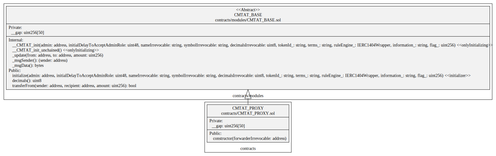
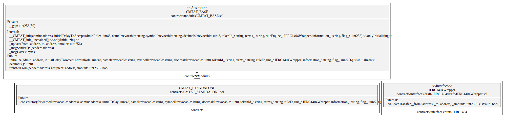

# Architecture

This documents presents an overview of the CMTAT architecture.

## Introduction

There are three mains contracts for deployment:

| Model                       | Contract                                                 |
| --------------------------- | -------------------------------------------------------- |
| Standalone                  | [CMTAT_STANDALONE](../../contracts/CMTAT_STANDALONE.sol) |
| Transparent or Beacon Proxy | [CMTAT_PROXY](../../contracts/CMTAT_PROXY.sol)           |
| UUPS Proxy                  | [CMTAT_PROXY_UUPS](../../contracts/CMTAT_PROXY_UUPS.sol) |

These contracts inherit from the same base contract [CMTAT_BASE.sol](../contracts/modules/CMTAT_BASE.sol), which inherits of the different modules.

The main schema describing the architecture can be found here: [architecture.pdf](../schema/drawio/architecture.pdf) 

## Schema

This section presents the different schema:

### Inheritance

#### Base

#### Proxy

#### Standalone

#### UUPS Proxy

### UML

See [CMTAT_BASE.svg](../schema/sol2uml/CMTAT_BASE.svg).

#### CMTAT_PROXY

#### CMTAT_STANDALONE

### Graph

#### Base

#### Proxy

#### Standalone

