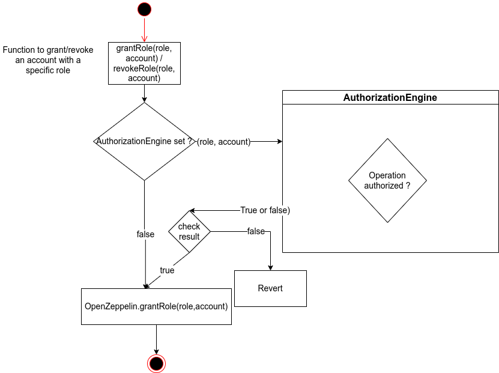

# Engine

It is possible to add supplementary controls on the CMTAT through four Engines: 

- The `RuleEngine`
- The `AuthorizationEngine`
- The DocumentEngine
- The DebtEngine

## RuleEngine

The **RuleEngine** is an external contract used to apply transfer restriction to the CMTAT. This contract is **optional** and its address can be left to zero.

This contract acts as a controller and can call different contract rule to apply rule on each transfer.

A possible rule is a whitelist rule where only the address inside the whitelist can perform a transfer.

### Example

In this example, the token holder calls the function `transfer` which triggers a call to the `RuleEngine` and the different rules associated.


### Implementation

A **ruleEngine** contract has to implement the interface `IRuleEngine`, which inherits from the `IERC1404Wrapper`. These two interfaces defines mainly two functions.

- `operateOnTransfer`

```solidity
function operateOnTransfer(address _from,address _to, uint256 _amount) 
external returns (bool);
```

- `validateTransfer`

```solidity
function validateTransfer(address _from,address _to,uint256 _amount) 
external returns (bool);
```

**Warning**

The `RuleEngine` has to restrict the access of the function `operateOnTransfer` to only the `CMTAT contract`. 

### Schema


## AuthorizationEngine

The `authorizationEngine` allows the possibility to add supplementary checks on AccessControl with an optional `AuthorizationEngine`, similar to the RuleEngine.
Main advantages :

- Allow CMTAT user to add their own check on access control, typically the transfer of adminship, e.g. if this operations requires a multi signature or the authorization of guardians.
- Reduce the contract code size because theses supplementary checks are made in an external contract, which is good since the size of a contract is limited.

- The` AccessControlDefaultAdminRules` introduces in CMTAT 2.3.1, has been removed because it has a large code size and introduces several restriction, good for security but can be too restrictive. With the `AuthorizationEngine`, it is possible to implement theses restrictions.

### Implementation

An **AuthorizationEngine** contract has to implement the interface `IAuthorizationEngine`. This interface defines mainly twos functions, one to grant a Role and the other one to revole a role.

```solidity
    /**
     * @dev Returns true if the operation is authorized, and false otherwise.
     */
    function operateOnGrantRole(
        bytes32 role, address account
    ) external returns (bool isValid);

        /**
     * @dev Returns true if the operation is authorized, and false otherwise.
     */
    function operateOnRevokeRole(
        bytes32 role, address account
    ) external returns (bool isValid);
   
```

### Schema





### Warning

- Once an `autorizationEngine` is set, it  is not possible to update the address of the `AuthorizationEngine`. The goal is to protect against a change by the super-admin, e.g. the possibility to remove the `AuthorizationEngine`, to bypass the different restrictions.

- With a deployment of proxy, the owner of the proxy contract can deactivate these controls by upgrading to a new implementation. To avoid this, the proxy owner should be different of the CMTAT super admin in case you want to use an `AuthorizationEngine`.
- The `AuthorizationEngine` has to restrict the access of the function `operateOnAuthorization` to only the `CMTAT contract`. 