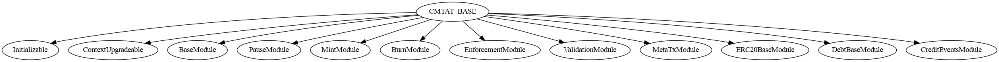
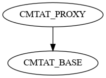
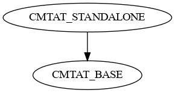
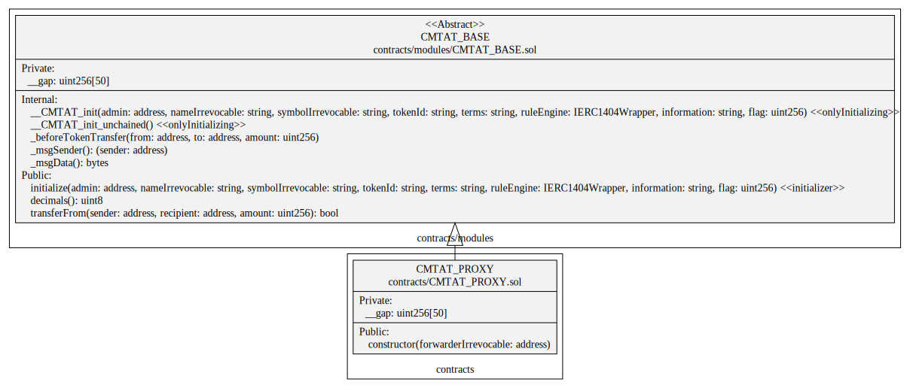
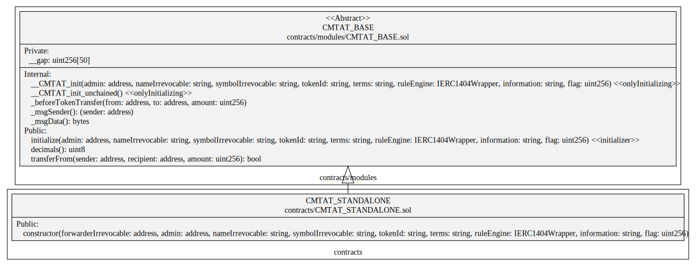
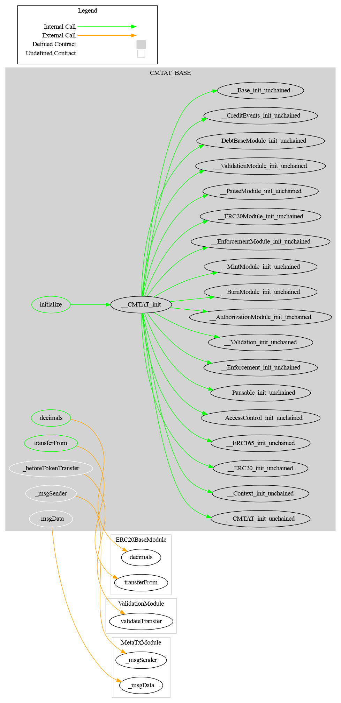
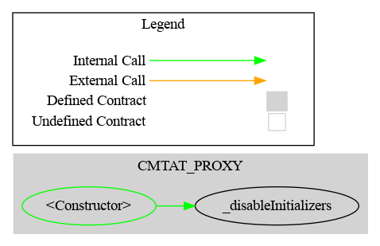
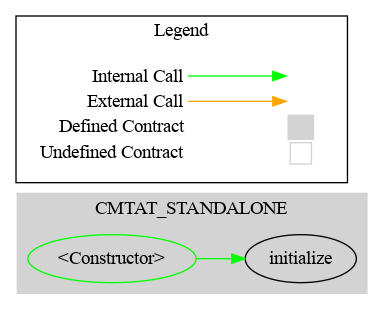

Architectreu

[TOC]

## Schema

### Inheritance

#### Base

#### Proxy

#### Standalone

### UML

See 

[CMTAT_BASE.svg](./schema/sol2uml/CMTAT_BASE.svg)

#### CMTAT_PROXY

#### CMTAT_STANDALONE

### Graph

#### Base

#### Proxy

#### Standalone

