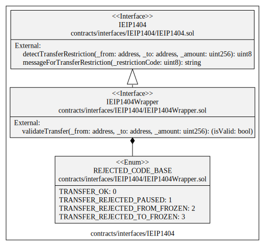

# IEIP1404

[TOC]

## Introduction

The transfer of token from an address to another address is restricted by using the EIP-1404, *Simple Restricted Token Standard* 
See [ethereum/EIPs/issues/1404](https://github.com/ethereum/EIPs/issues/1404), [erc1404.org/](https://erc1404.org/).

In the interface IEIP1404Wrapper, we have added one function to the standard : `isTransferValid`

To apply transfer restriction, you need to deploy a CMTAT containing the module `ValidationModule`, as well as a contract implementing the interface *IEIP1404Wrapper*, which we usually call a *RuleEngine*.

You will find an example of this kind of architecture in 

## UML
The following UML describes the different interfaces and their function.

## Sūrya's Description Report

### IEIP1404

### Legend

| Symbol | Meaning                   |
| :----: | ------------------------- |
|   🛑    | Function can modify state |
|   💵    | Function is payable       |

#### Files Description Table

| File Name                          | SHA-1 Hash                               |
| ---------------------------------- | ---------------------------------------- |
| ./interfaces/IEIP1404/IEIP1404.sol | 61b9ba3ee5e6c8ffbb95a590419fb21df9d93a95 |

#### Contracts Description Table

|   Contract   |             Type              |     Bases      |                |               |
| :----------: | :---------------------------: | :------------: | :------------: | :-----------: |
|      └       |       **Function Name**       | **Visibility** | **Mutability** | **Modifiers** |
|              |                               |                |                |               |
| **IEIP1404** |           Interface           |                |                |               |
|      └       |   detectTransferRestriction   |   External ❗️   |                |      NO❗️      |
|      └       | messageForTransferRestriction |   External ❗️   |                |      NO❗️      |

### IEIP1404Wrapper

#### Files Description Table

| File Name                                 | SHA-1 Hash                               |
| ----------------------------------------- | ---------------------------------------- |
| ./interfaces/IEIP1404/IEIP1404Wrapper.sol | e3658a9af344df6e49f304c90b7315422b77357d |

#### Contracts Description Table

|      Contract       |       Type        |     Bases      |                |               |
| :-----------------: | :---------------: | :------------: | :------------: | :-----------: |
|          └          | **Function Name** | **Visibility** | **Mutability** | **Modifiers** |
|                     |                   |                |                |               |
| **IEIP1404Wrapper** |     Interface     |    IEIP1404    |                |               |
|          └          | validateTransfer  |   External ❗️   |                |      NO❗️      |

