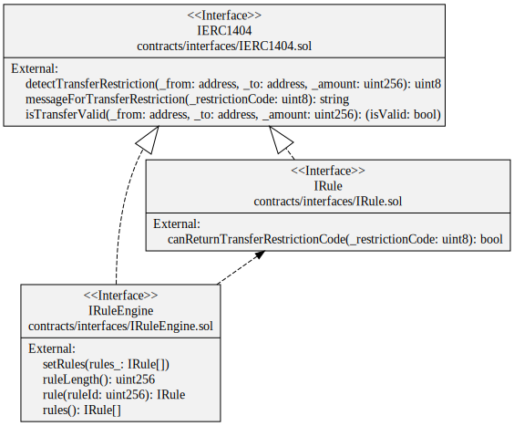

# Specification

## Introduction
The transfer of token from an address to another address is restricted by using the ERC-1404, *Simple Restricted Token Standard* 
See [ethereum/EIPs/issues/1404](https://github.com/ethereum/EIPs/issues/1404), [erc1404.org/](https://erc1404.org/).
We have added one function to the standard : `isTransferValid`
- The interface `RuleEngine` is the main contract, it manages the different rules to apply to a transfer.
- The interface `IRule` defines the standard form of a rule.

## Requirement
**Mint**
If you set a ruleEngine, be aware of the mint functionality. A mint is a transfer **from** the 0 address, it comes from the library OpenZeppelin used by the CMTAT. Therefore, if you implement a whitelist system, you have to add the zero address in the whitelist to mint token.
It is not planned to change this behavior in the CMTAT because it requires to change the structure of the code and it will reduce the possibilities of the RuleEngine. 

**Burn**
The same principle applies as for the function mint. A  burn is a transfer **to** the 0 address.

## UML
The following UML describes the different interfaces and their function.

