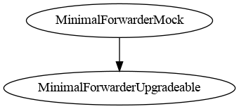
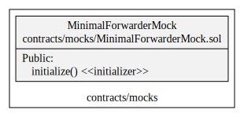
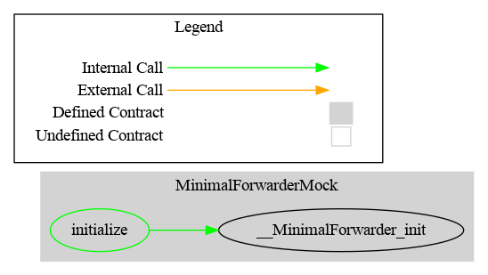

# MinimalForwarderMock

It is a simple minimal forwarder to be used together with an ERC2771 compatible contract. It is used for testing, do not use it in production and inherits from the contract mock of OpenZeppelin *MinimalForwarderUpgradeable*.

## Schema

### Inheritance

### UML

### Graph

## Sūrya's Description Report

### Files Description Table

| File Name                        | SHA-1 Hash                               |
| -------------------------------- | ---------------------------------------- |
| ./mocks/MinimalForwarderMock.sol | a73611acc4b24d163d3c88f971d619479d60afb1 |

### Contracts Description Table

|         Contract         |       Type        |            Bases            |                |               |
| :----------------------: | :---------------: | :-------------------------: | :------------: | :-----------: |
|            └             | **Function Name** |       **Visibility**        | **Mutability** | **Modifiers** |
|                          |                   |                             |                |               |
| **MinimalForwarderMock** |  Implementation   | MinimalForwarderUpgradeable |                |               |
|            └             |    initialize     |          Public ❗️           |       🛑        |  initializer  |

### Legend

| Symbol | Meaning                   |
| :----: | ------------------------- |
|   🛑    | Function can modify state |
|   💵    | Function is payable       |
