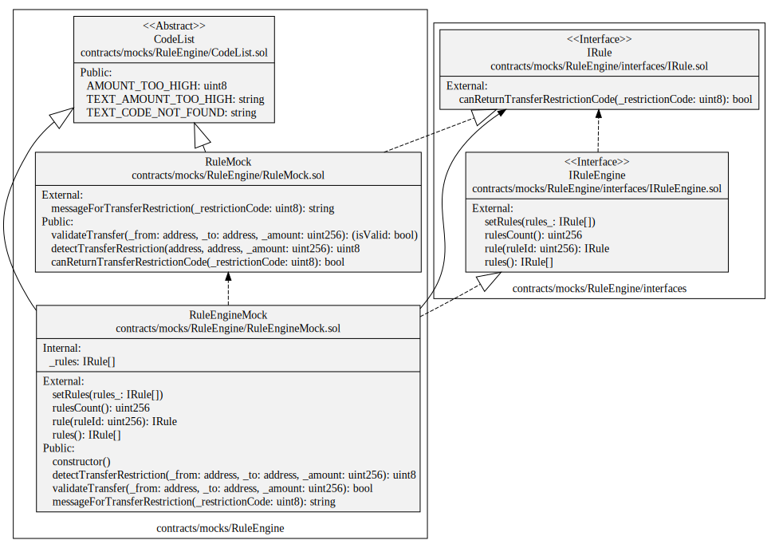
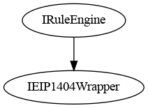
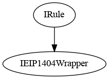
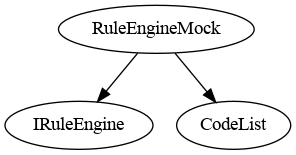
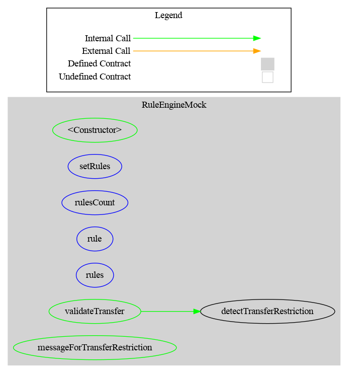
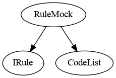
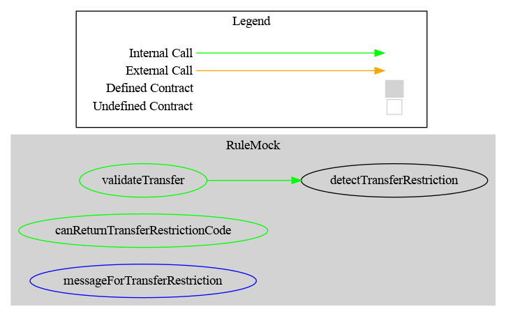

# Specification

[TOC]

## Introduction

The different mocks are used for testing and to provide a minimal example.

In the mock directory, you will find an example of such a contract with the contract RuleEngine.

 This contract is the main contract, it manages the different rules to apply to a transfer.

## Requirement

**Mint**
If you set a ruleEngine, be aware of the mint functionality. A mint is a transfer **from** the 0 address, it comes from the library OpenZeppelin used by the CMTAT. Therefore, if you implement a whitelist system, you have to add the zero address in the whitelist to mint token.
It is not planned to change this behavior in the CMTAT because it requires to change the structure of the code and it will reduce the possibilities of the RuleEngine. 

**Burn**
The same principle applies as for the function mint. A  burn is a transfer **to** the 0 address.

## Architecture

### UML

The following UML describes the different contracts and their functions.



### Components

#### Interface

- The interface `IRuleEngine` defines an example of interface for a RuleEngine



- The interface `IRule` defines the standard form of a rule.



#### Implementation contract

##### RuleEngineMock

###### Description

It is a simple minimal RuleEngine to be used together with a CMTAT contract. It is used for testing. The goal is to keep this RuleEngine very minimal.

One of the limitation of this mock is pointed by the CVF-68 (see [audit report](https://github.com/CMTA/CMTAT/blob/master/doc/audits/ABDK-CMTAT-audit-20210910.pdf)) for the function setRules.

> Setting all rules at once effectively limits the maximum number of rules, as size of a transaction is limited by block gas limit

For a RuleEngine with more functionalities, you can watch the project [CMTA/RuleEngine](https://github.com/CMTA/RuleEngine). Nevertheless, it will cost more gas to deploy this version.

###### Inheritance



###### Graph




##### RuleMock

###### Description

It is a simple minimal Rule to be used together with a RuleEngine contract. 

This rule defines a maximum limit of tokens to transfer in one time. 

```
AMOUNT_TOO_HIGH = 10
```

For a rule with more functionalities, you can watch the project [CMTA/RuleEngine](https://github.com/CMTA/RuleEngine). 

###### Inheritance



###### Graph



