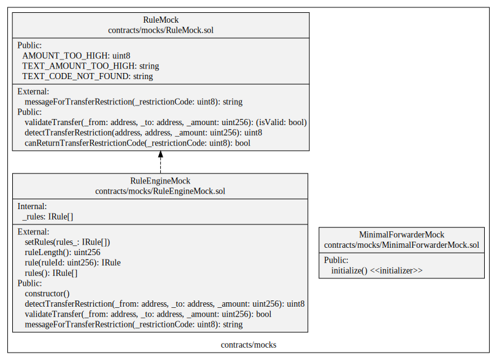

# Specification

## Introduction

The different mocks are used for testing and to provide a minimal example.

## Mock

### MinimalForwarderMock

It is a simple minimal forwarder to be used together with an ERC2771 compatible contract. It is used for testing, do not use it in production and inherits from the contract mock of OpenZeppelin *MinimalForwarderUpgradeable*.

### RuleEngineMock

It is a simple minimal RuleEngine to be used together with a CMTAT contract. It is used for testing. The goal is to keep this RuleEngine very minimal.

One of the limitation of this mock is pointed by the CVF-68 (see [audit report](https://github.com/CMTA/CMTAT/blob/master/doc/audits/ABDK-CMTAT-audit-20210910.pdf)) for the function setRules.

> Setting all rules at once effectively limits the maximum number of rules, as size of a transaction is limited by block gas limit

For a RuleEngine with more functionalities, you can watch the project [CMTA/RuleEngine](https://github.com/CMTA/RuleEngine). Nevertheless, it will cost more gas to deploy this version.

### RuleMock

It is a simple minimal Rule to be used together with a RuleEngine contract. 

This rule defines a maximum limit of tokens to transfer in one time. 

```
AMOUNT_TOO_HIGH = 10
```

For a rule with more functionalities, you can watch the project [CMTA/RuleEngine](https://github.com/CMTA/RuleEngine). 

## UML
The following UML describes the different mocks and their functions.


