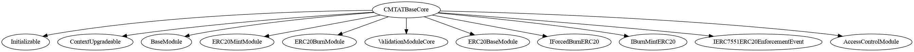

# CMTAT Base Core

This document defines the CMTAT Base Core Module for the CMTA Token specification.

[TOC]

## Schema


### Inheritance




### Graph


## API for Ethereum

This section describes the Ethereum API of Burn Module.

### Functions

#### `forcedBurn(address,uint256,bytes)`

Destroys a `value` amount of tokens from `account`, by transferring it to address(0).

```solidity
function forcedBurn(
        address account,
        uint256 value,
        bytes memory data
    ) public virtual override(IForcedBurnERC20) onlyRole(DEFAULT_ADMIN_ROLE) 
```

##### Requirements

Only authorized users (*DEFAULT_ADMIN_ROLE*) are allowed to call this function.

##### Events

###### `Enforcement (address,address, uint256, bytes)`

```solidity
event Enforcement (address indexed enforcer, address indexed account, uint256 amount, bytes data);
```

Emitted when the specified `value` amount of tokens owned by `owner`are destroyed with the given `data`

​    
