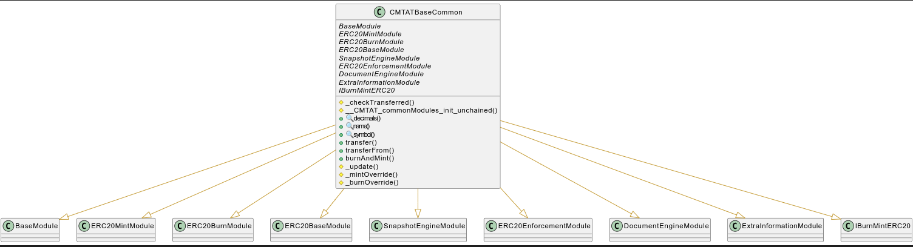
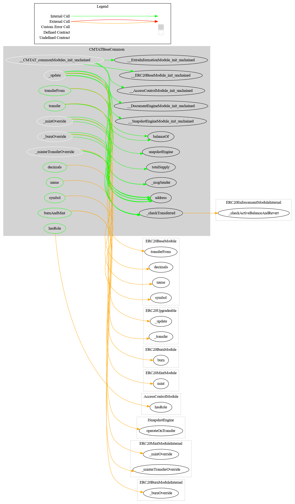

# CMTAT Base Common

This document defines the CMTAT Base Common Module for the CMTA Token specification.

[TOC]

## Schema



### Inheritance


### Graph



## API for Ethereum

This section describes the Ethereum API of CMTAT Base Common Module.

###  IBurnMintERC20

#### burnAndMint(address from, address to, uint256 amountToBurn, uint256 amountToMint, bytes data) public override

Burns tokens from one account and mints new tokens to another account atomically.

```solidity
function burnAndMint(address from, address to, uint256 amountToBurn, uint256 amountToMint, bytes calldata data) 
public virtual override(IBurnMintERC20)
```

**Details:**

- Ensures both burn and mint happen in a single transaction (all-or-nothing).
- Access control is enforced by the underlying `burn` (from **ERC20BurnModule**) and `mint` (from **ERC20MintModule**) functions.
- Input validation is also handled within those modules.
- It is possible to mint **more tokens than are burned**.

**Access Control:**

- See {burn} and {mint} for specific access restrictions.

**Input Parameters:**

| Name         | Type    | Description                                             |
| ------------ | ------- | ------------------------------------------------------- |
| from         | address | The current token holder whose tokens will be burned.   |
| to           | address | The recipient who will receive the newly minted tokens. |
| amountToBurn | uint256 | The number of tokens to burn from `from`.               |
| amountToMint | uint256 | The number of tokens to mint to `to`.                   |
| data         | bytes   | Additional calldata for extensibility or hooks.         |
