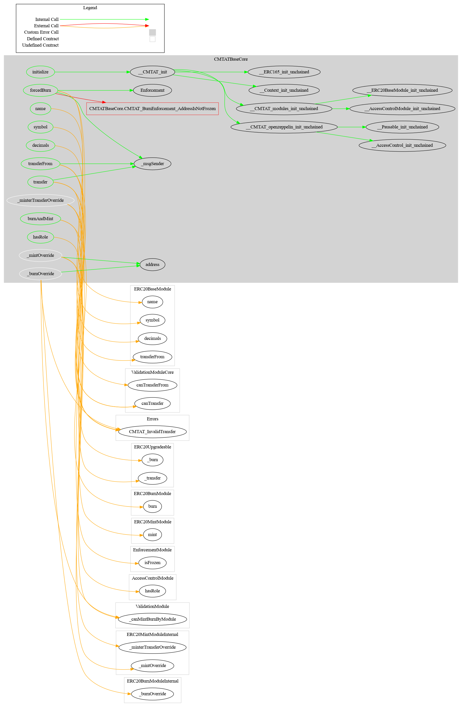

# CMTAT Base Core

This document defines the CMTAT Base Core Module for the CMTA Token specification.

[TOC]

## Schema


### Inheritance


### Graph



## API for Ethereum

This section describes the Ethereum API of Burn Module.

### IForcedBurnERC20

#### forcedBurn(address,uint256,bytes)

```solidity
function forcedBurn(address account,uint256 value,bytes memory data) 
public virtual override(IForcedBurnERC20) 
onlyERC20ForcedBurnManager
```

Allows an authorized issuer to burn tokens from a frozen account.

| Parameter | Type    | Description                             |
| --------- | ------- | --------------------------------------- |
| `account` | address | The frozen account to burn tokens from. |
| `value`   | uint256 | Number of tokens to burn.               |
| `data`    | bytes   | Metadata related to the burn action.    |

##### Requirements

Only authorized users (*DEFAULT_ADMIN_ROLE*) are allowed to call this function.

**Returns:** None

##### Events

###### `Enforcement (address,address, uint256, bytes)`

```solidity
event Enforcement (address indexed enforcer, address indexed account, uint256 amount, bytes data);
```

Emitted when the specified `value` amount of tokens owned by `owner`are destroyed with the given `data`

​    

### burnAndMint(address from, address to, uint256 amountToBurn, uint256 amountToMint, bytes data) public override

Burns tokens from one account and mints new tokens to another account atomically.

**Details:**

- Ensures both burn and mint happen in a single transaction (all-or-nothing).
- Access control is enforced by the underlying `burn` (from **ERC20BurnModule**) and `mint` (from **ERC20MintModule**) functions.
- Input validation is also handled within those modules.
- It is possible to mint **more tokens than are burned**.

**Access Control:**

- See {burn} and {mint} for specific access restrictions.

**Input Parameters:**

| Name         | Type    | Description                                             |
| ------------ | ------- | ------------------------------------------------------- |
| from         | address | The current token holder whose tokens will be burned.   |
| to           | address | The recipient who will receive the newly minted tokens. |
| amountToBurn | uint256 | The number of tokens to burn from `from`.               |
| amountToMint | uint256 | The number of tokens to mint to `to`.                   |
| data         | bytes   | Additional calldata for extensibility or hooks.         |
