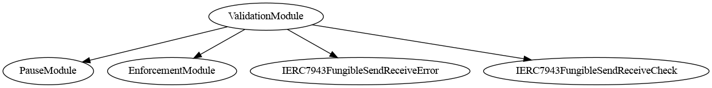
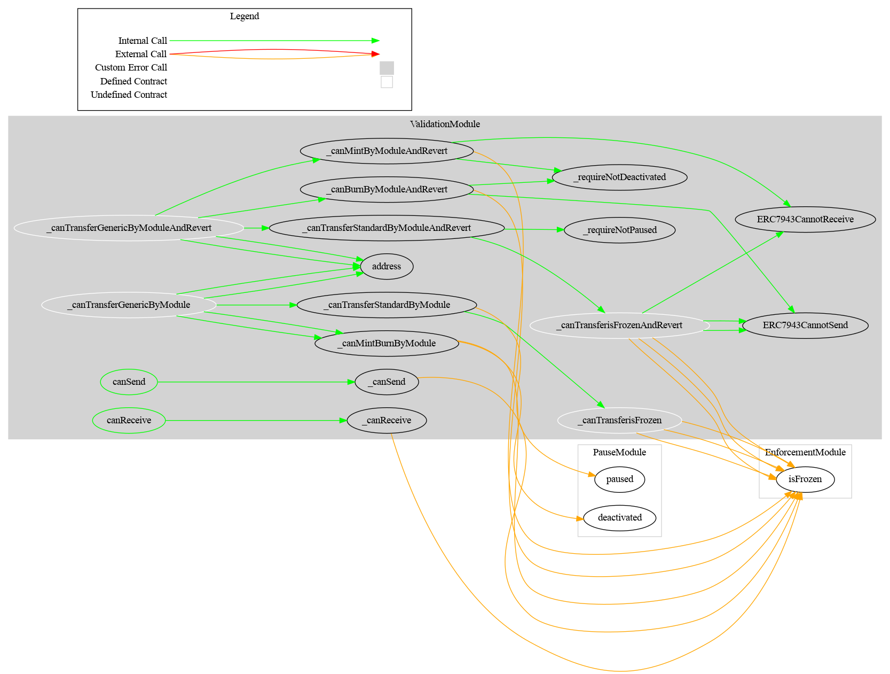

# Validation Module

This document defines the Validation Module for the CMTA Token specification. The goal of the Validation Module is to restrict token transferability based on a set of rules applied to the token.

[TOC]

## Rationale

> Issuers may decide to implement legal restrictions to the transfer of the tokenized instruments, to limit the scope of persons or entities who may hold the relevant instruments. 

## Schema


### Inheritance



### Graph




## Architecture

`ValidationModule` is the base transfer-check coordinator. It is extended by:

- `ValidationModuleCore` — adds `canTransfer` and `canTransferFrom` (used by all standard deployment variants)
- `ValidationModuleRuleEngine` — chains an external `RuleEngine` into the transfer path
- `ValidationModuleAllowlist` — overrides `_canSend` / `_canReceive` with allowlist membership checks (used by the Allowlist deployment variant)
- `ValidationModuleAllowance` — enforces pause and freeze checks on `approve` / `permit` (used by the Permit deployment variant)

## Check Composition

A transfer is permitted only when all of the following pass:

1. **Not paused** — `PauseModule.paused()` must be false (standard transfers) or not deactivated (mint/burn).
2. **Not frozen** — `spender`, `from`, and `to` must each pass `EnforcementModule.isFrozen`.
3. **Not RuleEngine-blocked** — if a `RuleEngine` is set, its `transferred(...)` hook must not revert (and the read-only `canTransfer` / `canTransferFrom` return true).
4. **Allowlist (Allowlist variant only)** — if allowlist is enabled, `from`, `to`, and `spender` must each be allowlisted.

Mint and burn paths skip the spender freeze check and instead check whether the recipient (`mint`) or source (`burn`) address is frozen and whether the contract is deactivated.

## API for Ethereum

### `ValidationModule`

#### `canSend(address) → bool`

```solidity
function canSend(address account) public view virtual returns (bool allowed)
```

Returns `true` if `account` is currently permitted to send tokens (i.e., act as a sender, spender, or burn source). Base implementation returns `!isFrozen(account)`. Overridden by `ValidationModuleAllowlist` to also require allowlist membership when the allowlist is enabled.

Implements `IERC7943FungibleSendReceiveCheck`.

| Parameter | Type    | Description            |
|-----------|---------|------------------------|
| `account` | address | Address to check.      |

---

#### `canReceive(address) → bool`

```solidity
function canReceive(address account) public view virtual returns (bool allowed)
```

Returns `true` if `account` is currently permitted to receive tokens (i.e., act as a recipient or mint target). Base implementation returns `!isFrozen(account)`. Overridden by `ValidationModuleAllowlist` to also require allowlist membership when the allowlist is enabled.

Implements `IERC7943FungibleSendReceiveCheck`.

| Parameter | Type    | Description            |
|-----------|---------|------------------------|
| `account` | address | Address to check.      |

---

### `ValidationModuleCore`

#### `canTransfer(address, address, uint256) → bool`

```solidity
function canTransfer(address from, address to, uint256 value) public view virtual returns (bool)
```

Full pre-check for a direct transfer (`msg.sender == from`). Returns `false` if the contract is paused, or if `from` or `to` is frozen (or not allowlisted when allowlist is enabled). If a `RuleEngine` is set it is also consulted.

Implements ERC-3643 `IERC3643ComplianceRead`.

| Parameter | Type    | Description                     |
|-----------|---------|---------------------------------|
| `from`    | address | Token sender.                   |
| `to`      | address | Token recipient.                |
| `value`   | uint256 | Amount (ignored in base check). |

---

#### `canTransferFrom(address, address, address, uint256) → bool`

```solidity
function canTransferFrom(address spender, address from, address to, uint256 value) public view virtual returns (bool)
```

Full pre-check for a delegated transfer (`spender != from`). Extends `canTransfer` by also checking that `spender` is not frozen (or blocked by allowlist/RuleEngine).

Implements ERC-7551 `IERC7551Compliance`.

| Parameter | Type    | Description                     |
|-----------|---------|---------------------------------|
| `spender` | address | Address executing the transfer. |
| `from`    | address | Token source.                   |
| `to`      | address | Token recipient.                |
| `value`   | uint256 | Amount (ignored in base check). |

---

### Runtime Path: `_canTransferGenericByModuleAndRevert`

```solidity
function _canTransferGenericByModuleAndRevert(address spender, address from, address to) internal view virtual
```

The internal entry point called on every token movement (`_update`). Routes to the appropriate check depending on whether the operation is a mint (`from == address(0)`), burn (`to == address(0)`), or standard transfer, then reverts with `ERC7943CannotSend` or `ERC7943CannotReceive` if the check fails.
