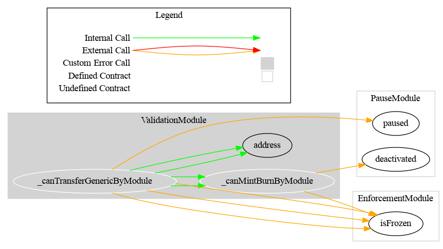

# Validation Module

This document defines the Validation Module for the CMTA Token specification. The goal of the Validation Module is to restrict token transferability based on a set of rules applied to the token.

[TOC]

## Rationale

> Issuers may decide to implement legal restrictions to the transfer of the tokenized instruments, to limit the scope of persons or entities who may hold the relevant instruments. 

## Schema

### Inheritance


### Graph




## API for Ethereum

This section describes the Ethereum API of the Validation Module.

The rules are defined using an (optional) rule engine, set using the `setRuleEngine` method. The `RuleEngine` implementation is not provided along with this implementation but it has to comply with the interface [IRuleEngine](https://github.com/CMTA/CMTAT/blob/master/contracts/interfaces/IRuleEngine.sol). The RuleEgine call rules that must respect the interface [IRule](https://github.com/CMTA/CMTAT/blob/master/contracts/interfaces/IRule.sol)

### Functions

#### `setRuleEngine(address)`

##### Definition:

```solidity
function setRuleEngine(IEIP1404Wrapper ruleEngine_) 
external onlyRole(DEFAULT_ADMIN_ROLE)
```

##### Description:

Set the optional rule engine to the given `address`.
Only authorized users are allowed to call this function.

### Events

#### `RuleEngine(address)`

##### Definition:

```solidity
event RuleEngine(IEIP1404Wrapper indexed newRuleEngine)
```

##### Description:

Emitted when the rule engine is set to `newRuleEngine`.
