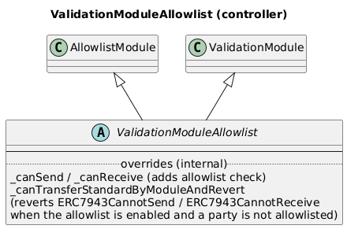
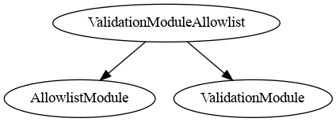
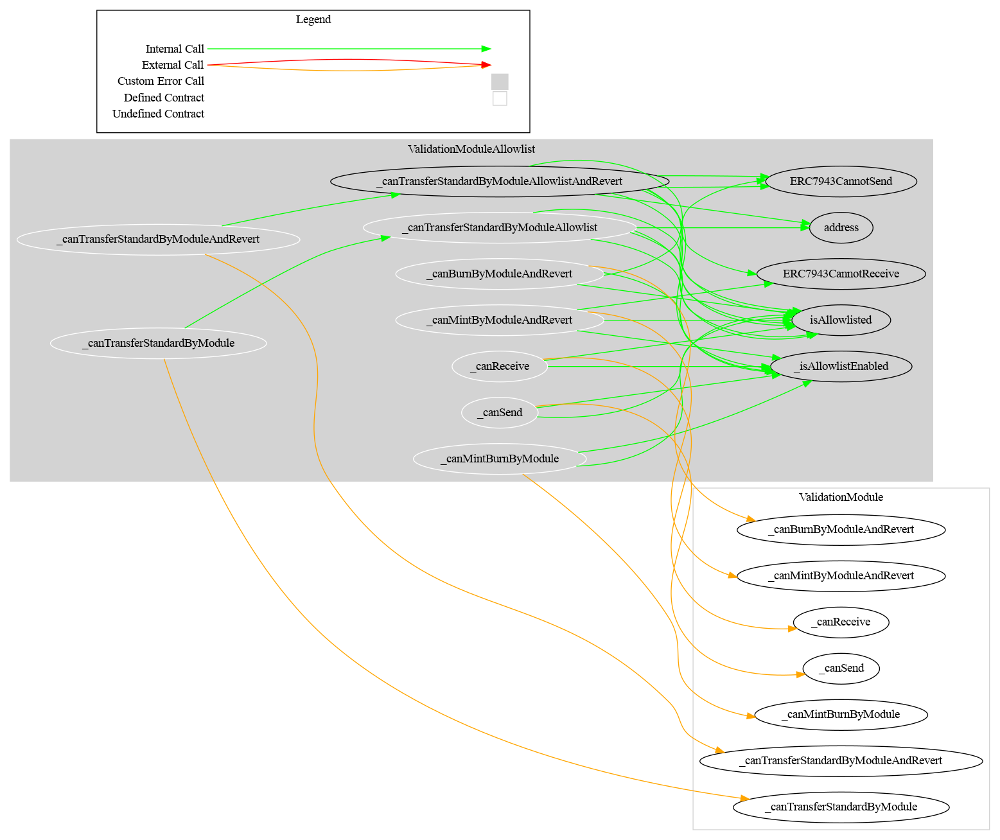

# Validation Allowlist Module

This document defines the Validation Allowlist Module for the CMTA Token specification. It restricts token transfers so that only addresses on an administrator-managed allowlist can send or receive tokens.

[TOC]

## Schema

### Inheritance

### Graph

## Architecture

Two contracts together provide the allowlist enforcement layer used in the Allowlist deployment variant:

| Contract | Role |
|---|---|
| `ValidationModuleAllowlist` | Overrides `_canSend` / `_canReceive` to add allowlist checks on top of the standard frozen-address checks for transfers, mint, and burn |
| `ValidationModuleAllowance` | Overrides the allowance authorization path (`approve` / `permit`) to require that both `owner` and `spender` pass `_canSend` |

Both extend `ValidationModule` / `ValidationModuleCore` and work alongside the existing pause and freeze checks — the allowlist check is an additional gate, not a replacement.

## Transfer Enforcement (`ValidationModuleAllowlist`)

### `_canSend(address account) → bool`

Returns `false` (blocking the operation) when **both** conditions hold:
1. The allowlist is enabled (`_isAllowlistEnabled()` returns true).
2. `account` is not in the allowlist (`!isAllowlisted(account)`).

When the allowlist is disabled, this falls through to the base `ValidationModule._canSend`, which returns `!isFrozen(account)`.

This check applies to senders, spenders, and burn sources.

### `_canReceive(address account) → bool`

Identical logic applied to the recipient side (mint targets and transfer recipients).

### Effect of `enableAllowlist(bool status)`

| `status` | `_canSend` / `_canReceive` behaviour |
|---|---|
| `true` | Allowlist membership required on top of the frozen-address check |
| `false` | Only the frozen-address check applies (allowlist is ignored) |

Disabling the allowlist does **not** clear the stored membership list — re-enabling it restores the previous state.

### Mint and Burn

Allowlist enforcement also applies to mint and burn paths:
- **Mint** — the recipient must pass `_canReceive` (reverts with `ERC7943CannotReceive` if not allowlisted when enabled).
- **Burn** — the token holder must pass `_canSend` (reverts with `ERC7943CannotSend` if not allowlisted when enabled).

Use `forcedTransfer` or `forcedBurn` to move tokens out of a non-allowlisted address when required.

## Allowance Authorization (`ValidationModuleAllowance`)

`ValidationModuleAllowance` guards `approve` and `permit` calls. Before an allowance is set, `_canAuthorizeAllowanceByModuleAndRevert` checks:

1. The contract must not be paused.
2. The `owner` must pass `_canSend` (not frozen; allowlisted if allowlist enabled).
3. The `spender` must pass `_canSend` (not frozen; allowlisted if allowlist enabled).

Note that the spender check here is a pre-authorization gate, not a transfer check. A spender that later becomes non-allowlisted or frozen will fail at the `transferFrom` call even if the allowance was set earlier.

This module is also used by the Permit deployment variant to enforce the same checks on `permit` signatures.

See also: [allowlist.md](../options/allowlist/allowlist.md) for the management API (`setAddressAllowlist`, `enableAllowlist`).
