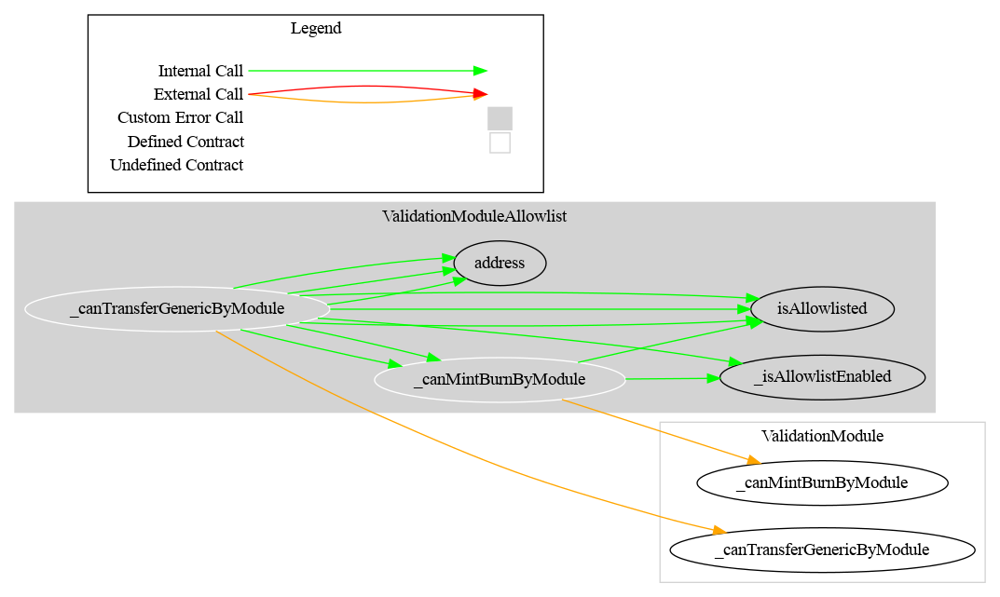

# Validation RuleEngine Module

This document defines the Validation RuleEngine Module for the CMTA Token specification. The goal of this module is to use an external contract (`RuleEngine`) to check the validity of a transfer.

[TOC]

## Schema

### Inheritance

### Graph

## API for Ethereum

> This section describes the Ethereum API of the Validation Module.

This module does not provide directly public functions.

< To do>
