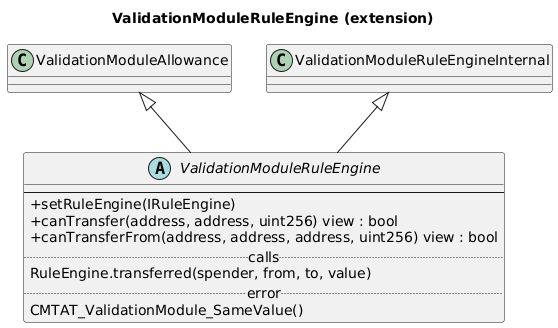
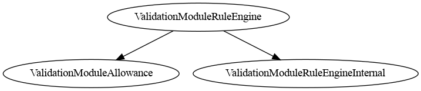
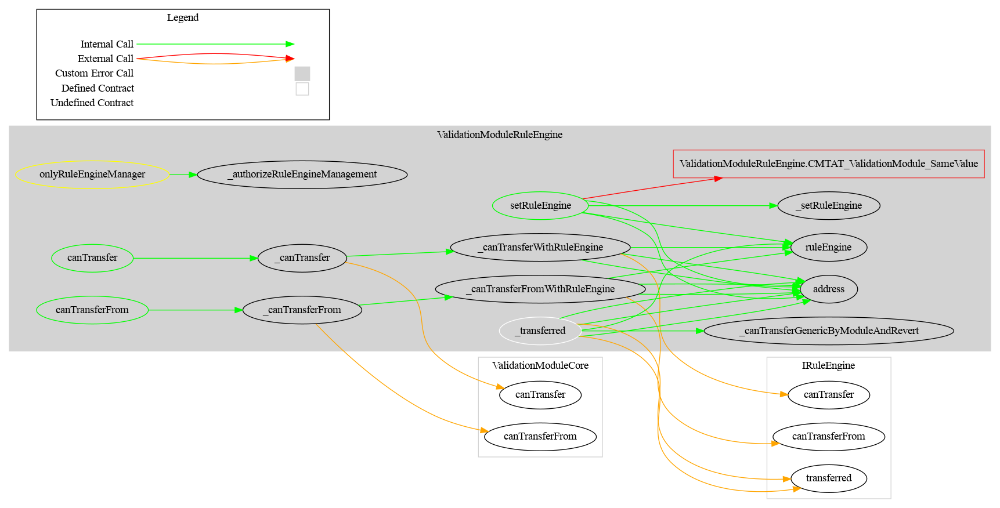

# Validation RuleEngine Module

This document defines the Validation RuleEngine Module for the CMTA Token specification. The goal of this module is to use an external contract (`RuleEngine`) to check the validity of a transfer.

[TOC]

## Schema

### Inheritance

### Graph

## API for Ethereum

This section describes the Ethereum API of the Validation Module.

The rules are defined using an (optional) rule engine, set using the `setRuleEngine` method. The `RuleEngine` implementation is not provided along with this implementation but it has to comply with the interface [IRuleEngine](https://github.com/CMTA/CMTAT/blob/master/contracts/interfaces/engine/IRuleEngine.sol). The RuleEngine calls rules that must respect the `IRule` interface defined in the [Rules](https://github.com/CMTA/Rules) repository

## Integration notes for RuleEngine implementers

### Zero-value calls to `transferred` are permissionless

The `transferred(...)` callback can be reached by **anyone**, for an **arbitrary `from`**, with `value == 0` and without any allowance.

Two ERC-20 properties combine to make this possible, and neither is a defect:

- ERC-20 requires that *"transfers of 0 values MUST be treated as normal transfers"*, so the token notifies the RuleEngine for them like any other transfer;
- OpenZeppelin's `_spendAllowance` consumes nothing when `value == 0`, so `transferFrom` succeeds with a zero allowance.

Concretely, any address can call `transferFrom(victim, anyone, 0)` on the token. The call passes the validation gates (the victim must not be frozen, the token must not be paused, ...), emits a zero-value `Transfer`, moves nothing, and still invokes `transferred(attacker, victim, anyone, 0)` on the configured RuleEngine. The 3-argument ERC-3643 overload is reachable the same way through `transfer(to, 0)`.

CMTAT deliberately does **not** suppress the notification for a zero value: doing so would make the compliance notifications inconsistent with the token's own ERC-20 transfer semantics, and a rule engine that needs to observe every transfer would silently miss a class of them.

**Requirement.** A RuleEngine — and every `IRule` it calls — **MUST treat `value == 0` as carrying no economic meaning**. Any stateful rule must be a no-op for a zero value, in particular:

| Rule kind | What a zero-value call must not do |
| --- | --- |
| Cooldown / holding period | Start, extend or reset a timer |
| Quota / volume cap | Consume budget or increment a counter |
| Tax or fee bucket | Accrue or settle anything |
| Holder tracking | Add, remove or reorder a holder |
| Sanction / freeze bookkeeping | Change a participant's status |

Otherwise an attacker can desynchronize policy state from actual balances, or keep a holder permanently restricted, at no cost beyond gas.

Implementations that cannot make a rule idempotent at zero should reject the call explicitly (`require(value > 0)` inside that rule) rather than let it mutate state — but note that reverting makes every zero-value transfer of the token revert too, which is not ERC-20 compliant. Preferring a no-op is strongly recommended.

> Reported as NM-6 by [Nethermind AuditAgent](https://auditagent.nethermind.io/) on CMTAT v3.3.0-rc2 and assessed as a RuleEngine-side responsibility; see the [maintainer feedback](../../security/tools/nethermind-audit-agent/v3.3.0-rc2/audit_agent_report_v3.3.0-rc2-feedback.md).

### `function setRuleEngine(IRuleEngine ruleEngine_)`

Updates the RuleEngine used to enforce validation rules.

| Parameter     | Type          | Description                            |
| ------------- | ------------- | -------------------------------------- |
| `ruleEngine_` | `IRuleEngine` | The new RuleEngine contract to be set. |

**Requirements:**

- Caller must have `DEFAULT_ADMIN_ROLE`.
- `ruleEngine_` must be different from the currently set RuleEngine.

**Emits:**

- [`RuleEngine(IRuleEngine newRuleEngine)`](#event-ruleengine)

**Reverts with:**

- [`CMTAT_ValidationModule_SameValue()`](#error-cmtat_validationmodule_samevalue)

------

### `function ruleEngine() → IRuleEngine`

Returns the address of the currently active RuleEngine.

| Returns       | Type          | Description                              |
| ------------- | ------------- | ---------------------------------------- |
| `ruleEngine_` | `IRuleEngine` | The current RuleEngine contract address. |

------

### `event RuleEngine(IRuleEngine newRuleEngine)`

Emitted when a new RuleEngine is set.

| Parameter       | Type          | Description                                     |
| --------------- | ------------- | ----------------------------------------------- |
| `newRuleEngine` | `IRuleEngine` | The address of the newly configured RuleEngine. |

------

### `error CMTAT_ValidationModule_SameValue()`

Reverts if the new RuleEngine being set is the same as the current one.

