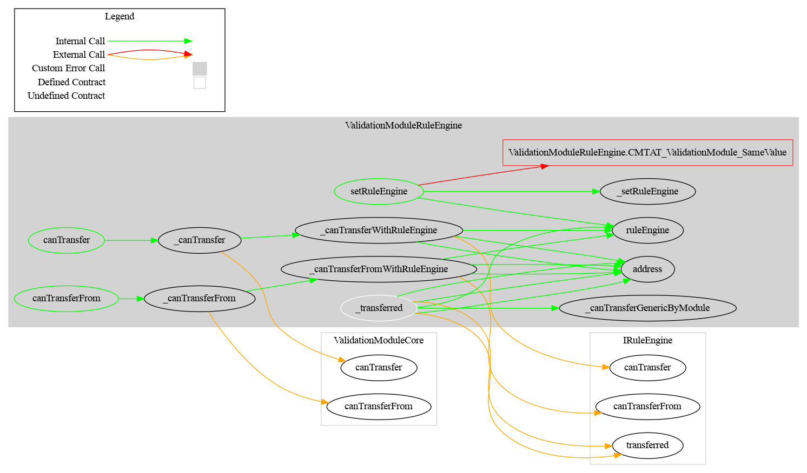

# Validation RuleEngine Module

This document defines the Validation RuleEngine Module for the CMTA Token specification. The goal of this module is to use an external contract (`RuleEngine`) to check the validity of a transfer.

[TOC]

## Schema

### Inheritance

### Graph

## API for Ethereum

This section describes the Ethereum API of the Validation Module.

The rules are defined using an (optional) rule engine, set using the `setRuleEngine` method. The `RuleEngine` implementation is not provided along with this implementation but it has to comply with the interface [IRuleEngine](https://github.com/CMTA/CMTAT/blob/master/contracts/interfaces/IRuleEngine.sol). The RuleEgine call rules that must respect the interface [IRule](https://github.com/CMTA/CMTAT/blob/master/contracts/interfaces/IRule.sol)

### `function setRuleEngine(IRuleEngine ruleEngine_)`

Updates the RuleEngine used to enforce validation rules.

| Parameter     | Type          | Description                            |
| ------------- | ------------- | -------------------------------------- |
| `ruleEngine_` | `IRuleEngine` | The new RuleEngine contract to be set. |

**Requirements:**

- Caller must have `DEFAULT_ADMIN_ROLE`.
- `ruleEngine_` must be different from the currently set RuleEngine.

**Emits:**

- [`RuleEngine(IRuleEngine newRuleEngine)`](#event-ruleengine)

**Reverts with:**

- [`CMTAT_ValidationModule_SameValue()`](#error-cmtat_validationmodule_samevalue)

------

### `function ruleEngine() → IRuleEngine`

Returns the address of the currently active RuleEngine.

| Returns       | Type          | Description                              |
| ------------- | ------------- | ---------------------------------------- |
| `ruleEngine_` | `IRuleEngine` | The current RuleEngine contract address. |

------

### `event RuleEngine(IRuleEngine newRuleEngine)`

Emitted when a new RuleEngine is set.

| Parameter       | Type          | Description                                     |
| --------------- | ------------- | ----------------------------------------------- |
| `newRuleEngine` | `IRuleEngine` | The address of the newly configured RuleEngine. |

------

### `error CMTAT_ValidationModule_SameValue()`

Reverts if the new RuleEngine being set is the same as the current one.

