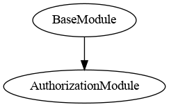
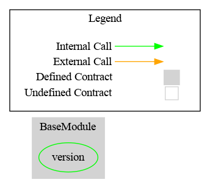

# Base Module

This document defines Base Module for the CMTA Token specification.

[TOC]

## Rationale

> The Base Module sets forth the basic functionalities a token must have to comply with the CMTAT framework, for tokens representing equity securities as well as tokens representing and debt securities. Here a quick list :
>
> - Terms of tokenization
> - Token ID (ISIN or other identifier) 
> - Others fields to allow the issuer to add additional information: information, flag

## Schema

### Inheritance



### Graph




## API for Ethereum

### Functions

#### `setTokenId(string)`

##### Definition:

```solidity
function setTokenId(string memory tokenId_) 
public
```

##### Description:

Set the `token id` to the given `string`.
Only authorized users are allowed to call this function.

#### `setTerms(string)`

##### Definition:

```solidity
function setTerms(string memory terms_) 
public onlyRole(DEFAULT_ADMIN_ROLE)
```

##### Description:

Set the `terms` to the given `string`.
Only authorized users are allowed to call this function.

#### `setInformation(string)`

##### Definition:

```solidity
function setInformation(string memory information_) 
public onlyRole(DEFAULT_ADMIN_ROLE) 
```

##### Description:

Set the information` to the given `uint256`.
Only authorized users are allowed to call this function.

### Files Description Table


| File Name                             | SHA-1 Hash                               |
| ------------------------------------- | ---------------------------------------- |
| ./modules/wrapper/core/BaseModule.sol | 88c3e7f8f49a491cc6432472783d33ac3127d536 |


### Contracts Description Table


|    Contract    |         Type          |        Bases        |                |                  |
| :------------: | :-------------------: | :-----------------: | :------------: | :--------------: |
|       └        |   **Function Name**   |   **Visibility**    | **Mutability** |  **Modifiers**   |
|                |                       |                     |                |                  |
| **BaseModule** |    Implementation     | AuthorizationModule |                |                  |
|       └        |      __Base_init      |     Internal 🔒      |       🛑        | onlyInitializing |
|       └        | __Base_init_unchained |     Internal 🔒      |       🛑        | onlyInitializing |
|       └        |      setTokenId       |      Public ❗️       |       🛑        |     onlyRole     |
|       └        |       setTerms        |      Public ❗️       |       🛑        |     onlyRole     |
|       └        |    setInformation     |      Public ❗️       |       🛑        |     onlyRole     |
|       └        |        setFlag        |      Public ❗️       |       🛑        |     onlyRole     |

### Events

#### `Term(string)`

##### Definition:

```solidity
event Term(string indexed newTermIndexed, string newTerm)
```

##### Description:

Emitted when the variable `terms` is set to `newTerm`.

#### `tokenId(string,string`

##### Definition:

```solidity
event TokenId(string indexed newTokenIdIndexed, string newTokenId)
```

##### Description:

Emitted when `tokenId` is set to `newTokenId`.

#### `Information(string,string)`

##### Definition:

```solidity
event Information(string indexed newInformationIndexed, string newInformation)
```

##### Description:

Emitted when the variable `information` is set to `newInformation`.
