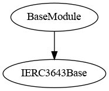
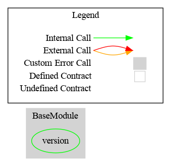

# Base Module

This document defines Base Module for the CMTA Token specification.

[TOC]

## Rationale

> The Base Module set the basic properties common to the different CMTAT tokens.
>
> Currently it only stores the contract version with the ERC-3643 function to retrieve it (`version`)
>

## Schema

### Inheritance



### Graph




## API for Ethereum

### Functions

#### `version`

##### Definition:

```solidity
function version() public view virtual override(IERC3643Base) returns (string memory)
```

##### Description:

Return the current contract version (ERC-3643)

