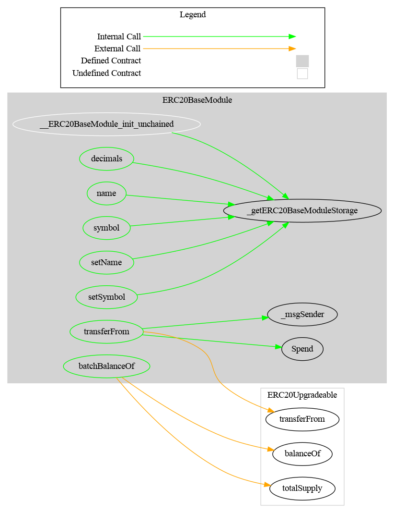

# ERC20Base Module

This document defines Base Module for the CMTA Token specification.

[TOC]


## Rationale

The ERC20Base Module sets forth the ERC20 basic functionalities a token must have to  be a fungible token circulating on a blockchain.

## Schema

### Inheritance


### Graph




## API for Ethereum

Base Module API for Ethereum blockchain extends the [ERC-20](https://github.com/ethereum/EIPs/blob/master/EIPS/eip-20.md) API, the standard fungible token API for Ethereum.

### Functions

#### OpenZeppelin

##### `totalSupply()`

Origin: OpenZeppelin (ERC20Upgradeable)

###### Definition

```solidity
function totalSupply() public view virtual 
returns (uint256)
```

###### Description

Return the total number of tokens currently in circulation.

##### `balanceOf(address)`

Origin: OpenZeppelin (ERC20Upgradeable)

###### Definition

```solidity
function balanceOf(address account) 
public view virtual 
returns (uint256)
```

###### Description

Return the number of tokens currently owned by the given `owner`.

##### `transfer(address,uint256)`

Origin: OpenZeppelin (ERC20Upgradeable)

###### Definition

```solidity
function transfer(address to, uint256 value) 
public virtual 
returns (bool)
```

###### Description

Transfer the given `amount` of tokens from the caller to the given `destination` address.
The function returns `true` on success and reverts on error.

###### Requirements

 * `to` cannot be the zero address.
 * the caller must have a balance of at least `value`.

##### `approve(address,uint256)`

Origin: OpenZeppelin (ERC20Upgradeable)

###### Definition

```solidity
function approve(address spender, uint256 value) 
public virtual 
returns (bool)
```

###### Description

Allow the given `spender` to transfer at most the given `amount` of tokens from the caller.
The function returns `true` on success and reverts of error.

###### Requirement

`spender` cannot be the zero address.

##### `allowance(address,address)`

Origin: OpenZeppelin (ERC20Upgradeable)

###### Definition

```solidity
function allowance(address owner, address spender) 
public view virtual 
returns (uint256)
```

###### Description

Return the number of tokens the given `spender` is currently allowed to transfer from the given `owner`.

#### CMTAT

##### `approve(address,uint256,uint256)`

###### Definition

```solidity
function approve(address spender,uint256 value,uint256 currentAllowance) 
public virtual 
returns (bool)
```

###### Description

Allows `spender` to withdraw from your account multiple times, up to the `value` amount
The function may be successfully executed only when the given `currentAllowance` values equals to the amount of token the spender is currently allowed to transfer from the caller.
The function returns `true` on success and reverts of error.

This function in not defined by ERC-20 and is needed to safely change the allowance.  Consider the following scenario:

1. Alice allows Bob to transfer 100 of her tokens
2. Alice wants to allow Bob to transfer 10 more of her tokens, i.e. 110 of her tokens in total
3. Alice calls `approve (bob, 110)`
4. Bob front runs the Alice's transaction with his own call: `transferFrom (alice, bob, 100)`
5. Bob's transaction transfers 100 tokens from Alice to Bob and reduces the allowance to zero
6. Then Alice's transaction is executed and sets the allowance to 110
7. No Bob executes `transferFrom (alice, bob, 110)` and takes another 110 tokens from Alice

So, Bob got 210 tokens in total, while Alice never means to allow him to transfer more than 110 tokens.

In order to mitigate this kind of attack, Alice at step 3 calls `approve (bob, 110, 100)`.  Such call could only succeed if the allowance is still 100, i.e. Bob's attempt to front run the transaction will make Alice's transaction to fail.

###### Requirement

- The given `currentAllowance` value has to be equal to the amount of token the spender is currently allowed to transfer from the caller.
-  `spender`and the sender cannot be the zero address (check made by `OpenZeppelin-_approve`).

##### `transferFrom(address,address,uint256)`

This function overrides the function `transferFrom`from OpenZeppelin

###### Definition

```solidity
function transferFrom(address from,address to,uint256 value) 
public virtual override 
returns (bool) 
```

###### Description

Transfers `value` amount of tokens from address `from` to address `to`

The function returns `true` on success, nothing if the parent function return false. The behavior of the parent function in case of an error is to revert rather than returned false.

###### Requirement

`from` and `to` cannot be the zero address.


#### `transferBatch(address[],uint256[])  `

##### Definition

```solidity
 function transferBatch(address[] calldata tos,uint256[] calldata values) 
 public 
 returns (bool) 
```

##### Description

For each address in `tos`, transfer the given `value` amount of tokens from the sender to the given address `to`.

##### Requirements

- `tos` and `values` must have the same length.

- The sender has to own the sum of tokens in `values`.

### Events

#### OpenZeppelin

##### `Transfer(address,address,uint256)`

Origin: OpenZeppelin (ERC20Upgradeable)

###### Definition

```solidity
event Transfer(address indexed from, address indexed to, uint256 value)
```

###### Description

Emitted when `value` tokens are moved from one account (`from`) to another (`to`).

Note that `value` may be zero.

##### `Approval(address,address,uint256)`

Origin: OpenZeppelin (ERC20Upgradeable)

###### Definition

```solidity
event Approval(address indexed owner, address indexed spender, uint256 value)
```

###### Description

Emitted when the allowance of a `spender` for an `owner` is set by a call to {approve}. `value` is the new allowance.

#### CMTAT

##### `Spend(address,address,uint256)`

###### Definition

```solidity
event Spend (address indexed owner, address indexed spender, uint256 value)
```

###### Description

Emitted when the specified `spender` spends the specified `value` tokens owned by the specified `owner` reducing the corresponding allowance.

This event is not defined by ERC-20 and is needed to track allowance changes.
