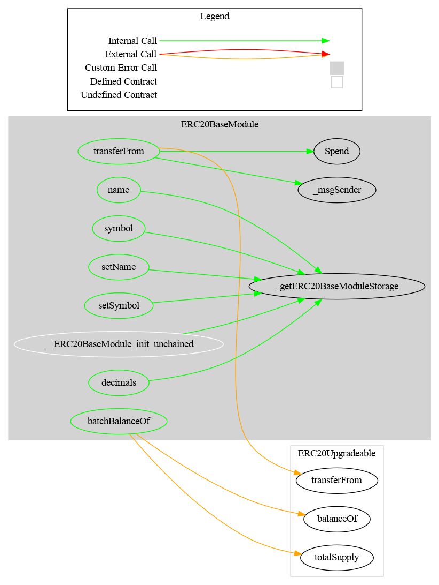

# ERC20Base Module

This document defines Base Module for the CMTA Token specification.

[TOC]


## Rationale

The ERC20Base Module sets forth the ERC20 basic functionalities a token must have to  be a fungible token circulating on a blockchain.

## Schema


### Inheritance


### Graph




## API for Ethereum

Base Module API for Ethereum blockchain extends the [ERC-20](https://github.com/ethereum/EIPs/blob/master/EIPS/eip-20.md) API, the standard fungible token API for Ethereum.

### Functions

#### `balanceInfo(address[])`

###### Definition

```solidity
function balanceInfo(address[] calldata addresses) 
public view virtual 
returns(uint256[] memory balances , uint256 totalSupply_)
```

###### Description

Return the number of tokens currently owned by the given `addresses` and the current `totalSupply`.

#### `transferFrom(address,address,uint256)`

This function overrides the function `transferFrom`from OpenZeppelin

###### Definition

```solidity
function transferFrom(address from,address to,uint256 value) 
public virtual override 
returns (bool) 
```

###### Description

Transfers `value` amount of tokens from address `from` to address `to`

The function returns `true` on success, nothing if the parent function return false. The behavior of the parent function in case of an error is to revert rather than returned false.

###### Requirement

`from` and `to` cannot be the zero address.

##### Events

###### `Spend(address,address,uint256)`

```solidity
event Spend (address indexed owner, address indexed spender, uint256 value)
```

Emitted when the specified `spender` spends the specified `value` tokens owned by the specified `owner` reducing the corresponding allowance.

This event is not defined by ERC-20 and is needed to track allowance changes.

#### setName(string)

 Sets the token name

```solidity
function setName(string calldata name_) 
public virtual override(IERC3643ERC20Base) 
onlyRole(DEFAULT_ADMIN_ROLE)
```


#### setSymbol(string)

 Sets the token symbol

```solidity
function setSymbol(string calldata symbol_) 
public virtual override(IERC3643ERC20Base) 
onlyRole(DEFAULT_ADMIN_ROLE)
```

