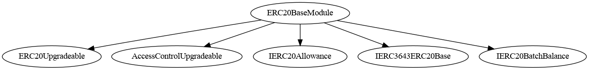

# ERC20Base Module

This document defines Base Module for the CMTA Token specification.

[TOC]


## Rationale

The ERC20Base Module sets forth the ERC20 basic functionalities a token must have to  be a fungible token circulating on a blockchain.

## Schema


### Inheritance




### Graph


## API for Ethereum

Base Module API for Ethereum blockchain extends the [ERC-20](https://github.com/ethereum/EIPs/blob/master/EIPS/eip-20.md) API, the standard fungible token API for Ethereum.


### `transferFrom(address,address,uint256)`

This function overrides the function `transferFrom`from OpenZeppelin

###### Definition

```solidity
function transferFrom(address from,address to,uint256 value) 
public virtual override 
returns (bool) 
```

###### Description

Transfers `value` amount of tokens from address `from` to address `to`

The function returns `true` on success, nothing if the parent function return false. The behavior of the parent function in case of an error is to revert rather than returned false.

###### Requirement

`from` and `to` cannot be the zero address.

##### Events

###### `Spend(address,address,uint256)`

```solidity
event Spend (address indexed owner, address indexed spender, uint256 value)
```

Emitted when the specified `spender` spends the specified `value` tokens owned by the specified `owner` reducing the corresponding allowance.

This event is not defined by ERC-20 and is needed to track allowance changes.

### IERC20Allowance

#### `Spend(address,address,uint256)`

```solidity
event Spend(address indexed account, address indexed spender, uint256 value);
```

| Name      | Type    | Description                                             |
| --------- | ------- | ------------------------------------------------------- |
| `account` | address | The owner of the tokens whose allowance is being spent. |
| `spender` | address | The address authorized to spend the tokens.             |
| `value`   | uint256 | The amount of tokens that were spent.                   |


> **Note:**
>  This event is similar in semantics to the ERC-20 `Approval` event:
>  `Approval(address indexed owner, address indexed spender, uint256 value)`.
>  It represents a reduction in the spender’s allowance and may also be emitted by functions that consume allowances, such as `burnFrom`.

### IERC20BatchBalance

#### `batchBalanceOf(address[])`

```solidity
function batchBalanceOf(address[] calldata addresses) external view returns (uint256[] memory balances, uint256 totalSupply_);
```

| Name           | Type      | Description                               |
| -------------- | --------- | ----------------------------------------- |
| `addresses`    | address[] | The list of addresses to query.           |
| **Returns**    |           |                                           |
| `balances`     | uint256[] | Token balances for each address provided. |
| `totalSupply_` | uint256   | The total supply of the token.            |


> **Usage Tip:**
>  Useful for on-chain snapshots or proportional distributions like dividends.

### `IERC3643ERC20Base`

#### Functions

------

#### `setName(string)`

```solidity
function setName(string calldata name_) external;
```

```solidity
function setName(string calldata name_) 
public virtual override(IERC3643ERC20Base) 
onlyERC20AttributeManager
```

Sets the name of the token.

| Name   | Type   | Description                          |
| ------ | ------ | ------------------------------------ |
| `name` | string | The new name to assign to the token. |


------

#### `setSymbol(string)`

```solidity
function setSymbol(string calldata symbol_) external;
```

```solidity
function setSymbol(string calldata symbol_) 
public virtual override(IERC3643ERC20Base) 
onlyERC20AttributeManager
```

Sets the symbol of the token.

| Name     | Type   | Description                            |
| -------- | ------ | -------------------------------------- |
| `symbol` | string | The new symbol to assign to the token. |


------

