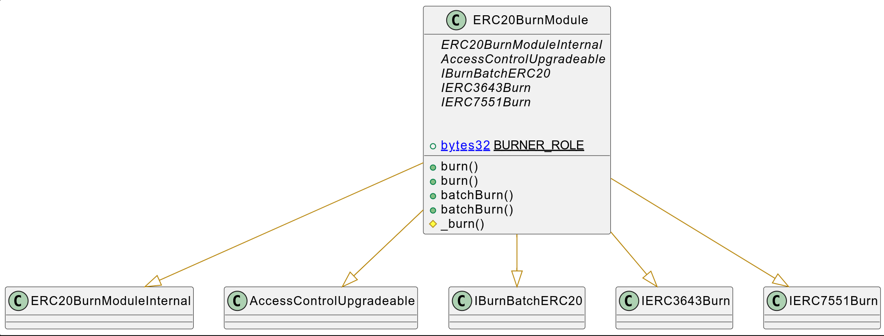
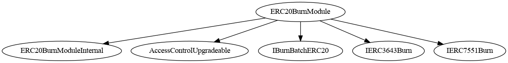
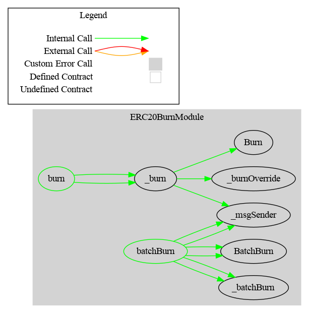

# ERC20Burn Module

This document defines the ERC20Burn Module for the CMTA Token specification.

[TOC]


## Rationale

> This function allows the issuer to destroy specific tokens that are recorded on a distributed ledger address. This function is meant to be used if the issuer cancels tokenized shares (e.g. if it reduces its share capital, if it has decided to have the shares in a different form (e.g. “simple” uncertificated securities within the meaning of Article 973c CO or paper certificates), or to comply with a court order requiring the cancellation of tokens pursuant to Article 973h CO).

## Schema



### Inheritance




### Graph



## API for Ethereum

This section describes the Ethereum API of Burn Module.

### ERC20BurnInternal

#### Errors

| Name                                              | Description                                                  |
| ------------------------------------------------- | ------------------------------------------------------------ |
| `CMTAT_BurnModule_EmptyAccounts()`                | Reverts when the `accounts` array provided for a batch burn operation is empty. |
| `CMTAT_BurnModule_AccountsValueslengthMismatch()` | Reverts when the `accounts` and `values` arrays for batch burning have mismatched lengths. Both arrays must contain the same number of elements. |

### IBurnBatchERC20

#### Event

##### BatchBurn(address,address[],bytes)

```solidity
event BatchBurn(address indexed burner,address[] accounts,uint256[] values,bytes data)
```

Emitted when tokens are burned from multiple accounts in a single batch operation.

| Parameter  | Type      | Description                                                |
| ---------- | --------- | ---------------------------------------------------------- |
| `burner`   | address   | The address that initiated the batch burn.                 |
| `accounts` | address[] | The list of addresses from which tokens were burned.       |
| `values`   | uint256[] | The respective amounts of tokens burned from each address. |
| `data`     | bytes     | Additional metadata associated with the batch burn.        |

#### Functions

##### BatchBurn(address[],uint256[],bytes)

```solidity
function batchBurn(address[] calldata accounts,uint256[] calldata values,bytes memory data) external
```

```solidity
function batchBurn(address[] calldata accounts,uint256[] calldata values,bytes memory data) 
public virtual override(IBurnERC20) onlyRole(BURNER_ROLE) 
```

Performs a batch burn operation from multiple accounts.

**Parameters**

| Parameter  | Type      | Description                                                  |
| ---------- | --------- | ------------------------------------------------------------ |
| `accounts` | address[] | Array of addresses to burn tokens from.                      |
| `values`   | uint256[] | Array of token amounts to burn from each corresponding account. |
| `data`     | bytes     | Common metadata for all burn operations in this batch.       |

**Returns:** None

**Requirements:**

- `accounts.length` must equal `values.length`.
- Caller must have the `BURNER_ROLE`.

**Emits:**

- Emits a`Transfer` event for each entry in the batch.
- Emits a `BatchBurn`event

### Interface: `IERC3643Burn`

> This interface defines functions and events for permanently removing tokens from circulation, either individually or in batch. It supports automatic unfreezing of frozen tokens if needed (when combined with an enforcement module).

------

#### Events

##### `Burn(address,address,uint256,bytes)`

```solidity
event Burn(address indexed burner, address indexed account, uint256 value, bytes data);
```

| Name      | Type    | Description                                 |
| --------- | ------- | ------------------------------------------- |
| `burner`  | address | The address that initiated the burn.        |
| `account` | address | The account from which tokens were burned.  |
| `value`   | uint256 | The number of tokens that were burned.      |
| `data`    | bytes   | Additional data attached to the burn event. |


------

#### Functions

##### `burn(address,uint256)`

```solidity
function burn(address account, uint256 value) external;
```

```solidity
function burn(address account,uint256 value) 
public virtual override(IERC3643Burn) 
onlyRole(BURNER_ROLE)
```

Burns a specific number of tokens from a single account by transferring them to the zero address.

| Parameter | Type    | Description                                   |
| --------- | ------- | --------------------------------------------- |
| `account` | address | The address from which tokens will be burned. |
| `value`   | uint256 | The number of tokens to burn.                 |

**Behavior:**

- Reduces the total supply of tokens.
- If frozen tokens are required to complete the burn, they are automatically unfrozen.

**Emits:** 

- Emits a `Transfer` event with the recipient set to `address(0)`.

- Emits a `TokensUnfrozen` event when applicable.

**Requirements:**

- The account must have a sufficient total balance (active + frozen).
- Only authorized users (*BURNER_ROLE*) are allowed to call this function.
- Reverts if the balance is insufficient.

------

##### `batchBurn(address[],uint256[])`

```solidity
function batchBurn(address[] calldata accounts, uint256[] calldata values) external;
```

```solidity
function batchBurn(address[] calldata accounts,uint256[] calldata values) 
public virtual override (IERC3643Burn) 
onlyRole(BURNER_ROLE)
```

Performs multiple `burn` operations in a single transaction.

| Parameter  | Type      | Description                                              |
| ---------- | --------- | -------------------------------------------------------- |
| `accounts` | address[] | List of addresses whose tokens are to be burned.         |
| `values`   | uint256[] | List of amounts to burn from each corresponding address. |

**Emits:** 

For each account:

- Emits a `Burn` event.
- Emits a `Transfer` event with the recipient set to `address(0)`.
- May emit `TokensUnfrozen` if frozen tokens are used.

**Requirements:**

- `accounts` and `values` must have the same length.
- Only authorized users (*BURNER_ROLE*) are allowed to call this function.
- May revert due to gas limitations if the array is too large.


### Interface: `IERC7551Burn`

#### Interface Description

> Defines the standard functions and events for burning ERC-20 tokens, either individually or in batch. Tokens burned are permanently removed from circulation.

------

#### Events

##### `Burn`

```solidity
event Burn(address indexed burner, address indexed account, uint256 value, bytes data);
```

| Name      | Type    | Description                                 |
| --------- | ------- | ------------------------------------------- |
| `burner`  | address | The address that initiated the burn.        |
| `account` | address | The account from which tokens were burned.  |
| `value`   | uint256 | The number of tokens that were burned.      |
| `data`    | bytes   | Additional data attached to the burn event. |


------

#### Functions

##### `burn`

```solidity
function burn(address account, uint256 amount, bytes calldata data) external;
```

```solidity
function burn(address account,uint256 value,bytes calldata data) 
public virtual override(IERC7551Burn) 
onlyRole(BURNER_ROLE)
```

Burns a specific amount of tokens from the given account by sending them to the zero address.

| Parameter | Type    | Description                                 |
| --------- | ------- | ------------------------------------------- |
| `account` | address | The address whose tokens will be burned.    |
| `amount`  | uint256 | The number of tokens to be burned.          |
| `data`    | bytes   | Optional metadata associated with the burn. |


**Returns**: `None`

**Notes**:

- Reverts if the account's balance is insufficient.
- Burn can occur even if transfers are paused.

**Emits:** 

- Emits a `Burn` event.
- Emits a `Transfer` event with recipient as `address(0)`.

------

##### `batchBurn`

```solidity
function batchBurn(address[] calldata accounts, uint256[] calldata values, bytes memory data) external;
```

```solidity
function batchBurn(address[] calldata accounts,uint256[] calldata values,bytes memory data) 
public virtual override(IERC7551Burn) 
onlyRole(BURNER_ROLE) 
```

Performs a batch burn operation from multiple accounts.

| Parameter  | Type      | Description                                                  |
| ---------- | --------- | ------------------------------------------------------------ |
| `accounts` | address[] | Array of addresses to burn tokens from.                      |
| `values`   | uint256[] | Array of token amounts to burn from each corresponding account. |
| `data`     | bytes     | Common metadata for all burn operations in this batch.       |


**Returns**: `None`

**Requirements**:

- `accounts.length` must equal `values.length`.
- Caller must have the `BURNER_ROLE`.

**Emits:** 

- Emits a `Burn` and `Transfer` event for each entry in the batch.
