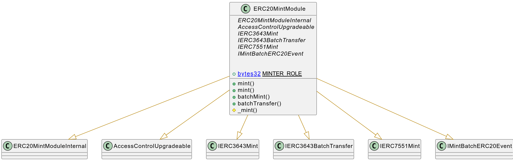

# ERC20Mint Module

This document defines ERC20Mint Module for the CMTA Token specification.

[TOC]


## Rationale

>  Traditional securities could be issued in different ways.  Bonds are usually issued all at once.  Normal shares could be issued several times, when the issuer wants to raise more capital.  ETF shares are continuously issued on demand.  The Mint Module covers scenarios for CMTA Token specification when the issuer needs to create new tokens in response to securities issuances.

## Schema



### Inheritance


### Graph


## API for Ethereum

This section describes the Ethereum API of Issue Module.

### ERC20MintModuleInternal

### Errors

| Name                                              | Description                                                  |
| ------------------------------------------------- | ------------------------------------------------------------ |
| `CMTAT_MintModule_EmptyAccounts()`                | Reverts when the `accounts` array provided for a batch mint operation is empty. |
| `CMTAT_MintModule_AccountsValueslengthMismatch()` | Reverts when the `accounts` and `values` arrays provided for batch minting have mismatched lengths. Both arrays must have the same number of elements. |
| `CMTAT_MintModule_EmptyTos()`                     | Reverts when the `tos` array provided for a batch transfer is empty. |
| `CMTAT_MintModule_TosValueslengthMismatch()`      | Reverts when the `tos` and `values` arrays provided for batch transfer have mismatched lengths. Both arrays must have the same number of elements. |

### IMintERC20

#### Event

##### `BatchMint(address,address[],uint256[])` 

```solidity
event BatchMint(address indexed minter,address[] accounts,uint256[] values)
```

This event is emitted when tokens are minted in batch, specifying the minter and the amounts minted to each account.

| Name       | Type      | Description                                              |
| ---------- | --------- | -------------------------------------------------------- |
| `minter`   | address   | The address that performed the batch mint action.        |
| `accounts` | address[] | List of recipient addresses receiving minted tokens.     |
| `values`   | uint256[] | Amount of tokens minted to each corresponding recipient. |

### IERC7551Mint

#### Event

##### `Mint(address,address,uint256,bytes)`

```solidity
event Mint(address indexed minter, address indexed account, uint256 value, bytes data);
```

Emitted when new tokens are minted and assigned to an account.

| Name    | Type    | Description                                                  |
| ------- | ------- | ------------------------------------------------------------ |
| minter  | address | The address that initiated the mint operation.               |
| account | address | The address receiving the newly minted tokens.               |
| value   | uint256 | The amount of tokens created.                                |
| data    | bytes   | Optional metadata related to the mint (e.g., reason, reference ID). |

#### Function

------

##### `mint(address,uint256,bytes)`

```solidity
function mint(address account, uint256 value, bytes calldata data) external;
```

```solidity
function mint(address account, uint256 value, bytes calldata data) 
public virtual override(IERC5679Mint) 
onlyMinter
```

Creates (`mints`) a specified amount of tokens and assigns them to an account.

| Name    | Type           | Description                                                  |
| ------- | -------------- | ------------------------------------------------------------ |
| account | address        | The address to receive the minted tokens. Must not be the zero address. |
| value   | uint256        | The amount of tokens to mint.                                |
| data    | bytes calldata | Optional contextual data (e.g., off-chain metadata or audit info) associated with the mint. |

**Notes:**

- Increases the total token supply.
- If the interface `{IERC7551Pause}` is implemented, minting is allowed even when transfers are paused.

**Emits**

Emits a `Mint` event and a standard ERC-20 `Transfer` event (from zero address).

------

### IERC3643Mint

#### `mint(address,uint256)`

```solidity
function mint(address account, uint256 value) external;
```

```solidity
function mint(address account, uint256 value) 
public virtual override(IERC3643Mint) 
onlyMinter
```

Creates (`mints`) a specified amount of tokens and assigns them to a single account.

| Name    | Type    | Description                                                  |
| ------- | ------- | ------------------------------------------------------------ |
| account | address | The address that will receive the minted tokens. Must not be the zero address. |
| value   | uint256 | The amount of tokens to mint.                                |

**Requirement**

- `account`can not be the zero address
- Only authorized users (`MINTER_ROLE`) are allowed to call this function.

------

#### `batchMint(address[],uint256[])`

```solidity
function batchMint(address[] calldata accounts, uint256[] calldata values) external;
```

```solidity
function batchMint(address[] calldata accounts,uint256[] calldata values) 
public virtual override(IERC3643Mint) 
onlyMinter
```

Mints tokens to multiple recipients in a single transaction.

| Name     | Type      | Description                                                  |
| -------- | --------- | ------------------------------------------------------------ |
| accounts | address[] | List of recipient addresses. Must not contain zero addresses. |
| values   | uint256[] | Amount of tokens to mint for each corresponding address.     |

**Events**

Emits a `Mint` and a `Transfer` event for each mint action (with `from` set to zero address).

**Requirement:**

- `accounts` and `values` arrays must have the same length.
-  None of the addresses in `accounts` can be the zero address.
- Large batches may run out of gas, so use with caution.
- Only authorized users (`MINTER_ROLE`) are allowed to call this function.

### IERC3643BatchTransfer

#### `batchTransfer(address[],uint256[])`

```solidity
function batchTransfer(address[] tos, uint256[] values) external returns (bool success_);
```

```solidity
function batchTransfer(address[] calldata tos,uint256[] calldata values) 
public virtual override(IERC3643BatchTransfer) 
onlyMinter 
returns (bool success_)
```

Transfers tokens to multiple recipients in a single transaction.

| Name       | Type      | Description                                                  |
| ---------- | --------- | ------------------------------------------------------------ |
| `tos`      | address[] | List of recipient addresses. Must not be empty or contain zero addresses. |
| `values`   | uint256[] | Token amounts to transfer to each corresponding recipient.   |
| `success_` | bool      | Indicates whether the batch transfer was successful.         |

**Requirements:**

- `tos` must not be empty.
- `tos.length` must equal `values.length`.
- `tos` cannot include the zero address.
- The caller must have enough total balance to cover the sum of `values`.
- Only authorized users (`MINTER_ROLE`) are allowed to call this function.

**Events:**

- Emits one `Transfer` event per recipient.

**Enforcement rules:**

- If `IERC3643Enforcement` is implemented:
  - The caller and all recipients must not be frozen.
- If `IERC3643ERC20Enforcement` is implemented:
  - The total transferred amount must not exceed the caller’s available (unfrozen) balance.

**Note:**
 Returns `bool` for compatibility with ERC-20’s `transfer` function, differing from the original ERC-3643 spec.
