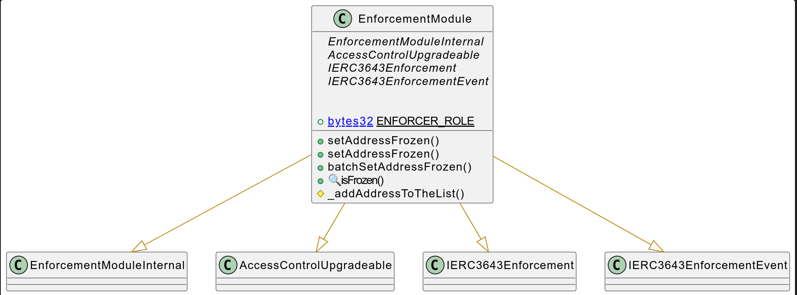
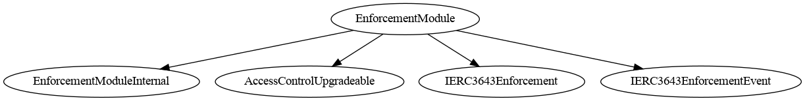
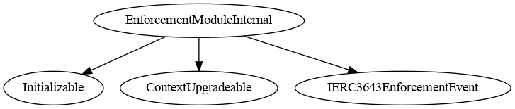
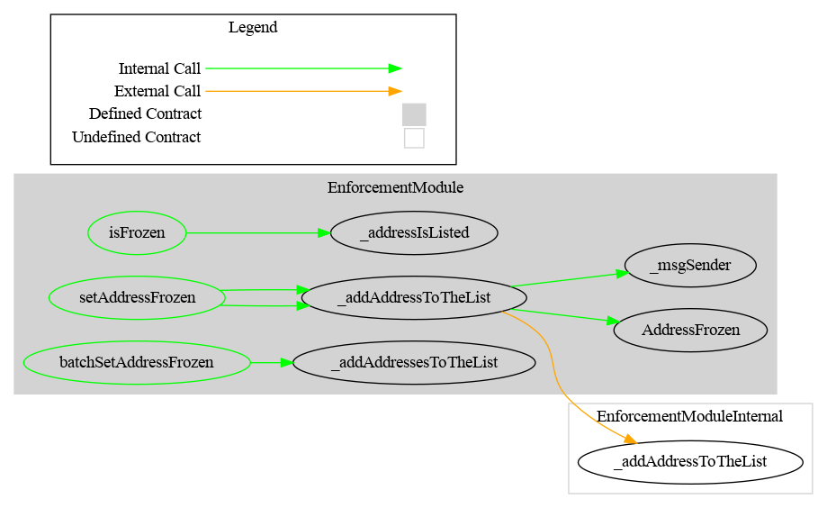
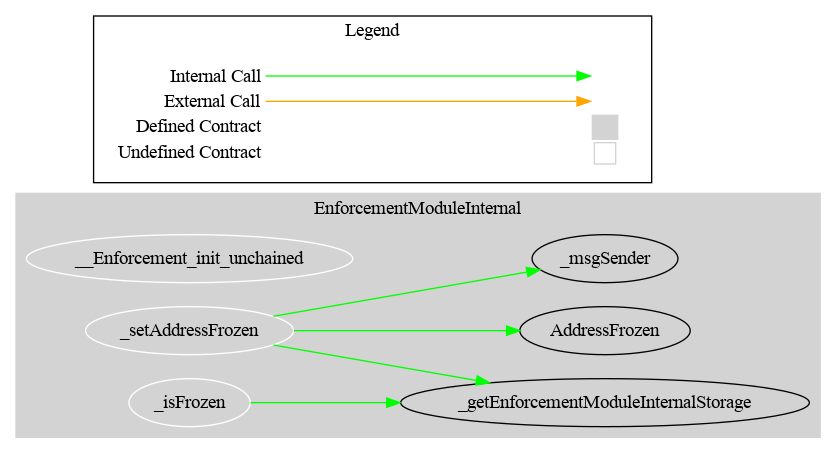

# Enforcement Module

This document defines Enforcement Module for the CMTA Token specification.

[TOC]

## Rationale

> The issuer (or a third party appointed by it) must be in a position to freeze tokens on specific distributed ledger addresses (as opposed to pausing the whole smart contract) to prevent the transfer of tokens that have been earmarked for transfer to a third party (e.g. between the execution of a transaction on a trading platform and the settlement of the trade in the distributed ledger).

## Schema



### Inheritance

#### EnforcementModule



#### EnforcementModuleInternal




### Graph

#### EnforcementModule



#### EnforcementModuleInternal



## API for Ethereum

This section describes the Ethereum API of the Enforcement Module.

### `setAddressFrozen(address,bool,bytes)`

```solidity
function setAddressFrozen(address account, bool freeze, bytes calldata data) 
public virtual 
onlyRole(ENFORCER_ROLE)
```

Updates the frozen status of a specific account, either freezing or unfreezing it.

| Name      | Type    | Description                                                  |
| --------- | ------- | ------------------------------------------------------------ |
| `account` | address | The wallet address whose frozen status is being modified.    |
| `freeze`  | bool    | `true` to freeze the account, `false` to unfreeze it.        |
| `data`    | bytes   | Optional contextual data explaining why the account was frozen or unfrozen. |

**Details:**

- When frozen, the account will be restricted from sending or receiving tokens depending on enforcement rules.
- Useful for enforcing compliance, sanctions, or regulatory requirements
- Extend ERC-3643 functions `setAddressFrozen` with a supplementary `data` parameter

**Emits**

- Emits an `AddressFrozen` event.

**Requirement**

Only authorized users (`ENFORCEMENT_ROLE`) are allowed to call this function.

### IERC3643EnforcementEvent

#### `AddressFrozen`

```solidity
event AddressFrozen(address indexed account, bool indexed isFrozen, address indexed enforcer, bytes data);
```

| Name       | Type    | Description                                                  |
| ---------- | ------- | ------------------------------------------------------------ |
| `account`  | address | The address that was frozen or unfrozen.                     |
| `isFrozen` | bool    | The new frozen status of the account: • `true` = frozen • `false` = unfrozen |
| `enforcer` | address | The address that performed the freeze or unfreeze action.    |
| `data`     | bytes   | Optional metadata providing context or documentation for the status change. |

 **Emitted by**:

- `setAddressFrozen`
- ``batchSetAddressFrozen`

**Extension Notice**:
This event extends the standard ERC-3643 specification by including the `data` field for enhanced traceability and context.

### `IERC3643Enforcement`

Interface for managing frozen status of accounts under ERC-3643 compliance rules.

------

#### `isFrozen(address)`

```solidity
function isFrozen(address account) external view returns (bool isFrozen_);
```

```solidity
function isFrozen(address account) 
public override(IERC3643Enforcement) view virtual 
returns (bool isFrozen_)
```
Checks whether a given account is currently frozen.

**Parameters**

| Name      | Type    | Description                             |
| --------- | ------- | --------------------------------------- |
| `account` | address | The address to check for frozen status. |

**Returns**

| Name        | Type | Description                                         |
| ----------- | ---- | --------------------------------------------------- |
| `isFrozen_` | bool | `true` if the account is frozen, `false` otherwise. |


------

#### `setAddressFrozen(address,bool)`

```solidity
function setAddressFrozen(address account, bool freeze) external;
```
```solidity
function setAddressFrozen(address account, bool freeze) 
public virtual override(IERC3643Enforcement) onlyRole(ENFORCER_ROLE)
```

Sets the frozen status of a specific address.

If `freeze`== true:

- Prevents `account` to perform any transfer.

If `freeze`== false:

- Authorize an account to perform transfer again.

**Parameters**

| Name      | Type    | Description                                               |
| :-------- | ------- | --------------------------------------------------------- |
| `account` | address | The address to update the frozen status for.              |
| `freeze`  | bool    | Set to `true` to freeze the account, `false` to unfreeze. |

**Emits**

Emits an `AddressFrozen` event.

**Requirement**

Only authorized users (`ENFORCEMENT_ROLE`) are allowed to call this function.

------

#### `batchSetAddressFrozen(address[],bool[])`

```solidity
function batchSetAddressFrozen(address[] calldata accounts, bool[] calldata freeze) external;
```
```solidity
function batchSetAddressFrozen(address[] calldata accounts, bool[] calldata freezes) 
public virtual override(IERC3643Enforcement) 
onlyRole(ENFORCER_ROLE)
```

Enables bulk freezing or unfreezing in a single call.

**Parameters**

| Name       | Type      | Description                                                  |
| ---------- | --------- | ------------------------------------------------------------ |
| `accounts` | address[] | A list of addresses to update.                               |
| `freeze`   | bool[]    | A list of boolean flags indicating the frozen status for each corresponding address. |

**Requirements**

- `accounts.length` must match `freeze.length`. 
- Only authorized users (`ENFORCEMENT_ROLE`) are allowed to call this function.


