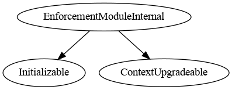
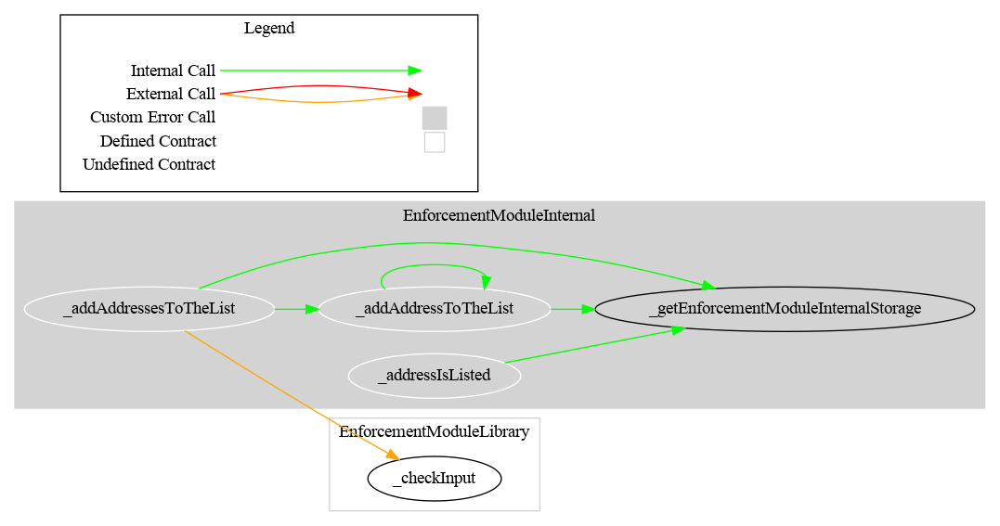

# Enforcement Module

This document defines Enforcement Module for the CMTA Token specification.

[TOC]

## Rationale

> The issuer (or a third party appointed by it) must be in a position to freeze tokens on specific distributed ledger addresses (as opposed to pausing the whole smart contract) to prevent the transfer of tokens that have been earmarked for transfer to a third party (e.g. between the execution of a transaction on a trading platform and the settlement of the trade in the distributed ledger).

## Schema

### Inheritance

#### EnforcementModule


#### EnforcementModuleInternal




### Graph

#### EnforcementModule


#### EnforcementModuleInternal



## API for Ethereum

This section describes the Ethereum API of the Enforcement Module.

### Functions

#### `setAddressFrozen(address,bool,bytes)`

##### Definition:

```solidity
function setAddressFrozen(address account, bool freeze) 
public virtual override(IERC3643Enforcement) 
onlyRole(ENFORCER_ROLE)
```

#### Description:

If `freeze`== true:

- Prevents `account` to perform any transfer.
  Only authorized users are allowed to call this function.

If `freeze`== false:

- Authorize an account to perform transfer again.

#### `frozen(address)`

Origin: EnforcementModuleInternal

##### Definition:

```solidity
function isFrozen(address account) 
public override(IERC3643Enforcement) 
view virtual returns (bool)
```

##### Description:

Tell, whether the given `account` is frozen.

### Events


#### `TokensFrozen(address,uint256)`

##### Definition:

```solidity
event TokensFrozen(address indexed account, uint256 value)
```

##### Description:

Emitted when address `account` is frozen by `enforcer`.

#### `TokensUnfrozen(address,uint256)`

##### Definition:

```solidity
event TokensUnfrozen(address indexed account, uint256 value)
```

##### Description:

Emitted when address `owner` is unfrozen by `enforcer`.
