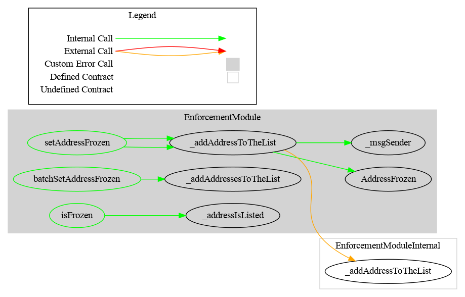

# Enforcement Module

This document defines Enforcement Module for the CMTA Token specification.

[TOC]

## Rationale

> The issuer (or a third party appointed by it) must be in a position to freeze tokens on specific distributed ledger addresses (as opposed to pausing the whole smart contract) to prevent the transfer of tokens that have been earmarked for transfer to a third party (e.g. between the execution of a transaction on a trading platform and the settlement of the trade in the distributed ledger).

## Schema

### Inheritance

#### EnforcementModule


#### EnforcementModuleInternal


### Graph

#### EnforcementModule



#### EnforcementModuleInternal


## 

## API for Ethereum

This section describes the Ethereum API of the Enforcement Module.

### Functions

#### `freeze(address,string)`

##### Definition:

```solidity
function freeze(address account,string memory reason) 
public onlyRole(ENFORCER_ROLE) 
returns (bool)
```

#### Description:

Prevents `account` to perform any transfer.
Only authorized users are allowed to call this function.
Returns `true` if the address is not yet frozen, `false` otherwise.

#### `unfreeze(address,string)`

##### Definition:

```solidity
function unfreeze(address account,string memory reason) 
public onlyRole(ENFORCER_ROLE) 
returns (bool)
```

#### Description:

Re-authorizes `account` to perform transfers if it was frozen.
Only authorized users are allowed to call this function.
Returns `true` if the address was frozen, `false` otherwise.

#### `frozen(address)`

Origin: EnforcementModuleInternal

##### Definition:

```solidity
function frozen(address account) 
public view virtual 
returns (bool)
```

##### Description:

Tell, whether the given `account` is frozen.

### Events


#### `Freeze(address,address)`

##### Definition:

```solidity
event Freeze (address indexed enforcer, address indexed owner)
```

##### Description:

Emitted when address `owner` is frozen by `enforcer`.

#### `Unfreeze(address,address)`

##### Definition:

```solidity
event Unfreeze (address indexed enforcer, address indexed owner)
```

##### Description:

Emitted when address `owner` is unfrozen by `enforcer`.
