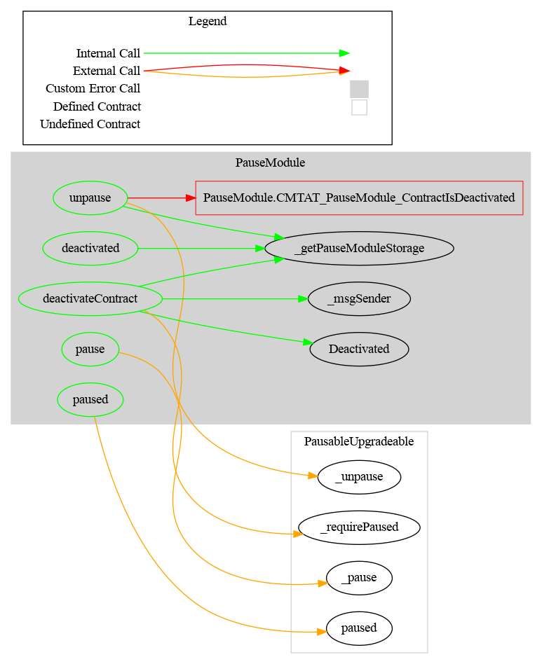

# Pause Module

This document defines the Pause Module for the CMTA Token specification.

[TOC]

## Rationale

> The issuer must be able to “pause” the smart contract, to prevent execution of transactions on the distributed ledger until the issuer puts an end to the pause. This function can be used to block transactions in case of a “hard fork” of the distributed ledger, pending a decision of the issuer as to which version of the distributed ledger it will support.

The PauseModule contract introduces contract pausing functionality into the CMTAT ERC20 token. This prevents users from being able to perform transfers while the contract is paused.

However, this is not enforced in the functions that allow to change a user’s allowance. We don't think it is necessary to prevent allowance change while the contract is in the pause state.

## Schema


### Inheritance


### Graph




## Ethereum API

This section describes the Ethereum API of the Pause Module.

### OpenZepplin PausableUpgradeable

See [docs.openzeppelin.com/contracts/5.x/api/utils#Pausable](https://docs.openzeppelin.com/contracts/5.x/api/utils#Pausable)

#### Events

##### `Paused(address)`

```solidity
event Paused(address account)
```

Emitted when token transfers were paused.

##### `Unpaused(address)`

```solidity
event Unpaused(address account)
```

Emitted when token transfers were unpaused.

### Interface: `ICMTATDeactivate`

 This interface defines functions and events for irreversibly deactivating a smart contract. Once deactivated, the contract becomes permanently non-functional. This mechanism is useful for compliance-focused or end-of-life lifecycle token contracts.

------

#### Events

##### `Deactivated`

```solidity
event Deactivated(address account);
```

| Name      | Type    | Description                                            |
| --------- | ------- | ------------------------------------------------------ |
| `account` | address | The address that permanently deactivated the contract. |

#### Functions

##### `deactivateContract`

```solidity
function deactivateContract() external;
```

```solidity
function deactivateContract()
public virtual override(ICMTATDeactivate)
onlyRole(DEFAULT_ADMIN_ROLE)
```

Permanently disables the contract.
**Warning:** This action is irreversible. Once the contract is deactivated, it can never be used again.

**Requirement**

- The contract must be paused before it can be deactivated.
  - Error: `ExpectedPause()`
- Only authorized users (`PAUSER_ROLE`) are allowed to call this function.

**Emits** 

- Deactivated

##### `deactivated`

```solidity
function deactivated() external view returns (bool isDeactivated);
```

```solidity
function deactivated() public view 
virtual override(ICMTATDeactivate) 
returns (bool)
```

Returns the current deactivation status of the contract.

**Returns**

| Returns         | Type | Description                                      |
| --------------- | ---- | ------------------------------------------------ |
| `isDeactivated` | bool | True if the contract is permanently deactivated. |


### `IERC3643Pause`

> Interface for pausing and unpausing token transfers, used in both CMTAT and ERC3643 token standards.
>  This interface allows toggling a pause state that disables or enables token transfers.

------

#### `paused`

```solidity
function paused() external view returns (bool);
```

```solidity
function paused() 
public virtual view override(IERC3643Pause, IERC7551Pause, PausableUpgradeable) returns (bool){
```

Returns whether the contract is currently paused.

| Name     | Type | Description                                          |
| -------- | ---- | ---------------------------------------------------- |
| `return` | bool | `true` if the contract is paused, otherwise `false`. |

#### `pause`

```solidity
function pause() external;
```

```solidity
function pause() 
public virtual override(IERC3643Pause, IERC7551Pause) 
onlyPauseManager
```

| Description                                                  |
| ------------------------------------------------------------ |
| Disables transfer functions across the contract. <br />Pauses all token transfers. |

##### Emits

Emits a `Paused` event.

##### Requirements

- Only authorized users (`PAUSER_ROLE`) are allowed to call this function.
- The contract must not be paused 
  - error: `EnforcedPause()`

#### `unpause`

```solidity
function unpause() external;
```

```solidity
function unpause() 
public virtual override(IERC3643Pause, IERC7551Pause) 
onlyPauseManager
```


| Description                                                  |
| ------------------------------------------------------------ |
| Unpauses all token transfers.  <br />Re-enables transfer functions across the contract. |


##### Emits

Emits an `Unpaused` event.

##### Requirements

- Only authorized users (`PAUSER_ROLE`) are allowed to call this function.
- The contract must be paused 
  - error: `ExpectedPause()`
