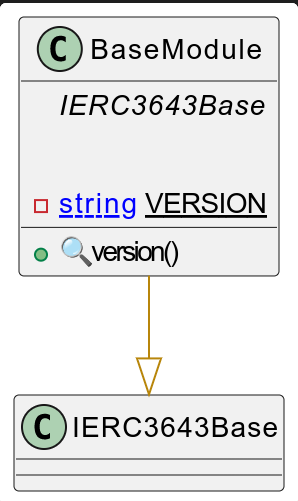

# Base Module

This document defines Base Module for the CMTA Token specification.

[TOC]

## Rationale

> The Base Module set the basic properties common to the different CMTAT tokens.
>
> Currently it only stores the contract version with the ERC-3643 function to retrieve it (`version`)
>

## Schema



### Inheritance


### Graph


## API for Ethereum

### Functions

#### IERC3643Base

##### `version()`

```solidity
function version() external view returns (string memory version_);
```
```solidity
function version() 
public view virtual override(IERC3643Base) 
returns (string memory version_)
```

 **Description**

Returns the current version of the token contract.
 Useful for identifying which version of the smart contract is deployed and in use. 

**Return**

| Name       | Type   | Description                                                  |
| ---------- | ------ | ------------------------------------------------------------ |
| `version_` | string | The version string of the token implementation (e.g., "1.0.0"). |


