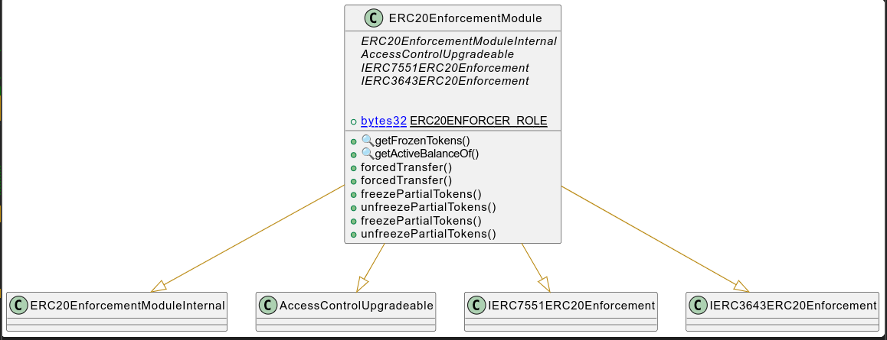

# ERC20 Enforcement Module

This document defines ERC20 Enforcement Module for the CMTA Token specification.

[TOC]

## Rationale

> Enforce a transfer: Transfer an amount of tokens without requiring the consent of the holder. This function which can be implemented in situations when it needs to be clear a transfer is enforced to comply with a transfer order, for example from a judicial authority
>
> Partial freeze: Partially freeze the balance of a token holder 

## Schema

### Inheritance

### Graph

## API for Ethereum

< To do >
