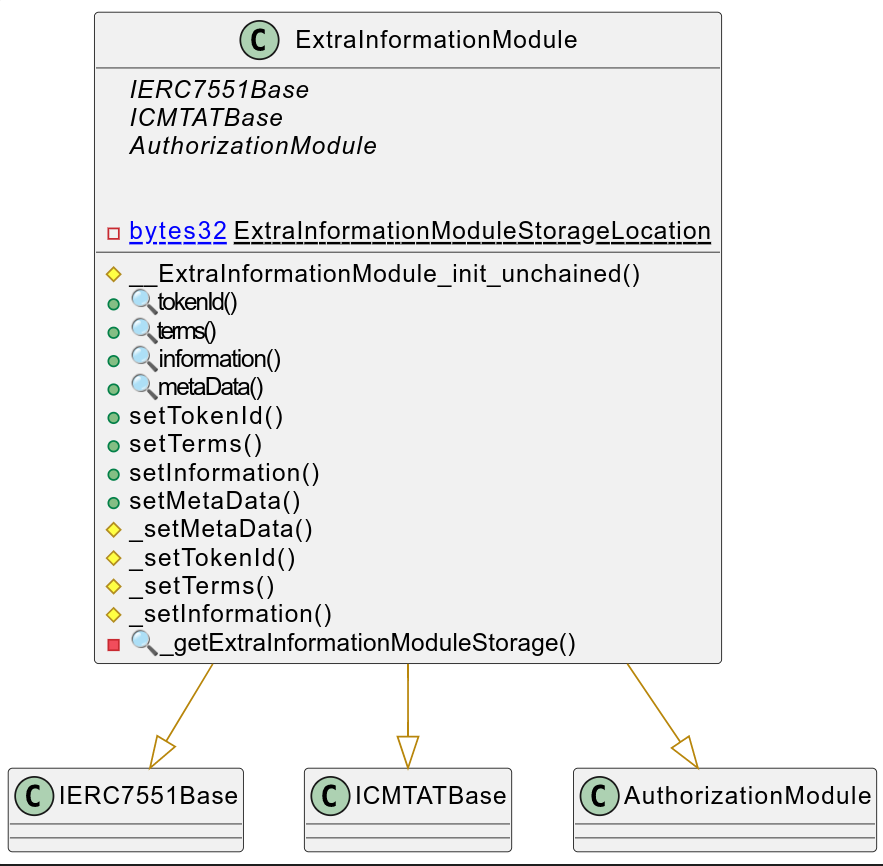
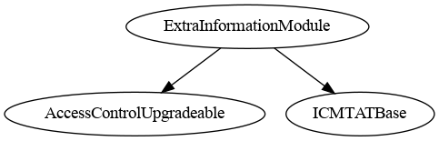
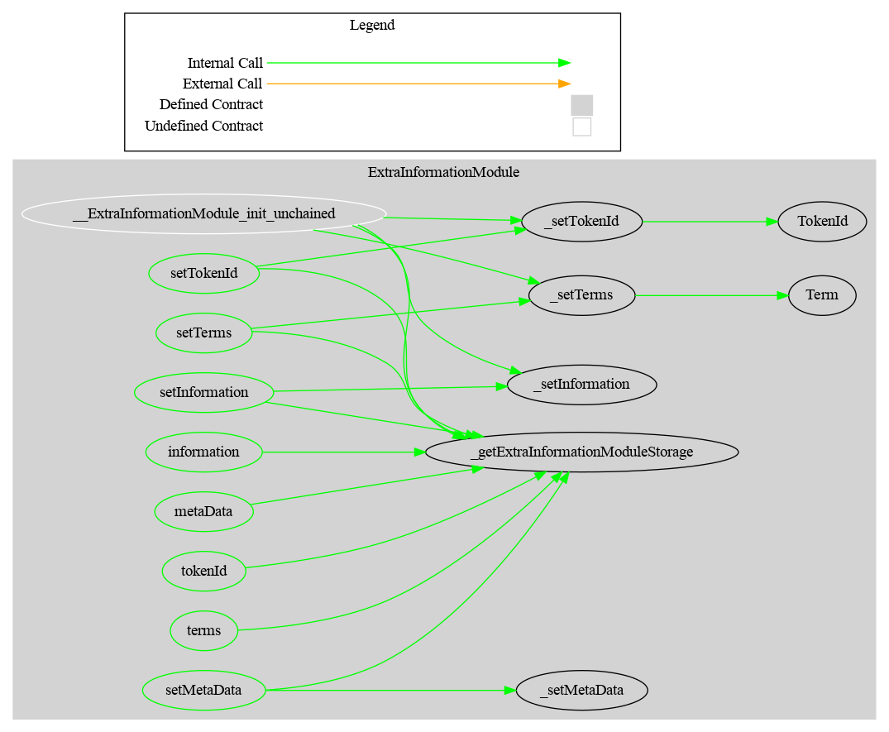

# Extra Information Module

This document defines the Extra Information Module, which allows to set additional information related to the token

> Defines standard metadata for a tokenized asset, including token ID, contractual terms (via document), and general-purpose information.

[TOC]


## Rationale

The ExtraInformation Module set the basic properties common to the different CMTAT tokens to represent equity securities as well as tokens representing and debt securities. Here a quick list :

- Terms of tokenization

- Token ID (ISIN or other identifier) 

- Metadata

- Additional field to allow the issuer to add  supplementation information: information

| Field name    | Type                                                         | Setter           | Description                                                  |
| ------------- | ------------------------------------------------------------ | ---------------- | ------------------------------------------------------------ |
| `tokenId`     | string                                                       | `setTokenId`     | ISIN or other identifier                                     |
| `terms`       | IERC1643Document<br /> (string name, string URI, bytes32 documentHash, uint256 lastModified) | `setTerms`       | Reference to any legally required documentation about the distributed ledger or the smart contract, such as the tokenization terms, the terms of the instrument and other relevant documents (e.g. prospectus or key information document) |
| `metaData`    | string                                                       | `setMetaData`    | Use case: a link towards a JSON file to describes metadata. See [ERC-7551](https://ethereum-magicians.org/t/erc-7551-crypto-security-token-smart-contract-interface-ewpg/16416) |
| `information` | string                                                       | `setInformation` | Supplementary information related to the token               |


## Schema



### Inheritance



### Graph




## API for Ethereum

### Structs

#### `Terms`

Represents the tokenization terms, including a name and an associated document reference.

| Name   | Type                | Description                                                  |
| ------ | ------------------- | ------------------------------------------------------------ |
| `name` | `string`            | Human-readable label for the terms (e.g. "Loan Terms").      |
| `doc`  | `IERC1643.Document` | Metadata for the associated document (URI, hash, timestamp). |


------

### Events

#### `Information(string)`

```solidity
event Information(string newInformation)
```

Emitted when the information field is updated (typically containing free-form metadata, context, or documentation URI).

| Name             | Type     | Description                             |
| ---------------- | -------- | --------------------------------------- |
| `newInformation` | `string` | The new metadata or description string. |

#### `Term(string,(string,bytes32,uint256))`

```solidity
event Term(Terms newTerm)
```

Emitted when new tokenization terms are set.

| Name      | Type    | Description                            |
| --------- | ------- | -------------------------------------- |
| `newTerm` | `Terms` | The new terms structure being applied. |


#### `TokenId(string,string)`

```solidity
event TokenId(string indexed newTokenIdIndexed, string newTokenId)
```

Emitted when a token ID is set or updated.

| Name                | Type     | Description                          |
| ------------------- | -------- | ------------------------------------ |
| `newTokenIdIndexed` | `string` | Indexed version of the new token ID. |
| `newTokenId`        | `string` | The full token ID string.            |


### Functions

#### `tokenId()->string`

```solidity
function tokenId() external view returns (string tokenId_)
```

```solidity
function tokenId() 
public view  virtual override(ICMTATBase) 
returns (string memory tokenId_)
```

Returns the current tokenization token ID.

| Returns    | Type     | Description                 |
| ---------- | -------- | --------------------------- |
| `tokenId_` | `string` | The token ID for the asset. |


------

#### `terms()->(string,(string,bytes32,uint256))`

```solidity
function terms() external view returns (Terms)
```

```solidity
function terms() 
public view virtual override(ICMTATBase)  
returns (Terms memory terms_)
```

Returns the current tokenization terms.

| Returns  | Type    | Description                             |
| -------- | ------- | --------------------------------------- |
| `terms_` | `Terms` | Struct with name and document metadata. |


------

#### `information()->string`

```solidity
function information() external view returns (string information_)
```

```solidity
function information() 
public view virtual override(ICMTATBase) 
returns (string memory information_)
```

Returns the general-purpose information string.

| Returns        | Type     | Description                                   |
| -------------- | -------- | --------------------------------------------- |
| `information_` | `string` | Additional metadata or context for the token. |


------

#### `setTokenId(string)`

```solidity
function setTokenId(string tokenId_) external
```

```solidity
function setTokenId(string calldata tokenId_) 
public virtual override(ICMTATBase)  
onlyRole(EXTRA_INFORMATION_ROLE)
```

Sets a new token ID for the asset.

Only authorized users are allowed to call this function.

| Name       | Type     | Description             |
| ---------- | -------- | ----------------------- |
| `tokenId_` | `string` | The token ID to assign. |


------

#### `setTerms((string,string,bytes32))`

```solidity
function setTerms(IERC1643CMTAT.DocumentInfo terms_) external
```

```solidity
function setTerms(IERC1643CMTAT.DocumentInfo calldata terms_) 
public virtual override(ICMTATBase) 
onlyRole(EXTRA_INFORMATION_ROLE)
```

Sets the legal/contractual terms for the token using a document reference.

Only authorized users are allowed to call this function.

| Name     | Type                                  | Description                          |
| -------- | ------------------------------------- | ------------------------------------ |
| `terms_` | `DocumentInfo` (from `IERC1643CMTAT`) | The document info (name, URI, hash). |


------

#### `setInformation(string)`

```solidity
function setInformation(string information_) external
```

```solidity
function setInformation(string calldata information_) 
public virtual
onlyRole(EXTRA_INFORMATION_ROLE)
```

Sets or updates the general-purpose information string.

Only authorized users are allowed to call this function.

| Name           | Type     | Description                           |
| -------------- | -------- | ------------------------------------- |
| `information_` | `string` | The new metadata or descriptive text. |
