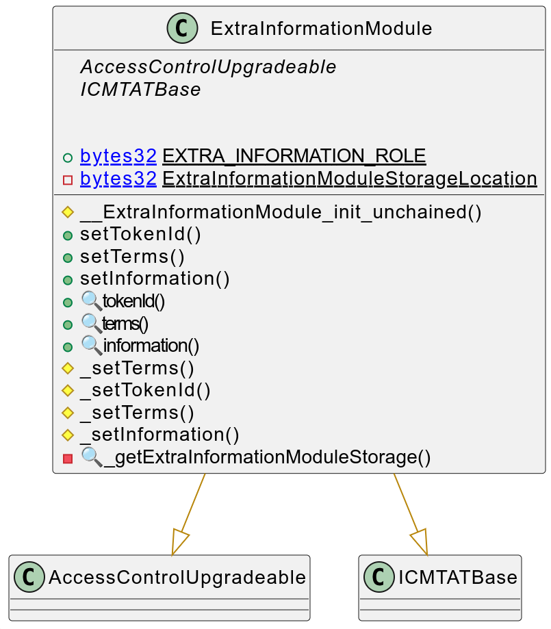

# Extra Information Module

This document defines the Extra Information Module, which allows to set additional information related to the token

[TOC]


## Rationale

The ExtraInformation Module set the basic properties common to the different CMTAT tokens to represent equity securities as well as tokens representing and debt securities. Here a quick list :

- Terms of tokenization

- Token ID (ISIN or other identifier) 

- Metadata

- Additional field to allow the issuer to add  supplementation information: information

| Field name    | Type                                                         | Setter           | Description                                                  |
| ------------- | ------------------------------------------------------------ | ---------------- | ------------------------------------------------------------ |
| `tokenId`     | string                                                       | `setTokenId`     | ISIN or other identifier                                     |
| `terms`       | IERC1643Document<br /> (string name, string URI, bytes32 documentHash, uint256 lastModified) | `setTerms`       | Reference to any legally required documentation about the distributed ledger or the smart contract, such as the tokenization terms, the terms of the instrument and other relevant documents (e.g. prospectus or key information document) |
| `metaData`    | string                                                       | `setMetaData`    | Use case: a link towards a JSON file to describes metadata. See [ERC-7551](https://ethereum-magicians.org/t/erc-7551-crypto-security-token-smart-contract-interface-ewpg/16416) |
| `information` | string                                                       | `setInformation` | Supplementary information related to the token               |


## Schema



### Inheritance


### Graph


## API for Ethereum

### Functions

#### `setTokenId(string)`

##### Definition:

```solidity
 function setTokenId(string calldata tokenId_) 
 public virtual override(ICMTATBase)  
 onlyRole(DEFAULT_ADMIN_ROLE)
```

##### Description:

Set the `token id` to the given `string`.
Only authorized users are allowed to call this function.

#### `setTerms(...)`

##### Definition:

```solidity
function setTerms(IERC1643CMTAT.DocumentInfo calldata terms_) 
public virtual override(ICMTATBase) 
onlyRole(DEFAULT_ADMIN_ROLE)
```

##### Description:

Set the `terms` to the given `string`.
Only authorized users are allowed to call this function.

#### `setInformation(string)`

##### Definition:

```solidity
function setInformation(string calldata information_) 
public onlyRole(DEFAULT_ADMIN_ROLE)
```

##### Description:

Set the information` to the given `uint256`.
Only authorized users are allowed to call this function.

### Events

#### `Term(string)`

##### Definition:

```solidity
event Term(string indexed newTermIndexed, string newTerm)
```

##### Description:

Emitted when the variable `terms` is set to `newTerm`.

#### `tokenId(string,string`

##### Definition:

```solidity
event TokenId(string indexed newTokenIdIndexed, string newTokenId)
```

##### Description:

Emitted when `tokenId` is set to `newTokenId`.

#### `Information(string,string)`

##### Definition:

```solidity
event Information(string indexed newInformationIndexed, string newInformation)
```

##### Description:

Emitted when the variable `information` is set to `newInformation`.
