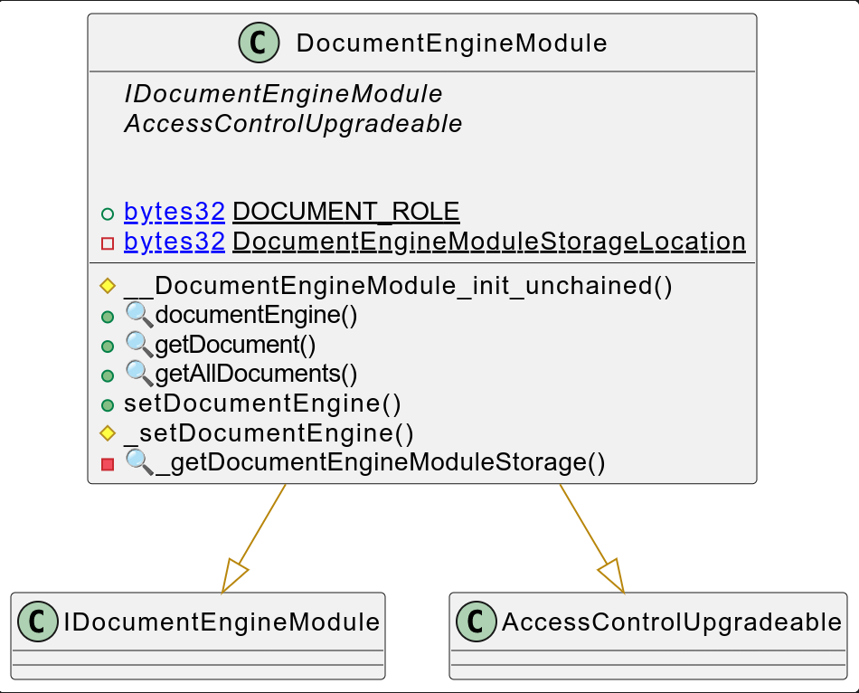
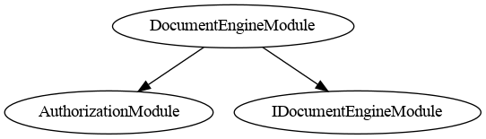
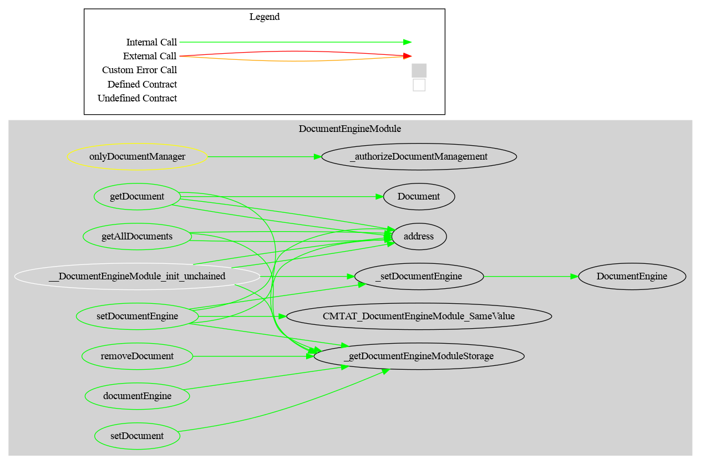

# Document Module

This document defines  Document Module for the CMTA Token specification.

> Interface for managing documents via delegation to an external document engine contract.
>  Extends `IERC1643`, the standard for document management.

> **Current status (v3.3.0):** `DocumentEngineModule` is available in the codebase but is **not** integrated in any shipped deployment contract (`CMTATStandard*`, `Permit`, `Snapshot`, `Debt`, `DebtEngine`, `Allowlist`, `ERC1363`, `ERC7551`, `Light`, `UUPS`). It is exercised through dedicated test mocks only (`CMTATDocumentEngineModuleMock`).
>
> All shipped deployment variants **except Light** integrate `DocumentERC1643Module` instead — the native in-contract ERC-1643 implementation that stores documents directly in the token contract and uses `DOCUMENT_ROLE` for write authorization. The Light variant (`CMTATBaseCore`) does not extend `CMTATBaseDocument` and therefore has no ERC-1643 document support. `DocumentEngineModule` uses the separate `DOCUMENT_ENGINE_ROLE` to authorize `setDocumentEngine`, `setDocument`, and `removeDocument` calls forwarded to the external engine.
>
> See [`doc/technical/document.md`](../../../../doc/technical/document.md) for a comparison of both patterns.

[TOC]

## Schema



### Inheritance




### Graph



## Ethereum API

### IDocumentEngine

#### Events

##### `DocumentEngine(address)`

```solidity
event DocumentEngine(IERC1643 indexed newDocumentEngine)
```

Emitted when a new document engine is set for the module.

###### Parameters

| Name                | Type       | Description                               |
| ------------------- | ---------- | ----------------------------------------- |
| `newDocumentEngine` | `IERC1643` | The address of the newly assigned engine. |


------

##### Errors

###### `CMTAT_DocumentEngineModule_SameValue`

Thrown when attempting to set the document engine to the same address currently in use.

------

#### Functions

##### `setDocumentEngine(address)`

```solidity
function setDocumentEngine(IERC1643 documentEngine_) external
```

```solidity
function setDocumentEngine(IERC1643 documentEngine_) 
public virtual override(IDocumentEngineModule) 
onlyDocumentManager
```

Sets a new external document engine contract.

- The new engine must differ from the current one.
- Throws `CMTAT_DocumentEngineModule_SameValue` if the same engine address is provided.

###### Parameters

| Name              | Type       | Description                        |
| ----------------- | ---------- | ---------------------------------- |
| `documentEngine_` | `IERC1643` | The new document engine to assign. |


------

##### `documentEngine()-> address`

```solidity
function documentEngine() external view returns (IERC1643)
```

```solidity
function documentEngine() 
public view virtual override(IDocumentEngineModule) 
returns (IERC1643)
```

Returns the address of the currently assigned document engine.

###### Returns

| Name              | Type       | Description                         |
| ----------------- | ---------- | ----------------------------------- |
| `documentEngine_` | `IERC1643` | The current document engine in use. |

### IERC1643

> Standardized interface for managing documents in ERC-1400 security tokens.
>  The `Document` struct stores document metadata; `getDocument` returns its fields as flat ERC-1643 values (`uri`, `documentHash`, `lastModified`).

#### Structs

##### `Document`

A structure that stores metadata for a document.

| Name           | Type      | Description                                                 |
| -------------- | --------- | ----------------------------------------------------------- |
| `uri`          | `string`  | URI pointing to the off-chain document (e.g., HTTPS, IPFS). |
| `documentHash` | `bytes32` | Cryptographic hash of the document content.                 |
| `lastModified` | `uint256` | Timestamp of the last on-chain update.                      |


------

#### Functions

##### `getDocument(bytes32)->((string,bytes32,uint256))`

```public
function getDocument(bytes32 name) external view returns (string memory uri, bytes32 documentHash, uint256 lastModified)
```

```solidity
function getDocument(bytes32 name) 
public view  virtual override(IERC1643) 
returns (string memory uri, bytes32 documentHash, uint256 lastModified)
```

Retrieves a document by its name.

###### Parameters

| Name   | Type      | Description                            |
| ------ | --------- | -------------------------------------- |
| `name` | `bytes32` | The unique identifier of the document. |


###### Returns

| Name       | Type       | Description                                               |
| ---------- | ---------- | --------------------------------------------------------- |
| `uri`          | `string`  | URI pointing to the document.                |
| `documentHash` | `bytes32` | Hash of the document contents.               |
| `lastModified` | `uint256` | Block timestamp of the last on-chain update. |


------

##### `getAllDocuments()-> bytes32[]`

```solidity
function getAllDocuments() external view returns (bytes32[] names)
```

```solidity
function getAllDocuments() 
public view virtual override(IERC1643) 
returns (bytes32[] memory documentNames_)
```

Returns the list of all registered document names.

###### Returns

| Name             | Type        | Description                        |
| ---------------- | ----------- | ---------------------------------- |
| `documentNames_` | `bytes32[]` | Array of all document identifiers. |

------

##### `setDocument(bytes32,string,bytes32)`

```solidity
function setDocument(bytes32 name, string calldata uri, bytes32 documentHash) external
```

```solidity
function setDocument(bytes32 name, string calldata uri, bytes32 documentHash)
public virtual override(IERC1643)
onlyDocumentManager
```

Forwards a document write to the external engine. Creates or updates the document identified by `name`.

###### Parameters

| Name           | Type      | Description                              |
| -------------- | --------- | ---------------------------------------- |
| `name`         | `bytes32` | The unique identifier of the document.   |
| `uri`          | `string`  | URI pointing to the off-chain document.  |
| `documentHash` | `bytes32` | Cryptographic hash of the document.      |

**Requirements:** caller must have `DOCUMENT_ENGINE_ROLE`.

------

##### `removeDocument(bytes32)`

```solidity
function removeDocument(bytes32 name) external
```

```solidity
function removeDocument(bytes32 name)
public virtual override(IERC1643)
onlyDocumentManager
```

Forwards a document removal to the external engine.

###### Parameters

| Name   | Type      | Description                            |
| ------ | --------- | -------------------------------------- |
| `name` | `bytes32` | The unique identifier of the document. |

**Requirements:** caller must have `DOCUMENT_ENGINE_ROLE`.
