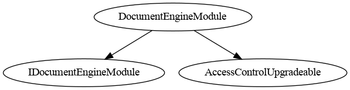

# Document Module

This document defines  Document Module for the CMTA Token specification.

> Interface for managing documents via delegation to an external document engine contract.
>  Extends `IERC1643`, the standard for document management.

[TOC]

## Schema


### Inheritance




### Graph


## Ethereum API

### IDocumentEngine

#### Events

##### `DocumentEngine(address)`

```solidity
event DocumentEngine(IERC1643 indexed newDocumentEngine)
```

Emitted when a new document engine is set for the module.

###### Parameters

| Name                | Type       | Description                               |
| ------------------- | ---------- | ----------------------------------------- |
| `newDocumentEngine` | `IERC1643` | The address of the newly assigned engine. |


------

##### Errors

###### `CMTAT_DocumentEngineModule_SameValue`

Thrown when attempting to set the document engine to the same address currently in use.

------

#### Functions

##### `setDocumentEngine(address)`

```solidity
function setDocumentEngine(IERC1643 documentEngine_) external
```

```solidity
function setDocumentEngine(IERC1643 documentEngine_) 
public virtual override(IDocumentEngineModule) 
onlyRole(DOCUMENT_ROLE)
```

Sets a new external document engine contract.

- The new engine must differ from the current one.
- Throws `CMTAT_DocumentEngineModule_SameValue` if the same engine address is provided.

###### Parameters

| Name              | Type       | Description                        |
| ----------------- | ---------- | ---------------------------------- |
| `documentEngine_` | `IERC1643` | The new document engine to assign. |


------

##### `documentEngine()`

```solidity
function documentEngine() external view returns (IERC1643)
```

```solidity
function documentEngine() 
public view virtual override(IDocumentEngineModule) 
returns (IERC1643)
```

Returns the address of the currently assigned document engine.

###### Returns

| Name              | Type       | Description                         |
| ----------------- | ---------- | ----------------------------------- |
| `documentEngine_` | `IERC1643` | The current document engine in use. |

### IERC1643

> Standardized interface for managing documents in ERC-1400 security tokens.
>  This version improves the original ERC-1643 by using a `Document` struct to represent document metadata.

#### Structs

##### `Document`

A structure that stores metadata for a document.

| Name           | Type      | Description                                                 |
| -------------- | --------- | ----------------------------------------------------------- |
| `uri`          | `string`  | URI pointing to the off-chain document (e.g., HTTPS, IPFS). |
| `documentHash` | `bytes32` | Cryptographic hash of the document content.                 |
| `lastModified` | `uint256` | Timestamp of the last on-chain update.                      |


------

#### Functions

##### `getDocument`

```public
function getDocument(string name) external view returns (Document doc)
```

```solidity
function getDocument(string memory name) 
public view  virtual override(IERC1643) 
returns (Document memory document)
```

Retrieves a document by its name.

###### Parameters

| Name   | Type     | Description                            |
| ------ | -------- | -------------------------------------- |
| `name` | `string` | The unique identifier of the document. |


###### Returns

| Name       | Type       | Description                                               |
| ---------- | ---------- | --------------------------------------------------------- |
| `document` | `Document` | The full metadata (URI, hash, timestamp) of the document. |


------

##### `getAllDocuments`

```solidity
function getAllDocuments() external view returns (string[] names)
```

```solidity
function getAllDocuments() 
public view virtual override(IERC1643) 
returns (string[] memory documentNames_)
```

Returns the list of all registered document names.

###### Returns

| Name             | Type       | Description                        |
| ---------------- | ---------- | ---------------------------------- |
| `documentNames_` | `string[]` | Array of all document identifiers. |
