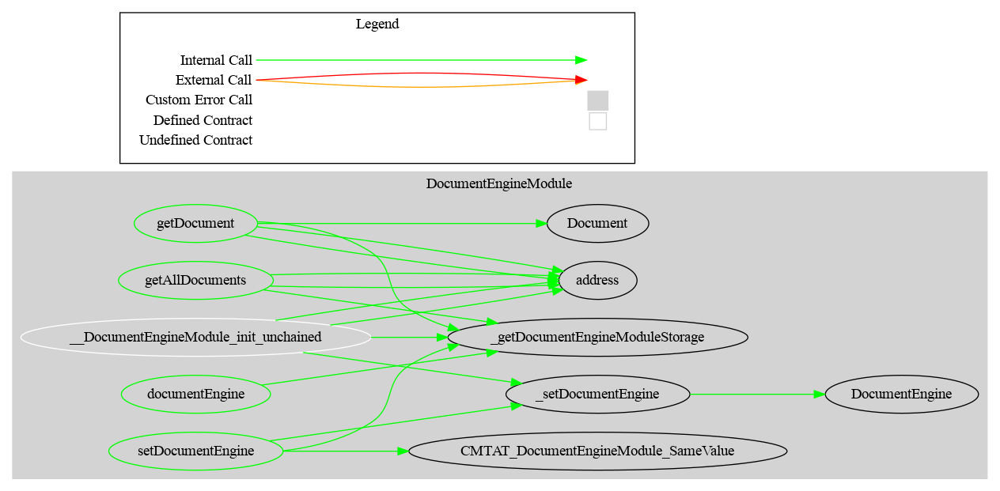

# Document Module

This document defines  Document Module for the CMTA Token specification.

[TOC]

## Schema


### Inheritance


### Graph



## Ethereum API

### getDocument(string)

Return a document identified by its name

```solidity
function getDocument(string memory name) 
public view  virtual 
returns (Document memory document)
```


### getAllDocuments()

Return all documents

```solidity
function getAllDocuments() public view virtual 
returns (string[] memory documents)
```

