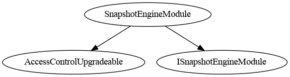
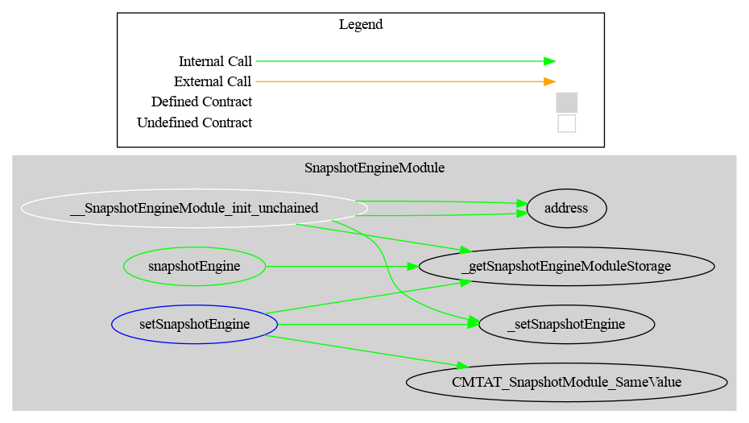

# Snapshot Module

This document defines the Snapshot Module for the CMTA Token specification. 

[TOC]

## Rationale

> In relation to distributions or the exercise of rights attached to tokenized securities, it is necessary to determine the number of tokens held by certain users at a certain point in time to allow issuers to carry out certain corporate actions such as dividend or interest payments. 
>
> Such moments are generally referred to in practice as the "record date" or the "record time" (i.e. the time that is relevant to determine the eligibility of security holders for the relevant corporate action). 
>
> The snapshot functions to determine the number of tokens recorded on the various ledger addresses at a specific point in time and to use that information to carry out transactions on-chain.

## Schema

### Inheritance

### Graph

