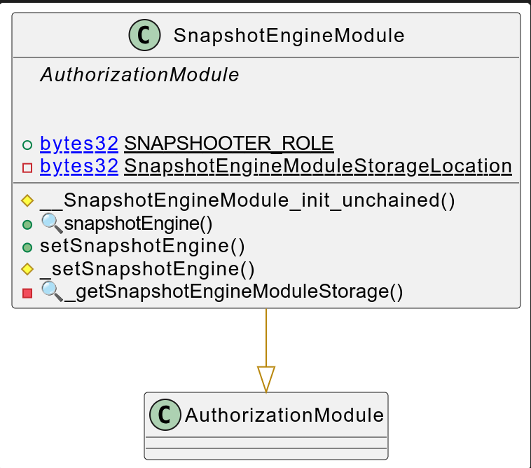
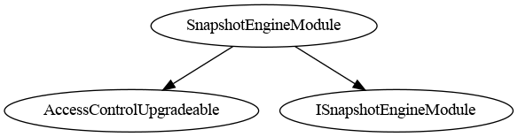
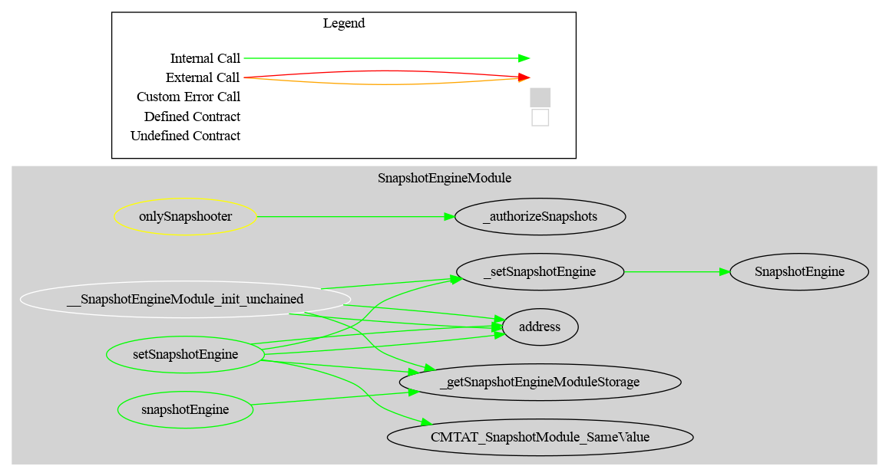

# Snapshot Module

This document defines the Snapshot Module for the CMTA Token specification. 

This module allows to set a specific engine called `SnapshotEngine`to perform snapshot on-chain. 

[TOC]

## Rationale

> In relation to distributions or the exercise of rights attached to tokenized securities, it is necessary to determine the number of tokens held by certain users at a certain point in time to allow issuers to carry out certain corporate actions such as dividend or interest payments. 
>
> Such moments are generally referred to in practice as the "record date" or the "record time" (i.e. the time that is relevant to determine the eligibility of security holders for the relevant corporate action). 
>
> The snapshot functions to determine the number of tokens recorded on the various ledger addresses at a specific point in time and to use that information to carry out transactions on-chain.

## Schema



### Inheritance




### Graph




### API Ethereum

#### ISnapshotEngineModule

Minimal interface for configuring a snapshot engine module.

#### Events

------

##### `SnapshotEngine(ISnapshotEngine newSnapshotEngine)`

Emitted when a new snapshot engine is set.

| Parameter           | Type              | Description                                             |
| ------------------- | ----------------- | ------------------------------------------------------- |
| `newSnapshotEngine` | `ISnapshotEngine` | Address of the newly assigned snapshot engine contract. |


------

#### Errors

------

##### `CMTAT_SnapshotModule_SameValue()`

Reverts if the new snapshot engine is the same as the current one.

------

#### Functions

------

##### `setSnapshotEngine(ISnapshotEngine snapshotEngine_)`

Sets the address of the snapshot engine contract.

| Parameter         | Type              | Description                                      |
| ----------------- | ----------------- | ------------------------------------------------ |
| `snapshotEngine_` | `ISnapshotEngine` | The new snapshot engine contract address to set. |


**Requirements:**

- Reverts with `CMTAT_SnapshotModule_SameValue` if the same engine is provided.
- Emits a `SnapshotEngine` event.

------

##### `snapshotEngine() → ISnapshotEngine`

Returns the currently active snapshot engine.

| Returns          | Type              | Description                                   |
| ---------------- | ----------------- | --------------------------------------------- |
| `snapshotEngine` | `ISnapshotEngine` | Address of the currently set snapshot engine. |

---

## Base Mixins

### `CMTATBaseSnapshot` (level 0)

`contracts/modules/0_CMTATBaseSnapshot.sol`

A pure mixin that composes `ERC20Upgradeable` and `SnapshotEngineModule`. Its sole role is to wire the ERC-20 `_update` hook into the snapshot engine:

```solidity
abstract contract CMTATBaseSnapshot is ERC20Upgradeable, SnapshotEngineModule {
    function _update(address from, address to, uint256 amount) internal virtual override(ERC20Upgradeable) {
        ISnapshotEngine snapshotEngineLocal = snapshotEngine();
        if (address(snapshotEngineLocal) != address(0)) {
            // snapshot balances before transfer, then call operateOnTransfer
            ERC20Upgradeable._update(from, to, amount);
            snapshotEngineLocal.operateOnTransfer(from, to, fromBalanceBefore, toBalanceBefore, totalSupplyBefore);
        } else {
            ERC20Upgradeable._update(from, to, amount);
        }
    }
}
```

`CMTATBaseSnapshot` is intentionally access-control-free: the `_authorizeSnapshots()` hook is left `abstract` and is implemented by the consuming base contract (typically enforcing `SNAPSHOOTER_ROLE`).

### `CMTATBaseERC2771Snapshot` (level 7)

`contracts/modules/7_CMTATBaseERC2771Snapshot.sol`

Combines `CMTATBaseERC2771` (gasless meta-transactions via ERC-2771 trusted forwarder) with `CMTATBaseSnapshot`. It resolves the `_update` diamond-inheritance ambiguity by delegating to `CMTATBaseSnapshot._update`, and similarly resolves `_msgSender` / `_msgData` / `_contextSuffixLength` in favour of `CMTATBaseERC2771`.

This is the base contract used by the dedicated **Snapshot** deployment variants (`CMTATStandaloneSnapshot`, `CMTATUpgradeableSnapshot`).

---

## Deployment Variants

| Variant | Base | Available snapshot support |
|---|---|---|
| `CMTATStandaloneSnapshot` | `CMTATBaseERC2771Snapshot` | Yes — dedicated variant |
| `CMTATUpgradeableSnapshot` | `CMTATBaseERC2771Snapshot` | Yes — dedicated variant |
| `CMTATStandaloneDebt` | `CMTATBaseDebt` (inherits `CMTATBaseSnapshot`) | Yes — included by default |
| `CMTATUpgradeableDebt` | `CMTATBaseDebt` | Yes — included by default |
| `CMTATStandaloneDebtEngine` | `CMTATBaseDebtEngine` (inherits `CMTATBaseSnapshot`) | Yes — included by default |
| `CMTATUpgradeableDebtEngine` | `CMTATBaseDebtEngine` | Yes — included by default |

Issuers using the `Debt` or `DebtEngine` deployment variants do **not** need to deploy the separate `Snapshot` variant to access SnapshotEngine support — it is already available through `CMTATBaseSnapshot` in those base contracts.
