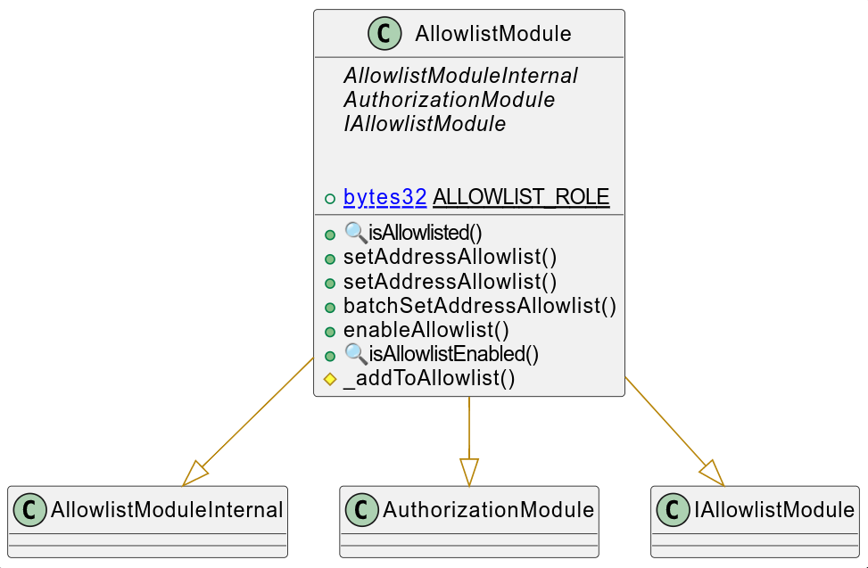
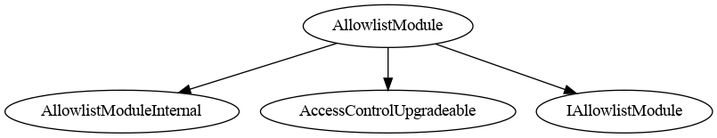
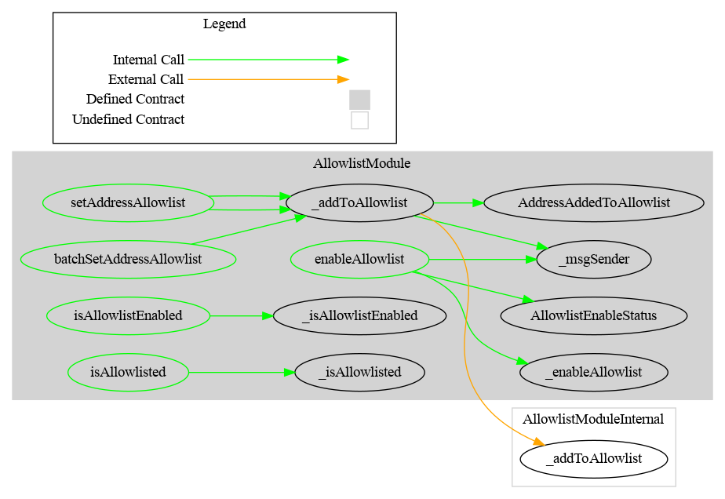

# Allowlist Module

This document defines the Allowlist module

[TOC]

## Schema

### Inheritance

### Graph

## API for Ethereum

This section describes the Ethereum API of Debt Module.

<To do>
