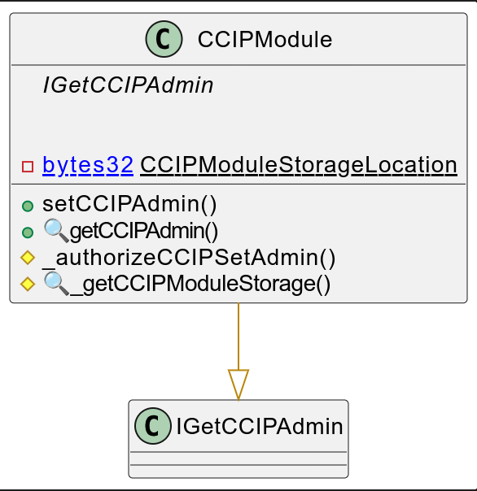
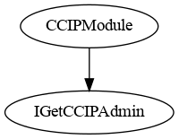
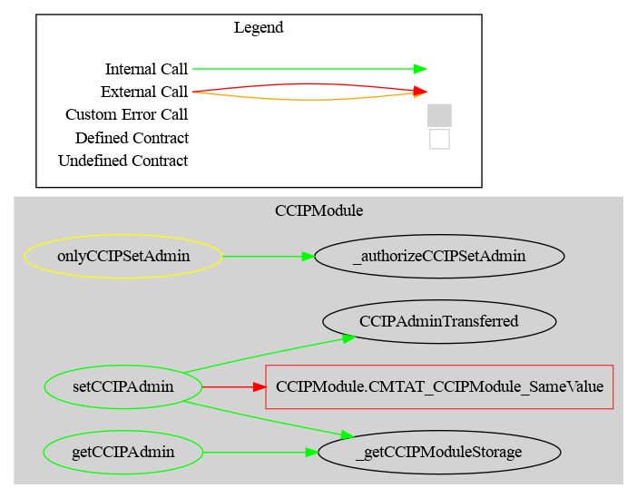

#  CCIP Module 

This document defines the CCIP Module for the CMTA Token specification. 

The goal of this module is to implement specific function to the standard [CCT](https://docs.chain.link/ccip/concepts/cross-chain-token/evm) for cross-chain transfers trough [Chainlink CCIP](https://docs.chain.link/ccip).

[TOC]

## Schema

### Inheritance

### Graph

## API for Ethereum

This section describes the Ethereum API of the CCIP Module. 

### setCCIPAdmin(address newAdmin) external

Transfers the `CCIPAdmin` role to a new address.
 This uses a **1-step ownership transfer** mechanism.

**Details:**

- Can only be called by authorized addresses (`onlyCCIPSetAdmin`).
- Cannot be called by the current `ccipAdmin`.
- Setting `newAdmin` to `address(0)` is valid and effectively revokes the role.

**Input Parameters:**

| Name     | Type    | Description                                                  |
| -------- | ------- | ------------------------------------------------------------ |
| newAdmin | address | The address to transfer the `CCIPAdmin` role to. Use `address(0)` to revoke. |
