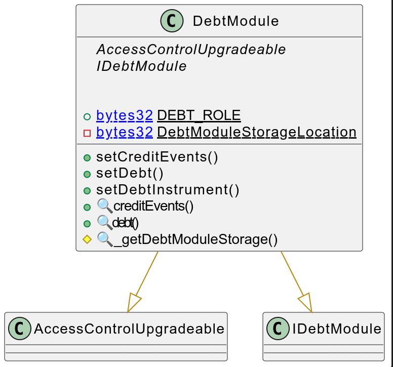
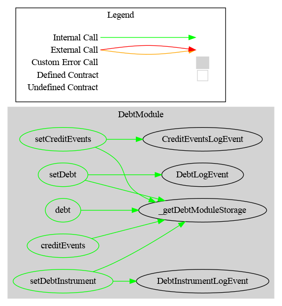

# Debt Module

This document defines Debt Module for the CMTA Token specification.

[TOC]

## Interface

The interface and struct to represent Debt is available in `/contracts/interfaces/tokenization/ICMTAT.sol`

## Schema



### Inheritance


### Graph



## API for Ethereum

This section describes the Ethereum API of Debt Module.

### Interfaces

See `IDebtModule`

```solidity
<To do>interface IDebtModule is ICMTATDebt, ICMTATCreditEvents {
    /* ============ Events ============ */
     // No paramater to reduce contract size
    event DebtLogEvent();
    event CreditEventsLogEvent();
    event DebtInstrumentLogEvent();

    /* ============ Functions ============ */
    /**
     * @notice Set only the instrument
     */
    function setDebtInstrument(
          ICMTATDebt.DebtInstrument calldata debtInstrument_
    ) external;
    
    /**
     * @notice Set the debt
     */
    function setDebt(
          ICMTATDebt.DebtInformation calldata debt_
    ) external;
    /**
     * @notice Set Credit Events
     */
    function setCreditEvents(
       CreditEvents calldata creditEvents_
    ) external; 
}
```


### Functions

#### setDebt(ICMTATDebt.DebtInformation calldata debt_) 

Set debt

```solidity
 function setDebt(ICMTATDebt.DebtInformation calldata debt_) 
 external virtual 
 onlyRole(DEBT_ROLE)
```

#### setDebtInstrument(ICMTATDebt.DebtInstrument calldata debtInstrument_)

Set only the instruments

```solidity
function setDebtInstrument(ICMTATDebt.DebtInstrument calldata debtInstrument_) 
external virtual 
onlyRole(DEBT_ROLE)
```

