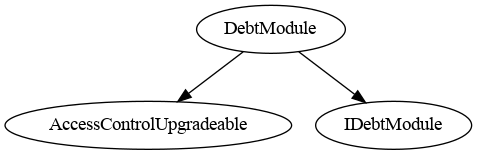

# Debt Module

This document defines Debt Module for the CMTA Token specification.

- This modules manages debt information and credit events.
- Inherits from `ICMTATDebt` and `ICMTATCreditEvents`.

[TOC]

## Interface

The interface and struct to represent Debt is available in `/contracts/interfaces/tokenization/ICMTAT.sol`

## Schema


### Inheritance




### Graph


## API for Ethereum

This section describes the Ethereum API of Debt Module.

See `IDebtModule` and `ICMTAT`

### Functions

#### `setDebtInstrument((uint256,uint256,uint256,string,string,string,string,string,string,string,string,address))`

```solidity
function setDebtInstrument(ICMTATDebt.DebtInstrument debtInstrument_) public
```

Sets only the debt instrument data.

##### Parameters

| Name              | Type                        | Description                   |
| ----------------- | --------------------------- | ----------------------------- |
| `debtInstrument_` | `ICMTATDebt.DebtInstrument` | The debt instrument to store. |

**Requirements:**

- Only authorized users (*DEBT_ROLE*) are allowed to call this function.

------

#### `setDebt((string,string,string,string),(uint256,uint256,uint256,string,string,string,string,string,string,string,string,address))`

```solidity
function setDebt(ICMTATDebt.DebtInformation debt_) public
```

Sets the full debt information (including instrument and values).

##### Parameters

| Name    | Type                         | Description             |
| ------- | ---------------------------- | ----------------------- |
| `debt_` | `ICMTATDebt.DebtInformation` | The debt data to store. |

**Requirements:**

- Only authorized users (*DEBT_ROLE*) are allowed to call this function.

------

#### `setCreditEvents((bool,bool,string))`

```solidity
function setCreditEvents(CreditEvents creditEvents_) public
```

Sets the credit events associated with a debt.

##### Parameters

| Name            | Type           | Description                 |
| --------------- | -------------- | --------------------------- |
| `creditEvents_` | `CreditEvents` | The credit events to store. |

**Requirements:**

- Only authorized users (*DEBT_ROLE*) are allowed to call this function.

### Events

Uses the `Log` suffix to avoid naming conflict with the `CreditEvents()` view function.

#### `DebtLogEvent()`

```solidity
event DebtLogEvent()
```

Emitted when the full debt information is updated.

------

#### `CreditEventsLogEvent()`

```solidity
event CreditEventsLogEvent()
```

Emitted when the credit events are updated.

------

#### `DebtInstrumentLogEvent()`

```solidity
event DebtInstrumentLogEvent()
```

Emitted when only the debt instrument portion of the data is updated.


