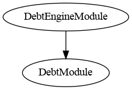

# Debt Engine Module

This document defines Debt Engine Module for the CMTA Token specification.

This module allows to set an external engine called `DebtEngine`to configure Debt and Credits Events information.

[TOC]

## Interface

The interface and struct to represent Debt is available in [ICMTAT.sol](/contracts/interfaces/tokenization/ICMTAT.sol)

## Schema


### Inheritance




### Graph


## API for Ethereum

This section describes the Ethereum API of Debt Module.

### Events

#### `DebtEngine(address)`

```solidity
event DebtEngine(IDebtEngine indexed newDebtEngine)
```

Emitted when a new external `DebtEngine` contract is set.

##### Parameters

| Name            | Type          | Description                                |
| --------------- | ------------- | ------------------------------------------ |
| `newDebtEngine` | `IDebtEngine` | Address of the newly assigned debt engine. |


------

### Functions

#### `creditEvents(...)`

```solidity
function creditEvents() external view returns(CreditEvents memory creditEvents_)
```

```solidity
function creditEvents() public view returns (CreditEvents creditEvents_)
```

Returns the current credit events.

- If a `DebtEngine` is set, delegates to `debtEngine.creditEvents()`.
- Otherwise, returns the credit events from the base `DebtModule`.

##### Returns

| Name                 | Type           | Description                              |
| -------------------- | -------------- | ---------------------------------------- |
| `creditEventsResult` | `CreditEvents` | The current credit event data structure. |


------

#### `debt()`

```solidity
function debt() external view returns(DebtInformation memory debtInformation_)
```

```solidity
function debt() 
public view virtual override(DebtModule) 
returns(DebtInformation memory debtInformation_){
```

Returns the current debt information.

- If a `DebtEngine` is set, delegates to `debtEngine.debt()`.
- Otherwise, returns the debt information from the base `DebtModule`.

##### Returns

| Name             | Type              | Description                             |
| ---------------- | ----------------- | --------------------------------------- |
| `debtBaseResult` | `DebtInformation` | The current debt information structure. |


------

#### `debtEngine`

```solidity
function debtEngine() public view returns (IDebtEngine)
```

Returns the address of the current `DebtEngine`.

##### Returns

| Name          | Type          | Description                        |
| ------------- | ------------- | ---------------------------------- |
| `debtEngine_` | `IDebtEngine` | The address of the current engine. |


------

#### `setDebtEngine(address)`

```solidity
function setDebtEngine(IDebtEngine debtEngine_) 
public virtual 
onlyRole(DEBT_ROLE)
```

Sets a new external `DebtEngine` to handle delegated debt and credit logic.

##### Parameters

| Name          | Type          | Description                             |
| ------------- | ------------- | --------------------------------------- |
| `debtEngine_` | `IDebtEngine` | The new engine contract to delegate to. |

**Emits**:

- Emits a `DebtEngine` event upon update.

**Requirements:**

- Only authorized users (*DEBT_ROLE*) are allowed to call this function.
