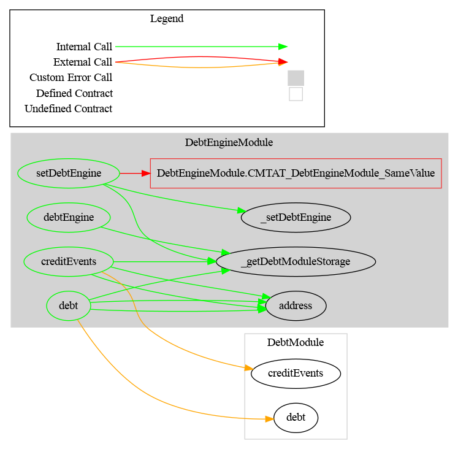

# Debt Engine Module

This document defines Debt Engine Module for the CMTA Token specification.

This module allows to set an external engine called `DebtEngine`to configure Debt and Credits Events information

[TOC]

## Interface

The interface and struct to represent Debt is available in `/contracts/interfaces/tokenization/ICMTAT.sol`

## Schema

### Inheritance

### Graph

## API for Ethereum

This section describes the Ethereum API of Debt Module.

<To do>

