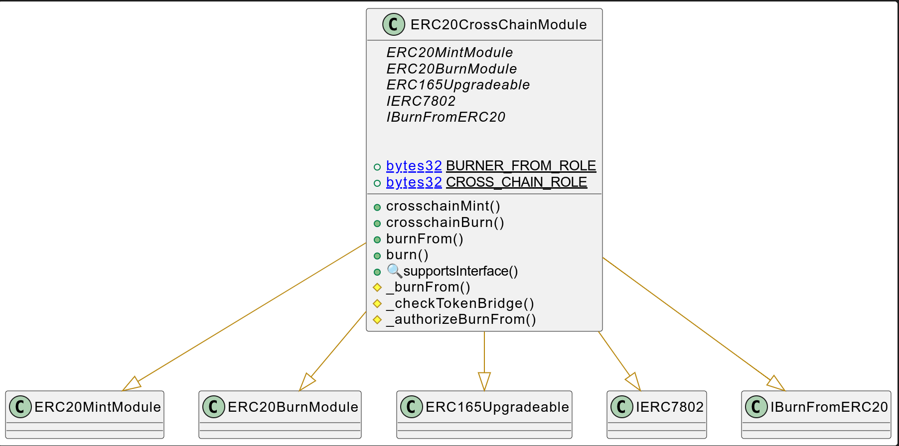
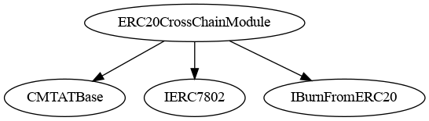
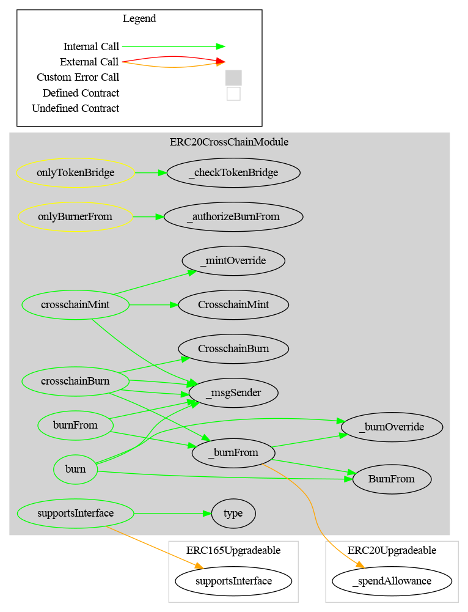

# Debt Module

This document defines Debt Module for the CMTA Token specification.

[TOC]

## Schema

### Inheritance

### Graph

## API for Ethereum

This section describes the Ethereum API of Debt Module.

<To do>
